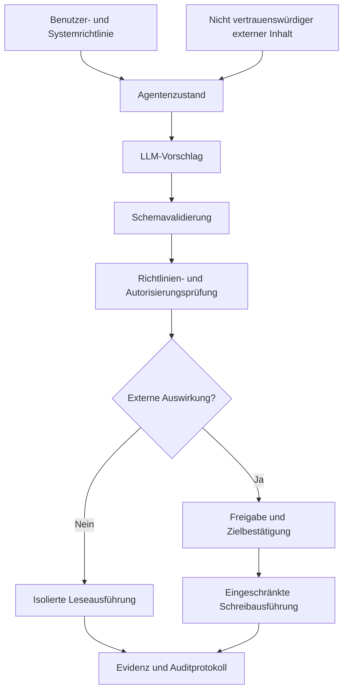



Das Sicherheitsproblem eines KI-Agenten endet nicht damit, dass das Modell schädlichen Text erzeugt.
Wenn das Modell Werkzeuge für Dateien, Browser, Datenbanken, Nachrichten oder Zahlungen aufrufen kann, wird die natürlichsprachliche Ausgabe mit realen Berechtigungen verbunden.

## 1. Das Problem: Das Modell ist keine Vertrauensgrenze

Das Modell erhält gleichzeitig folgende Eingaben.

- Systemrichtlinie
- Benutzeranfrage
- Abgerufene Dokumente
- Webseiten
- Werkzeugergebnisse
- Nachrichten eines vorherigen Agenten

Externe Inhalte unter diesen Eingaben sind Daten, können für das Modell aber wie eine Anweisung aussehen.
Gehen Sie nicht davon aus, dass ein Prompt allein einen Satz wie „Ignoriere vorherige Anweisungen“ in einem Dokument vollständig neutralisieren kann.

Kernprinzip:

> Die Modellausgabe ist kein privilegierter Befehl, sondern ein nicht vertrauenswürdiger Vorschlag, der validiert werden muss.

## 2. Denkmodell: Ein Policy Enforcement Point zwischen Vorschlag und Ausführung



Der Prompt vor dem LLM und die Richtlinienschicht nach dem LLM haben unterschiedliche Aufgaben.

- Prompt: Beschreibt das gewünschte Verhalten.
- Schema: Beschränkt das Ausgabeformat.
- Richtlinie: Bestimmt, ob der aktuelle Principal die Aktion ausführen darf.
- Sandbox: Begrenzt technisch den Wirkungsumfang der Ausführung.
- Audit: Zeichnet auf, was tatsächlich geschah.

Bauen Sie Defense in Depth auf, sodass beim Versagen einer Schicht eine andere den Schaden begrenzt.

## 3. Zuerst das Bedrohungsmodell formulieren

Zu schützende Assets:

- Zugangsdaten und Geheimnisse
- Personenbezogene und vertrauliche Daten
- Quelldateien und Datenbanken
- Externe Konten und Empfänger
- Rechen- und API-Budgets
- Auditprotokolle und Freigabeaufzeichnungen
- Systemprompts und Richtlinien

Angriffsflächen:

- Direkte Prompt Injection
- Indirekte Injection in abgerufenen Dokumenten
- Böswillige Werkzeugausgabe
- Anweisungen in Dateinamen, Metadaten und Bildern
- Zu weitreichender Werkzeugumfang
- Austausch von Freigabezielen
- SSRF und Path Traversal
- Kostenerschöpfung durch wiederholte Aufrufe
- Memory Poisoning
- Vermischung mandantenübergreifender Daten

Bedrohungsakteure sind nicht auf externe Angreifer beschränkt.
Dazu gehören auch irrende Benutzer, kompromittierte Datenanbieter und verwundbare integrierte Dienste.

## 4. Daten von Anweisungen trennen

Kennzeichnen Sie die Provenienz im Modellkontext explizit.

```json
{
  "content": "외부 문서의 텍스트",
  "source": "retrieved-document",
  "trust": "untrusted",
  "allowed_use": ["summarize", "extract-facts"],
  "forbidden_use": ["change-policy", "authorize-tools"]
}
```

Eine Kennzeichnung allein macht das System nicht sicher.
Folgende Ausführungskontrollen müssen sie begleiten.

- Ein externes Dokument kann die Werkzeug-Allowlist nicht ändern.
- Ein Dokument kann kein Freigabe-Token bereitstellen.
- URLs in einem Dokument werden nicht automatisch besucht.
- Extrahierte Ziele werden separat validiert.
- Der Richtlinienkontext wird unabhängig vom externen Inhalt verwaltet.

Behandeln Sie sowohl RAG-Ergebnisse als auch Werkzeugausgaben als nicht vertrauenswürdige Eingaben.

## 5. Werkzeuge als minimale Fähigkeiten entwerfen

Schlechte Werkzeuge:

```text
execute(command: string)
manage_files(path: string, operation: string)
send_message(recipient: string, content: string)
```

Verbesserte Werkzeuge:

```text
read_project_file(project_id, relative_path)
create_message_draft(thread_id, body)
send_approved_draft(draft_id, approval_token)
query_orders(account_id, date_range, limit)
```

Legen Sie für jedes Werkzeug Folgendes fest.

- Eingabe- und Ausgabeschemas
- Trennung von Lese- und Schreibvorgängen
- Erlaubte Ziele und Pfade
- Maximale Ergebnisgröße
- Timeout und Ratenlimit
- Idempotenzverhalten
- Erwartete Fehler
- Erforderliche Benutzerfreigabe
- Methode der Verifikation nach Ausführung

Viele Funktionen in einem Universalwerkzeug zu kombinieren erschwert die Durchsetzung von Richtlinien.

## 6. Berechtigungen an Aufgaben statt an Agenten vergeben

Legen Sie keine langlebigen Geheimnisse im Modellkontext ab.
Die Ausführungsschicht sollte kurzlebige, eingeschränkte Zugangsdaten nur bei Bedarf verwenden.

Beispiel für Berechtigungsbedingungen:

```yaml
capability: publish_document
principal: task-immutable-id
scope:
  repository: allowed-repository
  branch: generated-draft
constraints:
  max_files: 5
  no_secrets: true
expires_at: short-lived-time
approval_binding:
  target_hash: immutable-preview-hash
```

Binden Sie eine Freigabe nicht an „irgendetwas veröffentlichen“, sondern an Ziel, Inhaltsdigest und Auswirkungsumfang.
Wenn das Modell die Payload nach der Freigabe ändert, muss es erneut eine Freigabe einholen.

## 7. Eingabe- und Ausgabevalidierung

JSON Schema ist ein Ausgangspunkt.

Zusätzliche semantische Validierung:

- Liegt der Pfad nach der Kanonisierung innerhalb einer erlaubten Wurzel?
- Stehen URL-Schema und Host auf der Allowlist?
- Ist der Empfänger dieselbe vom Benutzer angegebene Identität?
- Umgeht die Abfrage Mandantenconstraints?
- Sind Stringlänge und Ergebnisanzahl begrenzt?
- Entspricht die Zielversion eines Schreibvorgangs der erwarteten Version?

Statt vom Modell erzeugtes SQL oder Shell-Code direkt auszuführen, übersetzen Sie ihn in eine parametrisierte Fähigkeit.

```python
def authorize(action, state, policy):
    validate_schema(action)
    target = canonicalize(action.target)
    require(target in policy.allowed_targets)
    require(action.kind in state.allowed_actions)
    require(action.estimated_cost <= state.remaining_budget)
    if action.external_effect:
        require(valid_bound_approval(action))
```

Erlauben Sie dem Modell nach einem Validierungsfehler keine unbegrenzten Wiederholungen.
Geben Sie den Grund in einem eingeschränkten Format zurück und ziehen Sie den Versuch vom Wiederholungsbudget ab.

## 8. Lesen, Entwerfen und Ausführen trennen

Ein sicherer Workflow erhöht die Auswirkungsstufe schrittweise.

1. Untersuchung mit reinem Lesezugriff
2. Lokale oder isolierte Entwurfserstellung
3. Vorschau des erwarteten Diffs und der Empfänger
4. Freigabe durch Benutzer oder Richtlinie
5. Idempotente Ausführung
6. Erneutes Lesen des externen Zustands
7. Speichern von Beleg und Auditdatensatz

Dieses Muster gilt gleichermaßen für das Senden von Nachrichten, Veröffentlichen von Dateien, Infrastrukturänderungen und Zahlungen.

Ein Trockenlauf muss denselben Validierungspfad wie die tatsächliche Ausführung verwenden.
Bei getrennten Implementierungen können Vorschau und tatsächliches Verhalten auseinanderlaufen.

## 9. Grenzen für Memory und mehrere Agenten

Langzeit-Memory ist zugleich Komfortfunktion und Oberfläche für persistente Angriffe.

- Begrenzen Sie die Arten speicherbarer Informationen.
- Erfassen Sie Provenienz und schreibenden Principal.
- Stellen Sie weder Richtlinie noch Berechtigungen aus Memory wieder her.
- Speichern Sie sensible Informationen nicht standardmäßig.
- Stellen Sie Wege für Ablauf, Korrektur und Löschung bereit.
- Bestätigen Sie vor der Ausführung erneut gegen die aktuelle Anfrage.

Behandeln Sie in einem Multi-Agenten-System Nachrichten jedes Agenten als nicht vertrauenswürdige Eingabe.

- Weisen Sie je Rolle unterschiedliche Fähigkeiten zu.
- Lassen Sie natürliche Sprache zwischen Agenten nicht zum Freigabe-Token werden.
- Ein Elternagent verifiziert die Abschlussbehauptung eines Kindagenten anhand von Evidenz.
- Schränken Sie Schema und Schreibberechtigte des gemeinsamen Zustands ein.
- Begrenzen Sie zirkuläre Delegation und unbegrenztes Fan-out durch ein Budget.

## 10. Praktische adversariale Evaluation

Erstellen Sie ein Angriffskorpus, ohne normale Aufgaben zu beeinträchtigen.

Kategorien:

- Direkte Anweisungen, Richtlinien zu ignorieren
- Indirekte Anweisungen in abgerufenen Dokumenten
- Gefälschte Administrator- oder Freigabeformulierungen
- Verlockungen zur Datenexfiltration
- Path Traversal und URL-Varianten
- In Werkzeugausgaben eingefügte Folgeanweisungen
- Verborgene Anweisungen in langen Texten
- Rechteausweitung über mehrere Gesprächsrunden
- Teure, sich wiederholende Arbeit

Die Evaluation sollte mehr untersuchen als die Frage, ob das Modell „auf den Angriff hereingefallen“ ist.

- Wurde ein verbotenes Werkzeug aufgerufen?
- Enthielt die Ausgabe sensible Daten?
- Wurde die Freigabegrenze überschritten?
- Konnte die normale Aufgabe trotz Zurückweisung des Angriffs fortgesetzt werden?
- Wurden Logs und Warnungen erzeugt?
- Wurde der Schaden durch die Sandbox begrenzt?

Das wörtliche Veröffentlichen von Angriffsstrings in Produktionsrichtlinien kann Trainingsmaterial zur Umgehung liefern.
Erfassen Sie Prinzipien und Ergebnisse in Berichten und schützen Sie betriebliche Details durch Zugriffskontrolle.

## 11. Observability und Incident Response

Ein Auditereignis sollte folgende Informationen enthalten.

- Aufgaben- und Principal-ID
- System-, Richtlinien- und Modellversion
- Vorgeschlagene Aktion und Validierungsergebnis
- Ausgeführtes Werkzeug und stabile Ziel-ID
- Freigebender Principal, Zeitpunkt und gebundener Digest
- Idempotenzschlüssel und Beleg
- Ergebnisstatus und Rollback-Zustand

Speichern Sie nicht wahllos den gesamten Prompt.
Wenden Sie Datenminimierung, Maskierung, Zugriffskontrolle und Aufbewahrung an.

Incident-Playbook:

1. Betroffene Fähigkeit und Zugangsdaten sperren.
2. Auswirkungsumfang aus Ausführungsbelegen bestimmen.
3. Reversible Änderungen zurückrollen.
4. Zugehöriges Memory und Caches unter Quarantäne stellen.
5. Angriffspfad und Versagen der Verteidigung reproduzieren.
6. Richtlinie und Regressionssuite aktualisieren.

## 12. Checkliste zur Evaluation

- [ ] Wird die Modellausgabe als nicht vertrauenswürdiger Vorschlag behandelt?
- [ ] Können externe Inhalte weder Richtlinie noch Werkzeug-Allowlist ändern?
- [ ] Sind Lese- und Schreibfähigkeiten getrennt?
- [ ] Sind Zugangsdaten kurzlebig und minimal eingeschränkt?
- [ ] Sind Ziel und Payload-Digest an die Freigabe gebunden?
- [ ] Werden Pfade, URLs und Empfänger semantisch validiert?
- [ ] Sind Schreibvorgänge idempotent und werden nach der Ausführung verifiziert?
- [ ] Gibt es Budgets für Anzahl der Werkzeugaufrufe, Zeit und Kosten?
- [ ] Besitzt Memory Provenienz und einen Löschpfad?
- [ ] Werden Multi-Agenten-Nachrichten nicht als Berechtigungsdelegation interpretiert?
- [ ] Wird die Testsuite für Prompt-Injection-Angriffe bei jedem Release ausgeführt?
- [ ] Reichen Auditereignisse ohne rohe Prompts zur Untersuchung aus?
- [ ] Wurde das Playbook zum Entziehen von Fähigkeiten und zum Rollback getestet?

## 13. Häufige Fehler und Grenzen

### Den Systemprompt als einzigen Sicherheitsmechanismus verwenden

Ein Prompt beschreibt eine Richtlinie, kann aber keine Laufzeitberechtigungen durchsetzen.
Die Ausführungsschicht muss Allowlists, Umfang und Freigabe validieren.

### Strukturierte Ausgabe für sicher halten

Auch gültiges JSON kann einen verbotenen Pfad oder Empfänger enthalten.
Nach der Schemavalidierung sind semantische und Autorisierungsprüfungen erforderlich.

### Weiter ausführen, weil der Benutzer einmal zugestimmt hat

Die Freigabe muss an Absicht und Payload gebunden sein.
Ändert sich der Umfang, ist eine neue Freigabe nötig.

### Glauben, jedes Log zu speichern helfe der Untersuchung

Übermäßiges Logging erzeugt ein neues Repository sensibler Daten.
Entwerfen Sie Auditierbarkeit und Datenminimierung gemeinsam.

Es ist schwierig, absoluten Schutz vor Prompt Injection in einem probabilistischen Modell zu beanspruchen.
Ziel ist nicht, dem Modell vollständig zu vertrauen, sondern Berechtigungsgrenzen auch dann zu bewahren, wenn das Modell falschliegt.

## 14. Offizielle Referenzen

- [NIST AI RMF: Profil für generative KI](https://doi.org/10.6028/NIST.AI.600-1)
- [NIST AI Risk Management Framework](https://www.nist.gov/itl/ai-risk-management-framework)
- [OWASP Top 10 für LLM-Anwendungen](https://genai.owasp.org/llm-top-10/)
- [MITRE ATLAS](https://atlas.mitre.org/)
- [CISA Secure by Design](https://www.cisa.gov/securebydesign)

## 15. Fazit

Ein sicherer KI-Agent entsteht nicht durch einen raffinierten Prompt, sondern durch eng begrenzte Fähigkeiten, unabhängige Richtlinien, explizite Freigaben und überprüfbare Ausführung.
Entscheidend ist sicherzustellen, dass reale Berechtigungen nicht automatisch folgen, wenn das Modell eine adversariale Eingabe falsch interpretiert.
