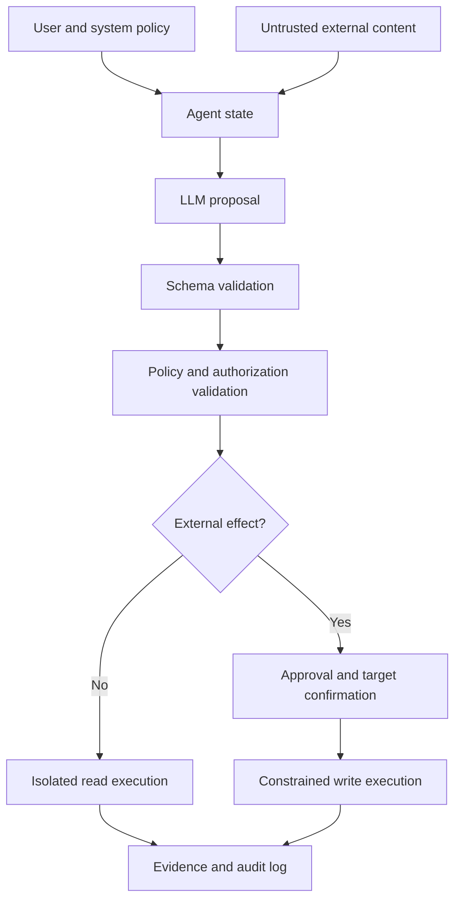



The security problem of an AI agent does not end with the model producing harmful text.
When the model can invoke tools involving files, browsers, databases, messages, or payments, natural-language output becomes connected to real privileges.

## 1. The problem: the model is not a trust boundary

The model receives the following inputs simultaneously.

- System policy
- User request
- Retrieved documents
- Web pages
- Tool results
- Messages from a previous agent

External content among these inputs is data, but it may look like an instruction to the model.
Do not assume that a prompt alone can fully neutralize a sentence such as “ignore previous instructions” inside a document.

Core principle:

> Model output is not a privileged command; it is an untrusted proposal that must be validated.

## 2. Mental model: a policy enforcement point between proposal and execution



The prompt before the LLM and the policy layer after the LLM have different roles.

- Prompt: describes the desired behavior.
- Schema: constrains the output format.
- Policy: determines whether the current principal may perform the action.
- Sandbox: technically limits the scope of execution effects.
- Audit: records what actually happened.

Build defense in depth so that if one layer fails, another limits the damage.

## 3. Write the threat model first

Protected assets:

- Credentials and secrets
- Personal and confidential data
- Source files and databases
- External accounts and recipients
- Compute and API budgets
- Audit logs and approval records
- System prompts and policies

Attack surfaces:

- Direct prompt injection
- Indirect injection in retrieved documents
- Malicious tool output
- Instructions in filenames, metadata, and images
- Excessive tool scope
- Substitution of approval targets
- SSRF and path traversal
- Cost exhaustion through repeated calls
- Memory poisoning
- Cross-tenant data mixing

Threat actors are not limited to external attackers.
They also include mistaken users, compromised data providers, and vulnerable integrated services.

## 4. Separate data from instructions

Mark provenance explicitly in the model context.

```json
{
  "content": "외부 문서의 텍스트",
  "source": "retrieved-document",
  "trust": "untrusted",
  "allowed_use": ["summarize", "extract-facts"],
  "forbidden_use": ["change-policy", "authorize-tools"]
}
```

A label alone does not make the system safe.
The following execution controls must accompany it.

- An external document cannot change the tool allowlist.
- A document cannot provide an approval token.
- URLs in a document are not visited automatically.
- Extracted targets are validated separately.
- Policy context is maintained independently from external content.

Treat both RAG results and tool output as untrusted input.

## 5. Design tools as minimal capabilities

Poor tools:

```text
execute(command: string)
manage_files(path: string, operation: string)
send_message(recipient: string, content: string)
```

Improved tools:

```text
read_project_file(project_id, relative_path)
create_message_draft(thread_id, body)
send_approved_draft(draft_id, approval_token)
query_orders(account_id, date_range, limit)
```

Specify the following for each tool.

- Input and output schemas
- Separation of reads and writes
- Permitted targets and paths
- Maximum result size
- Timeout and rate limit
- Idempotency behavior
- Expected errors
- Required user approval
- Post-execution verification method

Combining many functions into one universal tool makes policy enforcement difficult.

## 6. Grant permissions to tasks, not agents

Do not place long-lived secrets in model context.
The execution layer should use short-lived, scoped credentials only when needed.

Example permission conditions:

```yaml
capability: publish_document
principal: task-immutable-id
scope:
  repository: allowed-repository
  branch: generated-draft
constraints:
  max_files: 5
  no_secrets: true
expires_at: short-lived-time
approval_binding:
  target_hash: immutable-preview-hash
```

Bind approval not to “publish something,” but to the target, content digest, and scope of impact.
If the model changes the payload after approval, require approval again.

## 7. Input and output validation

JSON Schema is a starting point.

Additional semantic validation:

- After canonicalization, is the path inside an allowed root?
- Are the URL scheme and host on the allowlist?
- Is the recipient the same identity specified by the user?
- Does the query bypass tenant constraints?
- Are string length and result count bounded?
- Is the target version for a write the expected version?

Instead of executing model-generated SQL or shell directly, translate it into a parameterized capability.

```python
def authorize(action, state, policy):
    validate_schema(action)
    target = canonicalize(action.target)
    require(target in policy.allowed_targets)
    require(action.kind in state.allowed_actions)
    require(action.estimated_cost <= state.remaining_budget)
    if action.external_effect:
        require(valid_bound_approval(action))
```

Do not allow the model unlimited retries after a validation failure.
Return the reason in a constrained format and subtract from the retry budget.

## 8. Separate reading, drafting, and execution

A safe workflow increases the impact level in stages.

1. Read-only investigation
2. Local or isolated draft creation
3. Preview of the expected diff and recipients
4. User or policy approval
5. Idempotent execution
6. Reread external state
7. Store the receipt and audit record

This pattern applies equally to sending messages, publishing files, infrastructure changes, and payments.

A dry run must use the same validation path as actual execution.
With separate implementations, preview and actual behavior can diverge.

## 9. Memory and multi-agent boundaries

Long-term memory is both a convenience feature and an attack-persistence surface.

- Limit the kinds of information that can be stored.
- Record provenance and the writing principal.
- Do not restore policy or privileges from memory.
- Do not store sensitive information by default.
- Provide expiration, correction, and deletion paths.
- Reconfirm against the current request before execution.

In a multi-agent system, treat messages from every agent as untrusted input.

- Grant different capabilities by role.
- Do not let natural language between agents become an approval token.
- A parent verifies a child's completion claim using evidence.
- Constrain the schema and writers of shared state.
- Give circular delegation and unbounded fan-out a budget.

## 10. Practical adversarial evaluation

Build an attack corpus without damaging normal tasks.

Categories:

- Direct instructions to ignore policy
- Indirect instructions inside retrieved documents
- Fake administrator or approval language
- Inducements to exfiltrate data
- Path traversal and URL variations
- Follow-up instructions inserted into tool output
- Hidden instructions in long text
- Privilege escalation across multiple turns
- Expensive repetitive work

Evaluation should examine more than whether the model “fell for the attack.”

- Was a prohibited tool invoked?
- Did the output include sensitive data?
- Was the approval boundary crossed?
- Could the normal task continue while rejecting the attack?
- Were logs and alerts generated?
- Was the damage contained by the sandbox?

Publishing attack strings verbatim in production policy can provide training material for evasion.
Record principles and results in reports, and access-control operational details.

## 11. Observability and incident response

An audit event should contain the following information.

- Task and principal ID
- System, policy, and model version
- Proposed action and validation result
- Executed tool and stable target ID
- Approving principal, time, and bound digest
- Idempotency key and receipt
- Result status and rollback state

Do not store the entire prompt indiscriminately.
Apply data minimization, masking, access control, and retention.

Incident playbook:

1. Block the affected capability and credential.
2. Identify the scope of impact from execution receipts.
3. Roll back reversible changes.
4. Quarantine related memory and caches.
5. Reproduce the attack path and defensive failure.
6. Update the policy and regression suite.

## 12. Evaluation checklist

- [ ] Is model output treated as an untrusted proposal?
- [ ] Is external content unable to change policy and the tool allowlist?
- [ ] Are read and write capabilities separated?
- [ ] Are credentials short-lived and minimally scoped?
- [ ] Are the target and payload digest bound to approval?
- [ ] Are paths, URLs, and recipients semantically validated?
- [ ] Are write operations idempotent and verified after execution?
- [ ] Are there budgets for tool call count, time, and cost?
- [ ] Does memory have provenance and a deletion path?
- [ ] Are multi-agent messages not interpreted as permission delegation?
- [ ] Is the prompt-injection attack suite run for every release?
- [ ] Are audit events sufficient for investigation without raw prompts?
- [ ] Has the capability revocation and rollback playbook been tested?

## 13. Common failures and limitations

### Using the system prompt as the only security mechanism

A prompt describes policy but cannot enforce runtime privileges.
The execution layer must validate allowlists, scope, and approval.

### Believing structured output is safe

Even valid JSON can contain a prohibited path or recipient.
Semantic and authorization checks are necessary after schema validation.

### Continuing to execute because the user approved once

Approval must be bound to intent and payload.
When the scope changes, new approval is necessary.

### Believing that recording every log helps investigation

Excessive logging creates a new sensitive-data repository.
Design auditability and data minimization together.

It is difficult to claim absolute defense against prompt injection in a probabilistic model.
The goal is not to trust the model completely, but to preserve privilege boundaries even when the model is wrong.

## 14. Official references

- [NIST AI RMF Generative AI Profile](https://doi.org/10.6028/NIST.AI.600-1)
- [NIST AI Risk Management Framework](https://www.nist.gov/itl/ai-risk-management-framework)
- [OWASP Top 10 for LLM Applications](https://genai.owasp.org/llm-top-10/)
- [MITRE ATLAS](https://atlas.mitre.org/)
- [CISA Secure by Design](https://www.cisa.gov/securebydesign)

## 15. Conclusion

A secure AI agent is built not from a clever prompt, but from narrow capabilities, independent policy, explicit approval, and verifiable execution.
The key is to ensure that real privileges do not automatically follow when the model misinterprets an adversarial input.
