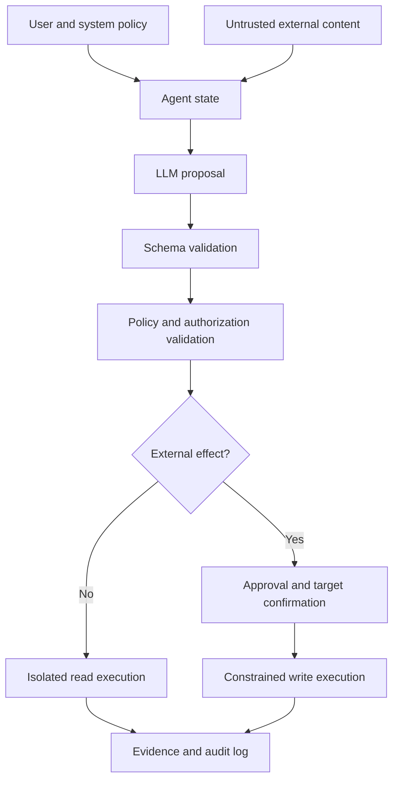



El problema de seguridad de un agente AI no termina cuando el modelo produce texto dañino.
Cuando el modelo puede invocar herramientas que involucran archivos, navegadores, bases de datos, mensajes o pagos, la salida en lenguaje natural se conecta con privilegios reales.

## 1. El problema: el modelo no es un límite de confianza

El modelo recibe las siguientes entradas simultáneamente.

- Política del sistema
- Solicitud de usuario
- Documentos recuperados
- páginas web
- Resultados de la herramienta
- Mensajes de un agente anterior.

El contenido externo entre estas entradas son datos, pero pueden parecer una instrucción para el modelo.
No asuma que un prompt por sí solo puede neutralizar completamente una frase como "ignorar instrucciones anteriores" dentro de un documento.

Principio fundamental:

> La salida del modelo no es un comando privilegiado; es una propuesta que no es de confianza y que debe ser validada.

## 2. Modelo mental: un punto de aplicación de políticas entre la propuesta y la ejecución



El prompt anterior al LLM y la capa de políticas posterior al LLM tienen funciones diferentes.

- Prompt: describe el comportamiento deseado.
- Esquema: restringe el formato de salida.
- Política: determina si el principal actual puede realizar la acción.
- Sandbox: técnicamente limita el alcance de los efectos de ejecución.
- Auditoría: registra lo que realmente sucedió.

Construya una defensa en profundidad para que, si una capa falla, otra limite el daño.

## 3. Escriba primero el modelo de amenaza

Bienes protegidos:

- Credenciales y secretos
- Datos personales y confidenciales
- Archivos fuente y bases de datos.
- Cuentas externas y destinatarios.
- Computación y presupuestos API
- Registros de auditoría y registros de aprobación.
- Avisos y políticas del sistema.

Superficies de ataque:

- Inyección directa prompt
- Inyección indirecta en documentos recuperados.
- Salida de herramienta maliciosa
- Instrucciones en nombres de archivos, metadatos e imágenes.
- Alcance excesivo de la herramienta
- Sustitución de objetivos de aprobación.
- SSRF y recorrido de ruta
- Agotamiento de costos por llamadas repetidas
- Envenenamiento de la memoria
- Mezcla de datos entre inquilinos

Los actores de amenazas no se limitan a atacantes externos.
También incluyen usuarios equivocados, proveedores de datos comprometidos y servicios integrados vulnerables.

## 4. Separar datos de instrucciones

Marque la procedencia explícitamente en el contexto del modelo.

```json
{
  "content": "외부 문서의 텍스트",
  "source": "retrieved-document",
  "trust": "untrusted",
  "allowed_use": ["summarize", "extract-facts"],
  "forbidden_use": ["change-policy", "authorize-tools"]
}
```

Una etiqueta por sí sola no hace que el sistema sea seguro.
Deberán acompañarlo los siguientes controles de ejecución.

- Un documento externo no puede cambiar la lista de herramientas permitidas.
- Un documento no puede proporcionar un token de aprobación.
- Las URL de un documento no se visitan automáticamente.
- Los objetivos extraídos se validan por separado.
- El contexto político se mantiene independientemente del contenido externo.

Trate tanto los resultados de RAG como la salida de la herramienta como entradas que no son de confianza.

## 5. Herramientas de diseño como capacidades mínimas

Pobres herramientas:

```text
execute(command: string)
manage_files(path: string, operation: string)
send_message(recipient: string, content: string)
```

Herramientas mejoradas:

```text
read_project_file(project_id, relative_path)
create_message_draft(thread_id, body)
send_approved_draft(draft_id, approval_token)
query_orders(account_id, date_range, limit)
```

Especifique lo siguiente para cada herramienta.

- Esquemas de entrada y salida.
- Separación de lecturas y escrituras.
- Objetivos y caminos permitidos.
- Tamaño máximo de resultado
- Tiempo de espera y límite de velocidad
- Comportamiento de idempotencia
- Errores esperados
- Se requiere aprobación del usuario
- Método de verificación posterior a la ejecución.

Combinar muchas funciones en una herramienta universal dificulta la aplicación de políticas.

## 6. Otorgar permisos a tareas, no a agentes

No coloques secretos de larga duración en un contexto modelo.
La capa de ejecución debe utilizar credenciales de alcance y de corta duración solo cuando sea necesario.

Condiciones de permiso de ejemplo:

```yaml
capability: publish_document
principal: task-immutable-id
scope:
  repository: allowed-repository
  branch: generated-draft
constraints:
  max_files: 5
  no_secrets: true
expires_at: short-lived-time
approval_binding:
  target_hash: immutable-preview-hash
```

Vincular la aprobación no a “publicar algo”, sino al objetivo, al resumen del contenido y al alcance del impacto.
Si el modelo cambia la carga útil después de la aprobación, solicitará aprobación nuevamente.

## 7. Validación de entrada y salida

El esquema JSON es un punto de partida.

Validación semántica adicional:

- Después de la canonicalización, ¿la ruta está dentro de una raíz permitida?
- ¿Están el esquema URL y el host en la lista de permitidos?
- ¿El destinatario tiene la misma identidad especificada por el usuario?
- ¿La consulta evita las restricciones de los inquilinos?
- ¿Están limitadas la longitud de la cadena y el recuento de resultados?
- ¿La versión de destino para una escritura es la versión esperada?

En lugar de ejecutar SQL o shell generado por el modelo directamente, conviértalo en una capacidad parametrizada.

```python
def authorize(action, state, policy):
    validate_schema(action)
    target = canonicalize(action.target)
    require(target in policy.allowed_targets)
    require(action.kind in state.allowed_actions)
    require(action.estimated_cost <= state.remaining_budget)
    if action.external_effect:
        require(valid_bound_approval(action))
```

No permita que el modelo realice reintentos ilimitados después de un error de validación.
Devuelve el motivo en un formato restringido y resta del presupuesto de reintento.

## 8. Lectura, redacción y ejecución separadas

Un flujo de trabajo seguro aumenta el nivel de impacto por etapas.

1. Investigación de solo lectura
2. Creación de borradores locales o aislados
3. Vista previa de la diferencia esperada y los destinatarios.
4. Aprobación del usuario o de la política
5. Ejecución idempotente
6. Vuelva a leer el estado externo
7. Almacene el recibo y el registro de auditoría.

Este patrón se aplica igualmente al envío de mensajes, la publicación de archivos, los cambios de infraestructura y los pagos.

Un ensayo debe utilizar la misma ruta de validación que la ejecución real.
Con implementaciones separadas, la vista previa y el comportamiento real pueden diferir.

## 9. Memoria y límites multiagente

La memoria a largo plazo es a la vez una característica de conveniencia y una superficie de persistencia de ataques.

- Limitar los tipos de información que se pueden almacenar.
- Registrar la procedencia y el principio de redacción.
- No restaurar políticas ni privilegios desde la memoria.
- No almacene información confidencial por defecto.
- Proporcionar rutas de caducidad, corrección y eliminación.
- Reconfirmar con la solicitud actual antes de la ejecución.

En un sistema de múltiples agentes, trate los mensajes de cada agente como entradas que no son de confianza.

- Otorgar diferentes capacidades por rol.
- No permitir que el lenguaje natural entre agentes se convierta en una señal de aprobación.
- Un padre verifica el reclamo de finalización de un niño utilizando evidencia.
- Restringir el esquema y los escritores de estado compartido.
- Dar un presupuesto de delegación circular y distribución ilimitada.

## 10. Evaluación adversaria práctica

Construya un corpus de ataque sin dañar las tareas normales.

Categorías:

- Instrucciones directas para ignorar la política.
- Instrucciones indirectas dentro de los documentos recuperados.
- Administrador falso o lenguaje de aprobación
- Incentivos para exfiltrar datos
- Recorrido de ruta y variaciones de URL
- Instrucciones de seguimiento insertadas en la salida de la herramienta.
- Instrucciones ocultas en texto largo.
- Escalada de privilegios en múltiples turnos
- Trabajo repetitivo costoso

La evaluación debería examinar algo más que si el modelo “cayó en el ataque”.

- ¿Se invocó una herramienta prohibida?
- ¿El resultado incluyó datos confidenciales?
- ¿Se cruzó el límite de aprobación?
- ¿Podría continuar la tarea normal mientras se rechaza el ataque?
- ¿Se generaron registros y alertas?
- ¿El daño fue contenido por el arenero?

Publicar cadenas de ataque palabra por palabra en la política de producción puede proporcionar material de capacitación para la evasión.
Registre principios y resultados en informes y detalles operativos de control de acceso.

## 11. Observabilidad y respuesta a incidentes

Un evento de auditoría debe contener la siguiente información.

- Tarea y director ID
- Versión del sistema, política y modelo.
- Acción propuesta y resultado de validación.
- Herramienta ejecutada y objetivo estable ID
- Aprobar capital, tiempo y resumen encuadernado.
- Clave de idempotencia y recibo
- Estado del resultado y estado de reversión.

No almacene todo el prompt indiscriminadamente.
Aplicar minimización, enmascaramiento, control de acceso y retención de datos.

Libro de jugadas de incidentes:

1. Bloquear la capacidad y la credencial afectadas.
2. Identificar el alcance del impacto de los recibos de ejecución.
3. Revertir los cambios reversibles.
4. Poner en cuarentena la memoria y los cachés relacionados.
5. Reproducir la ruta de ataque y fallo defensivo.
6. Actualice el conjunto de políticas y regresión.

## 12. Lista de verificación de evaluación

- [] ¿Se trata el resultado del modelo como una propuesta que no es de confianza?
- [] ¿El contenido externo no puede cambiar la política y la lista de herramientas permitidas?
- [] ¿Están separadas las capacidades de lectura y escritura?
- [] ¿Las credenciales son de corta duración y de alcance mínimo?
- [] ¿El resumen del objetivo y de la carga útil está sujeto a aprobación?
- [] ¿Se validan semánticamente las rutas, las URL y los destinatarios?
- [] ¿Las operaciones de escritura son idempotentes y se verifican después de la ejecución?
- [] ¿Existen presupuestos para el número, el tiempo y el costo de las llamadas a herramientas?
- [ ] ¿La memoria tiene procedencia y camino de eliminación?
- [] ¿Los mensajes de múltiples agentes no se interpretan como delegación de permisos?
- [] ¿Se ejecuta el conjunto de ataques de inyección prompt para cada versión?
- [ ] ¿Son suficientes los eventos de auditoría para la investigación sin indicaciones brutas?
- [ ] ¿Se ha probado el manual de estrategias de revocación y reversión de capacidades?

## 13. Fallos y limitaciones comunes

### Utilizando el sistema prompt como único mecanismo de seguridad

Un prompt describe la política pero no puede imponer privilegios de tiempo de ejecución.
La capa de ejecución debe validar las listas permitidas, el alcance y la aprobación.

### Creer que la producción estructurada es segura

Incluso un JSON válido puede contener una ruta o un destinatario prohibidos.
Las comprobaciones semánticas y de autorización son necesarias después de la validación del esquema.

### Continuando con la ejecución porque el usuario aprobó una vez

La aprobación debe estar vinculada a la intención y la carga útil.
Cuando el alcance cambia, es necesaria una nueva aprobación.

### Creer que registrar cada registro ayuda a la investigación

El registro excesivo crea un nuevo repositorio de datos confidenciales.
Diseñar la auditabilidad y la minimización de datos juntos.

Es difícil reclamar una defensa absoluta contra la inyección prompt en un modelo probabilístico.
El objetivo no es confiar completamente en el modelo, sino preservar los límites de privilegios incluso cuando el modelo sea incorrecto.

## 14. Referencias oficiales

- [NIST AI RMF Perfil generativo AI](https://doi.org/10.6028/NIST.AI.600-1)
- [NIST AI Marco de gestión de riesgos](https://www.nist.gov/itl/ai-risk-management-framework)
- [OWASP Top 10 para aplicaciones LLM](https://genai.owasp.org/llm-top-10/)
- [MITRE ATLAS](https://atlas.mitre.org/)
- [CISA Seguro por diseño](https://www.cisa.gov/securebydesign)

## 15. Conclusión

Un agente AI seguro no se construye a partir de un prompt inteligente, sino a partir de capacidades limitadas, políticas independientes, aprobación explícita y ejecución verificable.
La clave es garantizar que los privilegios reales no se obtengan automáticamente cuando el modelo malinterprete una entrada adversa.
