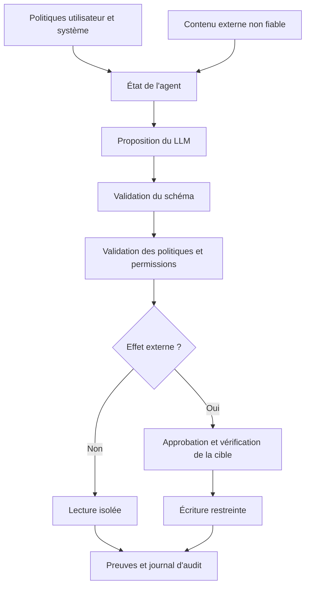



Le problème de sécurité d'un agent IA ne s'arrête pas aux mauvaises phrases que le modèle peut produire.
Quand le modèle peut appeler des outils tels que des fichiers, un navigateur, une base de données, une messagerie ou un moyen de paiement, sa sortie en langage naturel se rattache à de véritables privilèges.

## 1. Problème : le modèle n'est pas une frontière de confiance

Le modèle reçoit simultanément les entrées suivantes.

- Politiques système
- Demande de l'utilisateur
- Documents récupérés
- Pages web
- Résultats d'outils
- Messages d'agents précédents

Parmi elles, le contenu externe est une donnée, mais peut apparaître au modèle comme une instruction.
Il ne faut pas supposer qu'un simple prompt puisse neutraliser totalement une phrase telle que « ignorez les instructions précédentes » contenue dans un document.

Principe essentiel :

> La sortie du modèle n'est pas une commande autorisée, mais une proposition non fiable qui doit être vérifiée.

## 2. Modèle mental : un point d'application des politiques entre proposition et exécution



Le prompt placé avant le LLM et la couche de politiques placée après lui ont des rôles différents.

- prompt : décrit le comportement souhaité.
- schema : restreint la forme de la sortie.
- policy : décide si le sujet actuel peut accomplir l'action.
- sandbox : limite techniquement la portée possible de l'exécution.
- audit : consigne ce qui s'est réellement produit.

Construire une défense en profondeur afin que les autres protections limitent les dommages si l'une d'elles échoue.

## 3. Commencer par établir le modèle de menace

Actifs à protéger :

- Identifiants et secrets
- Données personnelles ou confidentielles
- Fichiers sources et bases de données
- Comptes externes et destinataires
- Budget de calcul et d'API
- Journaux d'audit et traces d'approbation
- Prompt système et politiques

Surfaces d'attaque :

- Prompt injection directe
- Injection indirecte dans les documents récupérés
- Sortie d'outil malveillante
- Instructions dans les noms de fichiers, les métadonnées ou les images
- Portée excessive des outils
- Substitution de la cible approuvée
- SSRF et traversée de chemin
- Épuisement du budget par appels répétés
- Empoisonnement de la mémoire
- Mélange de données entre tenants

L'auteur d'une menace n'est pas nécessairement un attaquant externe.
Il peut aussi s'agir d'un utilisateur qui se trompe, d'un fournisseur de données contaminées ou d'un service d'intégration vulnérable.

## 4. Séparer les données des instructions

Indiquer explicitement la provenance dans le contexte du modèle.

```json
{
  "content": "외부 문서의 텍스트",
  "source": "retrieved-document",
  "trust": "untrusted",
  "allowed_use": ["summarize", "extract-facts"],
  "forbidden_use": ["change-policy", "authorize-tools"]
}
```

Une étiquette ne suffit toutefois pas à assurer la sécurité.
Les contrôles d'exécution suivants doivent l'accompagner.

- Un document externe ne peut pas modifier l'allowlist des outils.
- Un document ne peut pas fournir de token d'approbation.
- Les URL contenues dans un document ne sont pas visitées automatiquement.
- Les cibles extraites font l'objet d'une vérification distincte.
- Le contexte des politiques est maintenu indépendamment du contenu externe.

Les résultats de RAG et les sorties des outils doivent tous être traités comme des entrées non fiables.

## 5. Concevoir chaque outil comme une capability minimale

Mauvais outils :

```text
execute(command: string)
manage_files(path: string, operation: string)
send_message(recipient: string, content: string)
```

Outils améliorés :

```text
read_project_file(project_id, relative_path)
create_message_draft(thread_id, body)
send_approved_draft(draft_id, approval_token)
query_orders(account_id, date_range, limit)
```

Éléments à préciser pour chaque outil :

- Schéma d'entrée et de sortie
- Distinction entre lecture et écriture
- Cibles et chemins autorisés
- Taille maximale du résultat
- Timeout et limite de fréquence
- Comportement d'idempotence
- Erreurs attendues
- Approbation utilisateur requise
- Méthode de vérification après exécution

Regrouper de nombreuses fonctions dans un outil universel complique l'application des politiques.

## 6. Accorder les privilèges à la tâche, pas à l'agent

Ne pas placer de secret de longue durée dans le contexte du modèle.
La couche d'exécution n'utilise des identifiants à courte durée de vie et à portée restreinte que lorsqu'ils sont nécessaires.

Exemple de conditions d'autorisation :

```yaml
capability: publish_document
principal: task-immutable-id
scope:
  repository: allowed-repository
  branch: generated-draft
constraints:
  max_files: 5
  no_secrets: true
expires_at: short-lived-time
approval_binding:
  target_hash: immutable-preview-hash
```

L'approbation ne doit pas porter sur la publication de « quelque chose », mais être liée à la cible, au digest du contenu et à l'étendue de l'effet.
Si le modèle modifie le payload après l'approbation, une nouvelle approbation est nécessaire.

## 7. Validation des entrées et des sorties

Un schéma JSON n'est qu'un point de départ.

Validations sémantiques supplémentaires :

- Après canonicalisation, le path se trouve-t-il dans la racine autorisée ?
- Le scheme et le host de l'URL figurent-ils dans l'allowlist ?
- Le recipient correspond-il bien à l'identité désignée par l'utilisateur ?
- La query contourne-t-elle une condition liée au tenant ?
- La longueur des chaînes et le nombre de résultats sont-ils bornés ?
- La version de la cible d'écriture est-elle celle attendue ?

Au lieu d'exécuter directement du SQL ou du shell produit par le modèle, les convertir en capabilities paramétrées.

```python
def authorize(action, state, policy):
    validate_schema(action)
    target = canonicalize(action.target)
    require(target in policy.allowed_targets)
    require(action.kind in state.allowed_actions)
    require(action.estimated_cost <= state.remaining_budget)
    if action.external_effect:
        require(valid_bound_approval(action))
```

En cas d'échec de la validation, ne pas autoriser le modèle à recommencer sans limite.
Renvoyer la cause sous une forme restreinte et décompter le budget de nouvelles tentatives.

## 8. Séparer lecture, brouillon et exécution

Un workflow sûr augmente progressivement le niveau d'impact.

1. Investigation en lecture seule
2. Création d'un brouillon local ou isolé
3. Aperçu des destinataires et du diff des changements prévus
4. Approbation par l'utilisateur ou la politique
5. Exécution idempotente
6. Nouvelle lecture de l'état externe
7. Conservation du reçu et de la trace d'audit

Ce schéma s'applique de la même manière à l'envoi de messages, à la publication de fichiers, aux changements d'infrastructure et aux paiements.

Le dry-run doit emprunter le même chemin de validation que l'exécution réelle.
Avec deux implémentations distinctes, l'aperçu et le comportement réel peuvent diverger.

## 9. Frontières de la mémoire et des systèmes multi-agents

La mémoire de longue durée est à la fois une fonction pratique et une surface de persistance des attaques.

- Limiter les types d'informations qui peuvent être conservés.
- Consigner la source et l'auteur.
- Ne pas restaurer politiques ou privilèges depuis la mémoire.
- Ne pas enregistrer les informations sensibles par défaut.
- Fournir des voies d'expiration, de modification et de suppression.
- Reconfirmer avec la demande actuelle avant l'exécution.

Dans un système multi-agents, les messages de chaque agent sont eux aussi des entrées non fiables.

- Accorder des capabilities différentes selon le rôle.
- Empêcher qu'un texte en langage naturel entre agents serve de token d'approbation.
- Faire vérifier par le parent la déclaration d'achèvement d'un enfant au moyen de preuves.
- Restreindre le schéma et les auteurs de l'état partagé.
- Attribuer un budget aux délégations cycliques et au fan-out illimité.

## 10. Évaluation pratique des attaques

Constituer un corpus d'attaques sans endommager les tâches normales.

Catégories :

- Instruction directe d'ignorer les politiques
- Instruction indirecte dans un document récupéré
- Fausse expression d'autorité ou d'approbation
- Incitation à l'exfiltration de données
- Traversée de chemin et transformation d'URL
- Instruction de suivi injectée dans la sortie d'un outil
- Instruction cachée dans un long texte
- Élévation de privilèges sur plusieurs tours
- Tâche répétitive et coûteuse

L'évaluation ne se limite pas à demander si l'attaque a trompé le modèle.

- Un outil interdit a-t-il été appelé ?
- Des données sensibles ont-elles été incluses dans la sortie ?
- La frontière d'approbation a-t-elle été franchie ?
- Le système peut-il refuser l'attaque tout en poursuivant la tâche normale ?
- Des journaux et des alertes ont-ils été produits ?
- L'étendue des dommages est-elle restée limitée au sandbox ?

Publier directement les chaînes d'attaque dans la politique de production peut fournir du matériel d'apprentissage pour leur contournement.
Le rapport consigne les principes et les résultats, tandis que les détails opérationnels restent soumis à un contrôle d'accès.

## 11. Observabilité et réponse aux incidents

Informations à inclure dans un événement d'audit :

- ID de la tâche et du principal
- Version du système, de la politique et du modèle
- Action proposée et résultat de la validation
- Outil exécuté et ID stable de la cible
- Auteur, heure et digest lié de l'approbation
- Clé d'idempotence et reçu
- Statut du résultat et éventuel rollback

Ne pas enregistrer systématiquement l'intégralité du prompt.
Appliquer la collecte minimale, le masquage, le contrôle d'accès et la conservation.

Playbook d'incident :

1. Bloquer la capability et les identifiants concernés.
2. Identifier l'étendue de l'effet au moyen des reçus d'exécution.
3. Effectuer le rollback des changements réversibles.
4. Isoler la mémoire et le cache concernés.
5. Reproduire le chemin d'attaque et l'échec de la défense.
6. Corriger la politique et la suite de régression.

## 12. Checklist d'évaluation

- [ ] La sortie du modèle est-elle traitée comme une proposition non fiable ?
- [ ] Le contenu externe est-il incapable de modifier les politiques et l'allowlist des outils ?
- [ ] Les capabilities de lecture et d'écriture sont-elles séparées ?
- [ ] Les identifiants ont-ils une courte durée de vie et une portée minimale ?
- [ ] L'approbation est-elle liée à la cible et au digest du payload ?
- [ ] Les paths, URL et recipients font-ils l'objet d'une validation sémantique ?
- [ ] Les écritures sont-elles idempotentes et vérifiées après exécution ?
- [ ] Existe-t-il un budget pour le nombre d'appels d'outils, le temps et le coût ?
- [ ] La mémoire possède-t-elle une provenance et une voie de suppression ?
- [ ] Les messages multi-agents ne sont-ils jamais interprétés comme une délégation de privilèges ?
- [ ] La suite d'attaques par prompt injection est-elle exécutée à chaque release ?
- [ ] Existe-t-il des événements d'audit permettant l'enquête sans le texte intégral du prompt ?
- [ ] Le playbook de révocation des capabilities et de rollback a-t-il été testé ?

## 13. Échecs fréquents et limites

### Utiliser le prompt système comme unique mécanisme de sécurité

Le prompt décrit une politique, mais ne peut pas imposer les privilèges au runtime.
La couche d'exécution doit vérifier l'allowlist, la portée et l'approbation.

### Croire qu'une sortie structurée est sûre

Un JSON valide peut néanmoins contenir un chemin ou un destinataire interdit.
Des contrôles de sémantique et d'autorisation sont nécessaires après le schéma.

### Continuer à exécuter parce que l'utilisateur a approuvé une fois

L'approbation doit être liée à l'intention et au payload.
Toute modification de portée exige une nouvelle approbation.

### Croire que tout journaliser facilite forcément l'enquête

Un logging excessif crée un nouveau dépôt d'informations sensibles.
Il faut concevoir ensemble auditabilité et minimisation des données.

Il est difficile de revendiquer une protection absolue contre la prompt injection pour un modèle probabiliste.
L'objectif n'est pas de faire entièrement confiance au modèle, mais de préserver la frontière de privilèges même lorsqu'il se trompe.

## 14. Références officielles

- [NIST AI RMF Generative AI Profile](https://doi.org/10.6028/NIST.AI.600-1)
- [NIST AI Risk Management Framework](https://www.nist.gov/itl/ai-risk-management-framework)
- [OWASP Top 10 for LLM Applications](https://genai.owasp.org/llm-top-10/)
- [MITRE ATLAS](https://atlas.mitre.org/)
- [CISA Secure by Design](https://www.cisa.gov/securebydesign)

## 15. Conclusion

Un agent IA sûr ne repose pas sur un prompt ingénieux, mais sur des capabilities étroites, une politique indépendante, une approbation explicite et une exécution vérifiable.
L'essentiel consiste à faire en sorte qu'une mauvaise interprétation d'une entrée hostile par le modèle ne lui accorde pas automatiquement les privilèges réels correspondants.
