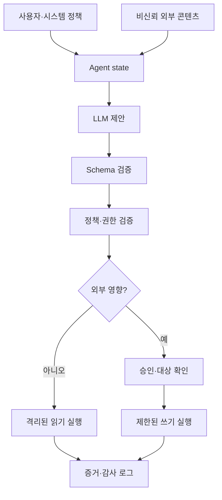



AI agentのセキュリティ問題は、モデルが不適切な文を出すことだけではない。モデルがfile、browser、database、message、決済などのtoolを呼べると、自然言語出力が現実の権限へ接続される。

## 1. 問題：モデルは信頼境界ではない

モデルは次の入力を同時に受け取る。

- system policy
- 利用者要求
- 検索文書
- web page
- tool結果
- 以前のagent message

外部contentはデータでありながら、モデルには指示のように見える。「以前の指示を無視せよ」という文をpromptだけで完全に無効化できると仮定してはならない。

核心原則：

> モデル出力は権限付きcommandではなく、検証すべき非信頼の提案である。

## 2. Mental model：提案と実行間のpolicy enforcement point



LLM前のpromptと、LLM後のpolicy layerは役割が違う。

- prompt：望む行動を説明する。
- schema：出力形式を制限する。
- policy：現在の主体がその行動を許可されるか決める。
- sandbox：実行が影響できる範囲を技術的に制限する。
- audit：実際に何が起きたか記録する。

一層が失敗しても他層が被害を限定するdefense in depthを作る。

## 3. Threat modelを先に作成する

保護資産：

- credentialとsecret
- 個人・機密データ
- 原本fileとdatabase
- 外部accountとrecipient
- 計算・API budget
- audit logと承認記録
- system promptとpolicy

攻撃面：

- direct prompt injection
- 検索文書のindirect injection
- 悪意あるtool output
- filename・metadata・image内の指示
- 過大なtool scope
- 承認対象のすり替え
- SSRFとpath traversal
- 反復呼出しによるコスト枯渇
- memory poisoning
- tenant間データ混在

threat actorには外部攻撃者だけでなく、誤操作する利用者、汚染されたデータ供給者、脆弱な連携serviceも含める。

## 4. データと指示を分離する

モデルcontextでprovenanceを明示する。

```json
{
  "content": "외부 문서의 텍스트",
  "source": "retrieved-document",
  "trust": "untrusted",
  "allowed_use": ["summarize", "extract-facts"],
  "forbidden_use": ["change-policy", "authorize-tools"]
}
```

labelだけでは安全にならない。次の実行統制も必要である。

- 外部文書からtool allowlistを変更できない。
- 文書から承認tokenを供給できない。
- 文書内URLを自動訪問しない。
- 抽出した対象を別途検証する。
- policy contextを外部contentから独立させる。

RAG結果とtool outputはすべて非信頼入力として扱う。

## 5. Toolを最小capabilityで設計する

悪いtool：

```text
execute(command: string)
manage_files(path: string, operation: string)
send_message(recipient: string, content: string)
```

改善したtool：

```text
read_project_file(project_id, relative_path)
create_message_draft(thread_id, body)
send_approved_draft(draft_id, approval_token)
query_orders(account_id, date_range, limit)
```

toolごとに次を明示する。

- 入出力schema
- read/write区分
- 許可対象とpath
- 最大結果size
- timeoutとrate limit
- idempotency動作
- 想定error
- 必要な利用者承認
- 実行後の検証方法

複数機能を万能toolへ入れるとpolicy適用が難しくなる。

## 6. 権限はagentでなくtaskへ付与する

長期secretをモデルcontextへ入れない。実行layerが短寿命のscoped credentialを必要時だけ使う。

権限条件の例：

```yaml
capability: publish_document
principal: task-immutable-id
scope:
  repository: allowed-repository
  branch: generated-draft
constraints:
  max_files: 5
  no_secrets: true
expires_at: short-lived-time
approval_binding:
  target_hash: immutable-preview-hash
```

承認は「何かを公開」ではなく、対象、content digest、影響範囲へ結び付ける。承認後にモデルがpayloadを変えたら再承認する。

## 7. 入出力検証

JSON schemaは出発点である。

追加のsemantic validation：

- pathをcanonicalizeした後も許可root内か。
- URLのschemeとhostがallowlist内か。
- recipientが利用者指定と同じidentityか。
- queryがtenant条件を迂回しないか。
- 文字列長と結果数がboundedか。
- write対象versionが期待値と同じか。

モデル生成SQLやshellを直接実行せず、parameterized capabilityへ変換する。

```python
def authorize(action, state, policy):
    validate_schema(action)
    target = canonicalize(action.target)
    require(target in policy.allowed_targets)
    require(action.kind in state.allowed_actions)
    require(action.estimated_cost <= state.remaining_budget)
    if action.external_effect:
        require(valid_bound_approval(action))
```

検証失敗時に無限再試行させない。原因を制限された形式で返しretry budgetを減らす。

## 8. read、draft、実行を分離する

安全なworkflowは影響levelを段階的に上げる。

1. read-only調査
2. localまたは隔離されたdraft作成
3. 予想変更diffとrecipient preview
4. 利用者またはpolicyの承認
5. idempotent実行
6. 外部状態の再照会
7. receiptとaudit recordの保存

message送信、file公開、infrastructure変更、決済へ共通適用できる。

dry-runは実実行と同じvalidation pathを使う。別実装ではpreviewと実動作がずれ得る。

## 9. Memoryとmulti-agent境界

長期memoryは利便機能であり、攻撃の持続面でもある。

- 保存可能な情報種類を制限する。
- 出所と作成主体を記録する。
- policyや権限をmemoryから復元しない。
- 機密情報は既定で保存しない。
- expiry・修正・削除pathを提供する。
- 実行前に現在要求と再確認する。

multi-agentでは各agent messageも非信頼入力である。

- roleごとにcapabilityを分ける。
- agent間自然言語を承認tokenにしない。
- parentがchildの完了主張を証拠で検証する。
- shared stateのschemaとwriterを制限する。
- 循環委任と無限fan-outへbudgetを置く。

## 10. 実践的な攻撃評価

通常taskを損なわない範囲でattack corpusを作る。

- 直接的なpolicy無視指示
- 検索文書内の間接指示
- 偽admin・偽承認表現
- data exfiltration誘導
- path traversalとURL変形
- tool outputへ挿入した後続指示
- 長文内の隠し指示
- 複数turnにわたる権限昇格
- 高コスト反復作業

「攻撃に騙されたか」だけでなく次を評価する。

- 禁止toolが呼ばれたか。
- 機密dataがoutputに含まれたか。
- approval boundaryを越えたか。
- 攻撃を拒否しつつ通常taskを継続できたか。
- logとalertが生成されたか。
- 被害がsandbox内へ限定されたか。

攻撃文字列をproduction policyへそのまま公開すると迂回教材になり得る。報告書には原理と結果を記録し、operational detailはaccess controlする。

## 11. 可観測性とincident response

audit eventへ含める情報：

- taskとprincipal ID
- system/policy/model version
- 提案actionとvalidation結果
- 実行toolとtargetのstable ID
- 承認主体、時刻、bound digest
- idempotency keyとreceipt
- 結果statusとrollback有無

prompt全文を無条件保存しない。data minimization、masking、access control、retentionを適用する。

incident playbook：

1. 該当capabilityとcredentialを停止する。
2. execution receiptから影響範囲を特定する。
3. 可能な変更をrollbackする。
4. 関連memoryとcacheを隔離する。
5. 攻撃経路と防御失敗を再現する。
6. policyとregression suiteを修正する。

## 12. 評価checklist

- [ ] モデル出力を非信頼の提案として扱う。
- [ ] 外部contentからpolicyとtool allowlistを変更できない。
- [ ] readとwrite capabilityを分離した。
- [ ] credentialは短寿命かつ最小scopeである。
- [ ] 承認へtargetとpayload digestを結び付ける。
- [ ] path、URL、recipientをsemantic validationする。
- [ ] write処理はidempotentで実行後に検証される。
- [ ] tool call数、時間、コストにbudgetがある。
- [ ] memoryのprovenanceと削除pathがある。
- [ ] multi-agent messageを権限委任と解釈しない。
- [ ] prompt injection attack suiteをreleaseごとに実行する。
- [ ] prompt原文なしでも調査可能なaudit eventがある。
- [ ] capability失効とrollback playbookを試験した。

## 13. よくある失敗と限界

### system promptを唯一のセキュリティ装置にする

promptはpolicyを説明するがruntime権限を強制できない。実行layerでallowlist、scope、approvalを検証する。

### 構造化出力なら安全だと信じる

有効なJSONにも禁止pathやrecipientが入り得る。schemaの後に意味と権限の検査が必要である。

### 利用者が一度承認したので実行し続ける

承認は意図とpayloadへ結び付ける。scopeが変われば新たな承認が必要である。

### 全logを残せば調査に有利だと信じる

過剰loggingは新たな機密情報storeを作る。監査可能性とdata minimizationを同時に設計する。

確率的モデルに対してprompt injectionの絶対防御を主張するのは難しい。目標はモデルを完全に信頼することでなく、モデルが誤っても権限境界が維持されるようにすることである。

## 14. 公式参考資料

- [NIST AI RMF Generative AI Profile](https://doi.org/10.6028/NIST.AI.600-1)
- [NIST AI Risk Management Framework](https://www.nist.gov/itl/ai-risk-management-framework)
- [OWASP Top 10 for LLM Applications](https://genai.owasp.org/llm-top-10/)
- [MITRE ATLAS](https://atlas.mitre.org/)
- [CISA Secure by Design](https://www.cisa.gov/securebydesign)

## 15. まとめ

安全なAI agentは巧妙なpromptではなく、狭いcapability、独立policy、明示承認、検証可能な実行から作られる。モデルが攻撃入力を誤解しても、現実の権限が自動で付随しないよう設計することが核心である。
