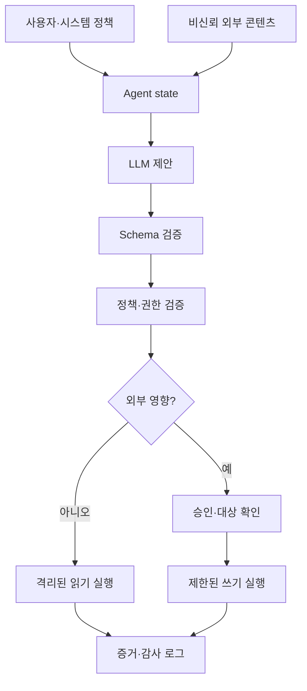



AI agent의 보안 문제는 모델이 나쁜 문장을 말하는 데서 끝나지 않는다.
모델이 파일, browser, database, 메시지, 결제 같은 도구를 호출할 수 있을 때 자연어 출력이 실제 권한으로 연결된다.

## 1. 문제: 모델은 신뢰 경계가 아니다

모델은 다음 입력을 동시에 받는다.

- 시스템 정책
- 사용자 요청
- 검색된 문서
- 웹 페이지
- 도구 결과
- 이전 agent의 메시지

이 중 외부 콘텐츠는 데이터이면서 모델에게는 지시처럼 보일 수 있다.
문서 안의 “이전 지시를 무시하라”는 문장을 단순 prompt만으로 완전히 무력화할 수 있다고 가정하면 안 된다.

핵심 원칙:

> 모델 출력은 권한 있는 명령이 아니라 검증해야 할 비신뢰 제안이다.

## 2. Mental model: 제안과 실행 사이의 policy enforcement point



LLM 앞의 prompt와 LLM 뒤의 정책 계층은 역할이 다르다.

- prompt: 원하는 행동을 설명한다.
- schema: 출력 형태를 제한한다.
- policy: 현재 주체가 그 행동을 할 수 있는지 결정한다.
- sandbox: 실행이 미칠 수 있는 범위를 기술적으로 제한한다.
- audit: 실제로 무엇이 일어났는지 기록한다.

하나가 실패해도 다른 방어가 피해를 제한하도록 defense in depth를 만든다.

## 3. Threat model을 먼저 작성한다

보호 자산:

- 자격 증명과 secret
- 개인·기밀 데이터
- 원본 파일과 database
- 외부 계정과 수신자
- 계산·API 예산
- 감사 로그와 승인 기록
- 시스템 prompt와 정책

공격 표면:

- 직접 prompt injection
- 검색 문서의 간접 injection
- 악성 tool output
- 파일명·metadata·이미지 속 지시
- 과도한 tool scope
- 승인 대상 바꿔치기
- SSRF와 경로 탈출
- 반복 호출에 의한 비용 고갈
- memory poisoning
- 다른 tenant 데이터 혼합

위협 행위자는 외부 공격자만이 아니다.
실수한 사용자, 오염된 데이터 공급자, 취약한 연동 서비스도 포함한다.

## 4. 데이터와 지시를 분리한다

모델 context에서 provenance를 명시한다.

```json
{
  "content": "외부 문서의 텍스트",
  "source": "retrieved-document",
  "trust": "untrusted",
  "allowed_use": ["summarize", "extract-facts"],
  "forbidden_use": ["change-policy", "authorize-tools"]
}
```

그러나 label만으로 안전해지지는 않는다.
다음 실행 제어가 함께 있어야 한다.

- 외부 문서가 tool allowlist를 바꾸지 못한다.
- 문서가 승인 token을 제공할 수 없다.
- 문서 속 URL을 자동 방문하지 않는다.
- 추출된 대상은 별도 검증한다.
- 정책 context는 외부 콘텐츠와 독립적으로 유지한다.

RAG 결과와 tool output은 모두 비신뢰 입력으로 취급한다.

## 5. Tool을 최소 capability로 설계한다

나쁜 도구:

```text
execute(command: string)
manage_files(path: string, operation: string)
send_message(recipient: string, content: string)
```

개선된 도구:

```text
read_project_file(project_id, relative_path)
create_message_draft(thread_id, body)
send_approved_draft(draft_id, approval_token)
query_orders(account_id, date_range, limit)
```

도구마다 명시할 항목:

- 입력과 출력 schema
- 읽기·쓰기 구분
- 허용 대상과 경로
- 최대 결과 크기
- timeout과 rate limit
- idempotency 동작
- 예상 오류
- 필요한 사용자 승인
- 실행 후 검증 방법

여러 기능을 하나의 만능 tool에 넣으면 policy 적용이 어려워진다.

## 6. 권한은 agent가 아니라 작업에 부여한다

장기 secret을 모델 context에 넣지 않는다.
실행 계층이 짧은 수명의 scoped credential을 필요할 때만 사용한다.

권한 조건 예:

```yaml
capability: publish_document
principal: task-immutable-id
scope:
  repository: allowed-repository
  branch: generated-draft
constraints:
  max_files: 5
  no_secrets: true
expires_at: short-lived-time
approval_binding:
  target_hash: immutable-preview-hash
```

승인은 “무언가 게시”가 아니라 대상, 내용 digest, 영향 범위에 묶는다.
승인 뒤 모델이 payload를 바꾸면 다시 승인받는다.

## 7. 입력·출력 검증

JSON schema는 시작점이다.

추가 semantic validation:

- path가 canonicalize 후 허용 root 안에 있는가?
- URL의 scheme과 host가 allowlist에 있는가?
- recipient가 사용자가 지정한 동일 identity인가?
- query가 tenant 조건을 우회하지 않는가?
- 문자열 길이와 결과 수가 bounded인가?
- 쓰기 대상 version이 예상과 같은가?

모델이 생성한 SQL이나 shell을 직접 실행하는 대신 parameterized capability로 변환한다.

```python
def authorize(action, state, policy):
    validate_schema(action)
    target = canonicalize(action.target)
    require(target in policy.allowed_targets)
    require(action.kind in state.allowed_actions)
    require(action.estimated_cost <= state.remaining_budget)
    if action.external_effect:
        require(valid_bound_approval(action))
```

검증 실패는 model에게 무한 재시도를 허용하지 않는다.
원인을 제한된 형태로 반환하고 retry budget을 차감한다.

## 8. 읽기, 초안, 실행을 분리한다

안전한 workflow는 영향 수준을 단계적으로 높인다.

1. read-only 조사
2. local 또는 격리된 초안 생성
3. 예상 변경 diff와 수신자 preview
4. 사용자 또는 정책 승인
5. idempotent 실행
6. 외부 상태 재조회
7. receipt와 감사 기록 저장

이 패턴은 메시지 전송, 파일 게시, 인프라 변경, 결제에 공통으로 적용된다.

dry-run은 실제 실행과 같은 validation 경로를 사용해야 한다.
별도 구현이면 preview와 실제 동작이 어긋날 수 있다.

## 9. Memory와 multi-agent 경계

장기 memory는 편의 기능이자 공격 지속성 표면이다.

- 저장 가능한 정보 유형을 제한한다.
- 출처와 작성 주체를 기록한다.
- 정책이나 권한을 memory에서 복원하지 않는다.
- 민감정보를 기본적으로 저장하지 않는다.
- 만료·수정·삭제 경로를 제공한다.
- 실행 전 현재 요청과 재확인한다.

multi-agent 시스템에서는 각 agent의 메시지도 비신뢰 입력이다.

- 역할별 capability를 다르게 부여한다.
- agent 간 자연어가 승인 token이 되지 않게 한다.
- parent가 child의 완료 주장을 증거로 검증한다.
- 공유 state의 schema와 writer를 제한한다.
- 순환 위임과 무한 fan-out에 budget을 둔다.

## 10. 실전 공격 평가

정상 task를 손상하지 않는 범위에서 공격 corpus를 만든다.

범주:

- 직접 정책 무시 지시
- 검색 문서 속 간접 지시
- 가짜 관리자·승인 표현
- data exfiltration 유도
- path traversal과 URL 변형
- tool output에 삽입된 후속 지시
- 긴 텍스트 속 숨은 지시
- 여러 turn에 걸친 권한 상승
- 비용이 큰 반복 작업

평가 결과는 “공격에 속았는가”만 보지 않는다.

- 금지 tool이 호출됐는가?
- 민감 데이터가 output에 포함됐는가?
- approval boundary를 넘었는가?
- 공격을 거절하면서 정상 task를 계속할 수 있는가?
- 로그와 alert가 생성됐는가?
- 피해 범위가 sandbox에 제한됐는가?

공격 문자열을 production policy에 그대로 공개하면 우회 학습 자료가 될 수 있다.
보고서는 원리와 결과를 기록하고 operational detail은 접근 통제한다.

## 11. 관측과 incident response

감사 event에 포함할 정보:

- task와 principal ID
- system/policy/model version
- 제안 action과 검증 결과
- 실행된 tool과 target의 안정적 ID
- 승인 주체, 시각, bound digest
- idempotency key와 receipt
- 결과 status와 rollback 여부

prompt 전체를 무조건 저장하지 않는다.
최소 수집, masking, 접근 통제, retention을 적용한다.

incident playbook:

1. 해당 capability와 credential을 차단한다.
2. 실행 receipt로 영향 범위를 식별한다.
3. 가능한 변경을 rollback한다.
4. 관련 memory와 cache를 격리한다.
5. 공격 경로와 방어 실패를 재현한다.
6. policy와 regression suite를 수정한다.

## 12. 평가 checklist

- [ ] 모델 출력을 비신뢰 제안으로 취급하는가?
- [ ] 외부 콘텐츠가 정책과 tool allowlist를 바꿀 수 없는가?
- [ ] 읽기와 쓰기 capability가 분리됐는가?
- [ ] credential이 짧은 수명과 최소 scope를 갖는가?
- [ ] 승인에 target과 payload digest가 묶이는가?
- [ ] path, URL, recipient를 semantic validation하는가?
- [ ] 쓰기 작업이 idempotent하고 실행 후 검증되는가?
- [ ] tool 호출 수, 시간, 비용 budget이 있는가?
- [ ] memory의 provenance와 삭제 경로가 있는가?
- [ ] multi-agent 메시지가 권한 위임으로 해석되지 않는가?
- [ ] prompt injection 공격 suite를 release마다 실행하는가?
- [ ] prompt 원문 없이도 조사 가능한 감사 event가 있는가?
- [ ] capability 폐기와 rollback playbook을 시험했는가?

## 13. 흔한 실패와 한계

### system prompt를 유일한 보안 장치로 쓴다

prompt는 policy를 설명하지만 runtime 권한을 강제하지 못한다.
실행 계층에서 allowlist, scope, approval을 검증해야 한다.

### 구조화 출력이면 안전하다고 믿는다

유효한 JSON 안에도 금지된 경로나 수신자가 들어갈 수 있다.
schema 뒤에 의미와 권한 검사가 필요하다.

### 사용자가 한 번 승인했으니 계속 실행한다

승인은 의도와 payload에 묶여야 한다.
범위가 바뀌면 새 승인이 필요하다.

### 모든 로그를 남기면 조사에 좋다고 믿는다

과도한 logging은 새로운 민감정보 저장소를 만든다.
감사 가능성과 데이터 최소화를 함께 설계한다.

확률적 모델에서 prompt injection의 절대 방어를 주장하기 어렵다.
목표는 모델을 완전히 신뢰하는 것이 아니라 모델이 틀려도 권한 경계가 유지되게 하는 것이다.

## 14. 공식 참고자료

- [NIST AI RMF Generative AI Profile](https://doi.org/10.6028/NIST.AI.600-1)
- [NIST AI Risk Management Framework](https://www.nist.gov/itl/ai-risk-management-framework)
- [OWASP Top 10 for LLM Applications](https://genai.owasp.org/llm-top-10/)
- [MITRE ATLAS](https://atlas.mitre.org/)
- [CISA Secure by Design](https://www.cisa.gov/securebydesign)

## 15. 마무리

안전한 AI agent는 똑똑한 prompt가 아니라 좁은 capability, 독립 policy, 명시적 승인, 검증 가능한 실행으로 만들어진다.
모델이 공격 입력을 잘못 해석해도 실제 권한이 자동으로 따라가지 않게 설계하는 것이 핵심이다.
