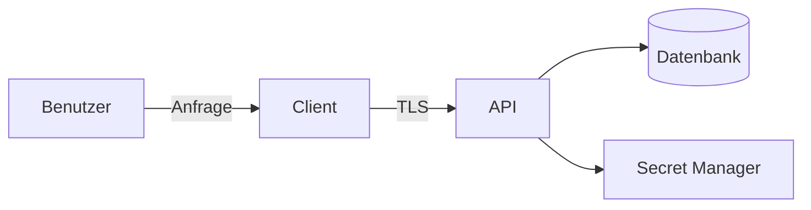



Sicherheit ist keine Phase, in der am Ende ein Scanner ausgeführt wird. Sie beginnt beim Entwurf dessen, was geschützt werden soll, wem vertraut wird und welchen Fehlern das System standhalten muss. Wichtiger als perfekte Manipulationsresistenz ist, **kritische Berechtigungen und Geheimnisse nicht dort zu platzieren, wo ein Angreifer sie kontrollieren kann**.

## Threat Modeling mit vier Fragen beginnen

1. Was bauen wir?
2. Was kann schiefgehen?
3. Was werden wir dagegen tun?
4. Wie verifizieren wir, dass wir hinreichend gute Arbeit geleistet haben?

Bilden Sie zuerst Assets, Akteure, Datenflüsse und Vertrauensgrenzen ab.



Da ein Browser- oder Desktop-Client auf dem Gerät des Benutzers läuft, muss er als außerhalb der Vertrauensgrenze behandelt werden. Prüfungen, Verschleierung und verborgene Zeichenketten im Client verzögern einen Angriff lediglich und können keine Grundlage serverseitiger Autorität sein.

## Assets und Sicherheitsziele konkret formulieren

Schreiben Sie statt „Daten schützen“ beispielsweise:

- Authentifizierungstokens dürfen von nicht autorisierten Principals weder gelesen noch wiederverwendet werden.
- Eine Anfrage eines Mandanten darf nicht auf Daten eines anderen Mandanten zugreifen.
- Provenienz und Integrität von Release-Binärdateien müssen verifizierbar sein.
- Zahlungs-, Lizenz- und Administrationsrechte müssen vom Server und nicht vom Client bestimmt werden.
- Auditprotokolle dürfen von gewöhnlichen Benutzern nicht verändert werden.

Verbinden Sie jedes Ziel mit einer Bedrohung, einer Kontrolle und einer Verifikation.

| Bedrohung | Vorbeugende oder mindernde Kontrolle | Verifikation |
|---|---|---|
| Unautorisierter Objektzugriff | Serverseitige Objekt- und Mandantenautorisierung | Negativtest mit der ID eines anderen Principals |
| SQL Injection | Parametrisierte Abfrage | Sicherheitstest und Code-Review |
| Offenlegung von Geheimnissen | Secret Manager und kurzlebige Zugangsdaten | Secret Scan und Rotationsübung |
| Manipulation von Binärdateien | Codesignierung und Prüfung der Update-Signatur | Test, dass die Installation bei einem Signaturfehler abgelehnt wird |
| Kompromittierung von Abhängigkeiten | Lockfile, Provenienz und Schwachstellenverwaltung | Reproduzierbarer Build und Abhängigkeitsprüfung |

## Authentifizierung von Autorisierung trennen

- Authentifizierung: Wer sind Sie?
- Autorisierung: Dürfen Sie diese Aktion an dieser Ressource ausführen?

Angemeldet zu sein gewährt keinen Zugriff auf jedes Objekt. Wird am Endpunkteinstieg nur eine Rolle geprüft, während die Mandantenbedingung in der Datenabfrage fehlt, entsteht eine horizontale Rechteausweitung. Autorisierung muss **Aktion + Ziel + aktuellen Zustand** gemeinsam validieren.

```text
can(actor, action, resource, context) -> allow | deny
```

Verweigern Sie standardmäßig, lassen Sie den Server Autorisierungsentscheidungen treffen und erwägen Sie für administrative Funktionen separate Auditierung und erneute Authentifizierung.

## Eingabevalidierung und Ausgabekodierung dienen verschiedenen Zwecken

Eingabevalidierung prüft erlaubte Formate und Domänenbereiche. Ausgabekodierung verhindert, dass Daten in einem Interpretationskontext wie HTML, SQL oder einer Shell zu Befehlen werden.

- Verwenden Sie für SQL parametrisierte Abfragen statt Stringverkettung.
- Kodieren Sie HTML für den Ausgabekontext und verwenden Sie CSP als ergänzende Kontrolle.
- Verwenden Sie für Shell-Aufrufe wenn möglich Argumentarrays und direkte APIs und vermeiden Sie Shell-Interpolation.
- Prüfen Sie bei Dateipfaden die erlaubte Wurzel und das normalisierte Ergebnis.
- Begrenzen Sie bei Serialisierungsformaten erlaubte Typen und Größen.

Keine einzelne Operation zum „Entfernen von Sonderzeichen“ kann jeden Injection-Angriff verhindern.

## Den Lebenszyklus eines Geheimnisses verwalten, nicht nur seinen Wert

Secret Management umfasst Erzeugung, Speicherung, Verteilung, Nutzung, Rotation und Entsorgung.

- Legen Sie Geheimnisse weder in Repositories, Images, Binärdateien noch Logs ab.
- Geben Sie wenn möglich kurzlebige Zugangsdaten über OIDC oder Workload Identity aus.
- Vergeben Sie pro Service geringste Rechte.
- Auditieren Sie, welche Principals wann Geheimnisse lesen.
- Üben Sie ein Rotations-Runbook unter der Annahme einer Offenlegung.
- Da gelöschte Commits im Git-Verlauf verbleiben können, müssen offengelegte Geheimnisse sofort widerrufen und ersetzt werden.

Gehen Sie davon aus, dass Benutzer einen in einer Desktop-Anwendung eingebetteten API-Schlüssel extrahieren können. Wenn ein Public Client erforderlich ist, entwerfen Sie mit einem eingeschränkten öffentlichen Identifikator, einem serverseitigen Vermittler und Tokens pro Benutzer.

## Realistische Grenzen für Desktop-Anwendungen und Lizenzierung

Lokal ausgeführter Code kann letztlich analysiert und verändert werden. Definieren Sie daher gestaffelte Ziele statt „nicht zu umgehen“:

1. Der Server besitzt die endgültige Autorität über Berechtigungen und kritische Privilegien.
2. Lizenzantworten signieren und durch den Client mit einem öffentlichen Schlüssel verifizieren lassen.
3. Nur kurze Ablaufzeit und minimale Claims in Tokens aufnehmen.
4. Richtlinien für Offline-Karenzzeiten und das Zurückstellen der Uhr festlegen.
5. Verteilungsweg durch Codesignierung und einen sicheren Updater schützen.
6. Obfuskation und Manipulationsschutz nur als ergänzende Kontrollen zur Erhöhung der Angriffskosten verwenden.
7. Geschäftliche Auswirkungen von Fail-open und Fail-closed bei Ausfall des Authentifizierungsservers im Voraus festlegen.

Ein privater Schlüssel oder ein gemeinsam genutztes Master Secret im Client kann bei einer einzigen Offenlegung jede Installation kompromittieren.

## Lieferkette und CI schützen

- Workflow-Berechtigungen minimieren.
- Richtlinien zum Prüfen, Festschreiben und Aktualisieren externer Actions und Abhängigkeiten etablieren.
- Deployment-Geheimnisse nicht gegenüber nicht vertrauenswürdigem Pull-Request-Code offenlegen.
- Hashes, Provenienz und Signaturen für Build- und Release-Artefakte bewahren.
- Branchschutz und Review auf kritische Pfade anwenden.
- SAST, Abhängigkeits- und Secret Scans sind Teile einer Schranke, nicht die Gesamtheit der Sicherheit.

## Logs und personenbezogene Daten

Sicherheitslogs müssen erfassen, wer wann was mit welchem Ergebnis versucht hat. Passwörter, Access Tokens, Cookies, private Schlüssel und rohe personenbezogene Daten dürfen jedoch nicht protokolliert werden. Auch die Logs selbst unterliegen Zugriffskontrolle, Aufbewahrungsfristen und Integritätsschutz.

## Checkliste zur Verifikation

- [ ] Assets, Akteure, Datenflüsse und Vertrauensgrenzen sind aktuell.
- [ ] Jede Bedrohung ist mit einer Kontrolle und einer konkreten Verifikationsmethode verbunden.
- [ ] Authentifizierung sowie Objekt- und Mandantenautorisierung werden getrennt getestet.
- [ ] Injection-Abwehr wird je Kontext angewendet.
- [ ] Weder Repository und dessen Verlauf noch Artefakte oder Logs enthalten Geheimnisse.
- [ ] Verfahren zur Secret-Rotation und zum Widerruf von Zugangsdaten wurden geprobt.
- [ ] Der Client wird nicht als Grundlage serverseitiger Autorität verwendet.
- [ ] Provenienz und Integrität von Release-Artefakten werden verifiziert.
- [ ] Verhalten bei Autorisierungs- und Abhängigkeitsfehlern ist dokumentiert.
- [ ] Sicherheitsentscheidungen und Restrisiken werden im Bedrohungsmodell erfasst.

## Häufige Fehler

- Einem Client vertrauen, weil er TLS verwendet.
- Eine verborgene UI-Schaltfläche als Autorisierungskontrolle behandeln.
- Annehmen, ein Geheimnis sei sicher, nur weil es in einer Umgebungsvariable gespeichert wird.
- Obfuskation mit Verschlüsselung oder serverseitiger Autorität gleichsetzen.
- Aus einem Scanner ohne Befunde schließen, dass keine Bedrohungen existieren.
- Interne Pfade, Abfragen und Tokens in Fehlerantworten und Logs offenlegen.

Das Wesen eines Sicherheitsentwurfs ist nicht, jeden Angriff vorherzusagen, sondern **die Autorität über kritische Assets innerhalb der richtigen Grenzen zu platzieren und wiederholt zu verifizieren, dass Kontrollen tatsächlich funktionieren**.

## Referenzen

- [OWASP Threat Modeling Cheat Sheet](https://cheatsheetseries.owasp.org/cheatsheets/Threat_Modeling_Cheat_Sheet.html)
- [OWASP Application Security Verification Standard](https://owasp.org/www-project-application-security-verification-standard/)
- [NIST Secure Software Development Framework](https://csrc.nist.gov/projects/ssdf)
