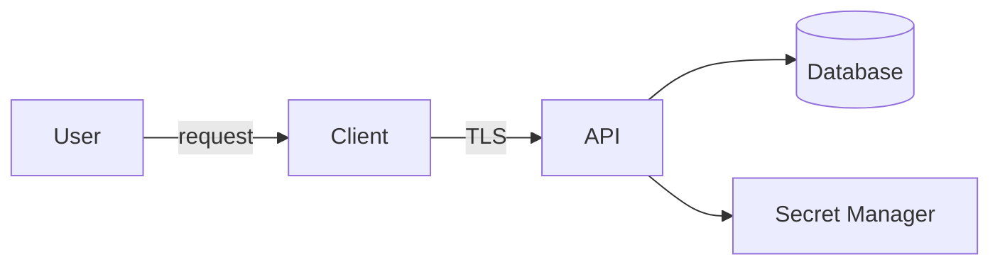



Security is not a stage in which a scanner is run at the end. It begins when designing what to protect, whom to trust, and which failures the system must withstand. More important than perfect tamper resistance is **not placing critical privileges and secrets where an attacker can control them**.

## Start Threat Modeling with Four Questions

1. What are we building?
2. What can go wrong?
3. What are we going to do about it?
4. How will we verify that we have done a sufficiently good job?

First, map the assets, actors, data flows, and trust boundaries.



Because a browser or desktop client runs on the user's device, treat it as outside the trust boundary. Checks, obfuscation, and hidden strings inside a client are merely delaying mechanisms and cannot serve as the basis for server-side authority.

## Make Assets and Security Goals Specific

Instead of writing “protect data,” write statements such as these:

- Authentication tokens must not be readable or reusable by unauthorized principals.
- A request from one tenant must not be able to read another tenant's data.
- The provenance and integrity of release binaries must be verifiable.
- Payment, licensing, and administrative privileges must be determined by the server, not the client.
- Audit logs must not be modifiable by ordinary users.

Connect each goal to a threat, a control, and verification.

| Threat | Preventive or mitigating control | Verification |
|---|---|---|
| Unauthorized object access | Server-side object and tenant authorization checks | Negative test using another principal's ID |
| SQL injection | Parameterized query | Security testing and code review |
| Secret exposure | Secret manager and short-lived credentials | Secret scan and rotation drill |
| Binary tampering | Code signing and update signature verification | Test that installation is rejected on a signature error |
| Dependency compromise | Lockfile, provenance, and vulnerability management | Reproducible build and dependency review |

## Separate Authentication from Authorization

- Authentication: Who are you?
- Authorization: May you perform this action on this resource?

Being logged in does not grant access to every object. Checking only a role at endpoint entry while omitting a tenant condition from the data query creates horizontal privilege escalation. Authorization must validate the **action + target + current state** together.

```text
can(actor, action, resource, context) -> allow | deny
```

Deny by default, let the server make authorization decisions, and consider separate auditing and reauthentication for administrative functions.

## Input Validation and Output Encoding Serve Different Purposes

Input validation checks permitted formats and domain ranges. Output encoding prevents data from turning into commands in an interpretation context such as HTML, SQL, or a shell.

- For SQL, use parameterized queries rather than string concatenation.
- For HTML, encode for the output context and use CSP as a supplementary control.
- For shell invocations, use argument arrays and direct APIs where possible, and avoid shell interpolation.
- For file paths, verify the permitted root and the normalized result.
- For serialization formats, restrict allowed types and sizes.

No single “remove special characters” operation can prevent every injection attack.

## Manage a Secret's Lifecycle, Not Just Its Value

Secret management includes creation, storage, distribution, use, rotation, and disposal.

- Do not put secrets in repositories, images, binaries, or logs.
- Where possible, issue short-lived credentials through OIDC or workload identity.
- Grant least privilege per service.
- Audit which principals read secrets and when.
- Practice a rotation runbook that assumes exposure.
- Because deleted commits may remain in Git history, immediately revoke and replace any exposed secret.

Assume that users can extract an API key embedded in a desktop application. When a public client is necessary, design around a restricted public identifier, a server-side intermediary, and per-user tokens.

## Realistic Boundaries for Desktop Applications and Licensing

Code that runs locally can ultimately be analyzed and modified. Therefore, define layered goals rather than “impossible to bypass”:

1. The server is the final authority for entitlements and critical privileges.
2. Sign license responses, and have the client verify them with a public key.
3. Put only a short expiration and minimal claims in tokens.
4. Specify policies for offline grace periods and clock rollback.
5. Protect the distribution path with code signing and a secure updater.
6. Use obfuscation and anti-tamper only as supplementary controls that raise the attacker's cost.
7. Decide in advance the business impact of failing open or failing closed when the authentication server is unavailable.

Putting a private key or shared master secret in the client can allow one exposure to compromise every installation.

## Protect the Supply Chain and CI

- Minimize workflow permissions.
- Establish policies to review, pin, and update external actions and dependencies.
- Do not expose deployment secrets to untrusted pull request code.
- Preserve hashes, provenance, and signatures for build and release artifacts.
- Apply branch protection and review to critical paths.
- SAST, dependency scans, and secret scans are parts of a gate, not the entirety of security.

## Logs and Personal Data

Security logs need to record who attempted what, when, and with what result. However, do not record passwords, access tokens, cookies, private keys, or raw personal data. The logs themselves are also subject to access control, retention periods, and integrity protection.

## Verification Checklist

- [ ] Assets, actors, data flows, and trust boundaries are current.
- [ ] Every threat is connected to a control and a concrete verification method.
- [ ] Authentication and object and tenant authorization checks are tested separately.
- [ ] Injection defenses are applied for each context.
- [ ] No secrets are present in the repository and its history, artifacts, or logs.
- [ ] Secret rotation and credential revocation procedures have been practiced.
- [ ] The client is not used as the basis for server-side authority.
- [ ] The provenance and integrity of release artifacts are verified.
- [ ] Behavior on authorization failure and dependency failure is documented.
- [ ] Security decisions and residual risks are recorded in the threat model.

## Common Failures

- Trusting a client because it uses TLS.
- Treating a hidden UI button as an authorization control.
- Assuming a secret is safe merely because it is stored in an environment variable.
- Treating obfuscation as equivalent to encryption or server-side authority.
- Concluding that no threats exist because a scanner reports no findings.
- Exposing internal paths, queries, and tokens in error responses and logs.

The essence of security design is not predicting every attack, but **placing authority over critical assets inside the correct boundaries and repeatedly verifying that controls actually work**.

## References

- [OWASP Threat Modeling Cheat Sheet](https://cheatsheetseries.owasp.org/cheatsheets/Threat_Modeling_Cheat_Sheet.html)
- [OWASP Application Security Verification Standard](https://owasp.org/www-project-application-security-verification-standard/)
- [NIST Secure Software Development Framework](https://csrc.nist.gov/projects/ssdf)
