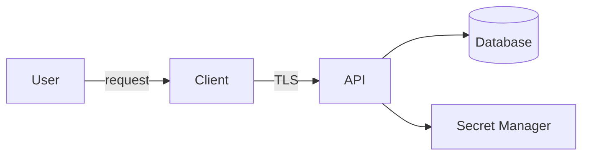



La seguridad no es una etapa en la que al final se ejecuta un escáner. Comienza cuando se diseña qué proteger, en quién confiar y qué fallas debe soportar el sistema. Más importante que una perfecta resistencia a la manipulación es **no colocar privilegios y secretos críticos donde un atacante pueda controlarlos**.

## Comience a modelar amenazas con cuatro preguntas

1. ¿Qué estamos construyendo?
2. ¿Qué puede salir mal?
3. ¿Qué vamos a hacer al respecto?
4. ¿Cómo comprobaremos que hemos hecho un trabajo suficientemente bueno?

Primero, mapee los activos, los actores, los flujos de datos y los límites de confianza.



Debido a que un navegador o un cliente de escritorio se ejecuta en el dispositivo del usuario, trátelo como si estuviera fuera del límite de confianza. Las comprobaciones, la ofuscación y las cadenas ocultas dentro de un cliente son simplemente mecanismos de demora y no pueden servir como base para la autoridad del lado del servidor.

## Hacer que los activos y los objetivos de seguridad sean específicos

En lugar de escribir "proteger datos", escriba declaraciones como estas:

- Los tokens de autenticación no deben ser legibles ni reutilizables por entidades principales no autorizadas.
- Una solicitud de un inquilino no debe poder leer los datos de otro inquilino.
- La procedencia y la integridad de los archivos binarios de publicación deben ser verificables.
- El pago, las licencias y los privilegios administrativos deben ser determinados por el servidor, no por el cliente.
- Los usuarios normales no deben poder modificar los registros de auditoría.

Conecte cada objetivo con una amenaza, un control y una verificación.

| Amenaza | Control preventivo o mitigador | Verificación |
|---|---|---|
| Acceso a objetos no autorizados | Comprobaciones de autorización de inquilinos y objetos del lado del servidor | Prueba negativa utilizando ID de otro principal |
| Inyección SQL | Consulta parametrizada | Pruebas de seguridad y revisión de código |
| Exposición secreta | Gerente secreto y credenciales de corta duración | Taladro secreto de escaneo y rotación |
| Manipulación binaria | Firma de código y verificación de firma de actualización | Pruebe que la instalación se rechaza por un error de firma |
| Compromiso de dependencia | Gestión de archivos de bloqueo, procedencia y vulnerabilidades | Revisión de dependencias y compilación reproducible |

## Separe la autenticación de la autorización

- Autenticación: ¿Quién eres?
- Autorización: ¿Puedes realizar esta acción en este recurso?

Iniciar sesión no otorga acceso a todos los objetos. Verificar solo una función en la entrada del punto final y omitir una condición de inquilino de la consulta de datos crea una escalada de privilegios horizontal. La autorización debe validar la **acción + objetivo + estado actual** juntos.

```text
can(actor, action, resource, context) -> allow | deny
```

Denegar de forma predeterminada, dejar que el servidor tome decisiones de autorización y considerar la auditoría y la reautenticación por separado para las funciones administrativas.

## La validación de entrada y la codificación de salida tienen diferentes propósitos

La validación de entrada verifica los formatos permitidos y los rangos de dominio. La codificación de salida evita que los datos se conviertan en comandos en un contexto de interpretación como HTML, SQL o un shell.

- Para SQL, utilice consultas parametrizadas en lugar de concatenación de cadenas.
- Para HTML, codifique para el contexto de salida y utilice CSP como control complementario.
- Para invocaciones de shell, utilice matrices de argumentos y API directas siempre que sea posible, y evite la interpolación de shell.
- Para rutas de archivos, verifique la raíz permitida y el resultado normalizado.
- Para formatos de serialización, restrinja los tipos y tamaños permitidos.

Ninguna operación única de "eliminar caracteres especiales" puede prevenir todos los ataques de inyección.

## Gestionar el ciclo de vida de un secreto, no sólo su valor

La gestión de secretos incluye la creación, almacenamiento, distribución, uso, rotación y eliminación.

- No coloques secretos en repositorios, imágenes, binarios o registros.
- Cuando sea posible, emita credenciales de corta duración a través de OIDC o una identidad de carga de trabajo.
- Otorgar el mínimo privilegio por servicio.
- Auditar qué directores leen secretos y cuándo.
- Practicar un runbook de rotación que asuma exposición.
- Debido a que las confirmaciones eliminadas pueden permanecer en el historial de Git, revoque y reemplace inmediatamente cualquier secreto expuesto.

Supongamos que los usuarios pueden extraer una clave API integrada en una aplicación de escritorio. Cuando sea necesario un cliente público, diseñe en torno a un identificador público restringido, un intermediario del lado del servidor y tokens por usuario.

## Límites realistas para aplicaciones de escritorio y licencias

El código que se ejecuta localmente puede, en última instancia, analizarse y modificarse. Por lo tanto, defina objetivos estratificados en lugar de objetivos “imposibles de eludir”:

1. El servidor es la autoridad final para los derechos y privilegios críticos.
2. Firme las respuestas de la licencia y haga que el cliente las verifique con una clave pública.
3. Coloque solo un vencimiento corto y reclamos mínimos en tokens.
4. Especifique políticas para períodos de gracia sin conexión y reversión del reloj.
5. Proteja la ruta de distribución con firma de código y un actualizador seguro.
6. Utilice la ofuscación y la lucha contra la manipulación sólo como controles complementarios que aumenten el coste para el atacante.
7. Decida de antemano el impacto empresarial que tendrá un error de apertura o cierre cuando el servidor de autenticación no esté disponible.

Poner una clave privada o un secreto maestro compartido en el cliente puede permitir que una exposición comprometa todas las instalaciones.

## Proteger la cadena de suministro y CI

- Minimizar los permisos de flujo de trabajo.
- Establecer políticas para revisar, fijar y actualizar acciones y dependencias externas.
- No exponga los secretos de implementación a códigos de solicitud de extracción que no sean de confianza.
- Preservar hashes, procedencia y firmas para artefactos de compilación y lanzamiento.
- Aplicar protección de sucursales y revisión de rutas críticas.
- SAST, los análisis de dependencias y los análisis secretos son partes de una puerta, no la totalidad de la seguridad.

## Registros y datos personales

Los registros de seguridad deben registrar quién intentó qué, cuándo y con qué resultado. Sin embargo, no registre contraseñas, tokens de acceso, cookies, claves privadas ni datos personales sin procesar. Los propios registros también están sujetos a control de acceso, períodos de retención y protección de la integridad.

## Lista de verificación de verificación

- [ ] Los activos, los actores, los flujos de datos y los límites de confianza están actualizados.
- [ ] Cada amenaza está ligada a un control y a un método de verificación concreto.
- [] Las comprobaciones de autenticación y autorización de objetos e inquilinos se prueban por separado.
- [ ] Se aplican defensas de inyección para cada contexto.
- [] No hay secretos presentes en el repositorio ni en su historial, artefactos o registros.
- [ ] Se han practicado procedimientos secretos de rotación y revocación de credenciales.
- [ ] El cliente no se utiliza como base para la autoridad del lado del servidor.
- [ ] Se verifica la procedencia e integridad de los artefactos liberados.
- [] Se documenta el comportamiento ante fallas de autorización y fallas de dependencia.
- [ ] Las decisiones de seguridad y los riesgos residuales se registran en el modelo de amenazas.

## Fallos comunes

- Confiar en un cliente porque usa TLS.
- Tratar un botón oculto UI como un control de autorización.
- Suponer que un secreto es seguro simplemente porque está almacenado en una variable de entorno.
- Tratar la ofuscación como equivalente al cifrado o a la autoridad del lado del servidor.
- Concluir que no existen amenazas porque un escáner no reporta hallazgos.
- Exponer rutas internas, consultas y tokens en registros y respuestas de error.

La esencia del diseño de seguridad no es predecir cada ataque, sino **colocar la autoridad sobre los activos críticos dentro de los límites correctos y verificar repetidamente que los controles realmente funcionen**.

## Referencias

- [Hoja de referencia sobre modelado de amenazas OWASP](https://cheatsheetseries.owasp.org/cheatsheets/Threat_Modeling_Cheat_Sheet.html)
- [Estándar de verificación de seguridad de aplicaciones OWASP](https://owasp.org/www-project-application-security-verification-standard/)
- [NIST Marco de desarrollo de software seguro](https://csrc.nist.gov/projects/ssdf)
