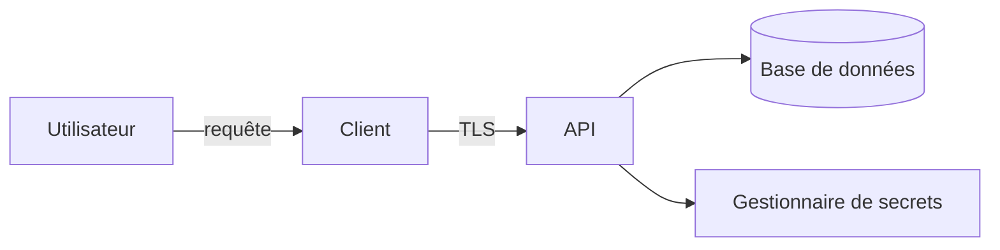



La sécurité n’est pas une étape finale consistant à lancer un scanner. Elle commence dès que l’on conçoit ce qui doit être protégé, les acteurs auxquels on accorde sa confiance et les défaillances que le système doit tolérer. Plus que l’ambition d’empêcher absolument toute altération, il importe de **ne pas placer les privilèges et les secrets essentiels à un endroit que l’attaquant peut contrôler**.

## Commencer le modèle de menace par quatre questions

1. Que construisons-nous ?
2. Qu’est-ce qui pourrait mal tourner ?
3. Qu’allons-nous faire ?
4. Comment vérifierons-nous que nous avons fait suffisamment bien ?

Commencez par représenter les actifs, les acteurs, les flux de données et les frontières de confiance.



Comme le browser ou le client de bureau s’exécute sur l’appareil de l’utilisateur, il se situe hors de la frontière de confiance. Les contrôles internes au client, l’obfuscation et les chaînes dissimulées ne sont que des dispositifs de ralentissement ; ils ne peuvent pas justifier une autorisation accordée par le serveur.

## Concrétiser les actifs et les objectifs de sécurité

Au lieu d’écrire simplement « protéger les données », formulez des objectifs tels que les suivants.

- Un acteur non autorisé ne doit pouvoir ni lire ni réutiliser les tokens d’authentification.
- Une requête d’un tenant ne doit pas pouvoir lire les données d’un autre tenant.
- L’origine et l’intégrité des binaires de release doivent être vérifiables.
- Les privilèges de paiement, de licence et d’administration doivent être décidés par le serveur, et non par le client.
- Un utilisateur ordinaire ne doit pas pouvoir modifier les audit logs.

Reliez à chaque objectif une menace, un contrôle et une méthode de vérification.

| Menace | Contrôle préventif ou d’atténuation | Vérification |
|---|---|---|
| Accès non autorisé à un objet | Contrôle côté serveur des droits sur l’objet et le tenant | Negative test avec l’ID d’un autre acteur |
| SQL injection | Parameterized query | Test de sécurité et code review |
| Fuite de secrets | Gestionnaire de secrets, credentials à courte durée de vie | Secret scan, exercice de rotation |
| Altération d’un binaire | Code signing, vérification de la signature des updates | Test de refus d’installation en cas de signature erronée |
| Compromission d’une dépendance | Lockfile, provenance, gestion des vulnérabilités | Build reproductible et dependency review |

## Séparer authentification et autorisation

- Authentification : qui est cette personne ?
- Autorisation : peut-elle effectuer cette action sur cette ressource ?

Être connecté ne donne pas accès à tous les objets. Contrôler seulement le rôle à l’entrée d’un endpoint, puis omettre le critère de tenant lors de l’accès aux données crée une élévation horizontale des privilèges. L’autorisation doit valider ensemble **l’action, la cible et l’état courant**.

```text
can(actor, action, resource, context) -> allow | deny
```

La règle par défaut est deny, le serveur prend la décision d’autorisation et les fonctions d’administration doivent faire l’objet d’un audit distinct et, si nécessaire, d’une réauthentification.

## La validation des entrées et l’encodage des sorties répondent à des objectifs différents

La validation des entrées vérifie le format autorisé et les limites du domaine. L’encodage des sorties empêche les données de devenir des commandes dans un contexte d’interprétation tel que HTML, SQL ou shell.

- Pour SQL, utilisez une parameterized query plutôt que la concaténation de chaînes.
- Pour HTML, encodez selon le contexte de sortie et employez CSP comme contrôle complémentaire.
- Pour un appel shell, privilégiez si possible un tableau d’arguments et une API directe, et évitez la shell interpolation.
- Pour les chemins de fichier, vérifiez la root autorisée et le résultat de la normalisation.
- Pour les formats de désérialisation, limitez les types admis et la taille.

La simple « suppression des caractères spéciaux » ne suffit pas à bloquer toutes les injections.

## Gérer le cycle de vie des secrets, pas uniquement leur valeur

La gestion des secrets recouvre leur création, leur stockage, leur distribution, leur utilisation, leur rotation et leur révocation.

- Ne les placez pas dans le dépôt, les images, les binaires ou les logs.
- Dans la mesure du possible, délivrez des credentials de courte durée au moyen d’OIDC ou d’une workload identity.
- Accordez à chaque service le minimum de privilèges.
- Auditez l’identité des acteurs qui lisent un secret et le moment où ils le font.
- Exercez le rotation runbook en supposant qu’une fuite a eu lieu.
- Un commit supprimé peut rester dans la Git history ; en cas de fuite, révoquez et remplacez donc immédiatement le secret.

Il faut supposer qu’une API key incluse dans une application de bureau peut être extraite par l’utilisateur. Si un client public est nécessaire, concevez un public identifier aux capacités limitées, un relais côté serveur et un token propre à chaque utilisateur.

## Frontière réaliste pour les applications de bureau et les licences

Un code exécuté localement peut, tôt ou tard, être analysé et modifié. L’objectif ne doit donc pas être de rendre tout contournement « absolument impossible », mais de superposer les protections suivantes.

1. Le serveur est l’autorité finale concernant l’entitlement et les privilèges importants.
2. La réponse de licence est signée et le client la vérifie avec la clé publique.
3. Le token comporte une expiration courte et le minimum de claims.
4. L’offline grace period et la politique de clock rollback sont explicites.
5. Le canal de distribution est protégé par le code signing et un updater sécurisé.
6. L’obfuscation et l’anti-tamper ne servent que de contrôles auxiliaires destinés à augmenter le coût de l’attaque.
7. En cas de panne du serveur d’authentification, les conséquences métier des stratégies fail-open et fail-closed sont décidées à l’avance.

Placer une clé privée ou un master secret commun dans le client permettrait à une seule fuite de compromettre toutes les installations.

## Protéger la chaîne d’approvisionnement et la CI

- Réduisez au minimum les autorisations des workflows.
- Définissez une politique de contrôle, d’épinglage et de mise à jour pour les actions et dependencies externes.
- Ne fournissez pas de deployment secrets au code d’une PR non fiable.
- Conservez le hash, la provenance et la signature des artifacts de build et de release.
- Appliquez la branch protection et la review aux chemins critiques.
- SAST, dependency scan et secret scan font partie des gates, mais ne constituent pas à eux seuls toute la sécurité.

## Logs et données personnelles

Les security logs doivent indiquer qui a tenté quoi, quand et avec quel résultat. Ils ne doivent toutefois pas enregistrer les mots de passe, access tokens, cookies, clés privées ou données personnelles brutes. Les logs eux-mêmes sont soumis au contrôle d’accès, à une durée de conservation et à une protection de leur intégrité.

## Checklist de vérification

- [ ] Les actifs, les acteurs, les flux de données et les frontières de confiance sont à jour.
- [ ] Chaque menace est reliée à un contrôle et à une méthode de vérification concrète.
- [ ] L’authentification et les contrôles d’autorisation portant sur l’objet et le tenant sont testés séparément.
- [ ] Les défenses contre l’injection sont appliquées en fonction de chaque contexte.
- [ ] Le dépôt, son history, les artifacts et les logs ne contiennent aucun secret.
- [ ] Les procédures de rotation des secrets et de révocation des credentials ont été exercées.
- [ ] Le client ne sert pas de fondement aux autorisations du serveur.
- [ ] L’origine et l’intégrité des release artifacts sont vérifiées.
- [ ] Le comportement en cas d’échec d’autorisation ou de panne d’une dépendance est documenté.
- [ ] Les décisions de sécurité et les risques résiduels sont consignés dans le threat model.

## Échecs fréquents

- Faire confiance au client au seul motif que TLS est utilisé.
- Considérer qu’un bouton masqué dans l’UI constitue un contrôle d’autorisation.
- Croire qu’un secret est sûr simplement parce qu’il se trouve dans une variable d’environnement.
- Traiter l’obfuscation comme une protection de même niveau que le chiffrement ou une autorisation côté serveur.
- Conclure à l’absence de menace parce que le scanner ne signale rien.
- Exposer des chemins internes, des query ou des tokens dans les réponses d’erreur et les logs.

L’essentiel d’une conception sécurisée n’est pas d’anticiper toutes les attaques, mais de **maintenir l’autorité sur les actifs critiques à l’intérieur de la bonne frontière et de vérifier régulièrement que les contrôles fonctionnent réellement**.

## Références

- [OWASP Threat Modeling Cheat Sheet](https://cheatsheetseries.owasp.org/cheatsheets/Threat_Modeling_Cheat_Sheet.html)
- [OWASP Application Security Verification Standard](https://owasp.org/www-project-application-security-verification-standard/)
- [NIST Secure Software Development Framework](https://csrc.nist.gov/projects/ssdf)
