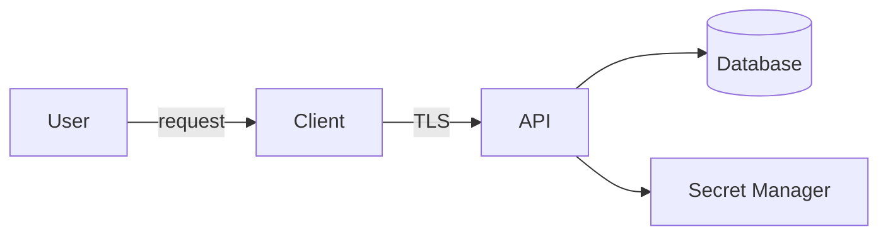



セキュリティは、最後にスキャナーを実行するだけの工程ではない。何を保護し、誰を信頼し、どのような障害に耐えるべきかを設計する時点から始まる。完全な改ざん防止より重要なのは、**重要な権限とシークレットを攻撃者が制御できる場所に置かないこと**である。

## 四つの問いから脅威モデルを始める

1. 何を構築しているのか。
2. 何が問題になり得るのか。
3. それに対して何をするのか。
4. 十分に対処できたことを、どのように確認するのか。

まず資産、主体、データフロー、信頼境界を描く。



ブラウザやデスクトップクライアントは利用者の端末上で動くため、信頼境界の外側にあると考える。クライアント内部の検査、難読化、隠し文字列は解析を遅らせる手段にすぎず、サーバー権限の根拠にはできない。

## 資産とセキュリティ目標を具体化する

「データを保護する」ではなく、次のように記述する。

- 認証トークンは、権限のない主体が読み取ったり再利用したりできてはならない。
- あるテナントの要求から、別のテナントのデータを読み取れてはならない。
- リリースバイナリは、出所と完全性を検証できなければならない。
- 決済・ライセンス・管理権限は、クライアントではなくサーバーが決定しなければならない。
- 監査ログは一般利用者が変更できてはならない。

各目標を脅威、統制、検証へ結び付ける。

| 脅威 | 予防・緩和統制 | 検証 |
|---|---|---|
| 権限のないオブジェクトへのアクセス | サーバー側でのオブジェクト・テナント権限検査 | 別主体のIDを使ったネガティブテスト |
| SQLインジェクション | パラメーター化クエリ | セキュリティテストとコードレビュー |
| シークレット漏えい | シークレット管理、短寿命クレデンシャル | シークレットスキャン、ローテーション訓練 |
| バイナリ改ざん | コード署名、更新署名の検証 | 署名エラー時にインストールを拒否するテスト |
| 依存関係の侵害 | ロックファイル、provenance、脆弱性管理 | 再現可能ビルドと依存関係レビュー |

## 認証と認可を分離する

- 認証：誰であるか。
- 認可：この主体が、このリソースに対して、この操作を行えるか。

ログイン済みだからといって、すべてのオブジェクトへアクセスできるわけではない。endpointの入口でroleだけを検査し、データ照会からテナント条件を外せば、水平権限昇格が起こる。認可では、**操作・対象・現在の状態**をまとめて検証する。

```text
can(actor, action, resource, context) -> allow | deny
```

既定値はdenyとし、認可判断はサーバーが行う。管理機能については、個別の監査と再認証を検討する。

## 入力検証と出力エンコーディングは目的が異なる

入力検証は、許可された形式とドメイン範囲を確認する。出力エンコーディングは、HTML、SQL、shellなどの解釈コンテキストにおいて、データが命令に変わることを防ぐ。

- SQLでは文字列連結の代わりにパラメーター化クエリを使う。
- HTMLでは出力コンテキストに合わせてエンコードし、CSPを補助統制として使う。
- shell呼び出しでは、可能なら引数配列と直接APIを使用し、shell interpolationを避ける。
- ファイルパスは、許可されたrootと正規化後の結果を検証する。
- デシリアライズ形式では、許可する型とサイズを制限する。

「特殊文字を削除する」という一つの方法だけで、すべてのインジェクションを防ぐことはできない。

## シークレットは値よりライフサイクルを管理する

シークレット管理には、生成、保存、配布、使用、ローテーション、廃棄が含まれる。

- リポジトリ、イメージ、バイナリ、ログに格納しない。
- 可能ならOIDCやworkload identityによって短寿命クレデンシャルを発行する。
- サービスごとに最小権限を付与する。
- 誰がいつシークレットを読み取ったか監査する。
- 漏えいを想定したローテーションrunbookを訓練する。
- 削除したコミットもGit履歴には残り得るため、漏えい時には直ちに失効・交換する。

デスクトップアプリに含めたAPI keyは、利用者が抽出できるものと仮定する。public clientが必要なら、制限されたpublic identifier、サーバー中継、利用者別tokenを設計する。

## デスクトップアプリとライセンスの現実的な境界

ローカルで動くコードは、最終的には解析・変更され得る。したがって目標を「絶対に解除不可能」とせず、次のように階層化する。

1. サーバーをentitlementと重要権限の最終的な権威とする。
2. ライセンス応答に署名し、クライアントは公開鍵で検証する。
3. tokenには短い有効期限と必要最小限のclaimだけを入れる。
4. offline grace periodとclock rollbackの方針を明示する。
5. コード署名と安全なupdaterによって配布経路を保護する。
6. 難読化・anti-tamperは、攻撃コストを上げる補助統制としてのみ使う。
7. 認証サーバー障害時にfail-openとfail-closedのどちらにするか、業務影響を踏まえて事前に決める。

秘密鍵や共通master secretをクライアントへ入れると、一度の漏えいで全インストールが無力化される可能性がある。

## サプライチェーンとCIを保護する

- workflowの権限を最小化する。
- 外部actionと依存関係には、レビュー・固定・更新の方針を設ける。
- 信頼していないPRのコードへデプロイ用シークレットを渡さない。
- buildとrelease artifactのhash、provenance、署名を保存する。
- 重要な経路にはbranch protectionとreviewを適用する。
- SAST、dependency scan、secret scanはgateの一部であり、セキュリティのすべてではない。

## ログと個人情報

セキュリティログには、誰が、何を、いつ、どのような結果で試みたかが必要である。ただし、パスワード、access token、cookie、秘密鍵、生の個人情報を記録してはならない。ログ自体もアクセス制御、保存期間、完全性保護の対象である。

## 検証チェックリスト

- [ ] 資産、主体、データフロー、信頼境界が最新である。
- [ ] 各脅威に統制と具体的な検証方法が結び付いている。
- [ ] 認証とオブジェクト・テナント認可を個別にテストしている。
- [ ] インジェクション防御をコンテキストごとに適用している。
- [ ] リポジトリ、履歴、artifact、ログにシークレットがない。
- [ ] シークレットのローテーションとクレデンシャル失効手順を訓練した。
- [ ] クライアントがサーバー権限の根拠になっていない。
- [ ] release artifactの出所と完全性を確認している。
- [ ] 認可失敗時と依存サービス障害時の動作が文書化されている。
- [ ] セキュリティ上の判断と残留リスクを脅威モデルに記録している。

## よくある失敗

- TLSを使用しているという理由でクライアントを信頼する。
- UIでボタンを隠したことを認可統制と見なす。
- 環境変数へ入れただけでシークレットが安全になったと考える。
- 難読化を暗号化やサーバー側認可と同等に扱う。
- scannerの検出結果がなければ脅威もないと結論付ける。
- エラー応答やログへ内部パス、query、tokenを露出する。

セキュリティ設計の核心は、すべての攻撃を予測することではない。**重要な資産に対する権威を適切な境界内へ置き、統制が実際に機能するかを反復検証すること**である。

## 参考資料

- [OWASP Threat Modeling Cheat Sheet](https://cheatsheetseries.owasp.org/cheatsheets/Threat_Modeling_Cheat_Sheet.html)
- [OWASP Application Security Verification Standard](https://owasp.org/www-project-application-security-verification-standard/)
- [NIST Secure Software Development Framework](https://csrc.nist.gov/projects/ssdf)
