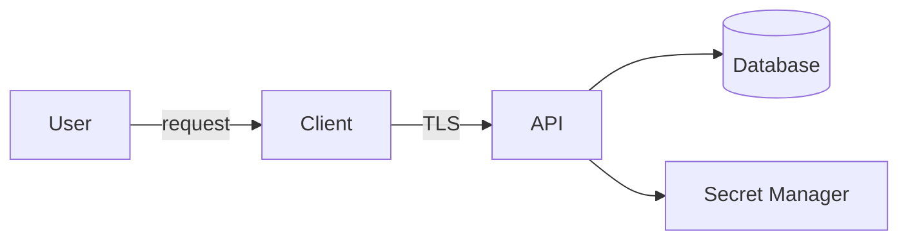

보안은 마지막에 scanner를 실행하는 단계가 아니다. 무엇을 보호하고, 누구를 신뢰하며, 어떤 실패를 견뎌야 하는지 설계할 때 시작된다. 완벽한 변조 방지보다 중요한 것은 **중요한 권한과 비밀을 공격자가 통제할 수 있는 위치에 두지 않는 것**이다.

## 네 가지 질문으로 위협 모델을 시작한다

1. 무엇을 만들고 있는가?
2. 무엇이 잘못될 수 있는가?
3. 무엇을 할 것인가?
4. 충분히 잘했는지 어떻게 확인할 것인가?

먼저 자산, 행위자, 데이터 흐름, 신뢰 경계를 그린다.



브라우저나 데스크톱 client는 사용자의 장치에서 실행되므로 신뢰 경계 밖으로 본다. client 내부의 검사, 난독화, 숨긴 문자열은 지연 장치일 뿐 서버 권한의 근거가 될 수 없다.

## 자산과 보안 목표를 구체화한다

“데이터를 보호한다”보다 다음처럼 쓴다.

- 인증 토큰은 권한 없는 주체가 읽거나 재사용할 수 없어야 한다.
- 한 tenant의 요청은 다른 tenant의 데이터를 읽지 못해야 한다.
- 릴리스 바이너리는 출처와 무결성을 검증할 수 있어야 한다.
- 결제·라이선스·관리 권한은 client가 아니라 서버가 결정해야 한다.
- 감사 로그는 일반 사용자가 수정할 수 없어야 한다.

각 목표에 위협, 통제, 검증을 연결한다.

| 위협 | 예방·완화 통제 | 검증 |
|---|---|---|
| 권한 없는 객체 접근 | 서버 측 객체·tenant 권한 검사 | 다른 주체의 ID로 negative test |
| SQL injection | parameterized query | 보안 테스트와 code review |
| 비밀 유출 | 비밀 관리자, 짧은 수명 자격증명 | secret scan, rotation drill |
| 바이너리 변조 | code signing, update 서명 검증 | 서명 오류 시 설치 거부 테스트 |
| 의존성 침해 | lockfile, provenance, 취약점 관리 | 재현 빌드와 dependency review |

## 인증과 권한을 분리한다

- 인증: 누구인가?
- 권한: 이 행위를 이 리소스에 할 수 있는가?

로그인했다고 모든 객체에 접근할 수 있는 것은 아니다. endpoint 진입 시 역할만 검사하고 데이터 조회에서 tenant 조건을 빼면 수평 권한 상승이 생긴다. 권한은 **행위 + 대상 + 현재 상태**를 함께 검증한다.

```text
can(actor, action, resource, context) -> allow | deny
```

기본은 deny이고, 서버가 권한 결정을 내리며, 관리자 기능은 별도 감사와 재인증을 고려한다.

## 입력 검증과 출력 인코딩은 목적이 다르다

입력 검증은 허용된 형식과 도메인 범위를 확인한다. 출력 인코딩은 HTML, SQL, shell 등 해석 맥락에서 데이터가 명령으로 변하는 일을 막는다.

- SQL은 문자열 결합 대신 parameterized query를 쓴다.
- HTML은 출력 context에 맞게 encode하고 CSP를 보조 통제로 사용한다.
- shell 호출은 가능하면 인자 배열과 직접 API를 사용하고 shell interpolation을 피한다.
- 파일 경로는 허용된 root와 정규화 결과를 검증한다.
- 역직렬화 형식은 허용 타입과 크기를 제한한다.

“특수문자 제거” 하나로 모든 injection을 막을 수 없다.

## 비밀은 값보다 생명주기를 관리한다

비밀 관리에는 생성, 저장, 배포, 사용, 회전, 폐기가 포함된다.

- 저장소·이미지·바이너리·로그에 넣지 않는다.
- 가능하면 OIDC나 workload identity로 짧은 수명 자격증명을 발급한다.
- 서비스별 최소 권한을 부여한다.
- 비밀을 읽는 주체와 시점을 감사한다.
- 유출을 가정한 rotation runbook을 연습한다.
- 삭제한 커밋도 Git history에 남을 수 있으므로 유출 시 즉시 폐기·교체한다.

데스크톱 앱에 포함된 API key는 사용자가 추출할 수 있다고 가정한다. 공용 client가 필요한 경우 제한된 public identifier와 서버 중계, 사용자별 token을 설계한다.

## 데스크톱 앱과 라이선스의 현실적 경계

로컬에서 실행되는 코드는 결국 분석·수정될 수 있다. 따라서 목표를 “절대 해제 불가능”이 아니라 다음처럼 계층화한다.

1. 서버가 entitlement와 중요 권한의 최종 권위가 된다.
2. 라이선스 응답은 서명하고 client는 공개키로 검증한다.
3. token에는 짧은 만료와 최소 claim만 둔다.
4. offline grace period와 clock rollback 정책을 명시한다.
5. code signing과 안전한 updater로 공급 경로를 보호한다.
6. 난독화·anti-tamper는 비용 상승용 보조 통제로만 사용한다.
7. 인증 서버 장애 시 fail-open 또는 fail-closed의 업무 영향을 사전에 결정한다.

개인키나 공통 master secret을 client에 넣으면 모든 설치본이 하나의 유출로 무력화될 수 있다.

## 공급망과 CI를 보호한다

- workflow 권한은 최소화한다.
- 외부 action과 dependency는 검토·고정·업데이트 정책을 둔다.
- 신뢰하지 않는 PR 코드에 배포 secret을 제공하지 않는다.
- build와 release artifact의 hash, provenance, 서명을 보존한다.
- branch protection과 review를 중요 경로에 적용한다.
- SAST, dependency scan, secret scan은 gate의 일부이지 보안의 전부가 아니다.

## 로그와 개인정보

보안 로그에는 누가, 무엇을, 언제, 어떤 결과로 시도했는지 필요하다. 그러나 비밀번호, access token, cookie, 개인키, 원시 개인정보는 기록하지 않는다. 로그 자체도 접근 제어, 보존 기간, 무결성 보호 대상이다.

## 검증 체크리스트

- [ ] 자산, 행위자, 데이터 흐름, 신뢰 경계가 최신이다.
- [ ] 각 위협에 통제와 구체적인 검증 방법이 연결되어 있다.
- [ ] 인증과 객체·tenant 권한 검사를 따로 테스트한다.
- [ ] injection 방어가 context별로 적용된다.
- [ ] 저장소와 history, artifact, 로그에 비밀이 없다.
- [ ] 비밀 회전과 credential 폐기 절차를 연습했다.
- [ ] client가 서버 권한의 근거가 되지 않는다.
- [ ] release artifact의 출처와 무결성을 확인한다.
- [ ] 권한 실패와 의존성 장애 시 동작이 문서화되어 있다.
- [ ] 보안 결정과 남은 위험을 threat model에 기록한다.

## 흔한 실패

- TLS를 사용한다는 이유로 client를 신뢰한다.
- UI에서 버튼을 숨긴 것을 권한 통제로 간주한다.
- 환경 변수에 넣었다는 이유만으로 비밀이 안전하다고 생각한다.
- 난독화를 암호화 또는 서버 권한과 같은 수준으로 취급한다.
- scanner 결과가 없으면 위협도 없다고 결론낸다.
- 오류 응답과 로그에 내부 경로·query·token을 노출한다.

보안 설계의 핵심은 공격을 모두 예측하는 것이 아니라, **중요한 자산의 권위를 올바른 경계 안에 두고 통제가 실제로 작동하는지 반복 검증하는 것**이다.

## 참고 자료

- [OWASP Threat Modeling Cheat Sheet](https://cheatsheetseries.owasp.org/cheatsheets/Threat_Modeling_Cheat_Sheet.html)
- [OWASP Application Security Verification Standard](https://owasp.org/www-project-application-security-verification-standard/)
- [NIST Secure Software Development Framework](https://csrc.nist.gov/projects/ssdf)
