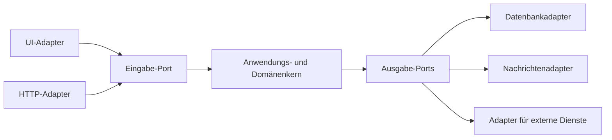
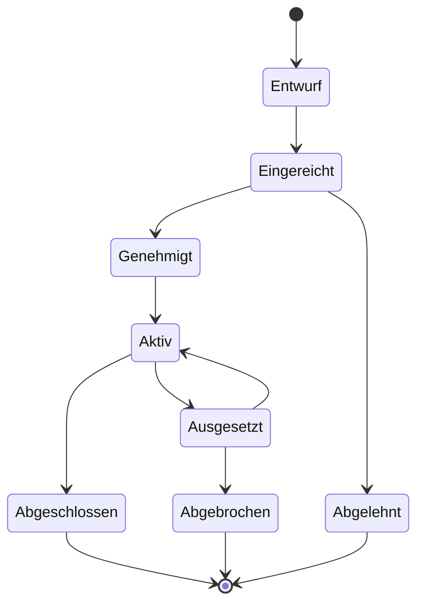
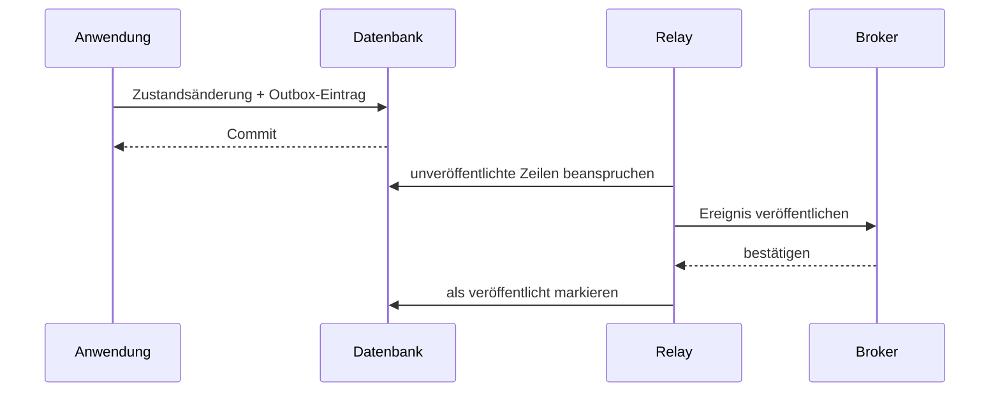
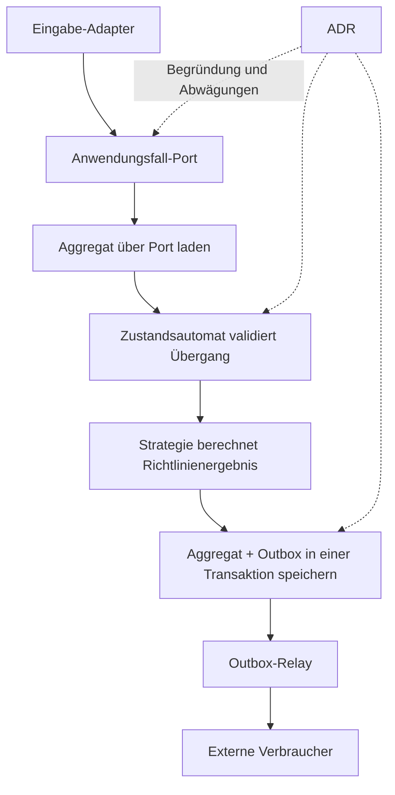



Gute Architektur ist keine Struktur mit möglichst vielen Schichtbezeichnungen.
Sie trennt häufig veränderliche Dinge von Regeln, die immer gelten müssen, und macht die Grenzen von Zustand, Seiteneffekten und Entscheidungen testbar.

Dieser Artikel listet keine modischen Patterns auf. Er verbindet fünf Werkzeuge, die unterschiedliche Probleme lösen.

## 1. Zuerst die Änderungsachsen finden

Beginnen Sie mit diesen Fragen.

- Was sind die zentralen Geschäftsregeln?
- Welche Bestandteile – UI, Datenbank, Queue oder externe APIs – werden am ehesten ersetzt?
- An welchen Grenzen treten Fehler und Wiederholungsversuche auf?
- Für welche Algorithmen werden mehrere Implementierungen benötigt?
- Welche Entitäten besitzen wichtige Zustandsübergänge?
- Welche Entscheidungen werden voraussichtlich lange bestehen bleiben?

Alles zu abstrahieren erhöht lediglich die Verständniskosten.
Führen Sie Abstraktionen nur an tatsächlichen Änderungsachsen und Risikogrenzen ein.

## 2. Der Kern von Ports und Adaptern

Der Anwendungskern hängt nicht direkt von externer Technologie ab, sondern von Verträgen, den sogenannten **Ports**.
Ein Adapter implementiert einen Port mit einer konkreten Technologie.



Abhängigkeiten zeigen von außen zum Kern.
Der Kern muss weder ORM-Entitäten noch HTTP-Anfragen oder Typen von UI-Steuerelementen kennen.

## 3. Ein Eingabe-Port ist ein Anwendungsfall

Ein Eingabe-Port ist kein generisches CRUD-Repository. Er repräsentiert die Absicht des Benutzers und eine Transaktionsgrenze.

Beispiele:

- `SubmitJob`
- `ApproveChange`
- `CancelOrder`
- `GenerateReport`

Jeder Anwendungsfall koordiniert die Validierung des Befehls, Autorisierung, Domänenübergänge, Persistenz und Ereignisaufzeichnung.

Wenn ein Controller oder View Model unmittelbar Geschäftsregeln besitzt, werden diese Regeln an anderen Einstiegspunkten dupliziert.

## 4. Ein Ausgabe-Port ist eine vom Kern benötigte Fähigkeit

Ein schlechter Port bildet die API eines externen Anbieters wörtlich nach.
Ein guter Port drückt eine Fähigkeit aus Sicht des Kerns aus.

- `LoadAggregate`
- `SaveAggregate`
- `PublishDomainEvent`
- `CurrentClock`
- `GenerateIdentifier`
- `StoreArtifact`

Wer auch Uhren und IDs als Ports gestaltet, erleichtert deterministische Tests.

## 5. Wann Domänenentitäten und Persistenzmodelle getrennt werden sollten

In einem einfachen System mit ORM-Annotationen kann derselbe Typ für beides verwendet werden.
Führen Sie jedoch eine Mapping-Schicht ein, wenn Belange der Persistenz in Domäneninvarianten eingreifen oder wenn sich Schema und Domänenlebenszyklus unterscheiden.

Modelle bedingungslos zu duplizieren vermehrt den Boilerplate-Code.
Erwägen Sie eine Trennung bei diesen Anzeichen.

- Lazy Loading verändert das Domänenverhalten
- Die NULL-Zulässigkeit der Datenbank unterscheidet sich von der Optionalität der Domäne
- Mehrere Aggregate teilen sich eine Tabelle
- Audit- oder temporale Schemas sind komplex
- Ein externer Serialisierungsvertrag friert die Domäne ein

## 6. Den Lebenszyklus mit einem Zustandsautomaten explizit machen

Mehrere boolesche Werte erzeugen unmögliche Kombinationen.

Wer etwa `isRunning`, `isDone`, `hasFailed` und `isCancelled` getrennt speichert, kann versehentlich mehrere davon gleichzeitig auf wahr setzen.
Definieren Sie einen einzigen Zustand und seine erlaubten Übergänge.



## 7. Invarianten und Seiteneffekte bei Übergängen trennen

Gestalten Sie die Domänen-Übergangsfunktion so rein wie möglich.

```text
transition(current_state, command, context)
  -> new_state, domain_events
```

Die Funktion prüft Folgendes.

- Ist der Befehl im aktuellen Zustand erlaubt?
- Sind Berechtigungen und Vorbedingungen des Akteurs erfüllt?
- Bleiben die Invarianten erhalten?
- Welche Domänenereignisse treten auf?

Ein Adapter außerhalb der Transaktion übernimmt den tatsächlichen E-Mail-Versand, die Veröffentlichung in der Queue und Datei-Schreibvorgänge.

## 8. Optimistische Nebenläufigkeitskontrolle

Zwei Anfragen können dieselbe Entität lesen und unterschiedliche Übergänge speichern.
Machen Sie das Versionsfeld zu einer Bedingung der Aktualisierung.

```sql
UPDATE aggregate
SET state = :next_state,
    version = version + 1
WHERE id = :id
  AND version = :expected_version;
```

Sind null Zeilen betroffen, ist ein Konflikt aufgetreten.
Ob automatisch wiederholt oder der Benutzer erneut um Bestätigung gebeten wird, hängt von der Bedeutung des Befehls ab.

## 9. Das vom Strategy Pattern gelöste Problem

Verwenden Sie Strategy, wenn mehrere Algorithmen dieselbe Aufgabe erfüllen und einer zur Laufzeit oder per Konfiguration ausgewählt werden muss.

Beispiele:

- Preisbildungsrichtlinie
- Routing-Algorithmus
- Validierungsrichtlinie
- Auswahl eines Solvers
- Wiederholungsrichtlinie

Die Schnittstelle definiert gemeinsame Eingaben, Ausgaben und Fehlersemantik der Algorithmen.
Eine Strategie, die direkt auf Datenbank und UI zugreift, lässt sich schlechter austauschen.

## 10. Die Strategieauswahl zentralisieren

Nachdem verstreute Anweisungen der Form `if type == ...` in Strategien verschoben wurden, bleibt die Verzweigung im Selektor bestehen.
Zentralisieren Sie die Auswahlregeln in einer Factory oder Registry und weisen Sie unbekannte Schlüssel explizit zurück.

Wenn die Konfiguration die Auswahl ändert, zeichnen Sie Folgendes auf.

- ID und Version der Strategie
- Eingabe der Auswahl
- Standard und Fallback
- Rollout oder Feature Flag
- Provenienz des Ergebnisses

Wenn ein Fallback unbemerkt einen anderen Algorithmus verwendet, wird die Interpretation des Ergebnisses schwierig.

## 11. Warum eine Transactional Outbox nötig ist

Wenn das Speichern in der Datenbank und die Nachrichtenveröffentlichung nacheinander erfolgen, kann nur einer der beiden Vorgänge gelingen.

Fehlerszenario:

1. Der DB-Commit gelingt.
2. Der Prozess stürzt ab.
3. Die Nachricht wird nicht veröffentlicht.

In umgekehrter Reihenfolge kann die Nachricht veröffentlicht werden, während die Datenbank einen Rollback ausführt.

Das Outbox Pattern speichert den Domänenzustand und das zu veröffentlichende Ereignis in derselben Datenbanktransaktion.



## 12. Outbox bedeutet nicht Exactly Once

Wenn das Relay nach der Veröffentlichung, aber vor der Markierung des Ereignisses als `published` ausfällt, wird dasselbe Ereignis erneut gesendet.
Verbraucher müssen Duplikate anhand der Ereignis-ID behandeln.

Nehmen Sie diese Felder in den Event Envelope auf:

- Ereignis-ID
- Aggregat-ID und -Version
- Ereignistyp und Schemaversion
- Zeitpunkt des Auftretens
- Korrelations- und Kausalitäts-IDs
- Payload

Hierfür kann eine Consumer Inbox oder eine Tabelle verarbeiteter Ereignisse verwendet werden.

## 13. Ereignisreihenfolge

Eine globale Reihenfolge zu garantieren ist teuer und oft unnötig.
Validieren Sie die lokale Reihenfolge mit einer Version pro Aggregat.

- Niedriger als die nächste erwartete Version: ein Duplikat oder verspätetes Ereignis
- Gleich: kann verarbeitet werden
- Höher: eine Lücke; daher zurückhalten, neu laden oder erneut versuchen

Die Aggregat-ID als Partitionsschlüssel kann helfen, die Broker-Reihenfolge zu bewahren; Semantik von Resharding und Wiederholungsversuchen muss jedoch geprüft werden.

## 14. Betriebliche Details der Outbox

- Beim Beanspruchen ausstehender Zeilen eine Sperre oder Lease verwenden
- Batchgröße der Veröffentlichung und Backpressure
- Exponentielle Wiederholung und Dead-Letter-Behandlung
- Aufbewahrung bereits veröffentlichter Zeilen
- Schemamigration
- Quarantäne für Poison Events
- Metriken zur Verzögerung des Relays
- DB-Wachstum während eines Broker-Ausfalls begrenzen

Betreiben Sie Archivierung und Bereinigung, damit die Outbox-Tabelle nicht unbegrenzt wächst.
Stimmen Sie das Löschen mit der Aufbewahrungsdauer der Verbraucher und den Audit-Anforderungen ab.

## 15. Warum ADRs nötig sind

Ein Architecture Decision Record bewahrt nicht nur, „wie die aktuelle Struktur aussieht“, sondern auch, „warum diese Wahl getroffen wurde und welche Abwägungen akzeptiert wurden“.

Eine einfache ADR-Struktur:

- Titel und Status
- Kontext und Entscheidungstreiber
- Betrachtete Optionen
- Entscheidung
- Positive und negative Folgen
- Auslöser für Validierung oder Neubewertung
- Zugehörige Issues, Benchmarks und Dokumente

Code allein zeigt weder verworfene Alternativen noch die damals geltenden Einschränkungen.

## 16. Lebenszyklus eines ADR

Zu den Statuswerten können vorgeschlagen, akzeptiert, ersetzt und veraltet gehören.
Überschreiben Sie ein bestehendes ADR nicht stillschweigend. Verknüpfen Sie ein neues ADR mit der vorherigen Entscheidung, die es ersetzt.

Bewerten Sie die Entscheidung in folgenden Situationen neu.

- Datenverkehr oder Datenvolumen überschreiten die Annahmen
- Neue Compliance-Anforderungen
- Deprecation eines Anbieters oder Dienstes
- Ein Incident offenbart eine verborgene Folge
- Benchmarks oder Kostenstruktur ändern sich

## 17. Ein die Patterns verbindender Ablauf eines Anwendungsfalls



Jedes Pattern hat eine andere Aufgabe.

- Ports: Richtung der Abhängigkeiten
- Zustandsautomat: Invarianten des Lebenszyklus
- Strategy: Variation von Algorithmen
- Outbox: Zuverlässigkeit zwischen DB und Nachrichten
- ADR: Entscheidungskontext und Abwägungen

## 18. Teststrategie

### Unit-Tests der Domäne

- Erlaubte Übergänge
- Verbotene Übergänge
- Invarianten
- Erzeugte Ereignisse
- Strategie-Verträge

### Vertragstests für Adapter

- Nebenläufigkeit des Repositorys
- Serialisierungsschema
- Abbildung von Broker-Fehlern
- Uhr und Zeitzone
- Timeout einer externen API

### Integrationstests

- Atomarer Commit von Zustand und Outbox
- Doppelte Veröffentlichung durch das Relay
- Idempotenz der Verbraucher
- Schemamigration
- Prozessabsturz und Wiederherstellung

### Architekturtests

Abhängigkeitsregeln können automatisch prüfen, dass das Kernprojekt weder UI, ORM noch Hersteller-SDKs referenziert.

## 19. Observability

Zeichnen Sie Korrelations-ID und Anwendungsfall in Traces auf und verknüpfen Sie Domänenereignisse mit Outbox-Ereignissen.

Beobachtbare Metriken:

- Erfolg, Fehler und Latenz des Anwendungsfalls
- Anzahl ungültiger Übergänge
- Konflikte der optimistischen Nebenläufigkeitskontrolle
- Verteilung der Strategieauswahl
- Anzahl ausstehender Outbox-Einträge und Alter des ältesten
- Wiederholte Veröffentlichungsversuche und Dead Letters
- Anzahl von Duplikaten und Lücken bei Verbrauchern

Generische HTTP-Metriken ohne geschäftliche Bedeutung erschweren die Diagnose von Domänenfehlern.

## 20. Checkliste zur Verifikation

- [ ] Vermeidet der Kern direkte Abhängigkeiten von Framework- und Herstellertypen?
- [ ] Sind Ports in der Sprache der Kernfähigkeiten definiert?
- [ ] Gibt jeder Anwendungsfall seine Transaktionsgrenze an?
- [ ] Ist der Lebenszyklus ein Zustandsautomat statt einer Kombination boolescher Werte?
- [ ] Werden verbotene Übergänge automatisch getestet?
- [ ] Werden Konflikte der optimistischen Nebenläufigkeitskontrolle behandelt?
- [ ] Teilen Strategien einen Vertrag für Eingabe, Ausgabe und Fehler?
- [ ] Wird die ID der ausgewählten Strategie in der Provenienz erfasst?
- [ ] Werden Zustand und Outbox in derselben Transaktion gespeichert?
- [ ] Sind Relay und Verbraucher gegen Duplikate abgesichert?
- [ ] Wird die Ereignisreihenfolge pro Aggregat validiert?
- [ ] Gibt es für Outbox-Rückstände Warnungen und Aufbewahrungsregeln?
- [ ] Besitzt jede wichtige strukturelle Entscheidung ein ADR?
- [ ] Sind die Auslöser zur Neubewertung des ADR explizit?

## 21. Häufig scheiternde Patterns und Grenzen

### Für jede Klasse eine Schnittstelle erstellen

Auch interne Berechnungen ohne Änderungsachse zu abstrahieren erhöht nur Navigations- und Wartungskosten.

### Das Domänenmodell in einen leeren Datencontainer verwandeln

Wenn Regeln über Services verteilt sind, lassen sich Übergänge und Invarianten nur schwer garantieren.

### Unterschiedliche Fehlersemantik für jede Strategie

Aufrufer müssen implementierungsspezifische Exceptions und Zustände kennen, wodurch die Austauschbarkeit verloren geht.

### Glauben, eine Outbox beseitige Duplikate

Gehen Sie von einer At-least-once-Veröffentlichung aus und entwerfen Sie die Verbraucher idempotent.

### ADRs als lange Sitzungsprotokolle schreiben

Halten Sie Entscheidung, Gründe, Alternativen, Folgen und Kriterien für eine Neubewertung knapp und durchsuchbar.

## 22. Offizielle und ursprüngliche Referenzen

- Cockburn, A., [Hexagonale Architektur](https://alistair.cockburn.us/hexagonal-architecture/).
- Gamma et al., *Design Patterns: Elements of Reusable Object-Oriented Software*.
- Fowler, M., [Zustandsautomat](https://martinfowler.com/bliki/StateMachine.html).
- Richardson, C., [Transactional-Outbox-Pattern](https://microservices.io/patterns/data/transactional-outbox.html).
- Nygard, M., [Architekturentscheidungen dokumentieren](https://cognitect.com/blog/2011/11/15/documenting-architecture-decisions).
- IETF, [Problem Details für HTTP-APIs](https://www.rfc-editor.org/rfc/rfc9457).

Der Zweck von Architektur-Patterns besteht nicht darin, Diagramme komplizierter zu machen.
Er besteht darin, **Regeln, Abhängigkeiten, Seiteneffekte und Entscheidungsgründe dort zu trennen, wo Änderungen und Fehler auftreten, und sie damit überprüfbar zu machen**.
