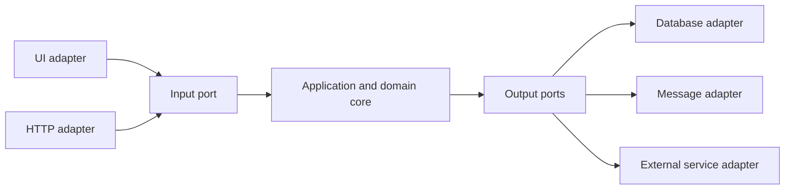
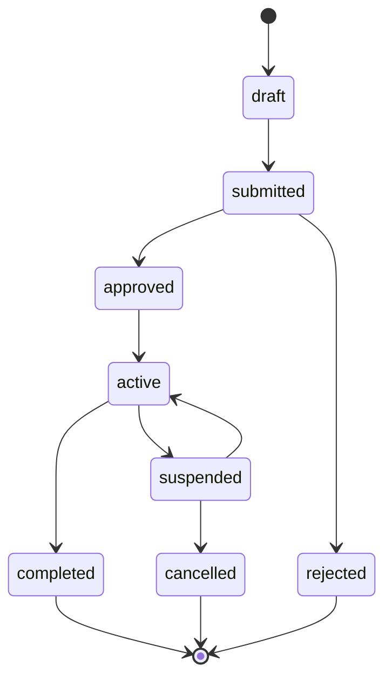
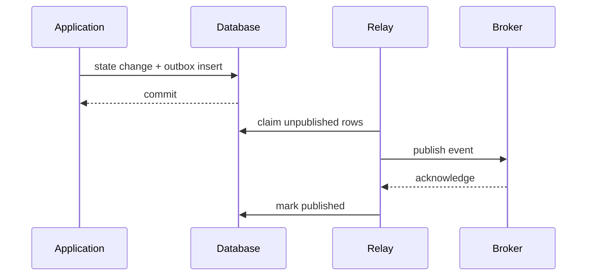
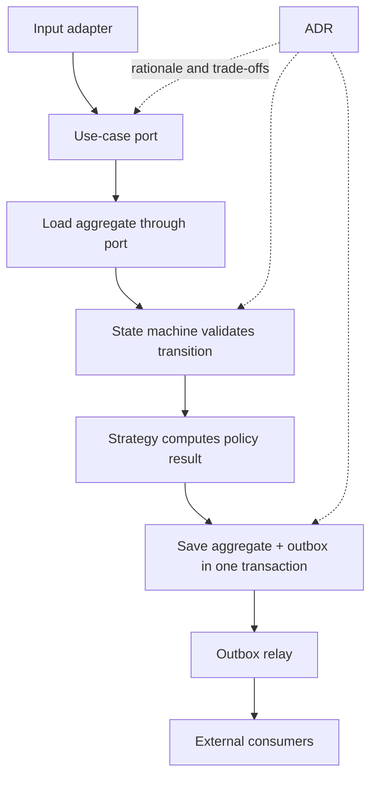



Good architecture is not a structure with many layer names.
It separates things that change frequently from rules that must always hold, and makes the boundaries of state, side effects, and decisions testable.

This article does not list fashionable patterns. It connects five tools that solve different problems.

## 1. Find the Axes of Change First

Start with these questions.

- What are the core business rules?
- Which of the UI, database, queue, and external APIs are most likely to be replaced?
- At which boundaries do failures and retries occur?
- Which algorithms need multiple implementations?
- Which entities have important state transitions?
- Which decisions are likely to remain in place for a long time?

Abstracting everything only increases the cost of understanding.
Introduce abstractions only at actual axes of change and risk boundaries.

## 2. The Core of Ports and Adapters

The application core does not depend directly on external technology; it depends on contracts called **ports**.
An adapter implements a port with a specific technology.



Dependencies point from the outside toward the core.
The core does not need to know about ORM entities, HTTP requests, or UI control types.

## 3. An Input Port Is a Use Case

An input port is not a generic CRUD repository. It represents user intent and a transaction boundary.

Examples:

- `SubmitJob`
- `ApproveChange`
- `CancelOrder`
- `GenerateReport`

Each use case coordinates command validation, authorization, domain transitions, persistence, and event recording.

If a controller or view model owns business rules directly, those rules are duplicated at other entry points.

## 4. An Output Port Is a Capability the Core Needs

A bad port copies an external vendor API verbatim.
A good port expresses a capability from the core's perspective.

- `LoadAggregate`
- `SaveAggregate`
- `PublishDomainEvent`
- `CurrentClock`
- `GenerateIdentifier`
- `StoreArtifact`

Making clocks and IDs ports also makes deterministic testing easier.

## 5. When to Separate Domain Entities from Persistence Models

In a simple system with ORM annotations, the same type can be used for both.
However, introduce a mapping layer when persistence concerns intrude on domain invariants or when the schema and domain lifecycle differ.

Duplicating models unconditionally increases boilerplate.
Consider separation when you see these signals.

- Lazy loading changes domain behavior
- Database nullability differs from domain optionality
- Multiple aggregates share one table
- Audit or temporal schemas are complex
- An external serialization contract freezes the domain

## 6. Make the Lifecycle Explicit with a State Machine

Multiple booleans create impossible combinations.

For example, keeping `isRunning`, `isDone`, `hasFailed`, and `isCancelled` separately can allow several to be true at once.
Define one state and its allowed transitions.



## 7. Separate Invariants from Side Effects in Transitions

Make the domain transition function as pure as possible.

```text
transition(current_state, command, context)
  -> new_state, domain_events
```

The function checks the following.

- Is the command allowed in the current state?
- Are the actor's permissions and preconditions satisfied?
- Are invariants preserved?
- Which domain events occur?

An adapter outside the transaction performs the actual email delivery, queue publication, and file writes.

## 8. Optimistic Concurrency

Two requests can read the same entity and save different transitions.
Make the version field a condition of the update.

```sql
UPDATE aggregate
SET state = :next_state,
    version = version + 1
WHERE id = :id
  AND version = :expected_version;
```

If zero rows are affected, a conflict occurred.
Whether to retry automatically or ask the user to confirm again depends on the command's meaning.

## 9. The Problem Solved by the Strategy Pattern

Use Strategy when several algorithms fulfill the same role and one must be selected at runtime or by configuration.

Examples:

- Pricing policy
- Routing algorithm
- Validation policy
- Solver selection
- Retry policy

The interface defines the algorithms' common input, output, and failure semantics.
A strategy that directly accesses the database and UI becomes less replaceable.

## 10. Centralize Strategy Selection

After scattered `if type == ...` statements are moved into strategies, branching remains in the selector.
Centralize selection rules in a factory or registry, and explicitly reject unknown keys.

When configuration changes the selection, record the following.

- Strategy ID and version
- Selection input
- Default and fallback
- Rollout or feature flag
- Result provenance

If a fallback silently uses another algorithm, interpreting the result becomes difficult.

## 11. Why Transactional Outbox Is Needed

When a database save and message publication happen sequentially, only one may succeed.

Failure scenario:

1. DB commit succeeds
2. The process crashes
3. Message publication is omitted

In the reverse order, the message can be published while the DB rolls back.

The outbox pattern stores domain state and the event to publish in the same database transaction.



## 12. Outbox Is Not Exactly-Once

If the relay dies after publishing but before marking the event `published`, the same event is sent again.
Consumers must handle duplicates using the event ID.

Include these fields in the event envelope:

- Event ID
- Aggregate ID and version
- Event type and schema version
- Occurrence time
- Correlation and causation IDs
- Payload

A consumer inbox or processed-event table can be used.

## 13. Event Ordering

Guaranteeing global order is expensive and often unnecessary.
Validate local order with a per-aggregate version.

- Lower than the next expected version: a duplicate or late event
- Equal: can be processed
- Higher: a gap, so hold, reload, or retry

Using the aggregate ID as a partition key can help preserve broker order, but resharding and retry semantics must be checked.

## 14. Outbox Operational Details

- Use a lock or lease when claiming pending rows
- Publication batch size and backpressure
- Exponential retry and dead-letter handling
- Retention of already-published rows
- Schema migration
- Poison-event quarantine
- Relay lag metrics
- Limit DB growth during a broker outage

Operate archival and purging so the outbox table does not grow without bound.
Align deletion with consumer retention and audit requirements.

## 15. Why ADRs Are Needed

An Architecture Decision Record preserves not only “what the current structure is,” but “why this choice was made and which trade-offs were accepted.”

A simple ADR structure:

- Title and status
- Context and decision drivers
- Options considered
- Decision
- Positive and negative consequences
- Validation or revisit triggers
- Related issues, benchmarks, and documents

Code alone does not reveal rejected alternatives or the constraints that existed at the time.

## 16. ADR Lifecycle

Statuses can include proposed, accepted, superseded, and deprecated.
Do not silently overwrite an existing ADR. Link a new ADR to the previous decision it supersedes.

Revisit the decision in these situations.

- Traffic or data volume exceeds assumptions
- New compliance requirements
- Vendor or service deprecation
- An incident reveals a hidden consequence
- Benchmarks or the cost structure change

## 17. A Use-Case Flow Connecting the Patterns



Each pattern has a different responsibility.

- Ports: dependency direction
- State machine: lifecycle invariants
- Strategy: algorithm variation
- Outbox: reliability between the DB and messages
- ADR: decision context and trade-offs

## 18. Test Strategy

### Domain unit tests

- Allowed transitions
- Forbidden transitions
- Invariants
- Generated events
- Strategy contracts

### Adapter contract tests

- Repository concurrency
- Serialization schema
- Broker error mapping
- Clock and timezone
- External API timeout

### Integration tests

- Atomic commit of state and outbox
- Duplicate publication by the relay
- Consumer idempotency
- Schema migration
- Process crash and recovery

### Architecture tests

Dependency rules can automatically check that the core project does not reference UI, ORM, or vendor SDKs.

## 19. Observability

Record the correlation ID and use case in traces, and connect domain events to outbox events.

Observable metrics:

- Use-case success, failure, and latency
- Invalid-transition count
- Optimistic-concurrency conflicts
- Strategy-selection distribution
- Outbox pending count and oldest age
- Publication retries and dead letters
- Consumer duplicate and gap counts

Generic HTTP metrics with no business meaning make domain failures difficult to diagnose.

## 20. Verification Checklist

- [ ] Does the core avoid direct dependencies on framework and vendor types?
- [ ] Are ports defined in the language of core capabilities?
- [ ] Does each use case specify its transaction boundary?
- [ ] Is the lifecycle a state machine rather than a combination of booleans?
- [ ] Are forbidden transitions automatically tested?
- [ ] Are optimistic-concurrency conflicts handled?
- [ ] Do strategies share an input, output, and failure contract?
- [ ] Is the selected strategy ID recorded in provenance?
- [ ] Are state and outbox stored in the same transaction?
- [ ] Are relay and consumer safe against duplicates?
- [ ] Is event ordering validated per aggregate?
- [ ] Do outbox backlogs have alerts and retention?
- [ ] Does each important structural choice have an ADR?
- [ ] Are the ADR's revisit triggers explicit?

## 21. Commonly Failing Patterns and Limitations

### Creating an interface for every class

Abstracting even internal calculations with no axis of change only increases navigation and maintenance costs.

### Turning the domain model into an empty data container

When rules are scattered across services, transitions and invariants are difficult to guarantee.

### Different error semantics for every strategy

Callers must know implementation-specific exceptions and states, breaking substitutability.

### Believing an outbox eliminates duplicates

Assume at-least-once publication and design consumer idempotency.

### Writing ADRs as long meeting minutes

Keep the decision, reasons, alternatives, consequences, and revisit criteria concise and searchable.

## 22. Official and Original References

- Cockburn, A., [Hexagonal Architecture](https://alistair.cockburn.us/hexagonal-architecture/).
- Gamma et al., *Design Patterns: Elements of Reusable Object-Oriented Software*.
- Fowler, M., [State Machine](https://martinfowler.com/bliki/StateMachine.html).
- Richardson, C., [Transactional Outbox pattern](https://microservices.io/patterns/data/transactional-outbox.html).
- Nygard, M., [Documenting Architecture Decisions](https://cognitect.com/blog/2011/11/15/documenting-architecture-decisions).
- IETF, [Problem Details for HTTP APIs](https://www.rfc-editor.org/rfc/rfc9457).

The purpose of architecture patterns is not to make diagrams more complicated.
It is to **separate rules, dependencies, side effects, and decision rationale at the points where change and failure occur, making them verifiable**.
