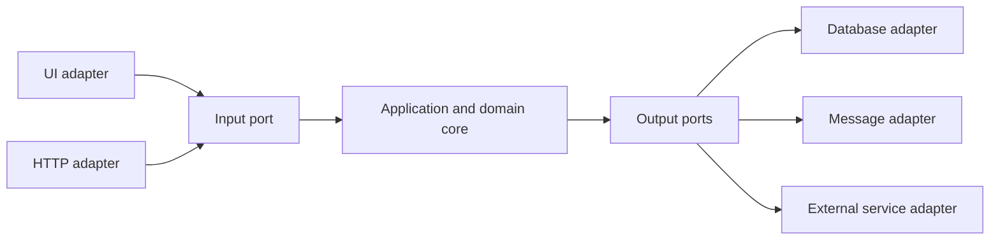
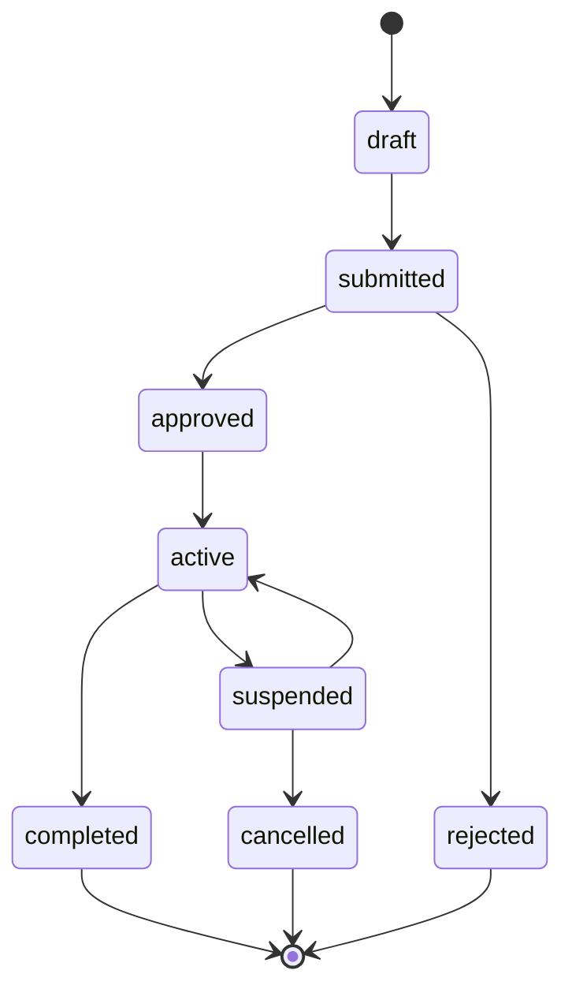
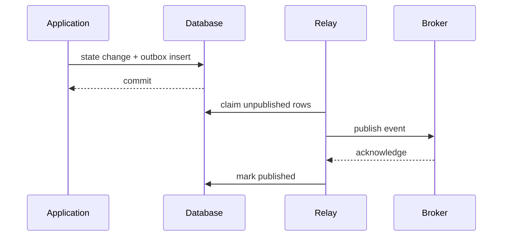
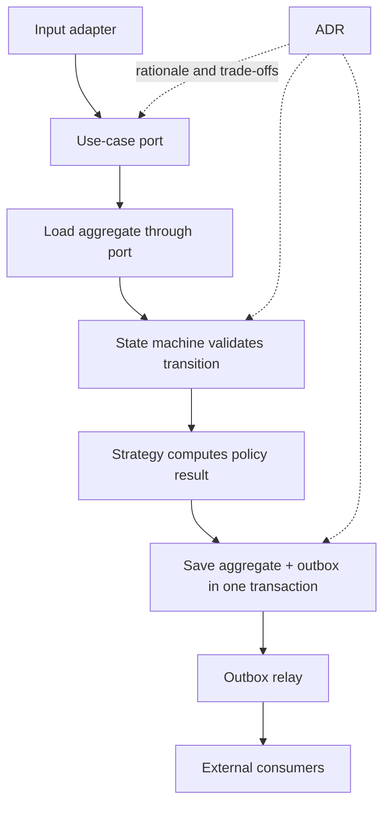



Una buena arquitectura no es una estructura con muchos nombres de capas.
Separa las cosas que cambian con frecuencia de las reglas que siempre deben mantenerse y hace que los límites del estado, los efectos secundarios y las decisiones sean comprobables.

Este artículo no enumera patrones de moda. Conecta cinco herramientas que resuelven diferentes problemas.

## 1. Encuentre primero los ejes del cambio

Comience con estas preguntas.

- ¿Cuáles son las reglas comerciales básicas?
- ¿Cuáles de las API UI, base de datos, cola y externas tienen más probabilidades de ser reemplazadas?
- ¿En qué límites ocurren los fallos y los reintentos?
- ¿Qué algoritmos necesitan múltiples implementaciones?
- ¿Qué entidades tienen transiciones estatales importantes?
- ¿Qué decisiones probablemente se mantendrán durante mucho tiempo?

Abstraerlo todo sólo aumenta el costo de la comprensión.
Introducir abstracciones sólo en los ejes reales de cambio y límites de riesgo.

## 2. El núcleo de los puertos y adaptadores

El núcleo de la aplicación no depende directamente de tecnología externa; depende de contratos llamados **puertos**.
Un adaptador implementa un puerto con una tecnología específica.



Las dependencias apuntan desde el exterior hacia el núcleo.
El núcleo no necesita conocer las entidades ORM, las solicitudes HTTP o los tipos de control UI.

## 3. Un puerto de entrada es un caso de uso

Un puerto de entrada no es un repositorio genérico CRUD. Representa la intención del usuario y un límite de transacción.

Ejemplos:

- `SubmitJob`
- `ApproveChange`
- `CancelOrder`
- `GenerateReport`

Cada caso de uso coordina la validación de comandos, la autorización, las transiciones de dominio, la persistencia y el registro de eventos.

Si un controlador o modelo de vista posee reglas comerciales directamente, esas reglas se duplican en otros puntos de entrada.

## 4. Un puerto de salida es una capacidad que el núcleo necesita

Un puerto defectuoso copia textualmente un proveedor externo API.
Un buen puerto expresa una capacidad desde la perspectiva del núcleo.

- `LoadAggregate`
- `SaveAggregate`
- `PublishDomainEvent`
- `CurrentClock`
- `GenerateIdentifier`
- `StoreArtifact`

Crear puertos de relojes e ID también facilita las pruebas deterministas.

## 5. Cuándo separar las entidades de dominio de los modelos de persistencia

En un sistema simple con anotaciones ORM, se puede usar el mismo tipo para ambos.
Sin embargo, introduzca una capa de mapeo cuando los problemas de persistencia interfieran con las invariantes del dominio o cuando el esquema y el ciclo de vida del dominio difieran.

Duplicar modelos aumenta incondicionalmente el estándar.
Considere la separación cuando vea estas señales.

- La carga diferida cambia el comportamiento del dominio
- La nulidad de la base de datos difiere de la opcionalidad del dominio.
- Múltiples agregados comparten una tabla
- Los esquemas de auditoría o temporales son complejos.
- Un contrato de serialización externo congela el dominio.

## 6. Hacer explícito el ciclo de vida con una máquina de estados

Múltiples valores booleanos crean combinaciones imposibles.

Por ejemplo, mantener `isRunning`, `isDone`, `hasFailed` y `isCancelled` por separado puede permitir que varios sean verdaderos a la vez.
Defina un estado y sus transiciones permitidas.



## 7. Separar las invariantes de los efectos secundarios en las transiciones

Haga que la función de transición de dominio sea lo más pura posible.

```text
transition(current_state, command, context)
  -> new_state, domain_events
```

La función comprueba lo siguiente.

- ¿Está permitido el comando en el estado actual?
- ¿Se cumplen los permisos y condiciones previas del actor?
- ¿Se conservan las invariantes?
- ¿Qué eventos de dominio ocurren?

Un adaptador fuera de la transacción realiza la entrega de correo electrónico, la publicación en cola y la escritura de archivos.

## 8. Simultaneidad optimista

Dos solicitudes pueden leer la misma entidad y guardar transiciones diferentes.
Haga que el campo de versión sea una condición de la actualización.

```sql
UPDATE aggregate
SET state = :next_state,
    version = version + 1
WHERE id = :id
  AND version = :expected_version;
```

Si no hay filas afectadas, se produjo un conflicto.
Si se debe volver a intentar automáticamente o pedirle al usuario que confirme nuevamente depende del significado del comando.

## 9. El problema resuelto por el patrón estratégico

Utilice Estrategia cuando varios algoritmos cumplan el mismo rol y deba seleccionarse uno en tiempo de ejecución o por configuración.

Ejemplos:

- Política de precios
- Algoritmo de enrutamiento
- Política de validación
- Selección de solucionador
- Política de reintento

La interfaz define la semántica común de entrada, salida y falla de los algoritmos.
Una estrategia que accede directamente a la base de datos y UI se vuelve menos reemplazable.

## 10. Centralizar la selección de estrategias

Después de que las declaraciones `if type == ...` dispersas se muevan a estrategias, la bifurcación permanece en el selector.
Centralice las reglas de selección en una fábrica o registro y rechace explícitamente las claves desconocidas.

Cuando la configuración cambie la selección, registre lo siguiente.

- Estrategia ID y versión
- Entrada de selección
- Predeterminado y alternativo
- Lanzamiento o bandera de función
- Procedencia del resultado

Si un recurso alternativo utiliza silenciosamente otro algoritmo, interpretar el resultado se vuelve difícil.

## 11. Por qué es necesaria la bandeja de salida transaccional

Cuando el guardado de una base de datos y la publicación de un mensaje se realizan de forma secuencial, solo uno puede tener éxito.

Escenario de falla:

1. La confirmación de DB se realizó correctamente.
2. El proceso falla
3. Se omite la publicación del mensaje.

En orden inverso, el mensaje se puede publicar mientras DB se revierte.

El patrón de la bandeja de salida almacena el estado del dominio y el evento a publicar en la misma transacción de la base de datos.



## 12. La bandeja de salida no es exactamente una vez

Si el relé muere después de la publicación pero antes de marcar el evento `published`, se envía nuevamente el mismo evento.
Los consumidores deben gestionar duplicados mediante el evento ID.

Incluya estos campos en el sobre del evento:

- Evento ID
- Agregado ID y versión
- Tipo de evento y versión del esquema.
- tiempo de ocurrencia
- ID de correlación y causalidad.
- Carga útil

Se puede utilizar una bandeja de entrada del consumidor o una tabla de eventos procesados.

## 13. Orden de eventos

Garantizar el orden global es costoso y a menudo innecesario.
Valide el pedido local con una versión por agregado.

- Inferior a la siguiente versión esperada: un evento duplicado o tardío
- Igual: se puede procesar
- Más alto: un espacio, así que mantén presionado, recarga o vuelve a intentarlo

El uso del agregado ID como clave de partición puede ayudar a preservar el orden del intermediario, pero se debe verificar la semántica de resharding y reintento.

## 14. Detalles operativos de la bandeja de salida

- Utilice un candado o un contrato de arrendamiento al reclamar filas pendientes
- Tamaño del lote de publicación y contrapresión.
- Reintento exponencial y manejo de mensajes fallidos.
- Retención de filas ya publicadas.
- Migración de esquemas
- Cuarentena de eventos de veneno
- Métricas de retraso de retransmisión
- Limitar el crecimiento de DB durante una interrupción del corredor

Opere el archivo y la purga para que la tabla de la bandeja de salida no crezca sin límites.
Alinear la eliminación con los requisitos de auditoría y retención del consumidor.

## 15. Por qué se necesitan las ADR

Un Registro de Decisiones de Arquitectura preserva no sólo “cuál es la estructura actual”, sino también “por qué se tomó esta decisión y qué compensaciones se aceptaron”.

Una estructura ADR simple:

- Título y estado
- Contexto y factores de decisión.
- Opciones consideradas
- Decisión
- Consecuencias positivas y negativas.
- Activadores de validación o revisión
- Cuestiones, puntos de referencia y documentos relacionados

El código por sí solo no revela las alternativas rechazadas ni las limitaciones que existían en ese momento.

## 16. Ciclo de vida ADR

Los estados pueden incluir propuesto, aceptado, reemplazado y obsoleto.
No sobrescriba silenciosamente un ADR existente. Vincular un nuevo ADR a la decisión anterior que reemplaza.

Revise la decisión en estas situaciones.

- El tráfico o el volumen de datos superan los supuestos.
- Nuevos requisitos de cumplimiento.
- Depreciación de proveedores o servicios
- Un incidente revela una consecuencia oculta.
- Los benchmarks o el cambio en la estructura de costos.

## 17. Un flujo de casos de uso que conecta los patrones



Cada patrón tiene una responsabilidad diferente.

- Puertos: dirección de dependencia
- Máquina de estados: invariantes del ciclo de vida.
- Estrategia: variación del algoritmo.
- Bandeja de salida: confiabilidad entre el DB y los mensajes
- ADR: contexto de decisión y compensaciones

## 18. Estrategia de prueba

### Pruebas unitarias de dominio

- Transiciones permitidas
- Transiciones prohibidas
- Invariantes
- Eventos generados
- Contratos estratégicos

### Pruebas de contrato de adaptador

- Simultaneidad del repositorio
- Esquema de serialización
- Mapeo de errores del corredor
- Reloj y zona horaria
- Tiempo de espera externo API

### Pruebas de integración

- Compromiso atómico de estado y bandeja de salida.
- Publicación duplicada por parte del relevo.
- Idempotencia del consumidor
- Migración de esquemas
- Fallo y recuperación del proceso.

### Pruebas de arquitectura

Las reglas de dependencia pueden verificar automáticamente que el proyecto principal no haga referencia a UI, ORM ni a los SDK del proveedor.

## 19. Observabilidad

Registre la correlación ID y el caso de uso en seguimientos, y conecte los eventos del dominio a los eventos de la bandeja de salida.

Métricas observables:

- Éxito, fracaso y latencia del caso de uso.
- Recuento de transiciones no válidas
- Conflictos de concurrencia optimista
- Distribución de selección de estrategia.
- Recuento pendiente de bandeja de salida y edad más antigua
- Reintentos de publicación y letras muertas.
- Recuentos de duplicados y brechas de consumidores

Las métricas genéricas HTTP sin significado comercial dificultan el diagnóstico de fallas de dominio.

## 20. Lista de verificación de verificación

- [] ¿El núcleo evita dependencias directas del marco y los tipos de proveedores?
- [] ¿Los puertos están definidos en el lenguaje de las capacidades principales?
- [] ¿Cada caso de uso especifica su límite de transacción?
- [] ¿Es el ciclo de vida una máquina de estados en lugar de una combinación de valores booleanos?
- [] ¿Se prueban automáticamente las transiciones prohibidas?
- [] ¿Se manejan los conflictos de concurrencia optimista?
- [ ] ¿Las estrategias comparten un contrato de entrada, salida y fracaso?
- [ ] ¿La estrategia seleccionada ID está registrada en procedencia?
- [] ¿El estado y la bandeja de salida se almacenan en la misma transacción?
- [ ] ¿La retransmisión y el consumidor son seguros contra duplicados?
- [] ¿Se valida el orden de eventos por agregado?
- [] ¿Los trabajos pendientes de la bandeja de salida tienen alertas y retención?
- [] ¿Cada elección estructural importante tiene un ADR?
- [] ¿Son explícitos los desencadenantes de revisita del ADR?

## 21. Patrones y limitaciones que suelen fallar

### Creando una interfaz para cada clase

Abstraer incluso los cálculos internos sin un eje de cambio solo aumenta los costos de navegación y mantenimiento.

### Convertir el modelo de dominio en un contenedor de datos vacío

Cuando las reglas están dispersas entre los servicios, las transiciones y las invariantes son difíciles de garantizar.

### Semántica de error diferente para cada estrategia

Las personas que llaman deben conocer los estados y excepciones específicos de la implementación, rompiendo la sustituibilidad.

### Creer que una bandeja de salida elimina duplicados

Asuma al menos una vez la idempotencia del consumidor en la publicación y el diseño.

### Escribir ADR como minutas de reuniones largas

Mantenga la decisión, los motivos, las alternativas, las consecuencias y los criterios de revisión concisos y fáciles de buscar.

## 22. Referencias oficiales y originales

- Cockburn, A., [Arquitectura hexagonal](https://alistair.cockburn.us/hexagonal-architecture/).
- Gamma et al., *Patrones de diseño: elementos de software reutilizable orientado a objetos*.
- Fowler, M., [Máquina de estados](https://martinfowler.com/bliki/StateMachine.html).
- Richardson, C., [Patrón de bandeja de salida transaccional](https://microservices.io/patterns/data/transactional-outbox.html).
- Nygard, M., [Documentación de decisiones de arquitectura](https://cognitect.com/blog/2011/11/15/documenting-architecture-decisions).
- IETF, [Detalles del problema para las API HTTP](https://www.rfc-editor.org/rfc/rfc9457).

El propósito de los patrones arquitectónicos no es complicar los diagramas.
Se trata de **separar reglas, dependencias, efectos secundarios y fundamentos de decisión en los puntos donde ocurren cambios y fallas, haciéndolos verificables**.
