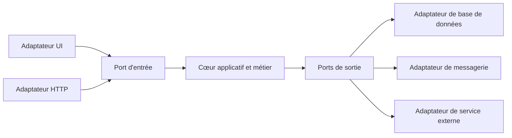
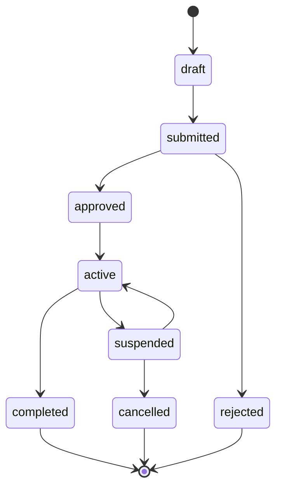
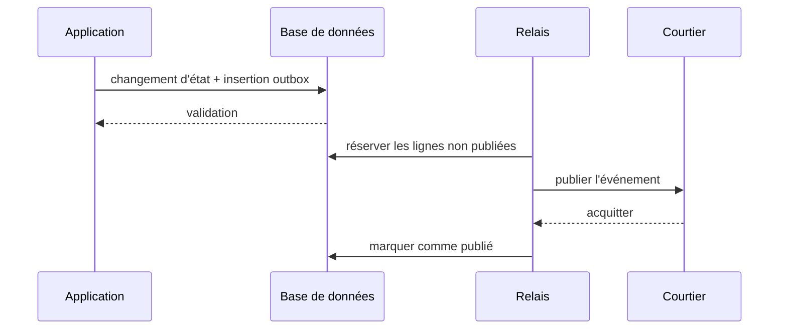
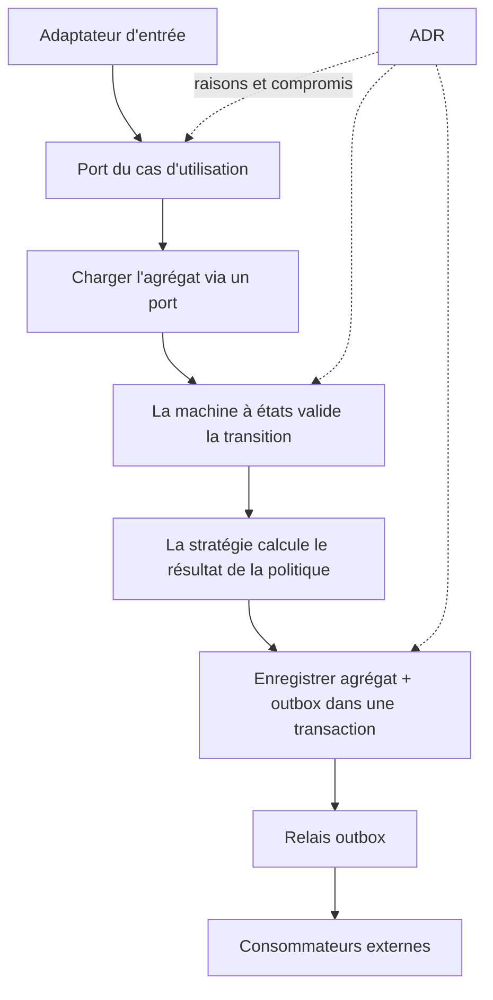



Une bonne architecture n'est pas une structure qui multiplie les noms de couches.
Elle sépare ce qui change souvent des règles qui doivent toujours rester vraies, et rend testables les frontières des états, des effets de bord et des décisions.

Cet article ne dresse pas une liste de patrons à la mode. Il relie cinq outils qui résolvent des problèmes distincts.

## 1. Commencer par repérer les axes de changement

Commencez par ces questions.

- Quelles sont les règles métier fondamentales ?
- Parmi l'interface utilisateur, la base de données, la file et les API externes, lesquels sont les plus susceptibles d'être remplacés ?
- À quelles frontières les échecs et les nouvelles tentatives se produisent-ils ?
- Quels algorithmes ont besoin de plusieurs implémentations ?
- Quelles entités connaissent des transitions d'état importantes ?
- Quelles décisions risquent de rester en vigueur longtemps ?

Tout abstraire ne fait qu'augmenter le coût de compréhension.
N'introduisez des abstractions que sur de véritables axes de changement et frontières de risque.

## 2. Le cœur des ports et adaptateurs

Le cœur de l'application ne dépend pas directement d'une technologie externe ; il dépend de contrats appelés **ports**.
Un adaptateur implémente un port à l'aide d'une technologie précise.



Les dépendances pointent de l'extérieur vers le cœur.
Le cœur n'a pas besoin de connaître les entités ORM, les requêtes HTTP ni les types de contrôles de l'interface.

## 3. Un port d'entrée est un cas d'utilisation

Un port d'entrée n'est pas un dépôt CRUD générique. Il représente l'intention de l'utilisateur et une frontière transactionnelle.

Exemples :

- `SubmitJob`
- `ApproveChange`
- `CancelOrder`
- `GenerateReport`

Chaque cas d'utilisation coordonne la validation de la commande, l'autorisation, les transitions du domaine, la persistance et l'enregistrement des événements.

Si un contrôleur ou un modèle de vue porte directement les règles métier, celles-ci seront dupliquées aux autres points d'entrée.

## 4. Un port de sortie est une capacité dont le cœur a besoin

Un mauvais port reproduit mot pour mot l'API d'un fournisseur externe.
Un bon port exprime une capacité du point de vue du cœur.

- `LoadAggregate`
- `SaveAggregate`
- `PublishDomainEvent`
- `CurrentClock`
- `GenerateIdentifier`
- `StoreArtifact`

Faire de l'horloge et des identifiants des ports facilite également les tests déterministes.

## 5. Quand séparer les entités du domaine des modèles de persistance

Dans un système simple muni d'annotations ORM, le même type peut servir aux deux usages.
Introduisez toutefois une couche de correspondance lorsque les préoccupations de persistance empiètent sur les invariants du domaine, ou lorsque le schéma et le cycle de vie métier divergent.

Dupliquer systématiquement les modèles augmente le code répétitif.
Envisagez leur séparation lorsque vous observez ces signes.

- Le chargement paresseux modifie le comportement du domaine
- La possibilité de valeur nulle en base diffère du caractère facultatif dans le domaine
- Plusieurs agrégats partagent une même table
- Les schémas d'audit ou temporels sont complexes
- Un contrat de sérialisation externe fige le domaine

## 6. Rendre le cycle de vie explicite avec une machine à états

Plusieurs booléens créent des combinaisons impossibles.

Par exemple, conserver séparément `isRunning`, `isDone`, `hasFailed` et `isCancelled` peut permettre à plusieurs d'être vrais en même temps.
Définissez un seul état et les transitions autorisées.



## 7. Séparer les invariants des effets de bord lors des transitions

Rendez la fonction de transition du domaine aussi pure que possible.

```text
transition(current_state, command, context)
  -> new_state, domain_events
```

La fonction vérifie les points suivants.

- La commande est-elle permise dans l'état courant ?
- Les autorisations de l'acteur et les préconditions sont-elles satisfaites ?
- Les invariants sont-ils préservés ?
- Quels événements du domaine se produisent ?

Un adaptateur situé hors de la transaction effectue l'envoi réel des courriels, la publication dans la file et les écritures de fichiers.

## 8. Concurrence optimiste

Deux requêtes peuvent lire la même entité et enregistrer des transitions différentes.
Faites du champ de version une condition de la mise à jour.

```sql
UPDATE aggregate
SET state = :next_state,
    version = version + 1
WHERE id = :id
  AND version = :expected_version;
```

Si aucune ligne n'est affectée, un conflit s'est produit.
Le choix entre une nouvelle tentative automatique et une nouvelle confirmation de l'utilisateur dépend du sens de la commande.

## 9. Le problème résolu par le patron Strategy

Utilisez Strategy lorsque plusieurs algorithmes remplissent le même rôle et que l'un d'eux doit être choisi à l'exécution ou par configuration.

Exemples :

- Politique tarifaire
- Algorithme de routage
- Politique de validation
- Choix du solveur
- Politique de nouvelle tentative

L'interface définit les entrées, les sorties et la sémantique d'échec communes aux algorithmes.
Une stratégie qui accède directement à la base de données et à l'interface utilisateur devient moins interchangeable.

## 10. Centraliser le choix des stratégies

Une fois les instructions `if type == ...` dispersées déplacées dans des stratégies, il reste encore des branchements dans le sélecteur.
Centralisez les règles de sélection dans une fabrique ou un registre, et rejetez explicitement les clés inconnues.

Lorsque la configuration modifie le choix, consignez les éléments suivants.

- Identifiant et version de la stratégie
- Entrée ayant servi à la sélection
- Valeur par défaut et solution de repli
- Déploiement progressif ou indicateur de fonctionnalité
- Provenance du résultat

Si une solution de repli emploie silencieusement un autre algorithme, le résultat devient difficile à interpréter.

## 11. Pourquoi une outbox transactionnelle est nécessaire

Lorsque l'enregistrement en base et la publication d'un message se déroulent l'un après l'autre, un seul des deux peut réussir.

Scénario d'échec :

1. La transaction en base est validée
2. Le processus s'arrête brutalement
3. La publication du message est omise

Dans l'ordre inverse, le message peut être publié alors que la transaction en base est annulée.

Le patron outbox enregistre l'état du domaine et l'événement à publier dans une seule transaction de base de données.



## 12. Une outbox ne garantit pas l'exécution exactement une fois

Si le relais s'arrête après la publication mais avant de marquer l'événement `published`, le même événement est renvoyé.
Les consommateurs doivent gérer les doublons à l'aide de l'identifiant de l'événement.

Incluez ces champs dans l'enveloppe de l'événement :

- Identifiant de l'événement
- Identifiant et version de l'agrégat
- Type d'événement et version de schéma
- Date et heure de survenue
- Identifiants de corrélation et de causalité
- Charge utile

On peut utiliser une boîte de réception côté consommateur ou une table des événements traités.

## 13. Ordre des événements

Garantir un ordre global est coûteux et souvent inutile.
Validez l'ordre local grâce à une version propre à chaque agrégat.

- Inférieure à la prochaine version attendue : doublon ou événement tardif
- Égale : peut être traitée
- Supérieure : il manque un élément ; mettre en attente, recharger ou réessayer

Employer l'identifiant de l'agrégat comme clé de partition peut aider à préserver l'ordre du courtier, mais il faut vérifier la redistribution des partitions et la sémantique des nouvelles tentatives.

## 14. Détails opérationnels de l'outbox

- Utiliser un verrou ou un bail lors de la réservation des lignes en attente
- Taille des lots de publication et contre-pression
- Nouvelles tentatives exponentielles et gestion des lettres mortes
- Conservation des lignes déjà publiées
- Migration du schéma
- Mise en quarantaine des événements toxiques
- Métriques de retard du relais
- Limitation de la croissance de la base lors d'une panne du courtier

Mettez en œuvre l'archivage et la purge afin que la table outbox ne croisse pas sans limite.
Alignez la suppression sur la conservation côté consommateurs et les exigences d'audit.

## 15. Pourquoi les ADR sont nécessaires

Un relevé de décision d'architecture, ou ADR, conserve non seulement « la structure actuelle », mais aussi « pourquoi ce choix a été fait et quels compromis ont été acceptés ».

Structure simple d'un ADR :

- Titre et statut
- Contexte et facteurs de décision
- Options envisagées
- Décision
- Conséquences positives et négatives
- Déclencheurs de validation ou de réexamen
- Tickets, bancs d'essai et documents associés

Le code seul ne révèle ni les solutions écartées ni les contraintes qui existaient à l'époque.

## 16. Cycle de vie d'un ADR

Les statuts peuvent inclure proposé, accepté, remplacé et obsolète.
N'écrasez pas silencieusement un ADR existant. Reliez le nouvel ADR à la décision antérieure qu'il remplace.

Réexaminez la décision dans les situations suivantes.

- Le trafic ou le volume de données dépasse les hypothèses
- De nouvelles obligations de conformité apparaissent
- Un fournisseur ou un service est abandonné
- Un incident révèle une conséquence cachée
- Les résultats de bancs d'essai ou la structure des coûts changent

## 17. Un flux de cas d'utilisation reliant les patrons



Chaque patron a une responsabilité distincte.

- Ports : direction des dépendances
- Machine à états : invariants du cycle de vie
- Strategy : variation des algorithmes
- Outbox : fiabilité entre la base de données et les messages
- ADR : contexte et compromis de la décision

## 18. Stratégie de test

### Tests unitaires du domaine

- Transitions autorisées
- Transitions interdites
- Invariants
- Événements générés
- Contrats des stratégies

### Tests de contrat des adaptateurs

- Concurrence du dépôt
- Schéma de sérialisation
- Correspondance des erreurs du courtier
- Horloge et fuseau horaire
- Expiration des requêtes à l'API externe

### Tests d'intégration

- Validation atomique de l'état et de l'outbox
- Publication en double par le relais
- Idempotence du consommateur
- Migration du schéma
- Arrêt brutal et reprise du processus

### Tests d'architecture

Des règles de dépendance peuvent vérifier automatiquement que le projet cœur ne référence ni l'interface utilisateur, ni l'ORM, ni les SDK des fournisseurs.

## 19. Observabilité

Consignez l'identifiant de corrélation et le cas d'utilisation dans les traces, et reliez les événements du domaine aux événements de l'outbox.

Métriques observables :

- Réussite, échec et latence des cas d'utilisation
- Nombre de transitions invalides
- Conflits de concurrence optimiste
- Distribution du choix des stratégies
- Nombre d'éléments outbox en attente et âge du plus ancien
- Nouvelles tentatives de publication et lettres mortes
- Nombre de doublons et de lacunes côté consommateurs

Des métriques HTTP génériques sans signification métier rendent les échecs du domaine difficiles à diagnostiquer.

## 20. Liste de vérification

- [ ] Le cœur évite-t-il les dépendances directes aux types des frameworks et des fournisseurs ?
- [ ] Les ports sont-ils définis dans le langage des capacités du cœur ?
- [ ] Chaque cas d'utilisation précise-t-il sa frontière transactionnelle ?
- [ ] Le cycle de vie est-il une machine à états plutôt qu'une combinaison de booléens ?
- [ ] Les transitions interdites sont-elles testées automatiquement ?
- [ ] Les conflits de concurrence optimiste sont-ils gérés ?
- [ ] Les stratégies partagent-elles un contrat d'entrée, de sortie et d'échec ?
- [ ] L'identifiant de la stratégie choisie est-il consigné dans la provenance ?
- [ ] L'état et l'outbox sont-ils enregistrés dans la même transaction ?
- [ ] Le relais et le consommateur sont-ils protégés contre les doublons ?
- [ ] L'ordre des événements est-il validé pour chaque agrégat ?
- [ ] Les retards de l'outbox ont-ils des alertes et une politique de conservation ?
- [ ] Chaque choix structurel important possède-t-il un ADR ?
- [ ] Les déclencheurs de réexamen de l'ADR sont-ils explicites ?

## 21. Erreurs fréquentes et limites

### Créer une interface pour chaque classe

Abstraire même les calculs internes dépourvus d'axe de changement ne fait qu'augmenter les coûts de navigation et de maintenance.

### Transformer le modèle du domaine en conteneur de données vide

Lorsque les règles sont dispersées dans les services, les transitions et les invariants deviennent difficiles à garantir.

### Une sémantique d'erreur différente pour chaque stratégie

Les appelants doivent connaître les exceptions et états propres à chaque implémentation, ce qui rompt la substituabilité.

### Croire qu'une outbox élimine les doublons

Supposez une publication au moins une fois et concevez l'idempotence des consommateurs.

### Rédiger les ADR comme de longs comptes rendus de réunion

Gardez la décision, les motifs, les solutions possibles, les conséquences et les critères de réexamen concis et faciles à rechercher.

## 22. Références officielles et originales

- Cockburn, A., [Hexagonal Architecture](https://alistair.cockburn.us/hexagonal-architecture/).
- Gamma et al., *Design Patterns: Elements of Reusable Object-Oriented Software*.
- Fowler, M., [State Machine](https://martinfowler.com/bliki/StateMachine.html).
- Richardson, C., [Transactional Outbox pattern](https://microservices.io/patterns/data/transactional-outbox.html).
- Nygard, M., [Documenting Architecture Decisions](https://cognitect.com/blog/2011/11/15/documenting-architecture-decisions).
- IETF, [Problem Details for HTTP APIs](https://www.rfc-editor.org/rfc/rfc9457).

Le but des patrons d'architecture n'est pas de compliquer les diagrammes.
Il est de **séparer les règles, les dépendances, les effets de bord et les raisons des décisions là où les changements et les échecs surviennent, afin de les rendre vérifiables**.
