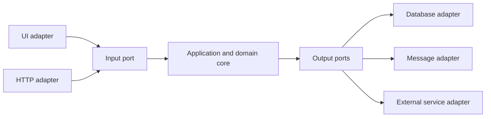
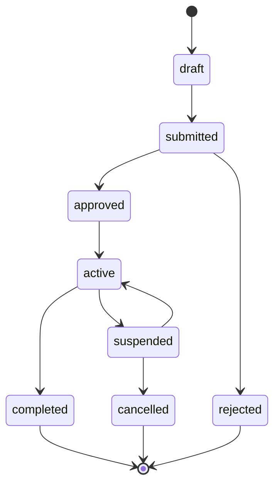
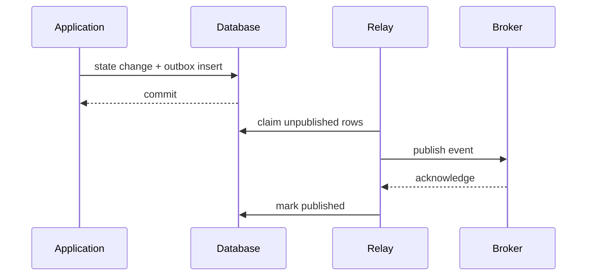
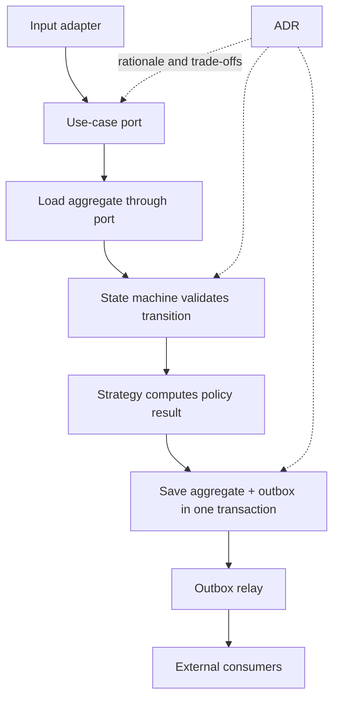



良いアーキテクチャとは、階層名が多い構造ではない。
頻繁に変わるものと必ず守る規則を分離し、状態・side effect・意思決定の境界をテスト可能にする構造である。

本稿では流行のpatternを列挙せず、異なる問題を解く五つの道具を接続する。

## 1. まず変化軸を見つける

次の問いから始める。

- 中核となる業務規則は何か。
- UI、database、queue、外部APIのうち、何が置換される可能性が高いか。
- 障害とretryが起きる境界はどこか。
- 複数実装が必要なalgorithmは何か。
- 状態遷移が重要なentityは何か。
- どの決定が長期間維持されそうか。

すべてを抽象化すれば理解コストだけが増える。
実際の変化軸とリスク境界にのみ抽象化を置く。

## 2. Ports and Adaptersの核心

application coreは外部技術へ直接依存せず、**port**という契約へ依存する。
adapterはportを特定技術で実装する。



依存方向は外部からcoreへ向かう。
coreがORM entity、HTTP request、UI control typeを知る必要はない。

## 3. Input portはuse caseである

input portはgeneric CRUD repositoryではなく、利用者の意図とtransaction boundaryを表す。

例：

- `SubmitJob`
- `ApproveChange`
- `CancelOrder`
- `GenerateReport`

各use caseはcommand validation、authorization、domain transition、persistence、event記録を調整する。

controllerやview-modelが業務規則を直接持つと、別のentry pointで規則が重複する。

## 4. Output portはcoreが必要とする能力である

悪いportは外部vendor APIをそのまま複製する。
良いportはcore視点のcapabilityを表す。

- `LoadAggregate`
- `SaveAggregate`
- `PublishDomainEvent`
- `CurrentClock`
- `GenerateIdentifier`
- `StoreArtifact`

clockとIDもportにすると、deterministic testが容易になる。

## 5. Domain entityとpersistence modelを分けるとき

ORM annotationが単純なシステムでは同じtypeを使える。
しかしpersistence concernがdomain invariantへ侵入する、またはschemaとdomain lifecycleが異なるならmapping layerを置く。

無条件にmodelを二重化するとboilerplateが増える。
次の兆候があるとき分離を検討する。

- lazy loadingがdomain behaviorを変える
- database nullabilityとdomain optionalityが異なる
- 複数aggregateが一つのtableを共有する
- audit/temporal schemaが複雑
- 外部serialization contractがdomainを固定する

## 6. 状態機械でlifecycleを明示する

複数のbooleanは不可能な組合せを作る。

たとえば `isRunning`、`isDone`、`hasFailed`、`isCancelled` を別々に置けば、同時にtrueとなる状態が生じ得る。
一つのstateと許可transitionを定義する。



## 7. Transitionではinvariantとside effectを分ける

domain transition関数は可能な限り純粋にする。

```text
transition(current_state, command, context)
  -> new_state, domain_events
```

関数は次を検査する。

- 現在stateでcommandが許可されるか。
- actor権限と前提条件が合うか。
- invariantが維持されるか。
- どのdomain eventが発生するか。

実際のemail、queue publish、ファイル書込みはtransaction外のadapterが処理する。

## 8. 楽観的同時実行制御

二つの要求が同じentityを読み、別々のtransitionを保存する可能性がある。
version fieldを条件にupdateする。

```sql
UPDATE aggregate
SET state = :next_state,
    version = version + 1
WHERE id = :id
  AND version = :expected_version;
```

影響rowが0ならconflictである。
無条件にretryするか、利用者の再確認を求めるかはcommandの意味による。

## 9. Strategy patternが解く問題

同じ役割のalgorithmが複数あり、runtimeまたはconfigurationに応じて選ぶときstrategyを使う。

例：

- pricing policy
- routing algorithm
- validation policy
- solver selection
- retry policy

interfaceはalgorithm共通のinput/outputとfailure semanticsを定義する。
strategyがdatabaseとUIへ直接アクセスすると、置換可能性が下がる。

## 10. Strategy選択を集中管理する

各所の `if type == ...` をstrategyへ移してもselectorの分岐は残る。
選択規則をfactoryまたはregistryへ集中させ、unknown keyを明示的に拒否する。

configurationが選択を変えるなら次を記録する。

- strategy IDとversion
- selection input
- defaultとfallback
- rollout/feature flag
- 結果provenance

fallbackが黙って別algorithmを使うと結果解釈が難しくなる。

## 11. Transactional outboxが必要な理由

database保存とmessage publishを順に行うと、一方だけ成功する場合がある。

障害scenario：

1. DB commit成功
2. process crash
3. message publish欠落

逆順ではmessage送信後にDBがrollbackする可能性がある。

outbox patternはdomain stateとpublish対象eventを同じdatabase transactionへ保存する。



## 12. Outboxはexactly-onceではない

relayがpublish後、`published` 表示前に停止すると、同じeventが再送される。
consumerはevent IDで重複処理しなければならない。

event envelopeに含める項目：

- event ID
- aggregate IDとversion
- event typeとschema version
- occurred time
- correlation/causation ID
- payload

consumer inboxまたはprocessed-event tableを利用できる。

## 13. Event ordering

global orderの保証は高価で、不要な場合が多い。
aggregate別versionでlocal orderを検証する。

- 次のexpected versionより小さい：duplicateまたは遅延event
- 同じ：処理可能
- 大きい：gapなので保留・再照会・再試行

partition keyをaggregate IDにすればbroker内の順序維持を支援できるが、reshardingとretry semanticsを確認する。

## 14. Outboxの運用詳細

- pending row claimにlock/leaseを使用
- publish batch sizeとbackpressure
- exponential retryとdead-letter
- publish済みrowのretention
- schema migration
- poison event quarantine
- relay lag metric
- broker障害時のDB増加制限

outbox tableが無限に増えないようarchiveとpurgeを運用する。
削除方針はconsumer retention・audit requirementと合わせる。

## 15. ADRが必要な理由

Architecture Decision Recordは「現在の構造」より、「なぜこの選択をし、どのtrade-offを受け入れたか」を保存する。

簡単なADR構造：

- タイトルと状態
- contextとdecision driver
- 検討したoption
- decision
- positive/negative consequence
- validationまたはrevisit trigger
- 関連issue、benchmark、文書

コードだけでは、棄却した代替案と当時の制約は分からない。

## 16. ADR lifecycle

状態はproposed、accepted、superseded、deprecatedなどで運用できる。
既存ADRを黙って上書きせず、新ADRが以前の決定を置き換えたと関連付ける。

次の場合にrevisitする。

- trafficまたはdata volumeが仮定を外れる
- 新しいcompliance requirement
- vendor/service deprecation
- incidentがhidden consequenceを示す
- benchmarkとコスト構造の変化

## 17. Patternを接続したuse-case flow



各patternの責任は異なる。

- ports：dependency direction
- state machine：lifecycle invariant
- strategy：algorithm variation
- outbox：DBとmessage間のreliability
- ADR：決定の文脈とtrade-off

## 18. Test strategy

### Domain unit test

- 許可transition
- 禁止transition
- invariant
- generated event
- strategy contract

### Adapter contract test

- repository concurrency
- serialization schema
- broker error mapping
- clock/timezone
- external API timeout

### Integration test

- stateとoutboxのatomic commit
- relay duplicate publish
- consumer idempotency
- schema migration
- process crashとrecovery

### Architecture test

core projectがUI、ORM、vendor SDKを参照しないか、dependency ruleを自動検査できる。

## 19. Observability

traceへcorrelation IDとuse-caseを記録し、domain eventとoutbox eventを結び付ける。

観測metric：

- use-case success/failure/latency
- invalid transition count
- optimistic concurrency conflict
- strategy selection distribution
- outbox pending countとoldest age
- publish retryとdead-letter
- consumer duplicate/gap count

業務上の意味がないgeneric HTTP metricだけではdomain failureの診断は難しい。

## 20. 検証チェックリスト

- [ ] coreがframework/vendor typeへ直接依存しない。
- [ ] portがcoreのcapability言語で定義される。
- [ ] use caseがtransaction boundaryを明示する。
- [ ] lifecycleがbooleanの組合せではなく状態機械である。
- [ ] 禁止transitionを自動テストする。
- [ ] optimistic concurrency conflictを処理する。
- [ ] strategyのinput/output/failure contractが共通である。
- [ ] 選択したstrategy IDがprovenanceへ残る。
- [ ] stateとoutboxが同じtransactionへ保存される。
- [ ] relayとconsumerがduplicateに安全である。
- [ ] aggregate別event orderingを検証する。
- [ ] outbox backlogにalertとretentionがある。
- [ ] 重要な構造選択にADRがある。
- [ ] ADRの再検討triggerが明示されている。

## 21. よく失敗するpatternと限界

### すべてのclassにinterfaceを作る

変化軸がない内部計算まで抽象化すると、navigationとmaintenance costだけが増える。

### domain modelを空のdata containerにする

規則がservice各所へ散らばり、transitionとinvariantを保証しにくい。

### strategyごとに異なるerror semantics

呼出側が実装別の例外と状態を知らねばならず、置換可能性が崩れる。

### outboxなら重複しないと信じる

at-least-once publishを仮定し、consumer idempotencyを設計しなければならない。

### ADRを議事録のように長く書く

決定、理由、代替案、結果、revisit条件を短く検索可能に保つ。

## 22. 公式・原典資料

- Cockburn, A., [Hexagonal Architecture](https://alistair.cockburn.us/hexagonal-architecture/).
- Gamma et al., *Design Patterns: Elements of Reusable Object-Oriented Software*.
- Fowler, M., [State Machine](https://martinfowler.com/bliki/StateMachine.html).
- Richardson, C., [Transactional Outbox pattern](https://microservices.io/patterns/data/transactional-outbox.html).
- Nygard, M., [Documenting Architecture Decisions](https://cognitect.com/blog/2011/11/15/documenting-architecture-decisions).
- IETF, [Problem Details for HTTP APIs](https://www.rfc-editor.org/rfc/rfc9457).

アーキテクチャpatternの目的はdiagramを複雑にすることではない。
**変更と障害が起きる地点で、規則、依存関係、side effect、決定根拠を分離し、検証可能にすること**である。
