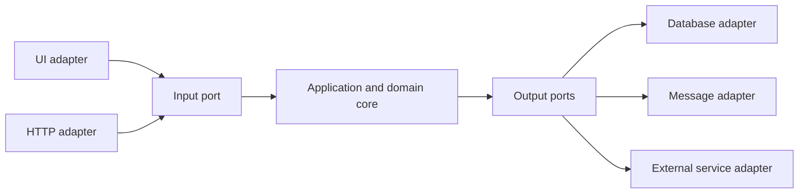
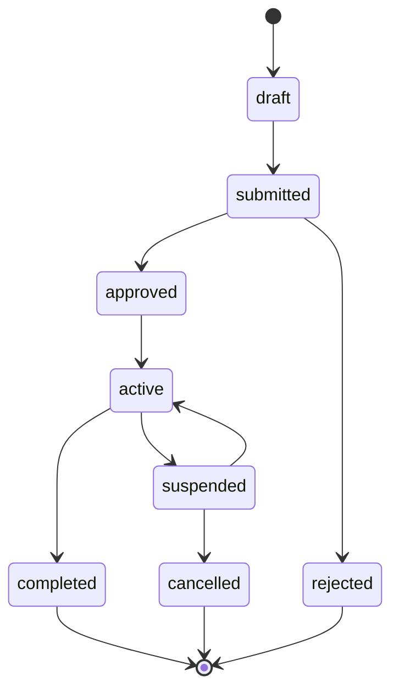
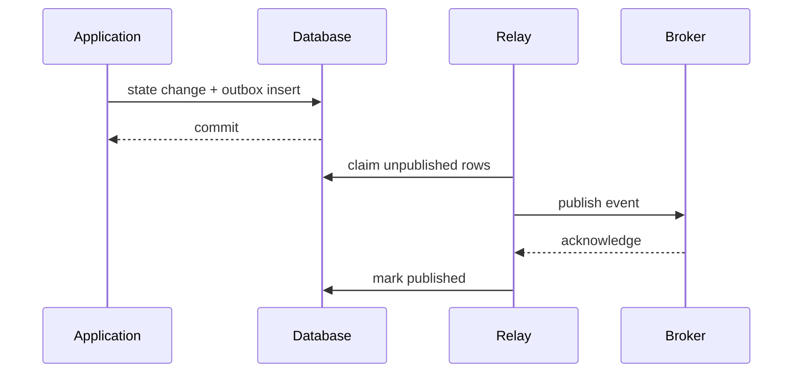
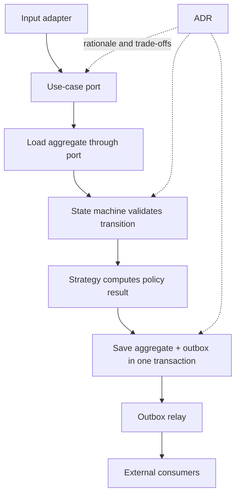



좋은 아키텍처는 계층 이름이 많은 구조가 아니다.
자주 바뀌는 것과 반드시 지켜야 하는 규칙을 분리하고, 상태·side effect·의사결정의 경계를 시험 가능하게 만드는 구조다.

이 글은 유행하는 패턴을 나열하지 않고, 서로 다른 문제를 푸는 다섯 도구를 연결한다.

## 1. 먼저 변화축을 찾는다

다음 질문으로 시작한다.

- 핵심 업무 규칙은 무엇인가?
- UI, database, queue, 외부 API 중 무엇이 교체될 가능성이 큰가?
- 실패와 retry가 발생하는 경계는 어디인가?
- 여러 구현이 필요한 알고리즘은 무엇인가?
- 상태 전이가 중요한 entity는 무엇인가?
- 어떤 결정이 장기간 유지될 가능성이 있는가?

모든 것을 추상화하면 이해 비용만 커진다.
실제 변화축과 위험경계에만 추상화를 둔다.

## 2. Ports and Adapters의 핵심

application core가 외부 기술에 직접 의존하지 않고 **port**라는 계약에 의존한다.
adapter는 port를 특정 기술로 구현한다.



의존성 방향은 외부에서 core로 향한다.
core가 ORM entity, HTTP request, UI control type을 알 필요가 없다.

## 3. Input port는 use case다

input port는 generic CRUD repository가 아니라 사용자 의도와 transaction boundary를 표현한다.

예:

- `SubmitJob`
- `ApproveChange`
- `CancelOrder`
- `GenerateReport`

각 use case는 command validation, authorization, domain transition, persistence, event 기록을 조정한다.

controller나 view-model이 업무 규칙을 직접 가지면 다른 entry point에서 규칙이 복제된다.

## 4. Output port는 core가 필요로 하는 능력이다

나쁜 port는 외부 vendor API를 그대로 복사한다.
좋은 port는 core 관점의 capability를 표현한다.

- `LoadAggregate`
- `SaveAggregate`
- `PublishDomainEvent`
- `CurrentClock`
- `GenerateIdentifier`
- `StoreArtifact`

clock과 ID도 port로 두면 deterministic test가 쉬워진다.

## 5. Domain entity와 persistence model을 구분할 때

ORM annotation이 간단한 시스템에서는 같은 type을 사용할 수 있다.
하지만 persistence concern이 domain invariant를 침범하거나 schema와 domain lifecycle이 다르면 mapping layer를 둔다.

무조건 model을 이중화하면 boilerplate가 늘어난다.
다음 신호가 있을 때 분리를 고려한다.

- lazy loading이 domain behavior를 바꿈
- database nullability와 domain optionality가 다름
- 여러 aggregate가 한 table을 공유
- audit/temporal schema가 복잡
- 외부 serialization contract가 domain을 고정

## 6. 상태기계로 lifecycle을 명시한다

boolean 여러 개는 불가능한 조합을 만든다.

예를 들어 `isRunning`, `isDone`, `hasFailed`, `isCancelled`를 별도로 두면 동시에 true인 상태가 생길 수 있다.
하나의 state와 허용 transition을 정의한다.



## 7. Transition은 invariant와 side effect를 분리한다

domain transition 함수는 가능한 한 순수하게 만든다.

```text
transition(current_state, command, context)
  -> new_state, domain_events
```

함수는 다음을 검사한다.

- 현재 state에서 command가 허용되는가?
- actor 권한과 전제조건이 맞는가?
- invariant가 유지되는가?
- 어떤 domain event가 발생하는가?

실제 email, queue publish, 파일 쓰기는 transaction 밖의 adapter가 처리한다.

## 8. 낙관적 동시성

두 요청이 같은 entity를 읽고 서로 다른 transition을 저장할 수 있다.
version field를 조건으로 update한다.

```sql
UPDATE aggregate
SET state = :next_state,
    version = version + 1
WHERE id = :id
  AND version = :expected_version;
```

영향받은 row가 0이면 conflict다.
무조건 retry할지 사용자에게 재확인을 요구할지는 command 의미에 따라 다르다.

## 9. Strategy pattern이 푸는 문제

같은 역할을 수행하는 여러 알고리즘이 있고 runtime 또는 configuration에 따라 선택해야 할 때 strategy를 사용한다.

예:

- pricing policy
- routing algorithm
- validation policy
- solver selection
- retry policy

interface는 알고리즘의 공통 input/output과 failure semantics를 정의한다.
strategy가 database와 UI까지 직접 접근하면 대체 가능성이 떨어진다.

## 10. Strategy 선택을 중앙화한다

곳곳의 `if type == ...`를 strategy로 옮긴 뒤 selector의 분기가 남는다.
선택 규칙을 factory 또는 registry에 중앙화하고 unknown key를 명시적으로 거절한다.

configuration이 선택을 바꾸면 다음을 기록한다.

- strategy ID와 version
- selection input
- default와 fallback
- rollout/feature flag
- 결과 provenance

fallback이 조용히 다른 알고리즘을 쓰면 결과 해석이 어려워진다.

## 11. Transactional outbox가 필요한 이유

database 저장과 message publish를 순서대로 하면 둘 중 하나만 성공할 수 있다.

실패 시나리오:

1. DB commit 성공
2. process crash
3. message publish 누락

반대 순서면 message는 나갔는데 DB가 rollback될 수 있다.

outbox pattern은 domain state와 publish할 event를 같은 database transaction에 저장한다.



## 12. Outbox는 exactly-once가 아니다

relay가 publish 후 `published` 표시 전에 죽으면 같은 event가 다시 전송된다.
consumer는 event ID로 중복을 처리해야 한다.

event envelope에 포함할 항목:

- event ID
- aggregate ID와 version
- event type와 schema version
- occurred time
- correlation/causation ID
- payload

consumer inbox 또는 processed-event table을 사용할 수 있다.

## 13. Event ordering

전역 순서를 보장하기는 비싸고 불필요한 경우가 많다.
aggregate별 version으로 local order를 검증한다.

- 다음 expected version보다 작음: duplicate 또는 늦은 event
- 같음: 처리 가능
- 큼: gap이므로 보류·재조회·재시도

partition key를 aggregate ID로 사용하면 broker 내 순서를 도울 수 있지만 resharding과 retry semantics를 확인해야 한다.

## 14. Outbox 운영 세부

- pending row claim에 lock/lease 사용
- publish batch size와 backpressure
- exponential retry와 dead-letter
- 이미 publish된 row retention
- schema migration
- poison event quarantine
- relay lag metric
- broker outage 시 DB 증가 제한

outbox table이 무한히 커지지 않도록 archive와 purge를 운영한다.
삭제는 consumer retention·audit requirement와 맞춘다.

## 15. ADR이 필요한 이유

Architecture Decision Record는 “현재 구조가 무엇인가”보다 “왜 이 선택을 했고 어떤 trade-off를 받아들였는가”를 보존한다.

간단한 ADR 구조:

- 제목과 상태
- context와 decision driver
- 고려한 option
- decision
- positive/negative consequence
- validation 또는 revisit trigger
- 관련 issue, benchmark, 문서

코드만 보면 버려진 대안과 당시 제약을 알 수 없다.

## 16. ADR lifecycle

상태는 proposed, accepted, superseded, deprecated처럼 운영할 수 있다.
기존 ADR을 조용히 덮어쓰지 말고 새 ADR이 이전 결정을 대체했다고 연결한다.

다음 상황에서 revisit한다.

- traffic 또는 data volume이 가정을 벗어남
- 새로운 compliance requirement
- vendor/service deprecation
- incident가 hidden consequence를 드러냄
- benchmark와 비용구조 변화

## 17. 패턴을 연결한 use-case 흐름



각 패턴은 다른 책임을 가진다.

- ports: dependency direction
- state machine: lifecycle invariant
- strategy: algorithm variation
- outbox: DB와 message 사이 reliability
- ADR: 결정 맥락과 trade-off

## 18. Test strategy

### Domain unit test

- 허용 transition
- 금지 transition
- invariant
- generated event
- strategy contract

### Adapter contract test

- repository concurrency
- serialization schema
- broker error mapping
- clock/timezone
- external API timeout

### Integration test

- state와 outbox의 atomic commit
- relay duplicate publish
- consumer idempotency
- schema migration
- process crash와 recovery

### Architecture test

core project가 UI, ORM, vendor SDK를 참조하지 않는지 dependency rule을 자동 검사할 수 있다.

## 19. Observability

trace에는 correlation ID와 use-case를 기록하고 domain event와 outbox event를 연결한다.

관측 metric:

- use-case success/failure/latency
- invalid transition count
- optimistic concurrency conflict
- strategy selection distribution
- outbox pending count와 oldest age
- publish retry와 dead-letter
- consumer duplicate/gap count

업무 의미가 없는 generic HTTP metric만으로는 domain failure를 진단하기 어렵다.

## 20. 검증 체크리스트

- [ ] core가 framework/vendor type에 직접 의존하지 않는다.
- [ ] port가 core의 capability 언어로 정의된다.
- [ ] use case가 transaction boundary를 명시한다.
- [ ] lifecycle이 boolean 조합이 아닌 상태기계다.
- [ ] 금지 transition을 자동 시험한다.
- [ ] optimistic concurrency conflict를 처리한다.
- [ ] strategy input/output/failure contract가 공통이다.
- [ ] 선택된 strategy ID가 provenance에 남는다.
- [ ] state와 outbox가 같은 transaction에 저장된다.
- [ ] relay와 consumer가 duplicate에 안전하다.
- [ ] aggregate별 event ordering을 검증한다.
- [ ] outbox backlog에 alert와 retention이 있다.
- [ ] 중요한 구조 선택에 ADR이 있다.
- [ ] ADR의 재검토 trigger가 명시되어 있다.

## 21. 자주 실패하는 패턴과 한계

### 모든 class에 interface 만들기

변화축이 없는 내부 계산까지 추상화하면 navigation과 maintenance cost만 증가한다.

### domain model을 빈 data container로 만들기

규칙이 service 곳곳에 흩어져 transition과 invariant를 보장하기 어렵다.

### strategy마다 다른 error semantics

호출자가 구현별 예외와 상태를 알아야 해 대체 가능성이 깨진다.

### outbox면 중복이 없다고 믿기

at-least-once publish를 가정하고 consumer idempotency를 설계해야 한다.

### ADR을 회의록처럼 길게 쓰기

결정, 이유, 대안, 결과, revisit 조건을 짧고 검색 가능하게 유지한다.

## 22. 공식·원전 참고자료

- Cockburn, A., [Hexagonal Architecture](https://alistair.cockburn.us/hexagonal-architecture/).
- Gamma et al., *Design Patterns: Elements of Reusable Object-Oriented Software*.
- Fowler, M., [State Machine](https://martinfowler.com/bliki/StateMachine.html).
- Richardson, C., [Transactional Outbox pattern](https://microservices.io/patterns/data/transactional-outbox.html).
- Nygard, M., [Documenting Architecture Decisions](https://cognitect.com/blog/2011/11/15/documenting-architecture-decisions).
- IETF, [Problem Details for HTTP APIs](https://www.rfc-editor.org/rfc/rfc9457).

아키텍처 패턴의 목적은 diagram을 복잡하게 만드는 것이 아니다.
**변경과 실패가 발생하는 지점에서 규칙, 의존성, side effect, 결정 근거를 분리해 검증 가능하게 만드는 것**이다.
