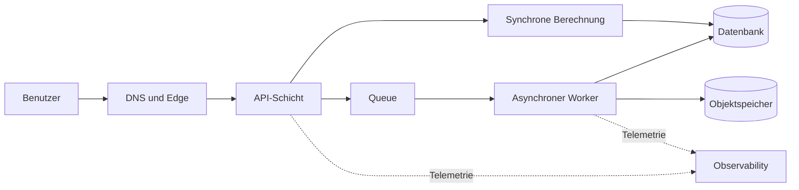



## Das Problem: Mehr Service-Icons ergeben keine bessere Architektur

Ausgangspunkt eines Cloud-Entwurfs ist keine Serviceliste, sondern Geschäftsergebnisse und Fehlertoleranz.

Folgende Ansätze können plausibel wirken, verbergen aber betriebliche Risiken.

- Jede Schicht ausnahmslos über mehrere Availability Zones bereitstellen.
- Backup- und Wiederherstellungstests auslassen, weil ein Service verwaltet wird.
- Kapazitäts- und Nebenläufigkeitsgrenzen ignorieren, weil ein System serverlos ist.
- Nur Security Groups verschärfen, ohne IAM-Berechtigungen und Datenpfade zu prüfen.
- Nur die prognostizierten Monatskosten berechnen, ohne die Kosten von Traffic-Spitzen zu messen.
- Dashboards erstellen, deren Metriken keine Benutzerergebnisse abbilden.

Ein guter Entwurf muss folgende Fragen beantworten können.

1. Welches Benutzerergebnis liefert er mit welcher Latenz und Verfügbarkeit?
2. Wovon hängt jede Komponente ab und zu welcher Fehlerdomäne gehört sie?
3. Wie und bis zu welchem Zeitpunkt werden verlorene oder beschädigte Daten wiederhergestellt?
4. Welche Logs, Metriken, Traces und synthetischen Prüfungen belegen die Gesundheit des Systems?
5. Wer hat die Abwägungen zwischen Sicherheit, Zuverlässigkeit, Performance und Kosten genehmigt?

Das offizielle AWS [Well-Architected Framework](https://docs.aws.amazon.com/wellarchitected/latest/framework/welcome.html) prüft diese Entscheidungen anhand von sechs Säulen: Operational Excellence, Sicherheit, Zuverlässigkeit, Performanceeffizienz, Kostenoptimierung und Nachhaltigkeit.

## Denkmodell: Vier Schichten aus Anforderungen, Grenzen, Fehlern und Evidenz

### 1. Anforderungen als Zahlen und Bedingungen ausdrücken

Erfassen Sie statt `schnelle API` Folgendes.

- Zielperzentil der Antwortzeit unter normaler Last
- Akzeptable Fehlerrate und Messfenster
- Erwartete durchschnittliche und maximale Anfrageraten
- Aufbewahrungsdauer und Standortanforderungen der Daten
- Recovery Time Objective oder RTO
- Recovery Point Objective oder RPO
- Toleranz für geplante Wartung
- Kostenobergrenze und Warnschwelle bei Überschreitung

Zahlen sind keine dauerhaften, unveränderlichen Wahrheiten.

Kennzeichnen Sie sie anfangs als Annahmen und aktualisieren Sie sie mit Lasttests und Betriebsdaten.

### 2. Zuerst Systemgrenzen zeichnen

Zu den Grenzen gehören Benutzer, externe Anbieter, DNS, Edge, APIs, Compute, Queues, Datenbanken, Objektspeicher, Identität und Observability.

Erfassen Sie für jeden Pfeil Protokoll, authentifizierenden Principal, Timeout, Wiederholungsverhalten und Datenklassifizierung.

Ohne diese Informationen gleicht ein Netzwerkdiagramm eher Dekoration als betrieblicher Dokumentation.

### 3. Fehlerdomänen trennen

Die Zahl der Ressourcen und ihre Unabhängigkeit sind verschiedene Konzepte.

- Mehrere Instanzen in derselben Availability Zone teilen einen zonalen Ausfall.
- Dasselbe Deployment-Artefakt kann denselben Defekt gleichzeitig reproduzieren.
- Ressourcen mit derselben IAM-Rolle teilen die Auswirkung einer Fehlkonfiguration der Berechtigungen.
- API-Replikate an demselben primären Datenbankknoten teilen die Datenschicht.
- Derselbe DNS-Anbieter, Identity Provider oder dieselbe Quote wird zu einer verborgenen gemeinsamen Ursache.

Eine Availability Zone ist eine wichtige Fehlergrenze, aber nicht die einzige.

Eine regionsübergreifende Architektur bewältigt größere Ausfälle, erhöht jedoch Bedenken bezüglich Datenkonsistenz, Latenz, Kosten und betrieblicher Komplexität.

### 4. Evidenz vervollständigt den Entwurf

Die Entwurfsdokumentation sollte mindestens auf folgende Evidenz verweisen.

- Änderungsverlauf von IaC
- Deployment-Ergebnisse und Rollback-Aufzeichnungen
- Ergebnisse von Lasttests
- Ergebnisse von Fehlerinjektionen
- Ergebnisse von Wiederherstellungsübungen
- IAM-Analyse und Ergebnisse der Sicherheitserkennung
- SLOs und Error Budgets
- Kosten- und Nutzungsberichte
- Aufzeichnungen ausgeführter Runbooks

## Workflow: Von Anforderungen zu einer bereitstellbaren Architektur

### Schritt 1. Den Workload in einem Satz definieren

Beispiel: `Authentifizierte Benutzeranfragen annehmen, dauerhaft speichern und Benutzern den Abruf der Ergebnisse asynchroner Verarbeitung ermöglichen.`

Eine klare Funktion entfernt auf natürliche Weise Services, die nicht benötigt werden.

### Schritt 2. Synchrone und asynchrone Pfade trennen

Behalten Sie auf dem synchronen Pfad nur Arbeit, auf die der Benutzer warten muss.

Verschieben Sie lang laufende oder wiederholungsbedürftige Arbeit hinter eine Queue.

Ergänzen Sie beim Wechsel zur asynchronen Verarbeitung folgende Verträge.

- Annahmeantwort und Job-ID
- Idempotenzschlüssel
- Statusabfrage oder Callback
- Maximale Verarbeitungszeit
- Wiederholungs- und Dead-Letter-Behandlung
- Gegen doppelten Konsum sichere Speichermethode

### Schritt 3. Zustandsbehaftete und zustandslose Komponenten trennen

Machen Sie Compute austauschbar und legen Sie dauerhaften Zustand in einem für seinen Zweck geeigneten Speicher ab.

Wählen Sie anhand von Zugriffsmustern, nicht nach Marken.

- Ist dies ein kurzer schlüsselbasierter Lookup?
- Sind Beziehungen und Transaktionen wichtig?
- Handelt es sich um ein großes Blob?
- Müssen sequenzielle Ereignisse wiedergegeben werden?
- Ist es ein Spaltenscan für Analysen?
- Welche Pfade erfordern starke Konsistenz?

### Schritt 4. Netzwerk und Identität gemeinsam entwerfen

Ein `private subnet` allein macht ein System nicht sicher.

Beschränken Sie mit IAM-Richtlinien Principal und erlaubte Aktionen jedes Aufrufs.

Bestimmen Sie, welche Ressourcen Internet-Egress zu welchen Zielen benötigen.

Legen Sie Geheimnisse nicht in Quellcode oder Images ab; verwenden Sie einen verwalteten Secret Store und ein Rotationsverfahren.

Beziehen Sie Richtlinien für Verschlüsselungsschlüssel und Wiederherstellungsberechtigungen in den Datenlebenszyklus ein.

### Schritt 5. Timeout, Wiederholung und Backoff End-to-End abstimmen

Ein Timeout der oberen Schicht muss größer sein als die Summe der Call-Timeouts und Wiederholungen der unteren Schichten.

Wenn jede Schicht gleich oft wiederholt, entsteht ein Wiederholungssturm.

Machen Sie wenn möglich eine Schicht für Wiederholungen verantwortlich und verwenden Sie exponentiellen Backoff mit Jitter.

Stellen Sie bei Anfragen mit Seiteneffekten zuerst Idempotenz her.

### Schritt 6. Kapazität und Quoten validieren

Entwerfen Sie nicht allein für die Durchschnittslast.

- Maximale Anfragerate
- Payload-Größe
- Anzahl der Verbindungen
- Wachstumsrate des Queue-Rückstaus
- Schreibkapazität der Datenbank
- Serverless-Nebenläufigkeit
- API-Ratenlimit
- Servicequoten je Region

Autoscaling besitzt eine Reaktionsverzögerung, weshalb Vorskalierung oder Reservekapazität nötig sein kann.

### Schritt 7. Für Deployment- und Änderungsfehler entwerfen

Identifizieren Sie Artefakte unveränderlich.

Datenbankmigrationen müssen Zeiträume berücksichtigen, in denen alte und neue Versionen koexistieren.

Health Checks sollten das bloße Überleben eines Prozesses von der Bereitschaft wesentlicher Abhängigkeiten unterscheiden.

Canary- oder Blue/Green-Übergänge sollten automatische Stoppmetriken und manuelle Freigabepunkte besitzen.

### Schritt 8. Wiederherstellung realistisch üben

Eine Meldung über ein erfolgreiches Backup ist kein Nachweis der Wiederherstellbarkeit.

Stellen Sie in einer isolierten Umgebung wieder her und prüfen Sie:

- Existieren die Daten zum erwarteten Zeitpunkt?
- Kann die Anwendung die wiederhergestellte Kopie lesen?
- Lassen sich auch Schlüssel und Geheimnisse wiederherstellen?
- Erfüllen tatsächliche RTO und RPO ihre Ziele?
- Wie werden während der Wiederherstellung erzeugte Daten zusammengeführt?

## Praxisbeispiel: Anfrageannahme und asynchrone Verarbeitung

Betrachten Sie eine hypothetische API zur Dateiverarbeitung.

1. Die Edge-Schicht übernimmt TLS und grundlegende Anfragebegrenzung.
2. Die API führt Authentifizierung und Eingabevalidierung durch.
3. Sie speichert das Original per bedingtem Schreibvorgang im Objektspeicher.
4. Sie erfasst Metadatentransaktion und Jobereignis konsistent.
5. Ein Worker konsumiert das Ereignis aus einer Queue.
6. Er speichert das Ergebnis unveränderlich unter einem eigenen Schlüssel.
7. Bedingte Aktualisierungen verhindern rückwärts laufende Zustandsübergänge.
8. Der Benutzer fragt den Status mit der Job-ID ab.

Entscheidend ist hier kein bestimmter Servicename.

Wichtig ist, ob die Übergänge zwischen `accepted`, `processing`, `completed` und `failed` sowie der Verantwortliche jedes Übergangs eindeutig sind.

Ein doppeltes Ereignis darf kein abgeschlossenes Ergebnis überschreiben.

Berücksichtigen Sie außerdem, dass ein Job nach einem Worker-Timeout weitergelaufen sein kann.

Nehmen Sie Korrelations-ID, Job-ID, Artefaktversion und Versuchsnummer in die Observability-Daten auf.

## Checkliste zur Validierung

### Anforderungen

- [ ] Benutzerorientierte SLIs und SLOs sind definiert.
- [ ] Annahmen zu Spitzenlast und Wachstum sind erfasst.
- [ ] RTO und RPO sind für jeden Datentyp definiert.
- [ ] Anforderungen an Datenstandort, Aufbewahrung und Löschung sind definiert.
- [ ] Eine Kostenobergrenze und eine verantwortliche Person existieren.

### Architektur

- [ ] Komponenten und externe Abhängigkeiten sind inventarisiert.
- [ ] Worst-Case-Latenz der synchronen Aufrufkette wurde berechnet.
- [ ] Jeder Zustand besitzt eine einzige Source of Truth.
- [ ] Gemeinsame Fehlerursachen wurden identifiziert.
- [ ] Jeder bewusst akzeptierte Single Point of Failure ist in einem ADR dokumentiert.
- [ ] Anforderungen an Regionsausfälle entsprechen den tatsächlichen Geschäftsanforderungen.

### Sicherheit

- [ ] Langlebige Zugriffsschlüssel wurden minimiert.
- [ ] Geringste Rechte werden auf Workload-Identitäten angewendet.
- [ ] Nur absichtlich öffentliche Endpunkte sind exponiert.
- [ ] Verschlüsselung ruhender und übertragener Daten sowie Schlüsselberechtigungen wurden geprüft.
- [ ] Secret-Rotation und Notfallzugriffsverfahren wurden getestet.
- [ ] Aufbewahrung der Auditprotokolle und Erkennungsregeln wurden verifiziert.

### Betrieb

- [ ] Deployment-Artefakte und Konfiguration sind reproduzierbar.
- [ ] Bedingungen für Rollback und Roll-forward existieren.
- [ ] Warnungen für Quoten und Throttling existieren.
- [ ] Queue-Alter und Rückstau werden überwacht.
- [ ] Synthetische Prüfungen validieren kritische Benutzerflüsse.
- [ ] Wiederherstellungsübungen werden regelmäßig durchgeführt.
- [ ] Runbooks enthalten Stoppbedingungen und Eskalationspfade.

## Häufige Fehler und Grenzen

### `multi-AZ` mit der Verfügbarkeit des gesamten Dienstes verwechseln

Selbst bei verteiltem Compute stoppt der Dienst, wenn Datenbank, Identität, DNS, Deployment-Prozess oder Konfiguration eine gemeinsame Fehlerursache bilden.

### Einen Managed Service mit einem ausfallfreien Service verwechseln

Auch Managed Services sind von Quoten, falschen Richtlinien, Client-Timeouts, Regionsausfällen und Benutzerfehlern betroffen.

### Eine regionsübergreifende Architektur zu früh einführen

Ohne Geschäftsanforderung eingeführt steigert sie die Komplexität des Konsistenzmodells und die Betriebslast erheblich.

Validieren Sie zuerst Deployment, Wiederherstellung und Observability innerhalb einer Region.

### Kosten nur als Monatsabschlussbericht behandeln

Kosten sind ein Architektursignal.

Verfolgen Sie Kosten pro Anfrage, Job und Speichereinheit, um Wachstum und Anomalien zu erklären.

### Jedes Risiko beseitigen wollen

Risikobeseitigung verursacht Kosten und Komplexität.

Wählen Sie für jedes Risiko zwischen Akzeptieren, Mindern, Übertragen und Vermeiden und erfassen Sie Begründung sowie Prüfdatum in einem ADR.

## Offizielle Referenzen

- [AWS Well-Architected Framework](https://docs.aws.amazon.com/wellarchitected/latest/framework/welcome.html)
- [Die sechs Säulen des AWS Well-Architected Framework](https://docs.aws.amazon.com/wellarchitected/latest/framework/the-pillars-of-the-framework.html)
- [AWS Reliability Pillar](https://docs.aws.amazon.com/wellarchitected/latest/reliability-pillar/welcome.html)
- [AWS-Sicherheits-Best-Practices in IAM](https://docs.aws.amazon.com/IAM/latest/UserGuide/best-practices.html)
- [AWS Architecture Center](https://aws.amazon.com/architecture/)

## Fazit

Beurteilen Sie die Qualität einer AWS-Architektur anhand der Nachvollziehbarkeit ihrer Entscheidungen und nicht anhand der Zahl ihrer Services.

Quantifizieren Sie Anforderungen, legen Sie Fehlerdomänen offen, spezifizieren Sie Daten- und Identitätsgrenzen und validieren Sie Wiederherstellung und Deployment wiederholt.

Wichtiger als Icons sind Annahmen und Evidenz, deren Wahrheit sich im Betrieb belegen lässt.
