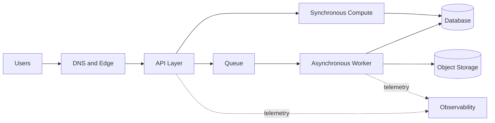



## The problem: More service icons do not make a better architecture

The starting point for cloud design is not a service list, but business outcomes and failure tolerance.

The following approaches may look plausible, but they conceal operational risk.

- Deploy every layer across multiple Availability Zones without exception.
- Skip backup and recovery tests because a service is managed.
- Ignore capacity and concurrency limits because a system is serverless.
- Tighten only security groups without reviewing IAM permissions and data paths.
- Calculate only projected monthly cost without measuring the cost of traffic spikes.
- Build dashboards that have no metrics representing user outcomes.

A good design must be able to answer the following questions.

1. What user outcome does it deliver, at what latency and availability?
2. What does each component depend on, and which failure domain does it belong to?
3. If data is lost or corrupted, how and to what point will it be restored?
4. Which logs, metrics, traces, and synthetic checks prove that the system is healthy?
5. Who approved the tradeoffs among security, reliability, performance, and cost?

The official AWS [Well-Architected Framework](https://docs.aws.amazon.com/wellarchitected/latest/framework/welcome.html) reviews these choices through six pillars: operational excellence, security, reliability, performance efficiency, cost optimization, and sustainability.

## Mental model: Four layers of requirements, boundaries, failures, and evidence

### 1. Express requirements as numbers and conditions

Instead of `fast API`, record the following.

- Target response-time percentile under normal load
- Acceptable error rate and measurement window
- Expected average and maximum request rates
- Data-retention period and location requirements
- Recovery time objective, or RTO
- Recovery point objective, or RPO
- Tolerance for planned maintenance
- Cost ceiling and overrun alert threshold

Numbers are not permanent, immutable truths.

Initially mark them as assumptions, then update them with load tests and operational data.

### 2. Draw system boundaries first

Boundaries include users, external providers, DNS, edge, APIs, compute, queues, databases, object storage, identity, and observability.

For every arrow, record the protocol, authenticating principal, timeout, retry behavior, and data classification.

Without this information, a network diagram is closer to decoration than operational documentation.

### 3. Separate failure domains

The number of resources and their independence are different concepts.

- Multiple instances in the same Availability Zone share a zonal failure.
- The same deployment artifact can reproduce the same defect simultaneously.
- Resources using the same IAM role share the impact of a permission misconfiguration.
- API replicas connected to the same database primary share the data layer.
- The same DNS provider, identity provider, or quota becomes a hidden common cause.

An Availability Zone is one important failure boundary, but it is not the only one.

A cross-Region architecture handles larger failures, but increases data-consistency concerns, latency, cost, and operational complexity.

### 4. Evidence completes the design

At minimum, design documentation should link to the following evidence.

- IaC change history
- Deployment results and rollback records
- Load-test results
- Fault-injection results
- Restore-drill results
- IAM analysis and security-detection results
- SLOs and error budgets
- Cost and usage reports
- Runbook execution records

## Workflow: From requirements to a deployable architecture

### Step 1. Define the workload in one sentence

Example: `Accept authenticated user requests, store them durably, and allow users to retrieve the results of asynchronous processing.`

Clarifying the function naturally removes services you do not need.

### Step 2. Separate synchronous and asynchronous paths

Keep only work the user must wait for on the synchronous path.

Move long-running work or work that requires retries behind a queue.

When making the transition to asynchronous processing, add the following contracts.

- Acceptance response and job identifier
- Idempotency key
- Status lookup or callback
- Maximum processing time
- Retry and dead-letter handling
- A storage method safe against duplicate consumption

### Step 3. Separate stateful and stateless components

Make compute replaceable and place durable state in a store suited to its purpose.

Choose based on access patterns, not brands.

- Is this a short key-based lookup?
- Are relationships and transactions important?
- Is it a large blob?
- Must sequential events be replayed?
- Is it a column scan for analytics?
- Which paths require strong consistency?

### Step 4. Design network and identity together

A `private subnet` alone does not make a system secure.

Use IAM policies to restrict the principal and allowed actions of each call.

Identify which resources require internet egress and their destinations.

Do not put secrets in source code or images; use a managed secret store and a rotation procedure.

Include encryption-key policies and recovery permissions in the data lifecycle.

### Step 5. Align timeout, retry, and backoff end to end

An upper-layer timeout must exceed the sum of lower-layer call timeouts and retries.

If every layer retries the same number of times, it creates a retry storm.

Where possible, make one layer responsible for retries and use exponential backoff with jitter.

Establish idempotency first for requests with side effects.

### Step 6. Validate capacity and quotas

Do not design for average load alone.

- Peak request rate
- Payload size
- Number of connections
- Queue-backlog growth rate
- Database write capacity
- Serverless concurrency
- API rate limit
- Service quotas by Region

Autoscaling has a response delay, so pre-scaling or spare capacity may be necessary.

### Step 7. Design for deployment and change failures

Identify artifacts immutably.

Database migrations must account for periods when old and new versions coexist.

Health checks should distinguish mere process survival from readiness of essential dependencies.

Canary or blue/green transitions should have automatic stop metrics and manual approval points.

### Step 8. Practice recovery for real

A successful-backup notification is not evidence of recoverability.

Restore into an isolated environment and verify the following.

- Does data exist at the expected point in time?
- Can the application read the restored copy?
- Can keys and secrets also be recovered?
- Do the actual RTO and RPO meet their targets?
- How will data created during recovery be merged?

## Practical example: Request acceptance and asynchronous processing

Consider a hypothetical file-processing API.

1. The edge layer handles TLS and basic request limiting.
2. The API performs authentication and input validation.
3. It stores the original in object storage using a conditional write.
4. It records the metadata transaction and job event consistently.
5. A worker consumes the event from a queue.
6. It stores the result immutably under a separate key.
7. Conditional updates prevent state transitions from moving backward.
8. The user looks up the status with the job ID.

The important point here is not a particular service name.

The key is whether the transitions among `accepted`, `processing`, `completed`, and `failed`, and the owner of each transition, are clear.

A duplicate event must not overwrite a completed result.

Also consider that a job may have continued running after a worker timeout.

Include the correlation ID, job ID, artifact version, and attempt number in observability data.

## Validation checklist

### Requirements

- [ ] User-oriented SLIs and SLOs are defined.
- [ ] Peak-load and growth assumptions are recorded.
- [ ] RTO and RPO are defined for each data type.
- [ ] Data location, retention, and deletion requirements are defined.
- [ ] A cost ceiling and owner exist.

### Architecture

- [ ] Components and external dependencies are inventoried.
- [ ] Worst-case latency for the synchronous call chain has been calculated.
- [ ] Each state has one source of truth.
- [ ] Common causes of failure have been identified.
- [ ] Any intentionally accepted single point of failure is recorded in an ADR.
- [ ] Region-failure requirements match actual business requirements.

### Security

- [ ] Long-lived access keys have been minimized.
- [ ] Least privilege is applied to workload identities.
- [ ] Only endpoints intended to be public are exposed.
- [ ] Encryption at rest and in transit, and key permissions, have been reviewed.
- [ ] Secret rotation and emergency-access procedures have been tested.
- [ ] Audit-log retention and detection rules have been verified.

### Operations

- [ ] Deployment artifacts and configuration are reproducible.
- [ ] Rollback and roll-forward conditions exist.
- [ ] Quota and throttling alerts exist.
- [ ] Queue age and backlog are monitored.
- [ ] Synthetic checks validate critical user flows.
- [ ] Restore drills are performed regularly.
- [ ] Runbooks contain stop conditions and escalation paths.

## Common failures and limitations

### Mistaking `multi-AZ` for availability of the entire service

Even when compute is distributed, the service stops if the database, identity, DNS, deployment process, or configuration is a common cause of failure.

### Mistaking a managed service for a service with no downtime

Managed services are still affected by quotas, incorrect policies, client timeouts, Regional outages, and user errors.

### Introducing cross-Region architecture too early

Introducing it without a business requirement sharply increases the complexity of the consistency model and the operational burden.

First validate deployment, recovery, and observability within a single Region.

### Treating cost only as a month-end report

Cost is an architectural signal.

Track cost per request, per job, and per unit of storage to explain growth and anomalies.

### Trying to eliminate every risk

Eliminating risk carries cost and complexity.

Choose among accepting, mitigating, transferring, and avoiding each risk, and record the rationale and review date in an ADR.

## Official references

- [AWS Well-Architected Framework](https://docs.aws.amazon.com/wellarchitected/latest/framework/welcome.html)
- [The Six Pillars of the AWS Well-Architected Framework](https://docs.aws.amazon.com/wellarchitected/latest/framework/the-pillars-of-the-framework.html)
- [AWS Reliability Pillar](https://docs.aws.amazon.com/wellarchitected/latest/reliability-pillar/welcome.html)
- [AWS Security Best Practices in IAM](https://docs.aws.amazon.com/IAM/latest/UserGuide/best-practices.html)
- [AWS Architecture Center](https://aws.amazon.com/architecture/)

## Conclusion

Judge the quality of an AWS architecture by the traceability of its decisions, not by the number of services.

Quantify requirements, expose failure domains, specify data and identity boundaries, and repeatedly validate recovery and deployment.

The artifacts that matter more than icons are assumptions and evidence whose truth can be demonstrated during operations.
