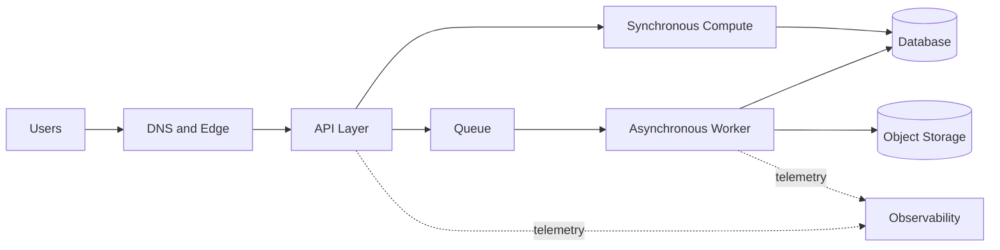



## El problema: más íconos de servicio no crean una mejor arquitectura

El punto de partida para el diseño de la nube no es una lista de servicios, sino los resultados comerciales y la tolerancia a fallas.

Los siguientes enfoques pueden parecer plausibles, pero ocultan riesgos operativos.

- Implemente cada capa en múltiples zonas de disponibilidad sin excepción.
- Omitir pruebas de respaldo y recuperación porque se administra un servicio.
- Ignore los límites de capacidad y concurrencia porque un sistema no tiene servidor.
- Reforzar únicamente los grupos de seguridad sin revisar los permisos IAM y las rutas de datos.
- Calcule únicamente el costo mensual proyectado sin medir el costo de los picos de tráfico.
- Cree paneles de control que no tengan métricas que representen los resultados de los usuarios.

Un buen diseño debe ser capaz de responder a las siguientes preguntas.

1. ¿Qué resultado ofrece al usuario, con qué latencia y disponibilidad?
2. ¿De qué depende cada componente y a qué dominio de falla pertenece?
3. Si los datos se pierden o se corrompen, ¿cómo y hasta qué punto se restaurarán?
4. ¿Qué registros, métricas, seguimientos y comprobaciones sintéticas demuestran que el sistema está en buen estado?
5. ¿Quién aprobó las compensaciones entre seguridad, confiabilidad, rendimiento y costo?

El AWS [Marco de buena arquitectura] (https://docs.aws.amazon.com/wellarchitected/latest/framework/welcome.html) oficial revisa estas opciones a través de seis pilares: excelencia operativa, seguridad, confiabilidad, eficiencia del rendimiento, optimización de costos y sostenibilidad.

## Modelo mental: cuatro capas de requisitos, límites, fallas y evidencia

### 1. Expresar requisitos como números y condiciones.

En lugar de `fast API`, registre lo siguiente.

- Percentil de tiempo de respuesta objetivo bajo carga normal
- Tasa de error aceptable y ventana de medición
- Tasas de solicitud máximas y promedio esperadas
- Período de retención de datos y requisitos de ubicación
- Objetivo de tiempo de recuperación, o RTO
- Objetivo del punto de recuperación, o RPO
- Tolerancia para el mantenimiento planificado.
- Límite de coste y umbral de alerta de superación

Los números no son verdades permanentes e inmutables.

Inicialmente márquelos como suposiciones y luego actualícelos con pruebas de carga y datos operativos.

### 2. Primero dibuje los límites del sistema

Los límites incluyen usuarios, proveedores externos, DNS, borde, API, computación, colas, bases de datos, almacenamiento de objetos, identidad y observabilidad.

Para cada flecha, registre el protocolo, el principal de autenticación, el tiempo de espera, el comportamiento de reintento y la clasificación de los datos.

Sin esta información, un diagrama de red está más cerca de una decoración que de una documentación operativa.

### 3. Dominios de falla separados

La cantidad de recursos y su independencia son conceptos diferentes.

- Varias instancias en la misma zona de disponibilidad comparten una falla zonal.
- El mismo artefacto de implementación puede reproducir el mismo defecto simultáneamente.
- Los recursos que utilizan el mismo rol IAM comparten el impacto de una mala configuración de permisos.
- Las réplicas API conectadas a la misma base de datos primaria comparten la capa de datos.
- El mismo proveedor DNS, proveedor de identidad o cuota se convierte en una causa común oculta.

Una zona de disponibilidad es un límite de falla importante, pero no es el único.

Una arquitectura entre regiones maneja fallas más grandes, pero aumenta las preocupaciones sobre la coherencia de los datos, la latencia, el costo y la complejidad operativa.

### 4. La evidencia completa el diseño

Como mínimo, la documentación de diseño debe vincularse a la siguiente evidencia.

- Historial de cambios de IaC
- Resultados de la implementación y registros de reversión.
- Resultados de la prueba de carga
- Resultados de inyección de fallas
- Restaurar resultados de perforación
- Análisis IAM y resultados de detección de seguridad.
- SLO y presupuestos de errores
- Informes de costos y uso.
- Registros de ejecución de Runbook

## Flujo de trabajo: de los requisitos a una arquitectura implementable

### Paso 1. Defina la carga de trabajo en una frase

Ejemplo: `Accept authenticated user requests, store them durably, and allow users to retrieve the results of asynchronous processing.`

Aclarar la función elimina naturalmente los servicios que no necesita.

### Paso 2. Separe las rutas sincrónicas y asincrónicas

Mantenga solo el trabajo que el usuario debe esperar en la ruta sincrónica.

Mueva el trabajo de larga duración o el trabajo que requiera reintentos detrás de una cola.

Al realizar la transición al procesamiento asincrónico, agregue los siguientes contratos.

- Respuesta de aceptación e identificador de trabajo.
- Clave de idempotencia
- Búsqueda de estado o devolución de llamada
- Tiempo máximo de procesamiento
- Reintento y manejo de mensajes no entregados.
- Un método de almacenamiento seguro contra el consumo duplicado.

### Paso 3. Separe los componentes con estado y sin estado

Haga que la computadora sea reemplazable y coloque el estado duradero en un almacén adecuado para su propósito.

Elija basándose en patrones de acceso, no en marcas.

- ¿Es esta una búsqueda breve basada en claves?
- ¿Son importantes las relaciones y transacciones?
- ¿Es una masa grande?
- ¿Deben repetirse eventos secuenciales?
- ¿Es un escaneo de columnas para análisis?
- ¿Qué caminos requieren una fuerte coherencia?

### Paso 4. Diseñar red e identidad juntos

Un `private subnet` por sí solo no hace que un sistema sea seguro.

Utilice políticas IAM para restringir las acciones principales y permitidas de cada llamada.

Identifique qué recursos requieren salida a Internet y sus destinos.

No pongas secretos en el código fuente o en las imágenes; utilice un almacén secreto administrado y un procedimiento de rotación.

Incluya políticas de claves de cifrado y permisos de recuperación en el ciclo de vida de los datos.

### Paso 5. Alinear el tiempo de espera, el reintento y el retroceso de un extremo a otro

Un tiempo de espera de la capa superior debe exceder la suma de los tiempos de espera y los reintentos de llamadas de la capa inferior.

Si cada capa reintenta el mismo número de veces, se crea una tormenta de reintentos.

Siempre que sea posible, haga que una capa sea responsable de los reintentos y utilice un retroceso exponencial con fluctuación.

Establezca primero la idempotencia para solicitudes con efectos secundarios.

### Paso 6. Validar capacidad y cuotas

No diseñe solo para carga promedio.

- Tasa de solicitud máxima
- Tamaño de carga útil
- Número de conexiones
- Tasa de crecimiento de la acumulación de colas
- Capacidad de escritura de base de datos
- Simultaneidad sin servidor
- Límite de tasa API
- Cuotas de servicio por Región

El escalado automático tiene un retraso de respuesta, por lo que puede ser necesario un escalado previo o capacidad adicional.

### Paso 7. Diseño para fallas de implementación y cambio

Identificar artefactos de forma inmutable.

Las migraciones de bases de datos deben tener en cuenta los períodos en los que coexisten versiones antiguas y nuevas.

Los controles de salud deberían distinguir la mera supervivencia del proceso de la preparación de las dependencias esenciales.

Las transiciones canarias o azul/verde deben tener métricas de parada automáticas y puntos de aprobación manuales.

### Paso 8. Practica la recuperación de verdad

Una notificación de respaldo exitosa no es evidencia de recuperabilidad.

Restaure en un entorno aislado y verifique lo siguiente.

- ¿Existen datos en el momento esperado?
- ¿Puede la aplicación leer la copia restaurada?
- ¿Se pueden recuperar también las claves y los secretos?
- ¿Cumplen sus objetivos los actuales RTO y RPO?
- ¿Cómo se fusionarán los datos creados durante la recuperación?

## Ejemplo práctico: aceptación de solicitudes y procesamiento asincrónico

Considere un hipotético API de procesamiento de archivos.

1. La capa de borde maneja TLS y la limitación de solicitudes básicas.
2. El API realiza autenticación y validación de entrada.
3. Almacena el original en el almacenamiento de objetos mediante una escritura condicional.
4. Registra la transacción de metadatos y el evento del trabajo de manera consistente.
5. Un trabajador consume el evento de una cola.
6. Almacena el resultado de forma inmutable bajo una clave separada.
7. Las actualizaciones condicionales evitan que las transiciones de estado retrocedan.
8. El usuario busca el estado con el trabajo ID.

Lo importante aquí no es el nombre de un servicio en particular.

La clave es si las transiciones entre `accepted`, `processing`, `completed` y `failed`, y el propietario de cada transición, son claras.

Un evento duplicado no debe sobrescribir un resultado completo.

Considere también que es posible que un trabajo haya continuado ejecutándose después de un tiempo de espera del trabajador.

Incluya la correlación ID, el trabajo ID, la versión del artefacto y el número de intento en los datos de observabilidad.

## Lista de verificación de validación

### Requisitos

- [ ] Se definen SLI y SLO orientados al usuario.
- [ ] Se registran los supuestos de carga máxima y crecimiento.
- [ ] RTO y RPO están definidos para cada tipo de datos.
- [ ] Se definen los requisitos de ubicación, retención y eliminación de datos.
- [ ] Existe un límite de costos y un propietario.

### Arquitectura

- [ ] Se inventarian componentes y dependencias externas.
- [] Se ha calculado la latencia en el peor de los casos para la cadena de llamadas síncronas.
- [ ] Cada estado tiene una fuente de verdad.
- [ ] Se han identificado causas comunes de falla.
- [ ] Cualquier punto único de falla aceptado intencionalmente se registra en un ADR.
- [ ] Los requisitos de falla de la región coinciden con los requisitos comerciales reales.

### Seguridad

- [] Se han minimizado las claves de acceso de larga duración.
- [] Se aplica el privilegio mínimo a las identidades de carga de trabajo.
- [ ] Solo se exponen los puntos finales destinados a ser públicos.
- [ ] Se han revisado el cifrado en reposo y en tránsito, y los permisos clave.
- [ ] Se han probado procedimientos secretos de rotación y acceso de emergencia.
- [] Se han verificado las reglas de retención y detección del registro de auditoría.

### Operaciones

- [] Los artefactos de implementación y la configuración son reproducibles.
- [ ] Existen condiciones de reversión y avance.
- [] Existen alertas de cuotas y limitaciones.
- [] Se monitorean la antigüedad de la cola y el trabajo pendiente.
- [ ] Los controles sintéticos validan los flujos de usuarios críticos.
- [ ] Se realizan simulacros de restauración periódicamente.
- [] Los runbooks contienen condiciones de detención y rutas de escalada.

## Fallos y limitaciones comunes

### Confundir `multi-AZ` con la disponibilidad de todo el servicio

Incluso cuando se distribuye la computación, el servicio se detiene si la base de datos, la identidad, DNS, el proceso de implementación o la configuración son una causa común de falla.

### Confundir un servicio administrado con un servicio sin tiempo de inactividad

Los servicios administrados aún se ven afectados por cuotas, políticas incorrectas, tiempos de espera de clientes, interrupciones regionales y errores de usuario.

### Introducir la arquitectura entre regiones demasiado pronto

Introducirlo sin un requisito comercial aumenta drásticamente la complejidad del modelo de coherencia y la carga operativa.

Primero valide la implementación, la recuperación y la observabilidad dentro de una sola región.

### Tratar el costo solo como un informe de fin de mes

El costo es una señal arquitectónica.

Realice un seguimiento del costo por solicitud, por trabajo y por unidad de almacenamiento para explicar el crecimiento y las anomalías.

### Intentando eliminar todos los riesgos

Eliminar el riesgo conlleva costos y complejidad.

Elija entre aceptar, mitigar, transferir y evitar cada riesgo, y registre el fundamento y la fecha de revisión en un ADR.

## Referencias oficiales

- [Marco de buena arquitectura AWS](https://docs.aws.amazon.com/wellarchitected/latest/framework/welcome.html)
- [Los seis pilares del marco de buena arquitectura AWS](https://docs.aws.amazon.com/wellarchitected/latest/framework/the-pillars-of-the-framework.html)
- [Pilar de confiabilidad AWS](https://docs.aws.amazon.com/wellarchitected/latest/reliability-pillar/welcome.html)
- [AWS Mejores prácticas de seguridad en IAM](https://docs.aws.amazon.com/IAM/latest/UserGuide/best-practices.html)
- [Centro de Arquitectura AWS](https://aws.amazon.com/architecture/)

## Conclusión

Juzgue la calidad de una arquitectura AWS por la trazabilidad de sus decisiones, no por la cantidad de servicios.

Cuantifique los requisitos, exponga dominios de fallas, especifique límites de identidad y datos y valide repetidamente la recuperación y la implementación.

Los artefactos que importan más que los íconos son suposiciones y evidencias cuya verdad puede demostrarse durante las operaciones.
