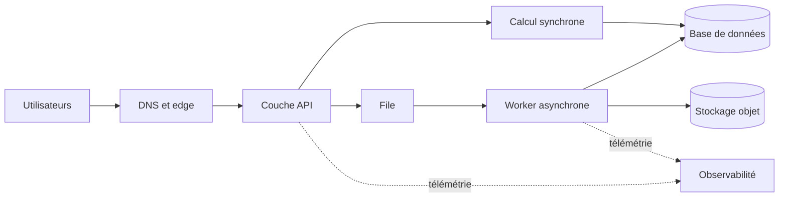



## Problème : multiplier les icônes de services ne garantit pas une bonne architecture

La conception d’un cloud part des résultats métier et des défaillances admissibles, pas d’une liste de services.

Les approches suivantes paraissent plausibles, mais masquent les risques d’exploitation.

- Déployer systématiquement toutes les couches dans plusieurs zones de disponibilité.
- Omettre les tests de sauvegarde et de restauration au motif qu’un service est managé.
- Ignorer les quotas de capacité et les limites de concurrence au motif que l’architecture est serverless.
- Restreindre uniquement les groupes de sécurité sans examiner les droits IAM ni les chemins de données.
- Calculer seulement le coût mensuel prévu sans mesurer le coût des pics de trafic.
- Créer des tableaux de bord sans aucune mesure représentant le résultat obtenu par l’utilisateur.

Une bonne conception doit pouvoir répondre aux questions suivantes.

1. Quel résultat utilisateur fournit-elle, avec quelle latence et quelle disponibilité ?
2. De quoi dépend chaque composant et à quel domaine de défaillance appartient-il ?
3. Si des données sont perdues ou endommagées, jusqu’à quel point et par quel moyen les restaure-t-on ?
4. Quels journaux, métriques, traces et contrôles synthétiques prouvent que le système fonctionne normalement ?
5. Qui a approuvé les arbitrages entre sécurité, fiabilité, performances et coûts ?

Le document officiel [AWS Well-Architected Framework](https://docs.aws.amazon.com/wellarchitected/latest/framework/welcome.html) examine ces choix selon six piliers : excellence opérationnelle, sécurité, fiabilité, efficacité des performances, optimisation des coûts et durabilité.

## Modèle mental : quatre couches — exigences, frontières, défaillances et preuves

### 1. Exprimer les exigences avec des chiffres et des conditions

Au lieu d’écrire `API rapide`, consignez les éléments suivants.

- Percentile cible du temps de réponse sous charge normale
- Taux d’erreur acceptable et fenêtre de mesure
- Taux de requêtes moyen et maximal attendu
- Durée de conservation des données et exigences régionales
- Objectif de délai de reprise, ou RTO
- Objectif de point de reprise, ou RPO
- Tolérance aux opérations de maintenance planifiées
- Plafond de coûts et seuil d’alerte en cas de dépassement

Les chiffres ne sont pas des vérités éternelles et immuables.

Au départ, marquez-les comme des hypothèses, puis actualisez-les à l’aide des tests de charge et des données d’exploitation.

### 2. Tracer d’abord les frontières du système

Elles englobent les utilisateurs, les fournisseurs externes, le DNS, l’edge, les API, le calcul, les files, les bases de données, le stockage objet, les identités et l’observabilité.

Pour chaque flèche, notez le protocole, le principal authentifié, le timeout, les nouvelles tentatives et la classification des données.

Sans ces informations, un schéma réseau est plus proche de la décoration que d’un document d’exploitation.

### 3. Séparer les domaines de défaillance

Le nombre de ressources et leur indépendance sont deux notions différentes.

- Plusieurs instances dans la même zone de disponibilité partagent la défaillance de cette zone.
- Un même artefact de déploiement peut reproduire le même défaut partout simultanément.
- Un même rôle IAM partage les conséquences d’une mauvaise configuration des droits.
- Les répliques d’API connectées au même serveur principal de base de données partagent la couche de données.
- Un même DNS, fournisseur d’identité ou quota constitue une cause commune cachée.

Une zone de disponibilité est une frontière de défaillance importante, mais ce n’est pas la seule.

Une architecture interrégionale couvre des incidents plus vastes, mais accroît les difficultés de cohérence des données, la latence, les coûts et la complexité opérationnelle.

### 4. Les preuves achèvent la conception

Le document d’architecture doit au minimum être relié aux preuves suivantes.

- Historique des modifications de l’IaC
- Résultats des déploiements et traces des rollbacks
- Résultats des tests de charge
- Résultats des injections de défaillances
- Résultats des exercices de restauration
- Analyses IAM et résultats des détections de sécurité
- SLO et budget d’erreur
- Rapports sur les coûts et l’utilisation
- Traces d’exécution des runbooks

## Démarche : des exigences à une architecture déployable

### Étape 1. Définir le workload en une phrase

Exemple : `Recevoir les requêtes d’utilisateurs authentifiés, les stocker durablement et permettre la consultation du résultat de leur traitement asynchrone.`

Une fonction clairement définie permet d’éliminer naturellement les services inutiles.

### Étape 2. Séparer les chemins synchrones des chemins asynchrones

Ne laissez sur le chemin synchrone que les opérations que l’utilisateur doit attendre.

Placez derrière une file les travaux longs ou susceptibles d’être relancés.

Lors du passage à l’asynchrone, ajoutez les contrats suivants.

- Réponse d’acceptation et identifiant de la tâche
- Clé d’idempotence
- Consultation d’état ou callback
- Durée maximale de traitement
- Nouvelles tentatives et gestion de la file de messages morts
- Méthode de stockage tolérant une consommation en double

### Étape 3. Séparer l’état des composants sans état

Rendez les ressources de calcul remplaçables et placez l’état durable dans un stockage adapté.

Les critères de choix sont les modes d’accès, pas la marque.

- S’agit-il d’une courte consultation par clé ?
- Les relations et les transactions sont-elles importantes ?
- S’agit-il de grands blobs ?
- Faut-il rejouer une suite d’événements ?
- Faut-il effectuer des analyses par balayage de colonnes ?
- Sur quels chemins une cohérence forte est-elle nécessaire ?

### Étape 4. Concevoir conjointement le réseau et les identités

Un `private subnet` ne suffit pas à assurer la sécurité.

Limitez par une politique IAM le principal et les actions autorisées pour chaque appel.

Identifiez les ressources qui ont besoin de sortir sur Internet ainsi que leurs destinations.

Ne placez pas les secrets dans le code source ou les images ; utilisez un coffre de secrets managé assorti d’une procédure de rotation.

Intégrez aussi au cycle de vie des données la politique des clés de chiffrement et les droits de restauration.

### Étape 5. Aligner de bout en bout les timeouts, les nouvelles tentatives et le backoff

Le timeout d’une couche supérieure doit dépasser la somme des timeouts et des nouvelles tentatives des appels sous-jacents.

Si chaque couche réessaie le même nombre de fois, une tempête de tentatives se produit.

Dans la mesure du possible, confiez les nouvelles tentatives à une seule couche et utilisez un backoff exponentiel assorti de jitter.

Assurez d’abord l’idempotence des requêtes ayant des effets de bord.

### Étape 6. Valider la capacité et les quotas

Ne concevez pas le système sur la seule charge moyenne.

- Taux de requêtes de pointe
- Taille des payloads
- Nombre de connexions
- Vitesse de croissance du backlog de la file
- Capacité d’écriture de la base de données
- Concurrence serverless
- Limite de débit de l’API
- Quotas de service par région

L’autoscaling réagit avec un certain délai ; une montée en charge anticipée ou une marge de capacité peuvent donc être nécessaires.

### Étape 7. Concevoir les échecs de déploiement et de modification

Identifiez les artefacts de manière immuable.

Pour les migrations de base de données, prévoyez la période de coexistence de l’ancienne et de la nouvelle version.

Les contrôles de santé doivent distinguer la survie du processus de l’état de préparation des dépendances indispensables.

Une transition canary ou blue/green doit disposer de métriques d’arrêt automatique et de points d’approbation manuelle.

### Étape 8. S’exercer réellement à la reprise

Une notification de réussite de la sauvegarde ne prouve pas qu’une restauration est possible.

Restaurez dans un environnement isolé et vérifiez les points suivants.

- Les données attendues au point de reprise sont-elles présentes ?
- L’application peut-elle lire la copie restaurée ?
- Les clés et les secrets sont-ils eux aussi récupérables ?
- Les RTO et RPO réels respectent-ils les objectifs ?
- Comment fusionner les données créées pendant la reprise ?

## Exemple pratique : réception d’une requête et traitement asynchrone

Prenons l’exemple d’une API fictive de traitement de fichiers.

1. La couche edge prend en charge TLS et la limitation élémentaire des requêtes.
2. L’API assure l’authentification et la validation des entrées.
3. Le fichier d’origine est enregistré dans le stockage objet par une écriture conditionnelle.
4. La transaction de métadonnées et l’événement de tâche sont enregistrés de manière cohérente.
5. Le worker consomme l’événement depuis la file.
6. Le résultat est enregistré de manière immuable sous une clé distincte.
7. Les transitions d’état utilisent des mises à jour conditionnelles pour empêcher tout retour en arrière.
8. L’utilisateur consulte l’état au moyen de l’identifiant de tâche.

L’important n’est pas le nom d’un service particulier.

Le cœur du problème est de définir clairement les transitions entre les états `reçu`, `en cours de traitement`, `terminé` et `échoué`, ainsi que le propriétaire de chaque transition.

Un événement en double ne doit pas écraser un résultat terminé.

Il faut aussi envisager qu’une tâche ait pu se poursuivre après le timeout du worker.

Incluez dans l’observabilité l’identifiant de corrélation, l’identifiant de tâche, la version de l’artefact et le numéro de tentative.

## Liste de contrôle de validation

### Exigences

- [ ] Les SLI et SLO du point de vue de l’utilisateur sont définis.
- [ ] Les hypothèses de pointe et de croissance sont consignées.
- [ ] Le RTO et le RPO sont définis pour chaque type de données.
- [ ] Les exigences d’emplacement, de conservation et de suppression des données sont définies.
- [ ] Le plafond de coûts et son responsable sont connus.

### Architecture

- [ ] Les composants et les dépendances externes sont répertoriés.
- [ ] La latence maximale de la chaîne d’appels synchrones a été calculée.
- [ ] Chaque état n’a qu’une source de vérité.
- [ ] Les causes communes de défaillance ont été identifiées.
- [ ] Les points uniques de défaillance délibérément acceptés sont consignés dans un ADR.
- [ ] L’exigence de résilience à une panne régionale correspond à un besoin métier réel.

### Sécurité

- [ ] Les clés d’accès à longue durée de vie sont réduites au minimum.
- [ ] Le moindre privilège s’applique aux identités des workloads.
- [ ] Seuls les endpoints volontairement exposés sont publics.
- [ ] Le chiffrement au repos et en transit, ainsi que les droits sur les clés, ont été examinés.
- [ ] La rotation des secrets et la procédure d’accès d’urgence ont été testées.
- [ ] La conservation des journaux d’audit et les règles de détection ont été vérifiées.

### Exploitation

- [ ] Les artefacts de déploiement et la configuration sont reproductibles.
- [ ] Les conditions de rollback et de roll-forward sont définies.
- [ ] Des alertes signalent l’atteinte des quotas et le throttling.
- [ ] L’âge de la file et son backlog sont surveillés.
- [ ] Des contrôles synthétiques valident le parcours utilisateur essentiel.
- [ ] Des exercices de restauration sont effectués régulièrement.
- [ ] Le runbook indique les conditions d’arrêt et le chemin d’escalade.

## Défaillances et limites fréquentes

### Confondre `multi-AZ` et disponibilité de l’ensemble du service

Même si le calcul est réparti, une base de données, une identité, un DNS, un déploiement ou une configuration communs peuvent provoquer l’arrêt du service.

### Confondre service managé et service sans interruption

Un service managé reste soumis aux quotas, aux mauvaises politiques, aux timeouts des clients, aux pannes régionales et aux erreurs humaines.

### Adopter trop tôt une architecture interrégionale

Sans besoin métier, elle accroît rapidement la complexité du modèle de cohérence et la charge opérationnelle.

Validez d’abord le déploiement, la reprise et l’observabilité dans une seule région.

### Ne considérer les coûts qu’à travers le rapport de fin de mois

Les coûts sont un signal architectural.

Suivez le coût par requête, par tâche et par unité de stockage afin de pouvoir expliquer la croissance et les anomalies.

### Chercher à éliminer tous les risques

L’élimination des risques a un coût et ajoute de la complexité.

Choisissez entre acceptation, atténuation, transfert et évitement, puis consignez dans un ADR la justification et la date de réexamen.

## Références officielles

- [AWS Well-Architected Framework](https://docs.aws.amazon.com/wellarchitected/latest/framework/welcome.html)
- [Les six piliers de l’AWS Well-Architected Framework](https://docs.aws.amazon.com/wellarchitected/latest/framework/the-pillars-of-the-framework.html)
- [Pilier de fiabilité AWS](https://docs.aws.amazon.com/wellarchitected/latest/reliability-pillar/welcome.html)
- [Bonnes pratiques de sécurité AWS dans IAM](https://docs.aws.amazon.com/IAM/latest/UserGuide/best-practices.html)
- [Centre d’architecture AWS](https://aws.amazon.com/architecture/)

## Conclusion

La qualité d’une architecture AWS doit se juger à la traçabilité de ses décisions, pas au nombre de services.

Quantifiez les exigences, rendez visibles les domaines de défaillance, explicitez les frontières des données et des identités, puis validez régulièrement la reprise et le déploiement.

Les livrables plus importants que les icônes sont les hypothèses et les preuves dont on peut démontrer la validité même pendant l’exploitation.
