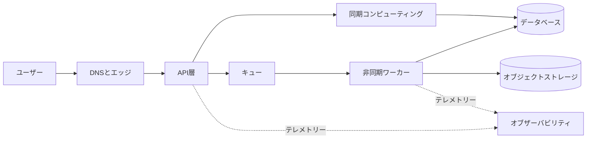



## 問題：サービスアイコンが多くても、優れたアーキテクチャとは限らない

クラウド設計の出発点はサービス一覧ではなく、業務上の成果と障害の許容範囲である。

次のようなアプローチは一見もっともらしいが、運用リスクを覆い隠す。

- すべての階層を無条件に複数のアベイラビリティーゾーンへ配置する。
- マネージドサービスだからという理由で、バックアップと復旧テストを省略する。
- サーバーレスだからという理由で、容量上限と同時実行数の制限を無視する。
- セキュリティグループだけを絞り、IAM権限とデータ経路は検討しない。
- 月間予想コストだけを計算し、トラフィック急増時のコストは測定しない。
- ダッシュボードは作るが、ユーザーへの成果を表す指標がない。

優れた設計は、次の問いに答えられなければならない。

1. どのユーザー成果を、どのレイテンシーと可用性で提供するのか？
2. 各コンポーネントは何に依存し、どの障害ドメインに属するのか？
3. データが失われたり破損したりした場合、どの時点まで、どのように復元するのか？
4. 正常であるという判断を、どのログ・メトリクス・トレース・合成監視で証明するのか？
5. セキュリティ・信頼性・パフォーマンス・コスト間の選択を誰が承認したのか？

AWS公式の[Well-Architected Framework](https://docs.aws.amazon.com/wellarchitected/latest/framework/welcome.html)は、運用上の優秀性、セキュリティ、信頼性、パフォーマンス効率、コスト最適化、持続可能性という6本の柱で、こうした選択を検討する。

## メンタルモデル：要件、境界、障害、証拠の4層

### 1. 要件は数値と条件で記述する

`高速なAPI`ではなく、次のように記録する。

- 通常負荷における応答時間の目標パーセンタイル
- 許容可能なエラー率と測定ウィンドウ
- 想定される平均・最大リクエスト率
- データ保持期間と地域要件
- 復旧時間目標であるRTO
- 目標復旧時点であるRPO
- 計画メンテナンスの許容範囲
- コスト上限と超過アラートの基準

数値は永遠に変わらない真理ではない。

当初は仮定として明示し、負荷テストと運用データに基づいて更新する。

### 2. まずシステム境界を描く

境界には、ユーザー、外部プロバイダー、DNS、エッジ、API、コンピューティング、キュー、データベース、オブジェクトストレージ、ID、オブザーバビリティが含まれる。

矢印ごとにプロトコル、認証主体、タイムアウト、リトライ、データ分類を記す。

この情報がなければ、ネットワーク図は運用文書ではなく装飾に近い。

### 3. 障害ドメインを分離する

リソース数と独立性は別の概念である。

- 同じアベイラビリティーゾーンの複数インスタンスは、ゾーン障害を共有する。
- 同じデプロイアーティファクトは、同一の欠陥を同時に再現し得る。
- 同じIAMロールは、権限設定ミスの影響をともに受ける。
- 同じデータベースプライマリに接続されたAPIレプリカは、データ層を共有する。
- 同じDNS・認証プロバイダー・クォータは、隠れた共通原因になる。

アベイラビリティーゾーンは重要な障害境界の一つだが、唯一の境界ではない。

リージョン間構成はより大きな障害に対応できる一方、データ整合性、レイテンシー、コスト、運用の複雑さが増す。

### 4. 証拠が設計を完成させる

設計文書には、少なくとも次の証拠が紐付けられていなければならない。

- IaCの変更履歴
- デプロイ結果とロールバック記録
- 負荷テスト結果
- 障害注入結果
- 復元訓練結果
- IAM分析とセキュリティ検知結果
- SLOとエラーバジェット
- コスト・使用量レポート
- ランブック実行記録

## ワークフロー：要件からデプロイ可能な構成へ

### ステップ1. ワークロードを一文で定義する

例：`認証済みユーザーのリクエストを受け、耐久性を確保して保存し、非同期処理の結果を照会できるようにする。`

機能を明確にすれば、不要なサービスは自然に除かれる。

### ステップ2. 同期経路と非同期経路を分ける

同期経路には、ユーザーが待つ必要のある処理だけを置く。

時間がかかる、またはリトライが必要な処理はキューの後段へ移す。

非同期へ切り替える際は、次の契約を追加する。

- 受付応答とジョブ識別子
- 冪等性キー
- 状態照会またはコールバック
- 最大処理時間
- リトライとデッドレター処理
- 重複消費に対して安全な保存方式

### ステップ3. ステートフルとステートレスを分離する

コンピューティングを交換可能にし、永続状態は目的に合ったストレージに置く。

選択基準はブランドではなくアクセスパターンである。

- キーベースの短時間照会か？
- リレーションとトランザクションが重要か？
- 大容量BLOBか？
- 連続したイベントを再生する必要があるか？
- 分析用のカラムスキャンか？
- 強い整合性がどの経路に必要か？

### ステップ4. ネットワークとIDを一緒に設計する

`private subnet`だけで安全になるわけではない。

各呼び出しの主体と許可するアクションをIAMポリシーで制限する。

インターネットへの接続が必要な対象と宛先を特定する。

シークレットをソースやイメージに含めず、マネージドシークレットストアとローテーション手順を使用する。

暗号化キーのポリシーと復旧権限もデータライフサイクルに含める。

### ステップ5. タイムアウト・リトライ・バックオフを最後まで整合させる

上位層のタイムアウトは、下位呼び出しのタイムアウトとリトライ時間の合計より長くなければならない。

すべての層が同じ回数だけリトライすると、リトライストームが発生する。

リトライは可能なら一つの層が担い、指数バックオフとジッターを使用する。

副作用のあるリクエストは、まず冪等性を確保する。

### ステップ6. 容量とクォータを検証する

平均負荷だけを基準に設計してはならない。

- ピークリクエスト率
- ペイロードサイズ
- 接続数
- キューバックログの増加率
- データベースの書き込み容量
- サーバーレスの同時実行数
- APIレート制限
- リージョンごとのサービスクォータ

オートスケーリングには応答遅延があるため、事前スケールアウトや予備容量が必要な場合がある。

### ステップ7. デプロイと変更の失敗を設計する

アーティファクトはイミュータブルに識別する。

データベースマイグレーションでは、旧バージョンと新バージョンが共存する期間を考慮する。

ヘルスチェックでは、プロセスの生存だけでなく、必須依存関係の準備状態も区別する。

カナリアまたはブルーグリーン切り替えには、自動停止の指標と手動承認ポイントを設ける。

### ステップ8. 復旧を実際に訓練する

バックアップ成功通知は、復旧可能性の証拠ではない。

隔離された環境に復元し、次を確認する。

- 想定した時点のデータが存在するか？
- アプリケーションが復元データを読み取れるか？
- キーとシークレットも復旧可能か？
- 実際のRTOとRPOが目標を満たすか？
- 復旧中に生成されたデータをどのように統合するか？

## 実践例：リクエスト受付と非同期処理

架空のファイル処理APIを考えてみよう。

1. エッジ層がTLSと基本的なリクエスト制限を担う。
2. APIは認証と入力検証を行う。
3. 元データはオブジェクトストレージへ条件付き書き込みで保存する。
4. メタデータのトランザクションとジョブイベントを一貫性を保って記録する。
5. ワーカーがキューからイベントを消費する。
6. 結果は別のキーにイミュータブルな形で保存する。
7. 状態遷移は条件付き更新で逆行を防ぐ。
8. ユーザーはジョブIDで状態を照会する。

ここで重要なのは、特定のサービス名ではない。

`受付済み`、`処理中`、`完了`、`失敗`の状態遷移と、それぞれの遷移の所有者が明確かどうかが核心である。

重複イベントが届いても、完了した結果を上書きしてはならない。

ワーカーのタイムアウト後も、実際には処理が継続していた可能性を考慮する。

オブザーバビリティには、相関ID、ジョブID、アーティファクトバージョン、試行番号を含める。

## 検証チェックリスト

### 要件

- [ ] ユーザー視点のSLIとSLOが定義されている。
- [ ] ピークと成長に関する仮定が記録されている。
- [ ] RTOとRPOがデータ種別ごとに定義されている。
- [ ] データの所在地・保持・削除要件が定義されている。
- [ ] コスト上限と責任者が定められている。

### アーキテクチャ

- [ ] コンポーネントと外部依存関係が一覧化されている。
- [ ] 同期呼び出しチェーンの最悪時レイテンシーを計算した。
- [ ] 各状態の信頼できる唯一の情報源が一つに定まっている。
- [ ] 共通の障害原因を特定した。
- [ ] 単一障害点を意図的に許容した箇所はADRに記録した。
- [ ] リージョン障害への要件が、実際の業務要件と一致している。

### セキュリティ

- [ ] 長期アクセスキーを最小限にした。
- [ ] ワークロードIDに最小権限を適用した。
- [ ] パブリック公開を意図したエンドポイントだけが存在する。
- [ ] 保存時・転送時の暗号化とキー権限を検討した。
- [ ] シークレットのローテーションと緊急アクセス手順をテストした。
- [ ] 監査ログの保持と検知ルールを確認した。

### 運用

- [ ] デプロイアーティファクトと設定を再現できる。
- [ ] ロールバックとロールフォワードの条件が定められている。
- [ ] クォータとスロットリングのアラートがある。
- [ ] キューの経過時間とバックログを監視している。
- [ ] 合成監視が中核となるユーザーフローを検証している。
- [ ] 復元訓練を定期的に実施している。
- [ ] ランブックに中止条件とエスカレーション経路がある。

## よくある失敗と限界

### `multi-AZ`をサービス全体の可用性と誤解する

コンピューティングだけを分散しても、データベース、ID、DNS、デプロイ、設定が共通原因ならサービスは停止する。

### マネージドサービスを無停止サービスと誤解する

マネージドサービスもクォータ、不適切なポリシー、クライアントタイムアウト、リージョン障害、ユーザーの操作ミスの影響を受ける。

### クロスリージョンを早すぎる段階で導入する

業務要件がないにもかかわらず導入すると、整合性モデルと運用負担が急激に増大する。

まず一つのリージョン内で、デプロイ・復旧・オブザーバビリティを検証する。

### コストを月末レポートだけで捉える

コストはアーキテクチャ上のシグナルである。

リクエスト単位・ジョブ単位・保存容量単位のコストを追跡して初めて、成長と異常を説明できる。

### あらゆるリスクを排除しようとする

リスクの排除にはコストと複雑さが伴う。

受容、軽減、移転、回避から選択し、根拠と再検討時期をADRに記録する。

## 公式参考資料

- [AWS Well-Architected Framework](https://docs.aws.amazon.com/wellarchitected/latest/framework/welcome.html)
- [AWS Well-Architected Frameworkの6本の柱](https://docs.aws.amazon.com/wellarchitected/latest/framework/the-pillars-of-the-framework.html)
- [AWS Reliability Pillar](https://docs.aws.amazon.com/wellarchitected/latest/reliability-pillar/welcome.html)
- [AWS Security Best Practices in IAM](https://docs.aws.amazon.com/IAM/latest/UserGuide/best-practices.html)
- [AWS Architecture Center](https://aws.amazon.com/architecture/)

## まとめ

AWSアーキテクチャの品質は、サービス数ではなく意思決定のトレーサビリティで判断すべきである。

要件を数値化し、障害ドメインを明らかにし、データとIDの境界を明示し、復旧とデプロイを繰り返し検証しよう。

アイコンより重要な成果物は、運用中も真であることを証明できる仮定と証拠である。
