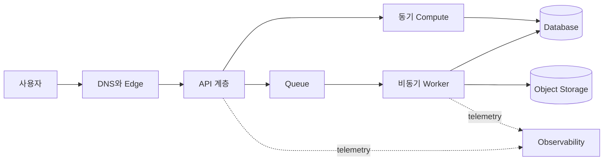



## 문제: 서비스 아이콘이 많다고 좋은 아키텍처는 아니다

클라우드 설계의 시작점은 서비스 목록이 아니라 업무 결과와 실패 허용 범위다.

다음과 같은 접근은 보기에는 그럴듯하지만 운영 위험을 숨긴다.

- 모든 계층을 무조건 다중 가용 영역으로 배치한다.
- 관리형 서비스라는 이유로 백업과 복구 시험을 생략한다.
- 서버리스라는 이유로 용량 한도와 동시성 제한을 무시한다.
- 보안 그룹만 좁히고 IAM 권한과 데이터 경로는 검토하지 않는다.
- 월 예상 비용만 계산하고 트래픽 급증 비용은 측정하지 않는다.
- 대시보드는 만들지만 사용자 결과를 나타내는 지표는 없다.

좋은 설계는 다음 질문에 답할 수 있어야 한다.

1. 어떤 사용자 결과를 어떤 지연 시간과 가용성으로 제공하는가?
2. 각 구성 요소는 무엇에 의존하며 어느 실패 도메인에 속하는가?
3. 데이터가 손실되거나 손상되면 어느 시점까지 어떻게 복원하는가?
4. 정상이라는 판단을 어떤 로그·지표·추적·합성 점검으로 증명하는가?
5. 보안·신뢰성·성능·비용 사이의 선택을 누가 승인했는가?

AWS의 공식 [Well-Architected Framework](https://docs.aws.amazon.com/wellarchitected/latest/framework/welcome.html)는 운영 우수성, 보안, 신뢰성, 성능 효율성, 비용 최적화, 지속 가능성의 여섯 축으로 이러한 선택을 검토한다.

## Mental model: 요구사항, 경계, 실패, 증거의 네 층

### 1. 요구사항은 수치와 조건으로 쓴다

`빠른 API` 대신 다음처럼 기록한다.

- 정상 부하에서 응답 시간의 목표 percentile
- 허용 가능한 오류율과 측정 창
- 예상 평균·최대 요청률
- 데이터 보존 기간과 지역 요건
- 복구 시간 목표인 RTO
- 복구 시점 목표인 RPO
- 계획된 유지보수의 허용 범위
- 비용 상한과 초과 경보 기준

숫자는 영구 불변 진리가 아니다.

처음에는 가정으로 표시하고 부하 시험과 운영 데이터로 갱신한다.

### 2. 시스템 경계를 먼저 그린다

경계에는 사용자, 외부 공급자, DNS, edge, API, compute, queue, database, object storage, identity, observability가 포함된다.

화살표마다 프로토콜, 인증 주체, timeout, retry, 데이터 분류를 적는다.

이 정보가 없으면 네트워크 그림은 운영 문서가 아니라 장식에 가깝다.

### 3. 실패 도메인을 분리한다

리소스 개수와 독립성은 다른 개념이다.

- 같은 가용 영역의 여러 instance는 영역 장애를 공유한다.
- 같은 배포 artifact는 동일 결함을 동시에 재현할 수 있다.
- 같은 IAM role은 권한 오설정의 영향을 함께 받는다.
- 같은 database primary에 연결된 API 복제본은 데이터 계층을 공유한다.
- 같은 DNS·인증 공급자·quota는 숨은 공통 원인이 된다.

Availability Zone은 하나의 중요한 실패 경계지만 유일한 경계는 아니다.

Region 간 구조는 더 큰 장애를 다루지만 데이터 정합성, 지연 시간, 비용, 운영 복잡성이 늘어난다.

### 4. 증거가 설계를 완성한다

설계 문서에는 최소한 다음 증거가 연결되어야 한다.

- IaC 변경 이력
- 배포 결과와 rollback 기록
- 부하 시험 결과
- 장애 주입 결과
- 복원 훈련 결과
- IAM 분석과 보안 탐지 결과
- SLO와 error budget
- 비용·사용량 보고서
- runbook 실행 기록

## Workflow: 요구사항에서 배포 가능한 구조로

### Step 1. workload를 한 문장으로 정의한다

예: `인증된 사용자의 요청을 받아 내구성 있게 저장하고 비동기 처리 결과를 조회하게 한다.`

기능을 명확히 하면 필요하지 않은 서비스가 자연스럽게 제거된다.

### Step 2. 동기 경로와 비동기 경로를 나눈다

동기 경로에는 사용자가 기다려야 할 일만 둔다.

오래 걸리거나 재시도가 필요한 작업은 queue 뒤로 이동한다.

비동기 전환 시 다음 계약을 추가한다.

- 접수 응답과 작업 식별자
- idempotency key
- 상태 조회 또는 callback
- 최대 처리 시간
- retry와 dead-letter 처리
- 중복 소비에 안전한 저장 방식

### Step 3. 상태와 무상태를 분리한다

compute를 교체 가능하게 만들고 내구 상태는 목적에 맞는 저장소에 둔다.

선택 기준은 브랜드가 아니라 접근 패턴이다.

- key 기반 짧은 조회인가?
- 관계와 transaction이 중요한가?
- 대형 blob인가?
- 순차 event를 재생해야 하는가?
- 분석용 column scan인가?
- 강한 일관성이 어느 경로에 필요한가?

### Step 4. 네트워크와 identity를 함께 설계한다

`private subnet`만으로 안전해지지 않는다.

각 호출의 주체와 허용 action을 IAM 정책으로 제한한다.

인터넷 진출이 필요한 대상과 목적지를 식별한다.

secret은 source와 image에 넣지 않고 관리형 secret store와 rotation 절차를 사용한다.

암호화 key 정책과 복구 권한도 데이터 수명주기에 포함한다.

### Step 5. timeout·retry·backoff를 끝까지 맞춘다

상위 계층 timeout은 하위 호출 timeout과 재시도 총합보다 커야 한다.

모든 계층이 같은 횟수로 재시도하면 retry storm이 생긴다.

재시도는 가능하면 한 계층이 책임지고 exponential backoff와 jitter를 쓴다.

부작용이 있는 요청은 idempotency를 먼저 확보한다.

### Step 6. 용량과 quota를 검증한다

평균 부하만으로 설계하지 않는다.

- peak request rate
- payload size
- connection 수
- queue backlog 증가율
- database write capacity
- serverless concurrency
- API rate limit
- region별 service quota

autoscaling은 반응 지연이 있으므로 사전 확장 또는 여유 용량이 필요할 수 있다.

### Step 7. 배포와 변경 실패를 설계한다

artifact는 immutable하게 식별한다.

database migration은 이전·새 버전의 공존 구간을 고려한다.

health check는 process 생존뿐 아니라 필수 dependency 준비 상태를 구분한다.

canary 또는 blue/green 전환은 자동 중단 지표와 수동 승인 지점을 가진다.

### Step 8. 복구를 실제로 연습한다

백업 성공 알림은 복구 가능성의 증거가 아니다.

격리된 환경에 복원하고 다음을 확인한다.

- 예상 시점의 데이터가 존재하는가?
- 애플리케이션이 복원본을 읽는가?
- key와 secret도 복구 가능한가?
- 실제 RTO와 RPO가 목표를 만족하는가?
- 복구 중 생성된 데이터는 어떻게 병합하는가?

## 실전 예제: 요청 접수와 비동기 처리

가상의 파일 처리 API를 생각해 보자.

1. edge 계층이 TLS와 기본적인 요청 제한을 담당한다.
2. API는 인증과 입력 검증을 수행한다.
3. 원본은 object storage에 조건부 쓰기로 저장한다.
4. metadata transaction과 작업 event를 일관되게 기록한다.
5. worker가 queue에서 event를 소비한다.
6. 결과는 별도 key에 immutable하게 저장한다.
7. 상태 전이는 조건부 갱신으로 역행을 막는다.
8. 사용자는 작업 ID로 상태를 조회한다.

여기서 중요한 것은 특정 서비스 이름이 아니다.

`접수됨`, `처리 중`, `완료`, `실패`의 상태 전이와 각 전이의 소유자가 명확한지가 핵심이다.

중복 event가 와도 완료 결과를 덮어쓰지 않아야 한다.

worker timeout 뒤 작업이 실제로 계속됐을 가능성도 고려한다.

관찰성에는 correlation ID, 작업 ID, artifact version, 시도 번호를 포함한다.

## 검증 Checklist

### 요구사항

- [ ] 사용자 관점 SLI와 SLO가 정의되어 있다.
- [ ] peak와 성장 가정이 기록되어 있다.
- [ ] RTO와 RPO가 데이터 종류별로 정의되어 있다.
- [ ] 데이터 위치·보존·삭제 요건이 정의되어 있다.
- [ ] 비용 상한과 소유자가 있다.

### 아키텍처

- [ ] 구성 요소와 외부 dependency가 목록화되어 있다.
- [ ] 동기 호출 chain의 최악 지연을 계산했다.
- [ ] 각 상태의 source of truth가 하나다.
- [ ] 공통 실패 원인을 식별했다.
- [ ] single point of failure를 의도적으로 수용한 곳은 ADR에 남겼다.
- [ ] region 장애 요구가 실제 업무 요구와 일치한다.

### 보안

- [ ] 장기 access key를 최소화했다.
- [ ] workload identity에 최소 권한을 적용했다.
- [ ] public exposure가 의도된 endpoint만 존재한다.
- [ ] 저장·전송 암호화와 key 권한을 검토했다.
- [ ] secret rotation과 비상 접근 절차를 시험했다.
- [ ] audit log 보존과 탐지 규칙을 확인했다.

### 운영

- [ ] 배포 artifact와 설정을 재현할 수 있다.
- [ ] rollback과 roll-forward 조건이 있다.
- [ ] quota와 throttling 경보가 있다.
- [ ] queue age와 backlog를 관찰한다.
- [ ] 합성 점검이 핵심 사용자 흐름을 검증한다.
- [ ] 복원 훈련을 정기적으로 수행한다.
- [ ] runbook에는 중단 조건과 escalation 경로가 있다.

## 자주 겪는 실패와 한계

### `multi-AZ`를 전체 서비스 가용성으로 오해한다

compute만 분산해도 database, identity, DNS, 배포, 설정이 공통 원인이면 서비스는 멈춘다.

### 관리형 서비스를 무중단 서비스로 오해한다

관리형 서비스도 quota, 잘못된 정책, client timeout, 지역 장애, 사용자 실수의 영향을 받는다.

### cross-region을 너무 일찍 도입한다

업무 요구가 없는데도 도입하면 일관성 모델과 운영 부담이 급격히 커진다.

먼저 한 region 안에서 배포·복구·관찰성을 검증한다.

### 비용을 월말 보고서로만 본다

비용은 아키텍처 신호다.

단위 요청·단위 작업·단위 저장량당 비용을 추적해야 성장과 이상을 설명할 수 있다.

### 모든 위험을 제거하려 한다

위험 제거에는 비용과 복잡성이 든다.

수용, 완화, 이전, 회피 중 선택하고 근거와 재검토 시점을 ADR에 남긴다.

## 공식 참고자료

- [AWS Well-Architected Framework](https://docs.aws.amazon.com/wellarchitected/latest/framework/welcome.html)
- [AWS Well-Architected Framework의 여섯 축](https://docs.aws.amazon.com/wellarchitected/latest/framework/the-pillars-of-the-framework.html)
- [AWS Reliability Pillar](https://docs.aws.amazon.com/wellarchitected/latest/reliability-pillar/welcome.html)
- [AWS Security Best Practices in IAM](https://docs.aws.amazon.com/IAM/latest/UserGuide/best-practices.html)
- [AWS Architecture Center](https://aws.amazon.com/architecture/)

## 마무리

AWS 아키텍처의 품질은 서비스 개수가 아니라 결정의 추적 가능성으로 판단해야 한다.

요구사항을 수치화하고, 실패 도메인을 드러내고, 데이터와 identity 경계를 명시하고, 복구와 배포를 반복 검증하자.

아이콘보다 중요한 산출물은 운영 중에도 참임을 증명할 수 있는 가정과 증거다.
