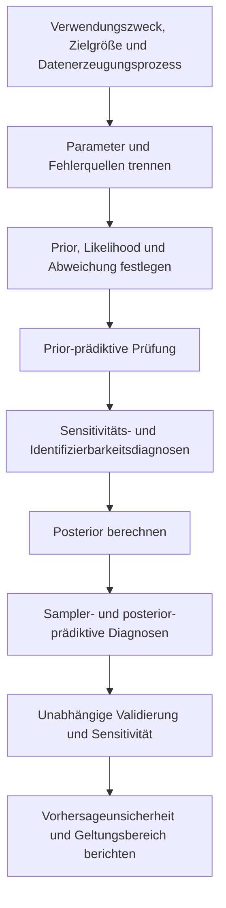



Kalibrierung bedeutet nicht lediglich, ein Modell „gut“ an die Daten anzupassen.
Da Beobachtungsfehler, Eingabeunsicherheit, Parameterunsicherheit und Fehler der Modellstruktur im selben Residuum vermischt sind, ist die Interpretation dessen, was geschätzt wurde, wichtiger als die reine Anpassungsgüte.

## 1. Grundstruktur der bayesianischen Kalibrierung

Für Beobachtungen (y), Eingaben (x) und ein Rechenmodell (eta(x,\theta)) lautet ein einfaches Modell

$$
y_i=\eta(x_i,\theta)+\epsilon_i,
\qquad
\epsilon_i\sim p(\epsilon\mid\phi)
$$

.

Mit dem Satz von Bayes ergibt sich die Posterior-Verteilung als

$$
p(\theta,\phi\mid y)
\propto
p(y\mid\theta,\phi)p(\theta,\phi)
$$

.

- Prior: plausible Parameterbereiche und Strukturen vor der Beobachtung der Daten
- Likelihood: Modell für die Entstehung der Beobachtungen und ihrer Fehler
- Posterior: Parameterunsicherheit aus der Verbindung von Prior und Likelihood
- Posterior-prädiktiv: Ergebnisunsicherheit unter neuen Bedingungen

## 2. Kalibrierung, Validierung und Vorhersage trennen

- Kalibrierung: unbekannte Parameter anhand von Daten schätzen
- Validierung: die Eignung eines Modells für seinen Zweck anhand unabhängiger Evidenz beurteilen
- Vorhersage: eine interessierende Größe unter unbeobachteten Bedingungen erschließen

Werden dieselben Daten zur Kalibrierung und Validierung verwendet, entsteht keine unabhängige Evidenz für die Vorhersageleistung.
Bei knappen Daten ist ihre Wiederverwendung offenzulegen und die Möglichkeit einer optimistischen Verzerrung anzuerkennen.

## 3. Der Prior ist eine Modellkomponente, die nicht verborgen werden darf

Ein Gleichverteilungsprior ist nicht automatisch uninformativ.
Seine Parametrisierung und sein Wertebereich können starke Annahmen auferlegen.

Zur Gestaltung des Priors gehören folgende Fragen.

- Welcher Wertebereich des Parameters ist physikalisch zulässig?
- Ist eine logarithmische Skala oder eine beschränkende Transformation natürlicher?
- Besteht zwischen Parametern eine Korrelationsstruktur?
- Ist hierarchisches Pooling erforderlich?
- Erzeugt die prior-prädiktive Verteilung physikalisch mögliche Ausgaben?

Ein positiver Parameter kann beispielsweise ausgedrückt werden als

$$
\theta=\exp(z),
\qquad z\sim\mathcal N(\mu,\sigma^2)
$$

.

## 4. Prior-prädiktive Prüfungen

Vor der Berechnung des Posteriors werden Stichproben erzeugt:

$$
\theta^{(s)}\sim p(\theta),
$$

$$
y^{(s)}\sim p(y\mid\theta^{(s)})
$$

.

Sind die Ausgaben physikalisch unmöglich oder übermäßig eng, können Prior oder Likelihood fehlspezifiziert sein.
Eine prior-prädiktive Prüfung ist eine Modellüberprüfung, die vor dem Abstimmen des MCMC-Verfahrens erfolgt.

## 5. Die Likelihood muss den tatsächlichen Messprozess abbilden

Unabhängige gaußsche Fehler sind bequem, aber keine automatische Wahl.

Anstelle von

$$
y_i\sim\mathcal N(\eta_i,\sigma^2)
$$

können folgende Strukturen erforderlich sein.

- Heteroskedastische Varianz
- Autokorrelation
- Zensierte oder abgeschnittene Beobachtungen
- Zähl-, binäre oder ordinale Ergebnisse
- Robustes Rauschen mit schweren Verteilungsschwänzen
- Zufällige Effekte auf Replikatebene
- Bekannte Messkovarianz

Die Likelihood muss Vorverarbeitung und Mittelung der Beobachtungen widerspiegeln.

## 6. Identifizierbarkeit

### Strukturelle Identifizierbarkeit

Erzeugen verschiedene Parameter selbst bei unendlich vielen rauschfreien Daten dieselbe Ausgabe, ist das Modell strukturell nicht identifizierbar.

$$
\eta(x,\theta_1)=\eta(x,\theta_2)
\quad\forall x
$$

fragt, ob ein Paar (\theta_1\ne\theta_2) mit dieser Eigenschaft existiert.

### Praktische Identifizierbarkeit

Auch wenn Parameter theoretisch unterscheidbar sind, kann über dem tatsächlichen Eingabebereich, Rauschniveau und Stichprobenumfang ein Grat in der Posterior-Verteilung verbleiben.

Anzeichen dafür sind:

- Starke posteriori Korrelation zwischen Parametern
- Marginale Posterior-Verteilungen, die übermäßig empfindlich auf den Prior reagieren
- Breite oder multimodale Posterior-Verteilungen
- Divergenzen des Samplers und langsame Mischung
- Flache Richtungen in der Profil-Likelihood

## 7. Sensitivität und Identifizierbarkeit sind nicht dasselbe

Selbst wenn die Ausgabe sensitiv auf Parameter reagiert, ist die Identifizierung jedes einzelnen Parameters schwierig, wenn mehrere Parameter sie in dieselbe Richtung beeinflussen.
Die lokale Sensitivitätsmatrix sei definiert als

$$
S_{ij}=\frac{\partial\eta(x_i,\theta)}{\partial\theta_j}
$$

Dann deutet Kollinearität zwischen ihren Spalten auf Konfundierung hin.
Kleine Eigenwerte der Fisher-Informationsnäherung

$$
I(\theta)=S^T\Sigma^{-1}S
$$

weisen auf schwach identifizierbare Richtungen hin.
Lokale Diagnosen allein reichen bei nichtlinearen, nicht normalverteilten Problemen nicht aus.

## 8. Modellabweichung

Die Realität sei (zeta(x)); die Abweichung (delta(x)) werde eingeführt als

$$
\zeta(x)=\eta(x,\theta)+\delta(x)
$$

.
Die Beobachtung lautet

$$
y(x)=\zeta(x)+\epsilon
$$

.

Wird die Abweichung weggelassen, können Parameter strukturelle Fehler aufnehmen und ihre physikalische Bedeutung verlieren.
Umgekehrt kann eine übermäßig flexible Abweichung jeden Parametereffekt absorbieren und die Kalibrierung nicht identifizierbar machen.

Diese Konfundierung verschwindet nicht zwangsläufig allein durch zusätzliche Daten.

## 9. Gestaltungsprinzipien für die Abweichung

- Ausgabeskala und Randbedingungen einhalten.
- Bekannte Invarianzen und Erhaltungssätze nicht verletzen.
- Keine Strukturen duplizieren, die Kalibrierungsparameter erklären sollen.
- Bei Extrapolation weder übermäßige Varianz noch unphysikalische Werte erzeugen.
- Größenordnung und Längenskala durch prior-prädiktive Simulation prüfen.
- Ergebnisse mit und ohne Abweichung als Sensitivitätsanalyse vergleichen.

Eine Gaußprozess-Abweichung ist flexibel, aber empfindlich gegenüber Kernel, Mittelwert und Kovarianz-Priors.
Eine strukturelle Basis oder eine physikinformierte Abweichung sind weitere Möglichkeiten.

## 10. Wann ein Emulator erforderlich ist

Ist das Rechenmodell teuer, wird ein Surrogat (hat\eta(x,\theta)) eingesetzt.
Der Posterior muss den Emulatorfehler einbeziehen.

$$
y=\hat\eta(x,\theta)
+\epsilon_{emu}+\delta(x)+\epsilon_{obs}.
$$

Wird die Emulatorunsicherheit ignoriert, kann der Posterior übermäßig eng werden.
Das Trainingsdesign muss sowohl den Parameterbereich, in dem der Posterior liegen wird, als auch den Vorhersagebereich abdecken.

## 11. Diagnosen für die Posterior-Berechnung

Bei MCMC ist Folgendes zu untersuchen.

- Mischung über mehrere Ketten
- Rangnormalisierte Konvergenzdiagnosen
- Effektive Stichprobengröße
- Warnungen vor Divergenz und Baumtiefe
- Energiediagnosen
- Autokorrelation
- Monte-Carlo-Standardfehler

Konvergenz darf nicht allein anhand der Akzeptanzrate erklärt werden.
Bei ungünstiger Geometrie sollten Umparametrisierung, Skalierung und nichtzentrierte Parametrisierung erwogen werden.

## 12. Posterior-prädiktive Prüfungen

Aus Posterior-Stichproben werden erzeugt:

$$
\theta^{(s)}\sim p(\theta\mid y),
$$

$$
y_{rep}^{(s)}\sim p(y\mid\theta^{(s)})
$$

und anschließend mit den Beobachtungen verglichen.

Vergleichsstatistiken sind passend zum Zweck zu wählen.

- Mittelwert und Varianz
- Verteilungsränder und Extremwerte
- Zeitliche Autokorrelation
- Räumliche Muster
- Schwellenwertüberschreitungen
- Streuung zwischen Replikaten

Der Gesamtmittelwert kann stimmen, während die lokale Struktur falsch bleibt.

## 13. Zerlegung der Vorhersageunsicherheit

Vorhersagen vereinen:

- Posteriori Parameterunsicherheit
- Aleatorische Beobachtungs- oder Prozessvariabilität
- Eingabeunsicherheit
- Emulatorunsicherheit
- Unsicherheit der Modellabweichung
- Szenario- oder Modellunsicherheit

Da jede Komponente womöglich nicht vollständig identifizierbar ist, muss darauf hingewiesen werden, dass die Zerlegung modellabhängig ist.
Für viele Entscheidungen ist die posterior-prädiktive Verteilung der interessierenden Größe wichtiger als die Posterior-Verteilung der Parameter.

## 14. Kalibrierungsablauf

## 15. Prüfcheckliste

- [ ] Kalibrierungs- und Validierungsdaten wurden getrennt.
- [ ] Physikalische Bedeutung und zulässiger Bereich jedes Parameters wurden angegeben.
- [ ] Die prior-prädiktive Verteilung erzeugt plausible Ausgaben.
- [ ] Die Likelihood berücksichtigt Wiederholungsmessungen, Korrelation und Heteroskedastizität.
- [ ] Strukturelle und praktische Identifizierbarkeit wurden beurteilt.
- [ ] Parameterkorrelationen und Grate wurden visualisiert.
- [ ] Rolle und Prior der Abweichung wurden erläutert.
- [ ] Emulatorfehler sind in Likelihood oder Hierarchie enthalten.
- [ ] Mehrere Ketten, ESS und Divergenzen wurden geprüft.
- [ ] Zweckrelevante Statistiken wurden posterior-prädiktiv geprüft.
- [ ] Die Sensitivität gegenüber Priors, Kernels und Abweichung wurde bewertet.
- [ ] Vorhersagebereich und Extrapolationsdistanz wurden angegeben.

## 16. Häufige Fehlermuster und Einschränkungen

### Aus einem engen Posterior auf gute Identifizierbarkeit schließen

Ein starker Prior oder eine weggelassene Abweichung kann ihn künstlich verengen.

### Jedes Residuum als Messrauschen behandeln

Residuen mit strukturellen Mustern deuten auf Modellabweichung oder eine ausgelassene Kovarianz hin.

### Parameter als physikalische Konstanten interpretieren

Nimmt ein Kalibrierungsparameter Modellfehler auf, kann er zu einem bedingungsabhängigen Abstimmknopf werden.

### Ein Modell nur anhand der Trainingsanpassung auswählen

Posterior-prädiktive Verteilung, zurückgehaltene Bedingungen und Extrapolationsverhalten sind zu untersuchen.

### Konvergenzdiagnosen mit einer einzigen Kennzahl bestehen

Multimodalität, Trichtergeometrien und schwache Identifizierbarkeit erfordern die gemeinsame Betrachtung von Verläufen und Geometrie.

## 17. Offizielle und primäre Referenzen

- Kennedy und O’Hagan, „Bayesian Calibration of Computer Models“, *Journal of the Royal Statistical Society B*, 2001.
- Gelman et al., *Bayesian Data Analysis*.
- Vehtari et al., „Rank-Normalization, Folding, and Localization: An Improved R-hat“, 2021.
- Stan, [Posterior-prädiktive Prüfungen und Diagnosen](https://mc-stan.org/docs/stan-users-guide/posterior-predictive-checks.html).
- NIST, [Ressourcen des Programms zur Unsicherheitsquantifizierung](https://www.nist.gov/programs-projects/uncertainty-quantification).

Ziel der bayesianischen Kalibrierung ist es nicht, Residuen nahe null zu zwingen.
Es besteht darin, **in der Vorhersageverteilung transparent abzubilden, welche Unsicherheiten unter welchen Annahmen reduziert wurden und was weiterhin nicht identifiziert ist**.
