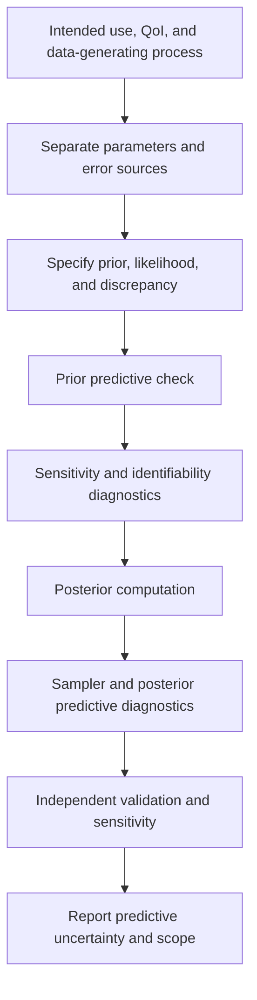



Calibration is not merely making a model fit the data “well.”
Because observation error, input uncertainty, parameter uncertainty, and model-structure error are mixed into the same residual, interpreting what has been estimated is more important.

## 1. Basic Structure of Bayesian Calibration

Given observations (y), inputs (x), and a computational model (eta(x,\theta)), a simple model is

$$
y_i=\eta(x_i,\theta)+\epsilon_i,
\qquad
\epsilon_i\sim p(\epsilon\mid\phi)
$$

.

Bayes' rule forms the posterior as

$$
p(\theta,\phi\mid y)
\propto
p(y\mid\theta,\phi)p(\theta,\phi)
$$

.

- Prior: plausible parameter ranges and structure before observing the data
- Likelihood: the observation-generation and error model
- Posterior: parameter uncertainty combining the prior and likelihood
- Posterior predictive: outcome uncertainty under new conditions

## 2. Separate Calibration, Validation, and Prediction

- Calibration: estimate unknown parameters from data
- Validation: evaluate a model's fitness for purpose using independent evidence
- Prediction: infer a quantity of interest under unobserved conditions

Using the same data for both calibration and validation does not provide independent evidence of predictive performance.
When data are scarce, state that they have been reused and acknowledge the possibility of optimistic bias.

## 3. The Prior Is a Model Component That Cannot Be Hidden

A uniform prior is not automatically uninformative.
Its parameterization and range can impose strong assumptions.

Questions for prior design include the following.

- What is the physically permissible range of the parameter?
- Is a log scale or constrained transform more natural?
- Is there a correlation structure among parameters?
- Is hierarchical pooling needed?
- Does the prior predictive generate physically possible outputs?

A positive parameter can, for example, be expressed as

$$
\theta=\exp(z),
\qquad z\sim\mathcal N(\mu,\sigma^2)
$$

.

## 4. Prior Predictive Checks

Before computing the posterior, generate

$$
\theta^{(s)}\sim p(\theta),
$$

$$
y^{(s)}\sim p(y\mid\theta^{(s)})
$$

.

If outputs are physically impossible or excessively narrow, the prior or likelihood may be misspecified.
A prior predictive check is a model review that comes before MCMC tuning.

## 5. The Likelihood Must Represent the Actual Measurement Process

Independent Gaussian error is convenient, but it is not an automatic choice.

Instead of

$$
y_i\sim\mathcal N(\eta_i,\sigma^2)
$$

the following structures may be required.

- Heteroscedastic variance
- Autocorrelation
- Censored or truncated observations
- Count, binary, or ordinal outcomes
- Robust heavy-tailed noise
- Replicate-level random effects
- Known measurement covariance

The likelihood must reflect observation preprocessing and averaging.

## 6. Identifiability

### Structural identifiability

If different parameters produce the same output even with infinite noise-free data, the model is structurally unidentifiable.

$$
\eta(x,\theta_1)=\eta(x,\theta_2)
\quad\forall x
$$

asks whether there is a pair (\theta_1\ne\theta_2) with this property.

### Practical identifiability

Even when parameters are distinguishable in theory, a posterior ridge may remain over the actual input range, noise level, and sample size.

Signs include the following.

- Strong posterior correlation between parameters
- Marginal posteriors that are excessively sensitive to the prior
- Wide or multimodal posteriors
- Sampler divergences and slow mixing
- Flat directions in the profile likelihood

## 7. Sensitivity and Identifiability Are Not the Same

Even when the output is sensitive to parameters, identifying each parameter is difficult if several parameters affect it in the same direction.
Define the local sensitivity matrix as

$$
S_{ij}=\frac{\partial\eta(x_i,\theta)}{\partial\theta_j}
$$

Then collinearity among its columns suggests confounding.
Small eigenvalues of the Fisher-information approximation

$$
I(\theta)=S^T\Sigma^{-1}S
$$

indicate weakly identifiable directions.
Local diagnostics alone are insufficient for nonlinear, non-normal problems.

## 8. Model Discrepancy

Let reality be (zeta(x)), and introduce discrepancy (delta(x)) as

$$
\zeta(x)=\eta(x,\theta)+\delta(x)
$$

.
The observation is

$$
y(x)=\zeta(x)+\epsilon
$$

.

If discrepancy is omitted, parameters may absorb structural error and lose their physical meaning.
Conversely, an overly flexible discrepancy can absorb every parameter effect and make calibration unidentifiable.

This confounding does not always disappear simply by collecting more data.

## 9. Discrepancy Design Principles

- Respect the output scale and boundary conditions.
- Do not violate known invariances and conservation laws.
- Do not duplicate structures that calibration parameters should explain.
- Do not produce excessive variance or nonphysical values during extrapolation.
- Check magnitude and length scale with prior predictive simulation.
- Compare results with and without discrepancy as a sensitivity analysis.

A Gaussian-process discrepancy is flexible but sensitive to its kernel, mean, and covariance priors.
A structural basis or physics-informed discrepancy is another option.

## 10. When an Emulator Is Needed

If the computational model is expensive, use a surrogate (hat\eta(x,\theta)).
The posterior must include surrogate error.

$$
y=\hat\eta(x,\theta)
+\epsilon_{emu}+\delta(x)+\epsilon_{obs}.
$$

Ignoring emulator uncertainty can make the posterior excessively narrow.
The training design must cover both the parameter region where the posterior will lie and the prediction domain.

## 11. Posterior Computation Diagnostics

For MCMC, inspect the following.

- Mixing across multiple chains
- Rank-normalized convergence diagnostics
- Effective sample size
- Divergence and tree-depth warnings
- Energy diagnostics
- Autocorrelation
- Monte Carlo standard error

Do not declare convergence based on acceptance rate alone.
When the geometry is poor, consider reparameterization, scaling, and non-centered parameterization.

## 12. Posterior Predictive Checks

Generate from posterior samples

$$
\theta^{(s)}\sim p(\theta\mid y),
$$

$$
y_{rep}^{(s)}\sim p(y\mid\theta^{(s)})
$$

and compare them with the observations.

Choose comparison statistics that fit the purpose.

- Mean and variance
- Tails and extremes
- Temporal autocorrelation
- Spatial patterns
- Threshold exceedance
- Replicate dispersion

The overall mean can match while local structure remains wrong.

## 13. Decomposing Predictive Uncertainty

Predictions combine the following.

- Posterior parameter uncertainty
- Aleatoric observation or process variability
- Input uncertainty
- Emulator uncertainty
- Discrepancy uncertainty
- Scenario or model uncertainty

Because each component may be difficult to identify completely, state that the decomposition is model-dependent.
For many decisions, the posterior predictive distribution of the QoI matters more than the parameter posterior.

## 14. Calibration Workflow

## 15. Verification Checklist

- [ ] Calibration and validation data have been separated.
- [ ] The physical meaning and permissible range of each parameter have been stated.
- [ ] The prior predictive produces plausible outputs.
- [ ] The likelihood reflects repeated measurements, correlation, and heteroscedasticity.
- [ ] Structural and practical identifiability have been evaluated.
- [ ] Parameter correlations and ridges have been visualized.
- [ ] The role and prior of the discrepancy have been explained.
- [ ] Emulator error is included in the likelihood or hierarchy.
- [ ] Multiple chains, ESS, and divergences have been checked.
- [ ] Purpose-relevant statistics have been checked with the posterior predictive.
- [ ] Sensitivity to priors, kernels, and discrepancy has been assessed.
- [ ] The prediction domain and extrapolation distance have been reported.

## 16. Common Failure Patterns and Limitations

### Concluding that identifiability is good because the posterior is narrow

A strong prior or omitted discrepancy may make it artificially narrow.

### Treating every residual as measurement noise

Residuals with structural patterns suggest model discrepancy or omitted covariance.

### Interpreting parameters as physical constants

When a calibration parameter absorbs model error, it can become a condition-dependent tuning knob.

### Selecting a model based only on training fit

Inspect the posterior predictive, held-out conditions, and extrapolation behavior.

### Passing convergence diagnostics with a single number

Multimodality, funnels, and weak identifiability require inspection of traces and geometry together.

## 17. Official and Primary References

- Kennedy and O’Hagan, “Bayesian Calibration of Computer Models,” *Journal of the Royal Statistical Society B*, 2001.
- Gelman et al., *Bayesian Data Analysis*.
- Vehtari et al., “Rank-Normalization, Folding, and Localization: An Improved R-hat,” 2021.
- Stan, [Posterior predictive checks and diagnostics](https://mc-stan.org/docs/stan-users-guide/posterior-predictive-checks.html).
- NIST, [Uncertainty Quantification program resources](https://www.nist.gov/programs-projects/uncertainty-quantification).

The goal of Bayesian calibration is not to drive residuals close to zero.
It is to **honestly preserve in the predictive distribution which uncertainties were reduced under which assumptions, and what remains unidentified**.
