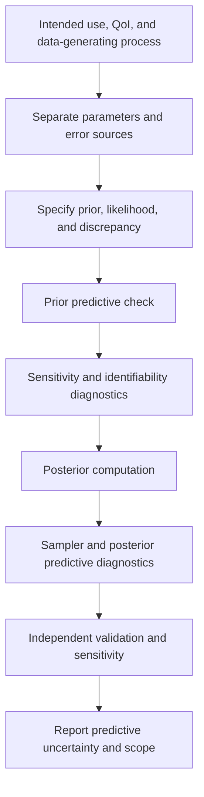



La calibración no es simplemente hacer que un modelo se ajuste “bien” a los datos.
Debido a que el error de observación, la incertidumbre de entrada, la incertidumbre de los parámetros y el error de la estructura del modelo se mezclan en el mismo residuo, interpretar lo que se ha estimado es más importante.

## 1. Estructura básica de la calibración bayesiana

Dadas las observaciones (y), las entradas (x) y un modelo computacional (eta(x,\theta)), un modelo simple es

$$
y_i=\eta(x_i,\theta)+\epsilon_i,
\qquad
\epsilon_i\sim p(\epsilon\mid\phi)
$$

.

La regla de Bayes forma la parte posterior como

$$
p(\theta,\phi\mid y)
\propto
p(y\mid\theta,\phi)p(\theta,\phi)
$$

.

- Previo: estructura y rangos de parámetros plausibles antes de observar los datos
- Probabilidad: el modelo de generación de observaciones y error.
- Posterior: incertidumbre del parámetro que combina el previo y la probabilidad.
- Predictivo posterior: incertidumbre del resultado bajo nuevas condiciones.

## 2. Calibración, validación y predicción por separado

- Calibración: estima parámetros desconocidos a partir de datos
- Validación: evaluar la idoneidad de un modelo para su propósito utilizando evidencia independiente.
- Predicción: inferir una cantidad de interés en condiciones no observadas

El uso de los mismos datos tanto para la calibración como para la validación no proporciona evidencia independiente del rendimiento predictivo.
Cuando los datos sean escasos, indique que se han reutilizado y reconozca la posibilidad de un sesgo optimista.

## 3. El prior es un componente del modelo que no se puede ocultar

Un prior uniforme no deja de ser automáticamente informativo.
Su parametrización y alcance pueden imponer suposiciones sólidas.

Las preguntas para el diseño previo incluyen las siguientes.

- ¿Cuál es el rango físicamente permitido del parámetro?
- ¿Es más natural una escala logarítmica o una transformación restringida?
- ¿Existe una estructura de correlación entre parámetros?
- ¿Se necesita una agrupación jerárquica?
- ¿El predictivo previo genera resultados físicamente posibles?

Un parámetro positivo puede, por ejemplo, expresarse como

$$
\theta=\exp(z),
\qquad z\sim\mathcal N(\mu,\sigma^2)
$$

.

## 4. Comprobaciones Predictivas Previas

Antes de calcular el posterior, genere

$$
\theta^{(s)}\sim p(\theta),
$$

$$
y^{(s)}\sim p(y\mid\theta^{(s)})
$$

.

Si los resultados son físicamente imposibles o excesivamente limitados, es posible que se especifique incorrectamente el valor previo o la probabilidad.
Una verificación predictiva previa es una revisión del modelo que se realiza antes del ajuste de MCMC.

## 5. La probabilidad debe representar el proceso de medición real

El error gaussiano independiente es conveniente, pero no es una elección automática.

En lugar de

$$
y_i\sim\mathcal N(\eta_i,\sigma^2)
$$

Es posible que se requieran las siguientes estructuras.

- Varianza heterocedástica
- Autocorrelación
- Observaciones censuradas o truncadas
- Resultados contables, binarios u ordinales
- Ruido robusto y pesado
- Efectos aleatorios de nivel de réplica
- Covarianza de medición conocida

La probabilidad debe reflejar el preprocesamiento y el promedio de las observaciones.

## 6. Identificabilidad

### Identificabilidad estructural

Si diferentes parámetros producen el mismo resultado incluso con infinitos datos libres de ruido, el modelo es estructuralmente inidentificable.

$$
\eta(x,\theta_1)=\eta(x,\theta_2)
\quad\forall x
$$

pregunta si hay un par (\theta_1\ne\theta_2) con esta propiedad.

### Identificabilidad práctica

Incluso cuando los parámetros son distinguibles en teoría, una cresta posterior puede permanecer sobre el rango de entrada, el nivel de ruido y el tamaño de muestra reales.

Los signos incluyen lo siguiente.

- Fuerte correlación posterior entre parámetros.
- Posteriores marginales que son excesivamente sensibles a los anteriores.
- Posteriores anchos o multimodales
- Divergencias del sampler y mezcla lenta.
- Direcciones planas en el perfil de probabilidad.

## 7. La sensibilidad y la identificabilidad no son lo mismo

Incluso cuando la salida es sensible a los parámetros, identificar cada parámetro es difícil si varios parámetros lo afectan en la misma dirección.
Defina la matriz de sensibilidad local como

$$
S_{ij}=\frac{\partial\eta(x_i,\theta)}{\partial\theta_j}
$$

Entonces la colinealidad entre sus columnas sugiere confusión.
Pequeños valores propios de la aproximación de información de Fisher

$$
I(\theta)=S^T\Sigma^{-1}S
$$

indican direcciones débilmente identificables.
Los diagnósticos locales por sí solos son insuficientes para problemas no lineales y anormales.

## 8. Discrepancia del modelo

Sea la realidad (zeta(x)), e introduzca la discrepancia (delta(x)) como

$$
\zeta(x)=\eta(x,\theta)+\delta(x)
$$

.
La observación es

$$
y(x)=\zeta(x)+\epsilon
$$

.

Si se omite la discrepancia, los parámetros pueden absorber errores estructurales y perder su significado físico.
Por el contrario, una discrepancia demasiado flexible puede absorber todos los efectos de los parámetros y hacer que la calibración sea inidentificable.

Esta confusión no siempre desaparece simplemente con recopilar más datos.

## 9. Principios de diseño de discrepancias

- Respetar la escala de salida y las condiciones límite.
- No violar invariancias conocidas y leyes de conservación.
- No duplicar estructuras que los parámetros de calibración deben explicar.
- No produzca variaciones excesivas ni valores no físicos durante la extrapolación.
- Comprobar magnitud y escala de longitud con simulación predictiva previa.
- Comparar resultados con y sin discrepancia a modo de análisis de sensibilidad.

Una discrepancia del proceso gaussiano es flexible pero sensible a sus antecedentes de núcleo, media y covarianza.
Otra opción es una base estructural o una discrepancia basada en la física.

## 10. Cuando se necesita un emulador

Si el modelo computacional es costoso, utilice un sustituto (hat\eta(x,\theta)).
La parte posterior debe incluir el error sustituto.

$$
y=\hat\eta(x,\theta)
+\epsilon_{emu}+\delta(x)+\epsilon_{obs}.
$$

Ignorar la incertidumbre del emulador puede hacer que la parte posterior sea excesivamente estrecha.
El diseño de entrenamiento debe cubrir tanto la región de parámetros donde se ubicará el posterior como el dominio de predicción.

## 11. Diagnóstico Computacional Posterior

Para MCMC, inspeccione lo siguiente.

- Mezcla en múltiples cadenas
- Diagnóstico de convergencia normalizado por rangos.
- Tamaño de muestra efectivo
- Advertencias de divergencia y profundidad de árbol.
- Diagnóstico energético
- Autocorrelación
- Error estándar de Montecarlo

No declare la convergencia basándose únicamente en la tasa de aceptación.
Cuando la geometría es deficiente, considere la reparametrización, el escalado y la parametrización no centrada.

## 12. Comprobaciones predictivas posteriores

Generar a partir de muestras posteriores.

$$
\theta^{(s)}\sim p(\theta\mid y),
$$

$$
y_{rep}^{(s)}\sim p(y\mid\theta^{(s)})
$$

y compararlos con las observaciones.

Elija estadísticas de comparación que se ajusten al propósito.

- Media y varianza
- Colas y extremos
- Autocorrelación Temporal
- Patrones espaciales
- Superación del umbral
- Dispersión replicada

La media general puede coincidir mientras la estructura local siga siendo incorrecta.

## 13. Descomponiendo la incertidumbre predictiva

Las predicciones combinan lo siguiente.

- Incertidumbre de parámetros posteriores
- Observación aleatoria o variabilidad del proceso.
- Incertidumbre de entrada
- Incertidumbre del emulador
- Incertidumbre de discrepancia
- Incertidumbre del escenario o modelo.

Debido a que cada componente puede ser difícil de identificar completamente, indique que la descomposición depende del modelo.
Para muchas decisiones, la distribución predictiva posterior de la QoI importa más que el parámetro posterior.

## 14. Flujo de trabajo de calibración

## 15. Lista de verificación de verificación

- [ ] Se han separado los datos de calibración y validación.
- [ ] Se ha indicado el significado físico y el rango permitido de cada parámetro.
- [] El predictivo previo produce resultados plausibles.
- [ ] La probabilidad refleja mediciones repetidas, correlación y heterocedasticidad.
- [ ] Se ha evaluado la identificabilidad estructural y práctica.
- [ ] Se han visualizado las correlaciones de parámetros y las crestas.
- [ ] Se ha explicado el papel y el origen de la discrepancia.
- [] El error del emulador está incluido en la probabilidad o jerarquía.
- [ ] Se han comprobado múltiples cadenas, ESS y divergencias.
- [ ] Las estadísticas relevantes para el propósito se han verificado con el predictivo posterior.
- [] Se ha evaluado la sensibilidad a antecedentes, núcleos y discrepancias.
- [ ] Se han informado el dominio de predicción y la distancia de extrapolación.

## 16. Patrones de fallas y limitaciones comunes

### Concluyendo que la identificabilidad es buena porque la parte posterior es estrecha

Una fuerte discrepancia previa u omitida puede hacerlo artificialmente estrecho.

### Tratar cada residuo como ruido de medición

Los residuos con patrones estructurales sugieren discrepancia en el modelo o covarianza omitida.

### Interpretación de parámetros como constantes físicas

Cuando un parámetro de calibración absorbe el error del modelo, puede convertirse en una perilla de ajuste dependiente de la condición.

### Seleccionar un modelo basado únicamente en el ajuste del entrenamiento

Inspeccione las condiciones predictivas posteriores, las condiciones retenidas y el comportamiento de extrapolación.

### Pasando diagnósticos de convergencia con un solo número

La multimodalidad, los embudos y la identificabilidad débil requieren una inspección conjunta de las trazas y la geometría.

## 17. Referencias oficiales y primarias

- Kennedy y O'Hagan, "Calibración bayesiana de modelos informáticos", *Revista de la Royal Statistical Society B*, 2001.
- Gelman et al., *Análisis de datos bayesianos*.
- Vehtari et al., “Normalización, plegado y localización de rangos: un R-hat mejorado”, 2021.
- Stan, [Controles y diagnósticos predictivos posteriores](https://mc-stan.org/docs/stan-users-guide/posterior-predictive-checks.html).
- NIST, [Recursos del programa de cuantificación de incertidumbre](https://www.nist.gov/programs-projects/uncertainty-quantification).

El objetivo de la calibración bayesiana no es acercar los residuos a cero.
Se trata de **preservar honestamente en la distribución predictiva qué incertidumbres se redujeron bajo qué supuestos y qué queda sin identificar**.
