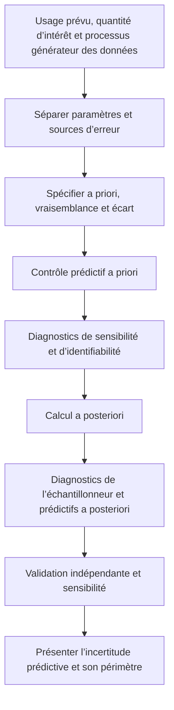



Étalonner ne consiste pas simplement à faire en sorte qu’un modèle s’ajuste « bien » aux données.
Comme l’erreur d’observation, l’incertitude des entrées, l’incertitude des paramètres et l’erreur de structure du modèle se mêlent dans le même résidu, il est plus important d’interpréter ce qui a été estimé.

## 1. Structure fondamentale de l’étalonnage bayésien

Étant donné des observations (y), des entrées (x) et un modèle de calcul (eta(x,\theta)), un modèle simple s’écrit

$$
y_i=\eta(x_i,\theta)+\epsilon_i,
\qquad
\epsilon_i\sim p(\epsilon\mid\phi)
$$

.

La règle de Bayes forme la distribution a posteriori comme suit :

$$
p(\theta,\phi\mid y)
\propto
p(y\mid\theta,\phi)p(\theta,\phi)
$$

.

- A priori : plages et structures plausibles des paramètres avant l’observation des données
- Vraisemblance : modèle de génération des observations et des erreurs
- A posteriori : incertitude sur les paramètres combinant a priori et vraisemblance
- Prédictive a posteriori : incertitude des résultats dans de nouvelles conditions

## 2. Séparer étalonnage, validation et prédiction

- Étalonnage : estimer les paramètres inconnus à partir des données
- Validation : évaluer l’aptitude d’un modèle à l’usage visé au moyen de preuves indépendantes
- Prédiction : inférer une quantité d’intérêt dans des conditions non observées

Utiliser les mêmes données pour l’étalonnage et la validation ne fournit aucune preuve indépendante des performances prédictives.
Lorsque les données sont rares, indiquez qu’elles ont été réutilisées et reconnaissez la possibilité d’un biais optimiste.

## 3. L’a priori est une composante du modèle qui ne peut pas être dissimulée

Un a priori uniforme n’est pas automatiquement non informatif.
Sa paramétrisation et son étendue peuvent imposer des hypothèses fortes.

La conception de l’a priori doit notamment répondre aux questions suivantes.

- Quelle est la plage physiquement admissible du paramètre ?
- Une échelle logarithmique ou une transformation contrainte est-elle plus naturelle ?
- Existe-t-il une structure de corrélation entre les paramètres ?
- Une mutualisation hiérarchique est-elle nécessaire ?
- La prédictive a priori génère-t-elle des sorties physiquement possibles ?

Un paramètre positif peut, par exemple, être exprimé comme suit :

$$
\theta=\exp(z),
\qquad z\sim\mathcal N(\mu,\sigma^2)
$$

.

## 4. Contrôles prédictifs a priori

Avant de calculer la distribution a posteriori, générez

$$
\theta^{(s)}\sim p(\theta),
$$

$$
y^{(s)}\sim p(y\mid\theta^{(s)})
$$

.

Si les sorties sont physiquement impossibles ou excessivement resserrées, l’a priori ou la vraisemblance est peut-être mal spécifié.
Un contrôle prédictif a priori est une revue du modèle qui précède le réglage de la méthode MCMC.

## 5. La vraisemblance doit représenter le processus de mesure réel

Une erreur gaussienne indépendante est pratique, mais ne constitue pas un choix automatique.

Au lieu de

$$
y_i\sim\mathcal N(\eta_i,\sigma^2)
$$

les structures suivantes peuvent être nécessaires.

- Variance hétéroscédastique
- Autocorrélation
- Observations censurées ou tronquées
- Résultats de comptage, binaires ou ordinaux
- Bruit robuste à queues lourdes
- Effets aléatoires au niveau des répétitions
- Covariance de mesure connue

La vraisemblance doit refléter le prétraitement et le moyennage des observations.

## 6. Identifiabilité

### Identifiabilité structurelle

Si des paramètres différents produisent la même sortie même avec une infinité de données sans bruit, le modèle n’est pas structurellement identifiable.

$$
\eta(x,\theta_1)=\eta(x,\theta_2)
\quad\forall x
$$

revient à rechercher s’il existe une paire (\theta_1\ne\theta_2) possédant cette propriété.

### Identifiabilité pratique

Même lorsque les paramètres sont distinguables en théorie, une crête peut subsister dans la distribution a posteriori pour la plage d’entrée, le niveau de bruit et la taille d’échantillon réels.

Les signes suivants permettent de la repérer.

- Forte corrélation a posteriori entre les paramètres
- Distributions marginales a posteriori excessivement sensibles à l’a priori
- Distributions a posteriori larges ou multimodales
- Divergences de l’échantillonneur et mélange lent
- Directions plates dans le profil de vraisemblance

## 7. Sensibilité et identifiabilité ne sont pas synonymes

Même lorsque la sortie est sensible aux paramètres, il est difficile d’identifier chaque paramètre si plusieurs d’entre eux agissent sur elle dans la même direction.
Définissons la matrice de sensibilité locale par

$$
S_{ij}=\frac{\partial\eta(x_i,\theta)}{\partial\theta_j}
$$

La colinéarité de ses colonnes indique alors une possible confusion.
De petites valeurs propres de l’approximation de l’information de Fisher

$$
I(\theta)=S^T\Sigma^{-1}S
$$

indiquent des directions faiblement identifiables.
Les seuls diagnostics locaux sont insuffisants pour les problèmes non linéaires et non normaux.

## 8. Écart du modèle

Notons la réalité (zeta(x)) et introduisons l’écart (delta(x)) comme suit :

$$
\zeta(x)=\eta(x,\theta)+\delta(x)
$$

.
L’observation est

$$
y(x)=\zeta(x)+\epsilon
$$

.

Si l’écart est omis, les paramètres peuvent absorber l’erreur structurelle et perdre leur signification physique.
À l’inverse, un écart trop souple peut absorber tous les effets des paramètres et rendre l’étalonnage non identifiable.

Cette confusion ne disparaît pas toujours par la simple collecte de données supplémentaires.

## 9. Principes de conception de l’écart

- Respectez l’échelle de sortie et les conditions aux limites.
- Ne violez pas les invariances et les lois de conservation connues.
- Ne reproduisez pas des structures que les paramètres d’étalonnage sont censés expliquer.
- Ne produisez pas une variance excessive ou des valeurs non physiques lors de l’extrapolation.
- Vérifiez l’amplitude et l’échelle de longueur par simulation prédictive a priori.
- Comparez les résultats avec et sans écart dans le cadre d’une analyse de sensibilité.

Un écart fondé sur un processus gaussien est souple, mais sensible à son noyau, à sa moyenne et aux a priori de covariance.
Une base structurelle ou un écart inspiré de la physique constitue une autre possibilité.

## 10. Quand un émulateur est nécessaire

Si le modèle de calcul est coûteux, utilisez un substitut (hat\eta(x,\theta)).
La distribution a posteriori doit inclure l’erreur du substitut.

$$
y=\hat\eta(x,\theta)
+\epsilon_{emu}+\delta(x)+\epsilon_{obs}.
$$

Ignorer l’incertitude de l’émulateur peut rendre la distribution a posteriori excessivement étroite.
Le plan d’entraînement doit couvrir à la fois la région des paramètres où se trouvera la distribution a posteriori et le domaine de prédiction.

## 11. Diagnostics du calcul a posteriori

Pour une méthode MCMC, examinez les éléments suivants.

- Mélange entre plusieurs chaînes
- Diagnostics de convergence normalisés par rang
- Taille effective de l’échantillon
- Avertissements de divergence et de profondeur d’arbre
- Diagnostics d’énergie
- Autocorrélation
- Erreur-type de Monte-Carlo

Ne concluez pas à la convergence sur la seule base du taux d’acceptation.
Lorsque la géométrie est mauvaise, envisagez une reparamétrisation, une mise à l’échelle et une paramétrisation non centrée.

## 12. Contrôles prédictifs a posteriori

À partir d’échantillons de la distribution a posteriori, générez

$$
\theta^{(s)}\sim p(\theta\mid y),
$$

$$
y_{rep}^{(s)}\sim p(y\mid\theta^{(s)})
$$

et comparez-les aux observations.

Choisissez des statistiques de comparaison adaptées à l’objectif.

- Moyenne et variance
- Queues et extrêmes
- Autocorrélation temporelle
- Motifs spatiaux
- Dépassement de seuil
- Dispersion des répétitions

La moyenne globale peut correspondre alors que la structure locale reste erronée.

## 13. Décomposer l’incertitude prédictive

Les prédictions combinent les éléments suivants.

- Incertitude a posteriori sur les paramètres
- Variabilité aléatoire des observations ou du processus
- Incertitude des entrées
- Incertitude de l’émulateur
- Incertitude de l’écart
- Incertitude du scénario ou du modèle

Comme chaque composante peut être difficile à identifier complètement, précisez que la décomposition dépend du modèle.
Pour de nombreuses décisions, la distribution prédictive a posteriori de la quantité d’intérêt importe davantage que la distribution a posteriori des paramètres.

## 14. Procédure d’étalonnage

## 15. Liste de contrôle

- [ ] Les données d’étalonnage et de validation ont été séparées.
- [ ] La signification physique et la plage admissible de chaque paramètre ont été indiquées.
- [ ] La prédictive a priori produit des sorties plausibles.
- [ ] La vraisemblance tient compte des mesures répétées, de la corrélation et de l’hétéroscédasticité.
- [ ] L’identifiabilité structurelle et pratique a été évaluée.
- [ ] Les corrélations entre paramètres et les crêtes ont été représentées.
- [ ] Le rôle et l’a priori de l’écart ont été expliqués.
- [ ] L’erreur de l’émulateur est incluse dans la vraisemblance ou la hiérarchie.
- [ ] Plusieurs chaînes, la taille effective de l’échantillon et les divergences ont été vérifiées.
- [ ] Les statistiques pertinentes pour l’objectif ont été contrôlées à l’aide de la prédictive a posteriori.
- [ ] La sensibilité aux a priori, aux noyaux et à l’écart a été évaluée.
- [ ] Le domaine de prédiction et la distance d’extrapolation ont été indiqués.

## 16. Échecs courants et limites

### Conclure que l’identifiabilité est bonne parce que la distribution a posteriori est étroite

Un a priori fort ou l’omission de l’écart peuvent la rétrécir artificiellement.

### Traiter chaque résidu comme du bruit de mesure

Des motifs structurels dans les résidus indiquent un écart du modèle ou une covariance omise.

### Interpréter les paramètres comme des constantes physiques

Lorsqu’un paramètre d’étalonnage absorbe l’erreur du modèle, il peut devenir un bouton de réglage dépendant des conditions.

### Sélectionner un modèle d’après son seul ajustement aux données d’entraînement

Examinez la prédictive a posteriori, les conditions mises de côté et le comportement en extrapolation.

### Résumer le diagnostic de convergence à un seul nombre

La multimodalité, les entonnoirs et la faible identifiabilité nécessitent d’examiner conjointement les traces et la géométrie.

## 17. Références officielles et primaires

- Kennedy and O’Hagan, “Bayesian Calibration of Computer Models,” *Journal of the Royal Statistical Society B*, 2001.
- Gelman et al., *Bayesian Data Analysis*.
- Vehtari et al., “Rank-Normalization, Folding, and Localization: An Improved R-hat,” 2021.
- Stan, [contrôles prédictifs a posteriori et diagnostics](https://mc-stan.org/docs/stan-users-guide/posterior-predictive-checks.html).
- NIST, [ressources du programme de quantification de l’incertitude](https://www.nist.gov/programs-projects/uncertainty-quantification).

L’objectif de l’étalonnage bayésien n’est pas de réduire les résidus au voisinage de zéro.
Il consiste à **préserver honnêtement, dans la distribution prédictive, quelles incertitudes ont été réduites selon quelles hypothèses, et ce qui reste non identifié**.
