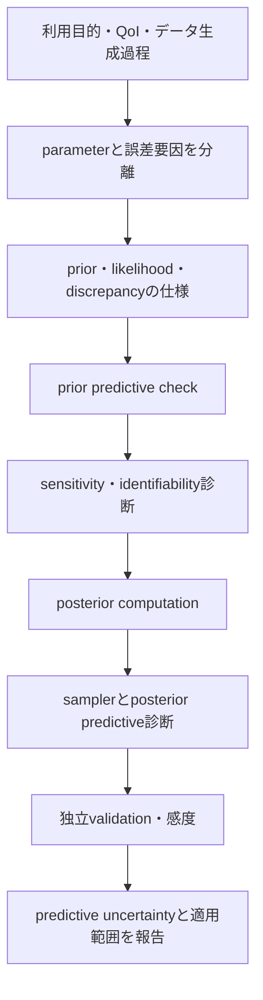



Calibrationは、モデルをデータに「よく適合」させることだけではない。
観測誤差、入力不確実性、parameter uncertainty、モデル構造誤差が同じresidualに混ざるため、何を推定したのかを解釈することのほうが重要である。

## 1. Bayesian calibrationの基本構造

観測 (y)、入力 (x)、計算モデル (eta(x,\theta)) を置くと、単純なモデルは

$$
y_i=\eta(x_i,\theta)+\epsilon_i,
\qquad
\epsilon_i\sim p(\epsilon\mid\phi)
$$

である。

Bayes則は

$$
p(\theta,\phi\mid y)
\propto
p(y\mid\theta,\phi)p(\theta,\phi)
$$

としてposteriorを作る。

- prior：データを見る前のplausibleなparameter範囲と構造
- likelihood：観測の生成・誤差モデル
- posterior：priorとlikelihoodを組み合わせたparameter不確実性
- posterior predictive：新しい条件におけるoutcome不確実性

## 2. Calibration、validation、predictionを分離する

- calibration：未知のparameterをデータから推定
- validation：独立した証拠で、モデルが目的に適合するかを評価
- prediction：観測されていない条件のQoIを推論

同じデータをcalibrationとvalidationの両方に使っても、独立した予測性能の証拠にはならない。
データが不足している場合は、再利用した事実と楽観的なバイアスの可能性を明示する。

## 3. Priorは隠すことのできないモデル構成要素である

priorはuniformであっても無情報ではない。
parameterizationと範囲によって強い仮定を生む。

prior設計で問うべきことは次のとおりである。

- parameterの物理的な許容範囲は何か？
- log scaleまたはconstrained transformのほうが自然か？
- parameter間に相関構造が存在するか？
- hierarchical poolingが必要か？
- prior predictiveは物理的に可能な出力を生成するか？

positive parameterは、たとえば

$$
\theta=\exp(z),
\qquad z\sim\mathcal N(\mu,\sigma^2)
$$

と表現できる。

## 4. Prior predictive check

posteriorを計算する前に

$$
\theta^{(s)}\sim p(\theta),
$$

$$
y^{(s)}\sim p(y\mid\theta^{(s)})
$$

を生成する。

出力が物理的に不可能、または狭すぎる場合、priorかlikelihoodの指定が誤っている可能性がある。
prior predictive checkはMCMC tuningに先立つモデル検討である。

## 5. Likelihoodは実際の測定過程を表現すべきである

独立したGaussian errorは便利だが、自動的に選ぶものではない。

$$
y_i\sim\mathcal N(\eta_i,\sigma^2)
$$

の代わりに、次の構造が必要な場合がある。

- heteroscedastic variance
- autocorrelation
- censoredまたはtruncated observation
- count、binary、ordinal outcome
- robust heavy-tailed noise
- replicate-level random effect
- known measurement covariance

観測の前処理とaveragingをlikelihoodに反映しなければならない。

## 6. 識別可能性

### Structural identifiability

noiseのない無限のデータでも、異なるparameterが同じ出力を作るなら、構造的に識別不可能である。

$$
\eta(x,\theta_1)=\eta(x,\theta_2)
\quad\forall x
$$

である (	heta_1\ne\theta_2) が存在するかを問う。

### Practical identifiability

理論上は区別できても、実際の入力範囲、noise、sample数ではposterior ridgeが残ることがある。

その兆候は次のとおりである。

- parameter間の強いposterior correlation
- priorに過度に敏感なmarginal posterior
- 広い、または多峰性のposterior
- sampler divergenceと遅いmixing
- profile likelihoodの平坦な方向

## 7. 感度と識別可能性は同じではない

出力がparameterに敏感でも、複数のparameterが同じ方向に影響すれば、個別の識別は難しい。
local sensitivity matrixを

$$
S_{ij}=\frac{\partial\eta(x_i,\theta)}{\partial\theta_j}
$$

とすると、列間の共線性はconfoundingを示唆する。
Fisher information近似

$$
I(\theta)=S^T\Sigma^{-1}S
$$

の小さなeigenvalueは、識別の弱い方向を表す。
非線形・非正規の問題では、local診断だけでは十分でない。

## 8. モデルdiscrepancy

現実を (zeta(x)) とし、

$$
\zeta(x)=\eta(x,\theta)+\delta(x)
$$

としてdiscrepancy (delta(x)) を導入できる。
観測は

$$
y(x)=\zeta(x)+\epsilon
$$

である。

discrepancyを省略すると、parameterが構造誤差を吸収して物理的意味を失う可能性がある。
反対に、柔軟すぎるdiscrepancyはparameter effectをすべて吸収し、calibrationを識別不可能にする。

このconfoundingは、単にデータ数を増やしても必ず解消するとは限らない。

## 9. Discrepancyの設計原則

- output scaleとboundary conditionを尊重する。
- known invarianceとconservationを破らない。
- calibration parameterが説明すべき構造と重複させない。
- extrapolationで過大な分散や非物理的な値を作らない。
- prior predictiveでmagnitudeとlength scaleを確認する。
- discrepancyを含む場合と含まない場合の結果をsensitivityとして比較する。

Gaussian process discrepancyは柔軟だが、kernel、mean、covariance priorに敏感である。
構造的basisまたはphysics-informed discrepancyも選択肢となる。

## 10. Emulatorが必要な場合

計算モデルが高コストであれば、surrogate (hat\eta(x,\theta)) を使用する。
posteriorにはsurrogate errorを含めなければならない。

$$
y=\hat\eta(x,\theta)
+\epsilon_{emu}+\delta(x)+\epsilon_{obs}.
$$

emulator uncertaintyを無視すると、posteriorが過度に狭くなる可能性がある。
training designは、posteriorが位置するparameter領域とprediction domainを覆わなければならない。

## 11. Posterior computationの診断

MCMCでは次を確認する。

- 複数chainのmixing
- rank-normalized convergence diagnostic
- effective sample size
- divergenceとtree-depthの警告
- energy diagnostic
- autocorrelation
- Monte Carlo standard error

acceptance rate一つだけで収束を宣言しない。
geometryが悪い場合は、reparameterization、scaling、non-centered parameterizationを検討する。

## 12. Posterior predictive check

posterior sampleから

$$
\theta^{(s)}\sim p(\theta\mid y),
$$

$$
y_{rep}^{(s)}\sim p(y\mid\theta^{(s)})
$$

を生成し、観測と比較する。

比較するstatisticは目的に合わせて選ぶ。

- 平均と分散
- tailとextreme
- temporal autocorrelation
- spatial pattern
- threshold exceedance
- replicate dispersion

全体の平均が合っていても、局所構造が誤っている場合がある。

## 13. 予測不確実性の分解

予測には次の要素が混在する。

- posterior parameter uncertainty
- aleatoric observation/process variability
- input uncertainty
- emulator uncertainty
- discrepancy uncertainty
- scenario/model uncertainty

各項を完全に識別するのは難しい場合があるため、分解がmodel-dependentであることを明記する。
意思決定に必要なのは、parameter posteriorよりもQoI posterior predictiveである場合が多い。

## 14. Calibrationワークフロー

## 15. 検証チェックリスト

- [ ] calibrationデータとvalidationデータを区別した。
- [ ] parameterの物理的意味と許容範囲を記述した。
- [ ] prior predictiveがplausibleなoutputを生成する。
- [ ] likelihoodが反復測定・相関・不均一分散を反映している。
- [ ] 構造的・実用的な識別可能性を評価した。
- [ ] parameter correlationとridgeを可視化した。
- [ ] discrepancyの役割とpriorを説明した。
- [ ] emulator errorをlikelihoodまたは階層に含めた。
- [ ] 複数のchainとESS・divergenceを確認した。
- [ ] posterior predictiveで目的に関係するstatisticを検査した。
- [ ] prior・kernel・discrepancyのsensitivityを調べた。
- [ ] prediction domainとextrapolation距離を報告した。

## 16. よくある失敗パターンと限界

### posteriorが狭ければ識別がうまくできたと判断する

強いpriorや欠落したdiscrepancyによって人為的に狭くなっている場合がある。

### residualをすべてmeasurement noiseとして扱う

構造的パターンを持つresidualは、model discrepancyまたは欠落したcovarianceを示唆する。

### parameterを物理定数のように解釈する

calibration parameterがmodel errorを吸収すると、条件依存のtuning knobになることがある。

### train fitだけを見てモデルを選ぶ

posterior predictive、held-out condition、extrapolation behaviorを確認すべきである。

### convergence diagnosticを単一の数値だけで合格とする

多峰性、funnel、weak identifiabilityについては、traceとgeometryを併せて確認しなければならない。

## 17. 公式・原典参考資料

- Kennedy and O’Hagan, “Bayesian Calibration of Computer Models,” *Journal of the Royal Statistical Society B*, 2001.
- Gelman et al., *Bayesian Data Analysis*.
- Vehtari et al., “Rank-Normalization, Folding, and Localization: An Improved R-hat,” 2021.
- Stan, [Posterior predictive checks and diagnostics](https://mc-stan.org/docs/stan-users-guide/posterior-predictive-checks.html).
- NIST, [Uncertainty Quantification program resources](https://www.nist.gov/programs-projects/uncertainty-quantification).

Bayesian calibrationの目標は、residualを0に近づけることではない。
**どの不確実性がどの仮定の下で減少し、何が依然として識別されていないのかを、予測分布に正直に残すこと**である。
