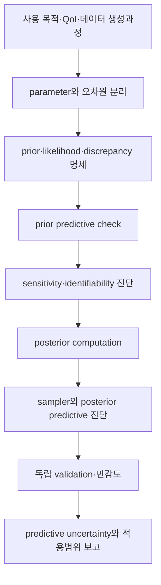



Calibration은 모델을 데이터에 “잘 맞게” 만드는 것만이 아니다.
관측 오차, 입력 불확실성, parameter uncertainty, 모델 구조 오차가 같은 residual에 섞이기 때문에 무엇을 추정했는지 해석하는 일이 더 중요하다.

## 1. Bayesian calibration의 기본 구조

관측 (y), 입력 (x), 계산모델 (eta(x,\theta))를 두면 단순 모형은

$$
y_i=\eta(x_i,\theta)+\epsilon_i,
\qquad
\epsilon_i\sim p(\epsilon\mid\phi)
$$

이다.

Bayes 규칙은

$$
p(\theta,\phi\mid y)
\propto
p(y\mid\theta,\phi)p(\theta,\phi)
$$

로 posterior를 만든다.

- prior: 데이터를 보기 전 plausible parameter 범위와 구조
- likelihood: 관측 생성·오차 모형
- posterior: prior와 likelihood를 결합한 parameter 불확실성
- posterior predictive: 새 조건에서 outcome 불확실성

## 2. Calibration, validation, prediction을 분리한다

- calibration: 미지 parameter를 데이터로 추정
- validation: 독립 증거로 모델의 목적 적합성을 평가
- prediction: 관측되지 않은 조건의 QoI를 추론

같은 데이터를 calibration과 validation 양쪽에 쓰면 독립적인 예측 성능 증거가 아니다.
데이터가 부족하면 재사용 사실과 낙관적 편향 가능성을 명시한다.

## 3. Prior는 숨길 수 없는 모델 구성요소다

prior는 uniform이라고 해서 무정보가 아니다.
parameterization과 범위에 따라 강한 가정을 만든다.

prior 설계 질문은 다음과 같다.

- parameter의 물리적 허용범위는 무엇인가?
- log scale 또는 constrained transform이 더 자연스러운가?
- parameter 사이 상관 구조가 존재하는가?
- hierarchical pooling이 필요한가?
- prior predictive가 물리적으로 가능한 출력을 생성하는가?

positive parameter는 예를 들어

$$
\theta=\exp(z),
\qquad z\sim\mathcal N(\mu,\sigma^2)
$$

로 표현할 수 있다.

## 4. Prior predictive check

posterior를 계산하기 전에

$$
\theta^{(s)}\sim p(\theta),
$$

$$
y^{(s)}\sim p(y\mid\theta^{(s)})
$$

를 생성한다.

출력이 물리적으로 불가능하거나 지나치게 좁다면 prior 또는 likelihood가 잘못 지정되었을 수 있다.
prior predictive check는 MCMC tuning보다 앞선 모델 검토다.

## 5. Likelihood가 실제 측정과정을 표현해야 한다

독립 Gaussian error는 편리하지만 자동 선택이 아니다.

$$
y_i\sim\mathcal N(\eta_i,\sigma^2)
$$

대신 다음 구조가 필요할 수 있다.

- heteroscedastic variance
- autocorrelation
- censored 또는 truncated observation
- count, binary, ordinal outcome
- robust heavy-tailed noise
- replicate-level random effect
- known measurement covariance

관측 전처리와 averaging을 likelihood가 반영해야 한다.

## 6. 식별가능성

### Structural identifiability

noise 없는 무한 데이터에서도 서로 다른 parameter가 같은 출력을 만들면 구조적으로 식별 불가능하다.

$$
\eta(x,\theta_1)=\eta(x,\theta_2)
\quad\forall x
$$

인 (	heta_1\ne\theta_2)가 존재하는지 묻는다.

### Practical identifiability

이론적으로 구분 가능해도 실제 입력 범위, noise, sample 수에서는 posterior ridge가 남을 수 있다.

징후는 다음과 같다.

- parameter 간 강한 posterior correlation
- prior에 지나치게 민감한 marginal posterior
- 넓거나 다봉인 posterior
- sampler divergence와 느린 mixing
- profile likelihood의 평평한 방향

## 7. 민감도와 식별가능성은 같지 않다

출력이 parameter에 민감해도 여러 parameter가 같은 방향으로 영향을 주면 개별 식별은 어렵다.
local sensitivity matrix를

$$
S_{ij}=\frac{\partial\eta(x_i,\theta)}{\partial\theta_j}
$$

라 하면 열 사이 공선성은 confounding을 시사한다.
Fisher information 근사

$$
I(\theta)=S^T\Sigma^{-1}S
$$

의 작은 eigenvalue는 약한 식별 방향을 나타낸다.
비선형·비정규 문제에서는 local 진단만으로 충분하지 않다.

## 8. 모델 discrepancy

현실을 (zeta(x))라 하고

$$
\zeta(x)=\eta(x,\theta)+\delta(x)
$$

로 discrepancy (delta(x))를 도입할 수 있다.
관측은

$$
y(x)=\zeta(x)+\epsilon
$$

이다.

discrepancy를 생략하면 parameter가 구조 오차를 흡수해 물리적 의미를 잃을 수 있다.
반대로 지나치게 유연한 discrepancy는 parameter effect를 모두 흡수해 calibration을 식별 불가능하게 만든다.

이 confounding은 단순히 데이터 수를 늘린다고 항상 사라지지 않는다.

## 9. Discrepancy 설계 원칙

- output scale과 boundary condition을 존중한다.
- known invariance와 conservation을 깨지 않는다.
- calibration parameter가 설명해야 할 구조를 중복하지 않는다.
- extrapolation에서 과도한 분산 또는 비물리 값을 만들지 않는다.
- prior predictive로 magnitude와 length scale을 확인한다.
- discrepancy 포함/제외 결과를 sensitivity로 비교한다.

Gaussian process discrepancy는 유연하지만 kernel, mean, covariance prior에 민감하다.
구조적 basis 또는 physics-informed discrepancy도 선택지다.

## 10. Emulator가 필요한 경우

계산모델이 비싸면 surrogate (hat\eta(x,\theta))를 사용한다.
posterior는 surrogate error를 포함해야 한다.

$$
y=\hat\eta(x,\theta)
+\epsilon_{emu}+\delta(x)+\epsilon_{obs}.
$$

emulator uncertainty를 무시하면 posterior가 과도하게 좁아질 수 있다.
training design은 posterior가 위치할 parameter 영역과 prediction domain을 덮어야 한다.

## 11. Posterior computation 진단

MCMC에서는 다음을 본다.

- 여러 chain의 mixing
- rank-normalized convergence diagnostic
- effective sample size
- divergence와 tree-depth 경고
- energy diagnostic
- autocorrelation
- Monte Carlo standard error

acceptance rate 하나만으로 수렴을 선언하지 않는다.
geometry가 나쁘면 reparameterization, scaling, non-centered parameterization을 검토한다.

## 12. Posterior predictive check

posterior sample에서

$$
\theta^{(s)}\sim p(\theta\mid y),
$$

$$
y_{rep}^{(s)}\sim p(y\mid\theta^{(s)})
$$

를 생성해 관측과 비교한다.

비교 statistic은 목적에 맞게 고른다.

- 평균과 분산
- tail와 extreme
- temporal autocorrelation
- spatial pattern
- threshold exceedance
- replicate dispersion

전체 평균만 맞고 국소 구조가 틀릴 수 있다.

## 13. 예측 불확실성 분해

예측에는 다음이 섞인다.

- posterior parameter uncertainty
- aleatoric observation/process variability
- input uncertainty
- emulator uncertainty
- discrepancy uncertainty
- scenario/model uncertainty

각 항을 완전히 식별하기 어려울 수 있으므로 분해가 model-dependent임을 밝힌다.
결정에 필요한 것은 parameter posterior보다 QoI posterior predictive인 경우가 많다.

## 14. Calibration 워크플로

## 15. 검증 체크리스트

- [ ] calibration과 validation 데이터를 구분했다.
- [ ] parameter의 물리적 의미와 허용범위를 적었다.
- [ ] prior predictive가 plausible output을 만든다.
- [ ] likelihood가 반복측정·상관·이분산을 반영한다.
- [ ] 구조적·실용적 식별가능성을 평가했다.
- [ ] parameter correlation과 ridge를 시각화했다.
- [ ] discrepancy의 역할과 prior를 설명했다.
- [ ] emulator error를 likelihood 또는 계층에 포함했다.
- [ ] 여러 chain과 ESS·divergence를 확인했다.
- [ ] posterior predictive로 목적 관련 statistic을 검사했다.
- [ ] prior·kernel·discrepancy sensitivity를 수행했다.
- [ ] prediction domain과 extrapolation 거리를 보고했다.

## 16. 자주 실패하는 패턴과 한계

### posterior가 좁으면 식별이 잘 됐다고 판단

강한 prior나 누락된 discrepancy 때문에 인위적으로 좁을 수 있다.

### residual을 모두 measurement noise로 처리

구조적 패턴이 있는 residual은 model discrepancy나 누락된 covariance를 시사한다.

### parameter를 물리 상수처럼 해석

calibration parameter가 model error를 흡수하면 조건 의존적인 tuning knob가 될 수 있다.

### train fit만 보고 모델 선택

posterior predictive와 held-out condition, extrapolation behavior를 봐야 한다.

### convergence diagnostic을 단일 숫자로 통과

다봉성, funnel, weak identifiability는 trace와 geometry를 함께 봐야 한다.

## 17. 공식·원전 참고자료

- Kennedy and O’Hagan, “Bayesian Calibration of Computer Models,” *Journal of the Royal Statistical Society B*, 2001.
- Gelman et al., *Bayesian Data Analysis*.
- Vehtari et al., “Rank-Normalization, Folding, and Localization: An Improved R-hat,” 2021.
- Stan, [Posterior predictive checks and diagnostics](https://mc-stan.org/docs/stan-users-guide/posterior-predictive-checks.html).
- NIST, [Uncertainty Quantification program resources](https://www.nist.gov/programs-projects/uncertainty-quantification).

Bayesian calibration의 목표는 residual을 0에 가깝게 만드는 것이 아니다.
**어떤 불확실성이 어떤 가정 아래 줄었고, 무엇이 여전히 식별되지 않는지를 예측 분포에 정직하게 남기는 것**이다.
