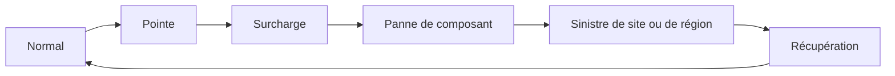



## Problème : la réussite d'une sauvegarde et la possibilité de récupérer sont deux affirmations différentes

Mesurer les performances uniquement quand le service fonctionne normalement ne dit rien de son comportement pendant une panne.

Le statut vert d'une tâche de sauvegarde ne permet pas de savoir si une restauration est réellement possible.

Les risques suivants restent souvent cachés.

- La charge moyenne est faible, mais une brève pointe submerge la file d'attente.
- Le SLO de latence est dépassé avant le démarrage de l'autoscaling.
- Les nouvelles tentatives créent une charge supérieure au trafic initial.
- Après un basculement, les zones restantes n'ont pas une capacité suffisante.
- Une sauvegarde existe, mais sa clé de chiffrement et sa configuration IAM ne peuvent pas être récupérées.
- La base de données a été restaurée, mais son schéma ne correspond pas à celui de l'application.
- Le runbook de reprise après sinistre n'existe que dans la mémoire d'une personne.

La résilience ne se mesure pas au nombre de réplicas, mais à la preuve que les fonctions et les données ont été rétablies dans le délai autorisé après une panne.

## Modèle mental : charge normale, surcharge, panne et sinistre forment un continuum

### La capacité n'est pas un chiffre unique associé à une seule ressource

Le débit de bout en bout est limité par la première contrainte qui arrive à saturation.

- CPU
- Mémoire
- Pool de connexions
- Thread ou worker
- Bande passante réseau
- IOPS et débit du stockage
- Partition de file d'attente
- Verrou de base de données
- Quota d'API externe

### Utiliser la loi de Little pour comprendre intuitivement les files d'attente

En régime stable, le nombre moyen de tâches simultanées $L$, le taux d'arrivée $\lambda$ et le temps de séjour moyen $W$ sont liés comme suit.

$$
L = \lambda W
$$

Si le taux d'arrivée reste longtemps supérieur au taux de traitement, l'arriéré continue de croître.

Même avec l'autoscaling, il faut calculer la quantité qui s'accumule pendant le délai d'extension.

### Distinguer RTO et RPO

- **RTO** : durée maximale autorisée pour rétablir le service après une panne
- **RPO** : fenêtre temporelle de perte de données acceptable lors de la récupération

Ils peuvent différer selon les jeux de données et les fonctions.

Exiger un RPO nul et un RTO immédiat pour tous les systèmes fait exploser les coûts et la complexité.

## Workflow : établir une référence de capacité

### Étape 1. Consigner le modèle de charge de travail

- Proportion de chaque type de requête
- Distribution de la taille des payloads
- Rapport lecture/écriture
- Taux de succès du cache
- Temps de réflexion de l'utilisateur
- Chevauchement du trafic batch et interactif
- Latence des dépendances externes
- Croissance et saisonnalité

Un test qui répète le comportement d'un utilisateur moyen ne reproduit pas l'asymétrie du trafic réel.

### Étape 2. Choisir des SLI représentatifs

- Débit
- Percentiles de latence
- Taux d'erreur
- Âge de la file d'attente
- Saturation
- Nombre de transactions métier réussies
- Exactitude des données

La latence moyenne masque les problèmes de traîne ; il faut donc examiner les percentiles.

Pour éviter l'omission coordonnée, vérifier aussi que le générateur de charge ne cesse pas de produire de nouvelles requêtes à cause de réponses lentes.

### Étape 3. Séparer les tests de référence et les tests de limite

Le test de référence examine la stabilité sous la charge cible normale.

Le test de stress recherche le point d'inflexion et les modes de défaillance.

Le test de pointe examine les brusques rafales.

Le test d'endurance recherche les fuites et les problèmes cumulatifs.

Le test au point de rupture recherche les limites dans un environnement isolé et sûr.

### Étape 4. Vérifier la boucle d'autoscaling

Additionner le délai de collecte des métriques, la fenêtre d'évaluation, le temps de provisionnement et le temps de préchauffage.

Vérifier que le déclencheur d'extension n'intervient pas trop tard par rapport au SLO utilisateur.

Lors de la réduction, examiner le drainage des connexions et la perte de cache.

Aligner le nombre maximal d'instances sur la capacité des systèmes en aval.

### Étape 5. Mettre en place un contrôle d'admission

Refuser explicitement les requêtes que le système ne peut pas traiter peut faciliter la récupération davantage que leur placement dans une file sans limite.

Utiliser des quotas par tenant, des limites de concurrence, des files bornées, des échéances et des priorités.

Préserver le trafic critique.

Attribuer un budget distinct aux nouvelles tentatives.

## Workflow : concevoir la résilience et la reprise après sinistre

### Étape 6. Inventorier les modes de défaillance

- Crash d'un processus
- Perte d'un nœud
- Perte d'une zone
- Timeout d'une dépendance
- Panne DNS ou d'identité
- Corruption de données
- Suppression accidentelle
- Compromission d'identifiants
- Perte d'une région ou d'un site
- Erreur d'un opérateur

Pour chaque mode, désigner un responsable de la détection, de l'endiguement, de la récupération et de la vérification.

### Étape 7. Vérifier l'indépendance de la redondance

Plusieurs réplicas peuvent partager la même zone, le même compte, les mêmes identifiants, le même déploiement ou la même configuration.

Indiquer les causes communes sur la carte d'architecture.

Vérifier régulièrement que le trafic réel peut être envoyé vers la cible de basculement.

Un standby inactif est exposé à la dérive des correctifs et de la configuration.

### Étape 8. Choisir les types de sauvegarde et la conservation

- Complète, incrémentale et différentielle
- Snapshot et dump logique
- Journal de transactions ou récupération à un instant donné
- Sauvegarde cohérente avec l'application
- Copie immuable ou protégée en écriture
- Copie intercompte ou hors site

La règle 3-2-1 constitue un bon point de départ, mais doit être adaptée au modèle de menace et aux exigences réglementaires.

La sauvegarde elle-même doit être isolée des rançongiciels et de la compromission des identifiants.

### Étape 9. Conserver également les dépendances nécessaires à la récupération

Les seules données ne permettent pas de restaurer une application.

- IaC et images
- Migrations de schéma
- Configuration
- Clés de chiffrement et certificats
- Amorçage IAM
- DNS et contrôle du domaine
- Observabilité
- Runbooks et contacts
- Informations de licence ou d'intégration externe

Concevoir un système de gestion récupérable sans placer directement les octets des secrets dans les documents.

### Étape 10. Tester la restauration dans un environnement isolé

1. Choisir un point de récupération précis.
2. Créer l'infrastructure dans un compte ou un namespace propre.
3. Amorcer les clés et les autorisations.
4. Restaurer la sauvegarde.
5. Aligner les versions du schéma et de l'application.
6. Vérifier l'intégrité et les invariants métier.
7. Exécuter une transaction synthétique.
8. Consigner les RTO et RPO réels.
9. Nettoyer en sécurité l'environnement temporaire et les copies sensibles.

### Étape 11. Distinguer le basculement du retour arrière

Le retour vers le site d'origine après un basculement réussi présente ses propres risques.

Décider comment fusionner les écritures produites des deux côtés.

Un fencing et un transfert d'autorité sont nécessaires pour éviter le split-brain.

Le TTL DNS, les caches clients et la réutilisation des connexions peuvent empêcher le transfert immédiat de tout le trafic.

### Étape 12. Définir les priorités de récupération par niveau de service

Ne pas essayer de rétablir toutes les fonctions simultanément.

- Identité et plan de contrôle
- Chemin critique de lecture
- Chemin critique d'écriture
- Traitement asynchrone
- Reporting et batch
- Fonctions non critiques

Définir l'ordre selon le graphe de dépendances et l'impact métier.

## Exemple pratique : tester la perte d'une zone

### Hypothèse

Même si une zone disparaît, le SLO de l'API principale reste dans une dégradation limitée.

### Conditions préalables

- Vérifier les réservations et les quotas dans les zones restantes
- Vérifier le comportement du basculement de la base de données
- Vérifier le PDB et le placement
- Définir le seuil d'abandon lié à l'impact client
- Désigner les responsables du rollback et les observateurs

### Exécution

1. Consigner la référence à l'aide d'un trafic canari.
2. Injecter la défaillance choisie dans un périmètre réduit.
3. Observer le routage des requêtes et le déplacement des réplicas.
4. Observer les nouvelles tentatives et l'âge de la file.
5. Observer le rétablissement des connexions à la base de données.
6. Comparer le SLO au seuil d'abandon.
7. Rétablir l'état normal.
8. Vérifier les invariants des données et la résorption de l'arriéré.

### Résultats

Au lieu d'un simple succès ou échec, consigner le délai réel de détection, le temps de basculement, le pic d'erreurs, le temps de récupération et les actions manuelles.

## Exemple pratique : restauration à un instant donné

Choisir une heure fictive de suppression erronée.

Restaurer la base de données au point de récupération qui précède immédiatement l'incident.

Effectuer la restauration dans une nouvelle instance sans écraser l'originale.

Comparer les données supprimées aux écritures valides effectuées ensuite.

Établir un plan de correction qui ne réapplique que les enregistrements nécessaires.

Faire approuver par le responsable métier la possibilité de ramener toutes les données à un instant unique.

Après la récupération, reconstruire l'index de recherche, le cache et les tables dérivées.

## Checklist de vérification

### Capacité

- [ ] La combinaison de charges et la pointe reflètent le trafic réel.
- [ ] La latence aux percentiles et la saturation sont examinées ensemble.
- [ ] Le trafic des nouvelles tentatives est inclus dans le modèle de charge.
- [ ] Le délai et le préchauffage de l'autoscaling ont été mesurés.
- [ ] Le contrôle d'admission agit avant que les limites en aval soient atteintes.
- [ ] La capacité restante après la perte d'une zone a été vérifiée.

### Sauvegarde

- [ ] Le RPO et la durée de conservation sont définis pour chaque jeu de données.
- [ ] Les copies de sauvegarde sont isolées des identifiants de production.
- [ ] La récupération des clés de chiffrement a été testée.
- [ ] Des alertes existent sur l'échec et l'ancienneté des sauvegardes.
- [ ] Les scénarios de suppression comme de corruption ont été testés.
- [ ] Les invariants métier du résultat restauré sont vérifiés.

### Reprise après sinistre

- [ ] Un RTO et un ordre de récupération existent pour chaque niveau.
- [ ] Le DNS, l'identité et l'observabilité sont inclus dans le plan.
- [ ] Un autre opérateur peut exécuter le runbook.
- [ ] L'autorité de basculement et le fencing sont explicites.
- [ ] Le retour arrière et la réconciliation des données ont été testés.
- [ ] La durée réelle de l'exercice est consignée et comparée à l'objectif.

## Échecs fréquents et limites

### Transformer le test de charge en concours du plus grand chiffre en production

L'objectif n'est pas d'afficher un chiffre spectaculaire, mais de trouver le point d'inflexion et une plage d'exploitation sûre.

### Croire que l'autoscaling remplace la planification de capacité

Les quotas, le délai de provisionnement, les goulots d'étranglement avec état et les limites en aval subsistent.

### Considérer la réplication comme une sauvegarde

La suppression et la corruption peuvent elles aussi être rapidement répliquées.

Un point de récupération indépendant est nécessaire.

### Enregistrer la réussite d'une restauration de snapshot comme une récupération du service

Il manque alors la vérification de la connexion à l'application, du schéma, des clés et des transactions métier.

### Rédiger la documentation de reprise sans l'exercer

Les dépendances, autorisations, contacts et commandes changent avec le temps.

Des répétitions régulières maintiennent la validité du document.

## Références officielles

- [AWS Well-Architected Reliability Pillar](https://docs.aws.amazon.com/wellarchitected/latest/reliability-pillar/welcome.html)
- [Google SRE Book: Handling Overload](https://sre.google/sre-book/handling-overload/)
- [Kubernetes Resource Management](https://kubernetes.io/docs/concepts/configuration/manage-resources-containers/)
- [NIST SP 800-34 Rev. 1 Contingency Planning Guide](https://csrc.nist.gov/pubs/sp/800/34/r1/final)
- [PostgreSQL Backup and Restore](https://www.postgresql.org/docs/current/backup.html)

## Conclusion

La capacité et la reprise après sinistre ne relèvent pas de documents séparés : elles correspondent à différentes échelles d'une même question de fiabilité.

Mesurons les limites sous une charge normale, bornons la surcharge, injectons des défaillances et restaurons réellement les sauvegardes.

La possibilité de récupérer ne se prouve pas par un diagramme d'architecture, mais par des restaurations reproductibles et des enregistrements attestant la vérification des fonctions destinées aux utilisateurs.
