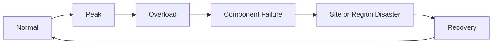



## 問題：backup成功と復旧可能性は別の主張である

serviceが正常なときの性能だけを測っても、障害中の挙動は分からない。

backup jobのgreen状態だけでは、実際にrestoreできるか分からない。

次のリスクが頻繁に隠れる。

- 平均負荷は低いが短いburstがqueueを圧倒する。
- autoscaling開始前にlatency SLOを破る。
- retryが元trafficより大きな負荷を作る。
- failover後、残ったzoneの容量が足りない。
- backupはあるがencryption keyとIAMを復旧できない。
- database restoreはできてもapplication schemaが合わない。
- DR runbookが特定個人の記憶にしかない。

レジリエンスとはreplica数ではなく、障害後の許容時間内に機能とデータを回復した証拠である。

## Mental model：通常負荷、過負荷、故障、災害を連続線で捉える

### 容量は一つのresourceの数値ではない

end-to-end throughputは、最初に飽和するconstraintに制限される。

- CPU
- memory
- connection pool
- threadまたはworker
- network bandwidth
- storage IOPSとthroughput
- queue partition
- database lock
- external API quota

### Little's Lawをqueueの感覚に使う

定常状態で、平均同時作業数 $L$、到着率 $\lambda$、平均滞在時間 $W$ には次の関係がある。

$$
L = \lambda W
$$

到着率が処理率より長時間高ければbacklogは増え続ける。

autoscalingがあってもscale-out delay中に蓄積する量を計算する。

### RTOとRPOを区別する

- **RTO**：障害後、serviceを回復すべき最大時間
- **RPO**：復旧時に許容できるデータ損失の時点範囲

datasetと機能ごとに異なり得る。

全systemへRPO 0と即時RTOを要求すればコストと複雑性が急増する。

## Workflow：容量baselineを作る

### Step 1. workload modelを記録する

- request type別比率
- payload size分布
- read/write比率
- cache hit ratio
- user think time
- batchとinteractive trafficの重なり
- 外部dependency latency
- 成長と季節性

平均的な一利用者を繰り返すtestは実際のskewを再現しない。

### Step 2. 代表SLIを選ぶ

- throughput
- latency percentile
- error rate
- queue age
- saturation
- 成功した業務transaction数
- data correctness

平均latencyはtail問題を隠すためpercentileを見る。

coordinated omissionを避けるため、遅い応答によりload generatorが新規要求の生成を止めないかも確認する。

### Step 3. baseline testとlimit testを分ける

baseline testは通常目標負荷での安定性を見る。

stress testはknee pointとfailure modeを探す。

spike testは突発的burstを見る。

soak testはleakと累積問題を見る。

breakpoint testは安全な隔離環境で限界を探す。

### Step 4. autoscaling loopを検証する

metric収集遅延、evaluation window、provisioning時間、warm-up時間を合算する。

scale-out triggerが利用者SLOより遅すぎないかを見る。

scale-in時のconnection drainとcache lossを検討する。

最大instance数をdownstream capacityと合わせる。

### Step 5. admission controlを置く

処理不能な要求は、無制限queueより明示的に拒否する方が復旧に有利な場合がある。

tenant別quota、concurrency limit、bounded queue、deadline、priorityを用いる。

critical trafficを保護する。

retryには別budgetを置く。

## Workflow：レジリエンスとDR設計

### Step 6. failure modeを列挙する

- process crash
- node loss
- zone loss
- dependency timeout
- DNSまたはidentity障害
- data corruption
- accidental delete
- credential compromise
- regionまたはsite喪失
- operator error

各modeにdetection、containment、recovery、verificationのownerを置く。

### Step 7. redundancyの独立性を検証する

複数replicaが同じzone、account、credential、deployment、configurationを共有している場合がある。

共通原因をarchitecture mapへ表示する。

failover先へ実trafficを流せるか定期確認する。

idle standbyはpatchとconfig driftが起きやすい。

### Step 8. backup種別と保存を決める

- full、incremental、differential
- snapshotとlogical dump
- transaction logまたはpoint-in-time recovery
- application-consistent backup
- immutableまたはwrite-protected copy
- cross-accountまたはoff-site copy

3-2-1は有用な出発点だが、threat modelと規制要件へ合わせる。

backup自体もransomwareとcredential compromiseから隔離する。

### Step 9. 復旧dependencyも保存する

dataだけではapplicationを復旧できない。

- IaCとimage
- schema migration
- configuration
- encryption keyとcertificate
- IAM bootstrap
- DNSとdomain control
- observability
- runbookとcontact
- licenseまたはexternal integration情報

secret bytesを文書へ直接置かず、復旧可能な管理体系を設計する。

### Step 10. restoreを隔離環境で試験する

1. 特定recovery pointを選ぶ。
2. clean accountまたはnamespaceへinfrastructureを作る。
3. keyと権限をbootstrapする。
4. backupをrestoreする。
5. schemaとapplication versionを合わせる。
6. integrityと業務invariantを検証する。
7. synthetic transactionを行う。
8. 実際のRTOとRPOを記録する。
9. 一時環境と機密copyを安全に整理する。

### Step 11. failoverとfailbackを区別する

failover成功後、元siteへ戻るfailbackには別のリスクがある。

両側で発生したwriteをどう統合するか決める。

split-brainを防ぐfencingとauthority切替えが必要である。

DNS TTL、client cache、connection再利用によりtraffic切替えは即時完了しない場合がある。

### Step 12. 復旧優先順位をservice tierで決める

全機能を同時に復旧しようとしない。

- identityとcontrol plane
- 中核read path
- 中核write path
- 非同期処理
- reportingとbatch
- 非中核機能

dependency graphと業務影響で順序を決める。

## 実践例：一つのzoneを失う試験

### 仮説

一zoneが消失しても、中核API SLOを限定的な劣化内で維持する。

### 事前条件

- 残りzoneのreservationとquota確認
- database failover動作確認
- PDBとplacement確認
- 顧客影響による中止条件を定義
- rollbackとobserverを指定

### 実行

1. canary trafficでbaselineを記録する。
2. 選択したfailureを小範囲へ注入する。
3. request routingとreplica再配置を観察する。
4. retryとqueue ageを観察する。
5. database connectionの再確立を観察する。
6. SLOとabort thresholdを比較する。
7. 正常状態へ戻す。
8. data invariantとbacklog drainを確認する。

### 結果

単純なpass/failより、実際のdetection time、failover time、peak error、recovery time、manual actionを記録する。

## 実践例：point-in-time restore

仮想的な誤delete時刻を決める。

incident直前のrecovery pointへdatabaseをrestoreする。

原本を上書きせず新instanceへrestoreする。

削除対象と、その後の正常writeを比較する。

必要recordだけを再適用するcorrection planを作る。

全dataを一時点へ戻してよいか業務ownerが承認する。

復旧後にsearch index、cache、derived tableを再構築する。

## 検証Checklist

### 容量

- [ ] workload mixとpeakが実trafficを反映する。
- [ ] percentile latencyとsaturationを合わせて見る。
- [ ] retry trafficを負荷modelへ含める。
- [ ] autoscaling delayとwarm-upを測定した。
- [ ] downstream limit前にadmission controlが動く。
- [ ] zone喪失後の残存容量を検証した。

### backup

- [ ] data別RPOとretentionを定義した。
- [ ] backup copyがproduction credentialから隔離される。
- [ ] encryption key復旧を試験した。
- [ ] backup failureとageへalertがある。
- [ ] deletionとcorruption scenarioを両方試験した。
- [ ] restore結果の業務invariantを検証する。

### DR

- [ ] tier別RTOと復旧順序がある。
- [ ] DNS、identity、observabilityも計画に含む。
- [ ] 別担当者がrunbookを実行できる。
- [ ] failover authorityとfencingが明確である。
- [ ] failbackとdata reconciliationを試験した。
- [ ] 実訓練時間を目標と比較し記録する。

## よくある失敗と限界

### 負荷testをproduction最大値の競争にする

目標は数値の誇示でなく、knee pointと安全な運用範囲を見つけることである。

### autoscalingが容量計画を代替すると信じる

quota、provisioning delay、stateful bottleneck、downstream limitは残る。

### replicationをbackupと見なす

deletionとcorruptionも高速に複製され得る。

独立したrecovery pointが必要である。

### snapshot restore成功をservice復旧として記録する

application接続、schema、key、業務transactionの検証が欠けている。

### DR文書を書いて訓練しない

dependency、権限、contact、commandは時間とともに変わる。

定期rehearsalが文書の有効性を保つ。

## 公式参考資料

- [AWS Well-Architected Reliability Pillar](https://docs.aws.amazon.com/wellarchitected/latest/reliability-pillar/welcome.html)
- [Google SRE Book: Handling Overload](https://sre.google/sre-book/handling-overload/)
- [Kubernetes Resource Management](https://kubernetes.io/docs/concepts/configuration/manage-resources-containers/)
- [NIST SP 800-34 Rev. 1 Contingency Planning Guide](https://csrc.nist.gov/pubs/sp/800/34/r1/final)
- [PostgreSQL Backup and Restore](https://www.postgresql.org/docs/current/backup.html)

## まとめ

容量と災害復旧は別文書ではなく、同じ信頼性問題の異なるscaleである。

通常負荷で限界を測り、overloadを制限し、failureを注入し、backupを実際にrestoreしよう。

復旧可能性はarchitecture diagramでなく、反復可能なrestoreと利用者機能の検証記録で証明される。
