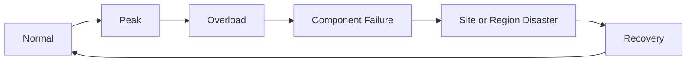



## 문제: 백업 성공과 복구 가능성은 다른 주장이다

서비스가 정상일 때의 성능만 측정하면 장애 중 행동을 알 수 없다.

backup job의 green 상태만 보면 실제 restore 가능성을 알 수 없다.

다음 위험이 자주 숨는다.

- 평균 부하는 낮지만 짧은 burst가 queue를 압도한다.
- autoscaling이 시작되기 전에 latency SLO가 깨진다.
- retry가 원래 traffic보다 큰 부하를 만든다.
- failover 뒤 남은 zone의 용량이 부족하다.
- backup은 있으나 encryption key와 IAM이 복구되지 않는다.
- database restore는 됐지만 application schema가 맞지 않는다.
- DR runbook이 특정 개인의 기억에만 있다.

복원력은 replica 수가 아니라 장애 뒤 허용 시간 안에 기능과 데이터를 회복한 증거다.

## Mental model: 정상 부하, 과부하, 고장, 재해를 연속선으로 본다

### 용량은 자원 하나의 숫자가 아니다

end-to-end 처리율은 가장 먼저 포화되는 constraint에 의해 제한된다.

- CPU
- memory
- connection pool
- thread 또는 worker
- network bandwidth
- storage IOPS와 throughput
- queue partition
- database lock
- external API quota

### Little's Law를 queue 감각으로 사용한다

안정 상태에서 평균 동시 작업 수 $L$, 도착률 $\lambda$, 평균 체류 시간 $W$ 사이에는 다음 관계가 있다.

$$
L = \lambda W
$$

도착률이 처리율보다 오래 높으면 backlog는 계속 증가한다.

autoscaling이 있어도 scale-out delay 동안 쌓이는 양을 계산해야 한다.

### RTO와 RPO를 구분한다

- **RTO**: 장애 뒤 서비스를 회복해야 하는 최대 시간
- **RPO**: 복구 시 허용 가능한 데이터 손실 시점 범위

dataset과 기능마다 다를 수 있다.

모든 시스템에 RPO 0과 즉시 RTO를 요구하면 비용과 복잡성이 급증한다.

## Workflow: 용량 baseline 만들기

### Step 1. workload model을 기록한다

- request type별 비율
- payload 크기 분포
- read/write 비율
- cache hit ratio
- user think time
- batch와 interactive traffic 중첩
- 외부 dependency latency
- 성장과 계절성

평균 사용자 한 명을 반복하는 test는 실제 skew를 재현하지 못한다.

### Step 2. 대표 SLI를 선택한다

- throughput
- latency percentile
- error rate
- queue age
- saturation
- 성공한 업무 transaction 수
- data correctness

평균 latency는 tail 문제를 숨기므로 percentile을 본다.

coordinated omission을 피하도록 load generator가 느린 응답 때문에 새 요청 생성을 멈추지 않는지도 확인한다.

### Step 3. baseline과 limit test를 분리한다

baseline test는 정상 목표 부하에서 안정성을 본다.

stress test는 knee point와 failure mode를 찾는다.

spike test는 갑작스러운 burst를 본다.

soak test는 leak과 누적 문제를 본다.

breakpoint test는 안전한 격리 환경에서 한계를 찾는다.

### Step 4. autoscaling loop를 검증한다

metric 수집 지연, evaluation window, provisioning 시간, warm-up 시간을 합산한다.

scale-out trigger가 사용자 SLO보다 너무 늦지 않은지 본다.

scale-in 때 connection drain과 cache loss를 검토한다.

최대 instance 수와 downstream capacity를 맞춘다.

### Step 5. admission control을 둔다

시스템이 감당할 수 없는 요청은 무제한 queue보다 명시적으로 거부하는 편이 회복에 유리할 수 있다.

tenant별 quota, concurrency limit, bounded queue, deadline, priority를 사용한다.

critical traffic을 보존한다.

retry에는 별도 budget을 둔다.

## Workflow: 복원력과 DR 설계

### Step 6. failure mode를 목록화한다

- process crash
- node loss
- zone loss
- dependency timeout
- DNS 또는 identity 장애
- data corruption
- accidental delete
- credential compromise
- region 또는 site 상실
- operator error

각 mode에 detection, containment, recovery, verification owner를 둔다.

### Step 7. redundancy의 독립성을 검증한다

여러 replica가 같은 zone, account, credential, deployment, configuration을 공유할 수 있다.

공통 원인을 architecture map에 표시한다.

failover 대상에 실제 traffic을 줄 수 있는지 정기적으로 확인한다.

idle standby는 patch와 config drift가 생기기 쉽다.

### Step 8. backup 종류와 보존을 정한다

- full, incremental, differential
- snapshot과 logical dump
- transaction log 또는 point-in-time recovery
- application-consistent backup
- immutable 또는 write-protected copy
- cross-account 또는 off-site copy

3-2-1은 유용한 출발점이지만 threat model과 규제 요건에 맞춘다.

backup 자체도 ransomware와 credential compromise에서 격리되어야 한다.

### Step 9. 복구 dependency를 함께 보존한다

data만으로 application을 복구할 수 없다.

- IaC와 image
- schema migration
- configuration
- encryption key와 certificate
- IAM bootstrap
- DNS와 domain control
- observability
- runbook과 contact
- license 또는 external integration 정보

secret bytes를 문서에 직접 넣지 않고 복구 가능한 관리 체계를 설계한다.

### Step 10. restore를 격리 환경에서 시험한다

1. 특정 recovery point를 선택한다.
2. 깨끗한 account 또는 namespace에 infrastructure를 만든다.
3. key와 권한을 bootstrap한다.
4. backup을 복원한다.
5. schema와 application version을 맞춘다.
6. integrity와 업무 invariant를 검증한다.
7. 합성 transaction을 수행한다.
8. 실제 RTO와 RPO를 기록한다.
9. 임시 환경과 민감 copy를 안전하게 정리한다.

### Step 11. failover와 failback을 구분한다

failover 성공 뒤 원래 site로 돌아가는 failback은 별도 위험을 가진다.

양쪽에서 발생한 write를 어떻게 합칠지 결정한다.

split-brain을 막는 fencing과 authority 전환이 필요하다.

DNS TTL, client cache, connection 재사용으로 traffic 전환이 즉시 완료되지 않을 수 있다.

### Step 12. 복구 우선순위를 service tier로 정한다

모든 기능을 동시에 살리려 하지 않는다.

- identity와 control plane
- 핵심 read path
- 핵심 write path
- 비동기 처리
- reporting와 batch
- 비핵심 기능

dependency graph와 업무 영향으로 순서를 정한다.

## 실전 예제: zone 하나를 잃는 시험

### 가설

zone 하나가 사라져도 핵심 API SLO를 제한된 저하 안에서 유지한다.

### 사전 조건

- 남은 zone의 reservation과 quota 확인
- database failover 동작 확인
- PDB와 placement 확인
- 고객 영향 중단 조건 정의
- rollback과 관찰자 지정

### 실행

1. canary traffic으로 baseline을 기록한다.
2. 선택한 failure를 작은 범위에 주입한다.
3. request routing과 replica 재배치를 관찰한다.
4. retry와 queue age를 관찰한다.
5. database connection 재수립을 관찰한다.
6. SLO와 abort threshold를 비교한다.
7. 정상 상태로 복구한다.
8. data invariant와 backlog drain을 확인한다.

### 결과

단순 pass/fail보다 실제 detection time, failover time, peak error, recovery time, manual action을 기록한다.

## 실전 예제: point-in-time restore

가상의 잘못된 delete 시각을 정한다.

사건 직전 recovery point로 database를 복원한다.

원본을 덮어쓰지 않고 새 instance에 복원한다.

삭제 대상과 이후 정상 write를 비교한다.

필요한 record만 재적용하는 correction plan을 만든다.

모든 데이터가 단일 시점으로 되돌아가도 되는지 업무 owner가 승인한다.

복구 뒤 search index, cache, derived table을 재구성한다.

## 검증 Checklist

### 용량

- [ ] workload mix와 peak가 실제 traffic을 반영한다.
- [ ] percentile latency와 saturation을 함께 본다.
- [ ] retry traffic이 부하 model에 포함된다.
- [ ] autoscaling delay와 warm-up을 측정했다.
- [ ] downstream limit 전 admission control이 작동한다.
- [ ] zone 손실 뒤 남은 용량을 검증했다.

### backup

- [ ] data별 RPO와 retention이 정의되어 있다.
- [ ] backup copy가 production credential과 격리된다.
- [ ] encryption key 복구를 시험했다.
- [ ] backup failure와 age에 경보가 있다.
- [ ] 삭제와 corruption 시나리오를 모두 시험했다.
- [ ] restore 결과의 업무 invariant를 검증한다.

### DR

- [ ] tier별 RTO와 복구 순서가 있다.
- [ ] DNS, identity, observability도 계획에 포함된다.
- [ ] runbook을 다른 담당자가 실행할 수 있다.
- [ ] failover authority와 fencing이 명확하다.
- [ ] failback과 data reconciliation을 시험했다.
- [ ] 실제 훈련 시간이 목표와 비교되어 기록된다.

## 자주 겪는 실패와 한계

### 부하 test를 production 최대치 경쟁으로 만든다

목표는 숫자 과시가 아니라 knee point와 안전한 운영 범위를 찾는 것이다.

### autoscaling이 용량 계획을 대체한다고 믿는다

quota, provisioning delay, stateful bottleneck, downstream limit은 남는다.

### replication을 backup으로 본다

삭제와 corruption도 빠르게 복제될 수 있다.

독립 recovery point가 필요하다.

### snapshot restore 성공을 서비스 복구로 기록한다

application 연결, schema, key, 업무 transaction 검증이 빠져 있다.

### DR 문서를 작성하고 훈련하지 않는다

dependency, 권한, 연락처, command가 시간이 지나며 바뀐다.

정기 rehearsal이 문서의 유효성을 유지한다.

## 공식 참고자료

- [AWS Well-Architected Reliability Pillar](https://docs.aws.amazon.com/wellarchitected/latest/reliability-pillar/welcome.html)
- [Google SRE Book: Handling Overload](https://sre.google/sre-book/handling-overload/)
- [Kubernetes Resource Management](https://kubernetes.io/docs/concepts/configuration/manage-resources-containers/)
- [NIST SP 800-34 Rev. 1 Contingency Planning Guide](https://csrc.nist.gov/pubs/sp/800/34/r1/final)
- [PostgreSQL Backup and Restore](https://www.postgresql.org/docs/current/backup.html)

## 마무리

용량과 재해복구는 별도 문서가 아니라 같은 신뢰성 질문의 서로 다른 규모다.

정상 부하에서 한계를 측정하고, overload를 제한하고, failure를 주입하고, backup을 실제로 복원하자.

복구 가능성은 architecture diagram이 아니라 반복 가능한 restore와 사용자 기능 검증 기록으로 증명된다.
