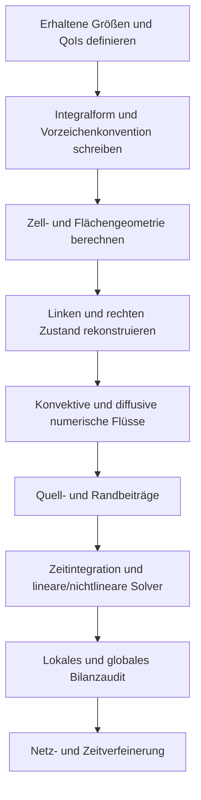



Die stärkste Perspektive zum Verständnis einer CFD-Berechnung ist nicht „zellzentrierte Werte interpolieren“, sondern **die in jedes Kontrollvolumen ein- und austretenden erhaltenen Größen wie in einem Hauptbuch zu bilanzieren**.
Vor dem Bewundern farbiger Konturen ist zu prüfen, dass Einströmung, Ausströmung, Akkumulation und Erzeugung von Masse, Impuls und Energie unter derselben Vorzeichenkonvention abschließen.

Dieser Artikel erläutert den gemeinsamen Rahmen konservativer Analyse unabhängig von einer bestimmten Strömung oder kommerziellen Software.

## 1. Was wird erhalten?

Sei eine beliebige erhaltene Größe in einem Kontinuum \(U\). Ihr Erhaltungsgesetz kann in Differentialform geschrieben werden als

$$
\frac{\partial U}{\partial t}+\nabla\cdot\mathbf F(U,\nabla U)=S(U,\mathbf x,t).
$$

- \(U\): je Volumeneinheit gespeicherte erhaltene Größe
- \(\mathbf F\): Fluss einschließlich Konvektion und Diffusion
- \(S\): Quelle oder Senke im Volumen
- \(\partial U/\partial t\): Akkumulationsrate im Kontrollvolumen

Typische konservative Variablen einer kompressiblen einphasigen Strömung sind:

$$
\mathbf U=
\begin{bmatrix}
\rho & \rho u & \rho v & \rho w & \rho E
\end{bmatrix}^{T}.
$$

Primitive Variablen sind dabei von konservativen Variablen zu unterscheiden.
Druck und Geschwindigkeit sind für die Analyse intuitiv, doch bei Schockwellen oder großen Dichteänderungen erleichtert die direkte Aktualisierung konservativer Variablen die konsistente Erfüllung der Sprungbedingungen.

## 2. Warum die integrale Kontrollvolumenform grundlegend ist

Integration über ein festes Kontrollvolumen \(\Omega\) ergibt

$$
\frac{d}{dt}\int_{\Omega}U\,d\Omega
+\int_{\partial\Omega}\mathbf F\cdot\mathbf n\,dA
=\int_{\Omega}S\,d\Omega
$$

Die umgekehrte Anwendung des Divergenzsatzes liefert diesen Ausdruck, der auch bei Diskontinuitäten ohne klassische Ableitungen in schwachem Sinn verwendet werden kann.

Die Intuition ist einfach.

> Änderung der gespeicherten Größe = einströmende Größe − ausströmende Größe + intern erzeugte Größe

An einer von zwei benachbarten Zellen gemeinsam genutzten Fläche muss der Ausstrom der einen der Einstrom der anderen sein.
Wird derselbe Flächenfluss mit entgegengesetzten Vorzeichen geteilt, heben sich die Beiträge innerer Flächen in der globalen Summe exakt auf.
Deshalb ist die Finite-Volumen-Methode strukturell konservativ.

## 3. Bewegte Kontrollvolumina und Reynolds-Transportsatz

Bewegen sich Netz oder Rand, kann die Gleichung des festen Kontrollvolumens nicht unverändert verwendet werden.
Sei die Geschwindigkeit der Kontrollfläche \(\mathbf v_g\). Die relative Transportgeschwindigkeit ist dann \(\mathbf u-\mathbf v_g\).

$$
\frac{d}{dt}\int_{\Omega(t)}U\,d\Omega
+\int_{\partial\Omega(t)}
\left(\mathbf F-U\mathbf v_g\right)\cdot\mathbf n\,dA
=\int_{\Omega(t)}S\,d\Omega.
$$

Ein bewegtes Netz muss neben dem physikalischen Erhaltungsgesetz auch das **geometrische Erhaltungsgesetz** erfüllen.
Ändert sich eine gleichförmige Lösung allein durch Netzbewegung, ist die Metrik- oder Swept-Volume-Berechnung inkonsistent.

## 4. Fluss in Konvektion und Diffusion aufteilen

Ein allgemeiner Fluss wird aufgeteilt in konvektiven und diffusiven Fluss:

$$
\mathbf F=\mathbf F_c-\mathbf F_d
$$

- Konvektive Terme müssen Richtung des Informationsflusses und Wellengeschwindigkeiten berücksichtigen.
- Diffusive Terme reagieren empfindlich auf Gradientenrekonstruktion und Nichtorthogonalitätskorrektur.
- Beide Terme erzeugen unterschiedliche Stabilitätsbedingungen und numerische Fehler.

Die skalare Konvektions-Diffusions-Gleichung zeigt diesen Unterschied besonders deutlich.

$$
\frac{\partial (\rho\phi)}{\partial t}
+\nabla\cdot(\rho\mathbf u\phi)
=\nabla\cdot(\Gamma\nabla\phi)+S_{\phi}.
$$

An einer Fläche benötigte Werte werden von Zellmittelpunktwerten nicht direkt bereitgestellt.
Daher sind Interpolation, Gradientenrekonstruktion und Limiter erforderlich.

## 5. Ein numerischer Fluss ist eine Vereinbarung zwischen zwei Zuständen

Sind die Zustände links und rechts einer Fläche \(U_L,U_R\), wird der numerische Fluss geschrieben als

$$
\widehat{F}=\widehat{F}(U_L,U_R,\mathbf n)
$$

Ein guter Fluss muss mindestens Konsistenz erfüllen.

$$
\widehat{F}(U,U,\mathbf n)=F(U)\cdot\mathbf n.
$$

Typische Wahlen besitzen folgende Eigenschaften.

| Ansatz | Vorteile | Zu beachten |
|---|---|---|
| zentral | geringe künstliche Diffusion, Einfachheit | kann bei konvektionsdominierten Problemen oszillieren |
| Upwind | berücksichtigt Informationsrichtung, robust | bei niedriger Ordnung hohe numerische Diffusion |
| approximativer Riemann-Solver | berücksichtigt Wellenstruktur | Implementierung, Positivität und Entropie müssen behandelt werden |
| gemischt/hochauflösend | gleicht Genauigkeit und Beschränktheit aus | Limiter beeinflusst Konvergenz und Glattheit |

Die Bezeichnung „hohe Ordnung“ allein garantiert keine Überlegenheit.
Nahe Diskontinuitäten kann unbeschränkte Rekonstruktion hoher Ordnung Überschwinger sowie negative Dichte oder negativen Druck erzeugen.
Ein Limiter senkt die lokale Ordnung, um dafür den physikalisch zulässigen Bereich und Monotonie zu bewahren.

## 6. Flächenrekonstruktion und Netzqualität

Lineare Rekonstruktion extrapoliert den Wert in Zelle \(P\) zur Fläche als

$$
\phi(\mathbf x_f)\approx
\phi_P+\nabla\phi_P\cdot(\mathbf x_f-\mathbf x_P)
$$

Der Gradient kann mit Green–Gauss oder der Methode kleinster Quadrate berechnet werden.

Auf unstrukturierten Netzen sind folgende Fehlerquellen wichtig.

- Nichtorthogonalität: Fehlorientierung zwischen Flächennormale und Verbindungslinie der Zellmittelpunkte
- Schiefe: Fehlorientierung zwischen Flächenmittelpunkt und Interpolationspunkt
- Seitenverhältnis: übermäßig lange, dünne Zellen
- abruptes Wachstum: abrupte Größenänderung benachbarter Zellen
- negatives Volumen oder invertierte Elemente

Das Bestehen einer einzelnen Netzqualitätsmetrik garantiert keine Genauigkeit.
Zusätzlich ist zu berücksichtigen, welcher diskretisierte Term auf welchen geometrischen Fehler empfindlich reagiert.

## 7. Randbedingungen sind Teil der Gleichungen und des Informationsflusses

Eine Randbedingung ist keine nach der Berechnung an Werte angehängte Einstellung.
Sie bestimmt Operator, Wohlgestelltheit, Energiestabilität und Gesamtmassenbilanz.

### Dirichlet-, Neumann- und Robin-Bedingungen

$$
\phi=g,
\qquad
\frac{\partial\phi}{\partial n}=q,
\qquad
a\phi+b\frac{\partial\phi}{\partial n}=c.
$$

Diese Bedingungen geben jeweils Wert, Normalfluss oder gemischte Beziehung an.
Zu viele vorgegebene Werte für jede Variable können das Problem mathematisch überbestimmen.

### Einlassränder

An einem Einlass wird die für eingehende Charakteristiken benötigte Information angegeben.
Ob Geschwindigkeit, Massenstrom oder Totalzustand vorgegeben wird, hängt von Strömungsregime und Modell ab.
Bei einem Turbulenzmodell müssen auch Turbulenzvariablen physikalisch konsistent bereitgestellt werden.

### Auslassränder

An einem Auslass darf ausgehende Information natürlich passieren; mögliche Rückströmung wird behandelt.
Schneidet ein Auslass eine Region starker Rezirkulation oder Gradienten, kann eine einfache Nullgradientenannahme das Problem verzerren.

### Wandränder

Für eine stationäre Wand in viskoser Strömung werden gewöhnlich Haft- und Undurchdringlichkeitsbedingungen verwendet.
Für Wärmeübertragung wird zwischen isothermer Bedingung, Wärmestrombedingung und konvektiver Kopplung gewählt.
Bei Verwendung von Wandfunktionen muss die Lage der ersten Zelle mit den Modellannahmen übereinstimmen.

### Symmetrie- und periodische Ränder

Eine Symmetriebedingung beschränkt Normalgeschwindigkeit und Normalgradientstruktur.
Eine periodische Bedingung verbindet Variablen und Flüsse entsprechender Flächen; liegt eine Rotations- oder Translationstransformation vor, müssen auch Vektorkomponenten transformiert werden.

## 8. Erhaltungsaudit der Randbedingungen

Das Summieren über das gesamte Gebiet eliminiert innere Flächen und lässt nur äußere Ränder zurück.

$$
\frac{dM}{dt}
+\sum_{b\in\partial\Omega}\dot m_b
=\dot m_{source}.
$$

Der Massenbilanzdefekt einer instationären Berechnung kann entdimensionalisiert werden als

$$
\epsilon_M=
\frac{
\Delta M/\Delta t+sum_b\dot m_b-\dot m_{source}
}{M_{scale}/T_{scale}}
$$

Liegt der Nenner nahe null, darf nicht nur der relative Fehler verwendet werden; absoluter Defekt und Referenzskala werden gemeinsam erfasst.

## 9. Implementierungsworkflow

1. Konservative Variablen, konstitutive Beziehungen und Abschlüsse unterscheiden.
2. Normalenrichtung und Owner-Cell-Konvention jeder Fläche dokumentieren.
3. Jeden inneren Fluss einmal berechnen und mit entgegengesetzten Vorzeichen zu beiden Zellen addieren.
4. Randflächen konsistent entweder mit Ghost-Zuständen oder direkten Flüssen behandeln.
5. Ist eine Quelle steif oder erzeugt Austausch erhaltener Größen, Implizitheit und paarweise Bilanz untersuchen.
6. Neben Residuen auch QoIs und Hauptbuch jeder erhaltenen Größe speichern.
7. Beobachtete Ordnung mit hergestellten Lösungen und einfachen Benchmarks bestätigen.

## 10. Prüfliste zur Verifikation

- [ ] Einheiten und Dimensionen sind in jedem Term konsistent.
- [ ] Das Vorzeichen der Flächennormale ist durch eine einzige Regel definiert.
- [ ] Flüsse innerer Flächen heben sich bis zur Maschinengenauigkeit auf.
- [ ] Ein gleichförmiges Feld bleibt auf gleichförmigen und verzerrten Netzen erhalten.
- [ ] Die gesamte erhaltene Größe bleibt in einem geschlossenen Gebiet ohne Quelle erhalten.
- [ ] Massen-, Impuls- und Energieflüsse werden je Rand getrennt berichtet.
- [ ] Sowohl Verringerung stationärer Residuen als auch Verringerung globaler Unwucht werden überwacht.
- [ ] Änderungen transienter Speicherung stimmen mit dem zeitintegrierten Nettofluss überein.
- [ ] Verletzungen von Positivität und Beschränktheit werden automatisch erkannt.
- [ ] QoI-Konvergenz ist auf mindestens drei Netzstufen bestätigt.
- [ ] Die Hauptschlussfolgerungen bleiben bei verschobenen Randpositionen gültig.
- [ ] Eine Änderung der Quellenlinearisierung bricht die Erhaltung nicht.

## 11. Häufige Fehlermuster und Einschränkungen

### Annehmen, kleine Residuen bedeuteten Konvergenz

Skalierte Residuen hängen von internen Definitionen des Solvers ab.
Globale Bilanz und Zielgrößen können weiterhin driften und müssen gemeinsam überwacht werden.

### Einlass- und Auslasswerte zum Übereinstimmen zwingen

Eine Hauptbuchabweichung in der Nachbearbeitung zu normalisieren verbirgt ihre Ursache.
Zuerst werden Randvorzeichen, Dichteauswertung, bewegte Volumina und Quellenintegration verfolgt.

### Randbedingungen nur nach ihren physikalischen Namen auswählen

Statt sich auf ein UI-Label wie „pressure outlet“ zu verlassen wird bestimmt, welche Charakteristiken und Flüsse tatsächlich angegeben sind.

### Verfahren hoher Ordnung bedingungslos verwenden

Schlechte Netze, Diskontinuitäten und Limiter-Aktivierung können die nominelle von der tatsächlichen Ordnung unterscheiden.

### Genauigkeit allein aufgrund der Erhaltung behaupten

Auch eine falsche Lösung kann die Gesamtgröße erhalten.
Erhaltung ist eine starke notwendige Bedingung, ersetzt aber keine Validierung.

## 12. Grundlegende und offizielle Referenzen

- Reynolds, O., „On the Dynamical Theory of Incompressible Viscous Fluids and the Determination of the Criterion“, *Philosophical Transactions*, 1895.
- Godunov, S. K., „A Difference Method for Numerical Calculation of Discontinuous Solutions“, 1959.
- LeVeque, R. J., *Finite Volume Methods for Hyperbolic Problems*, Cambridge University Press.
- NASA Glenn Research Center, [Navier-Stokes-Gleichungen](https://www.grc.nasa.gov/www/k-12/airplane/nseqs.html).
- NIST, [Überblick zur Method of Manufactured Solutions in Verifikationsressourcen](https://www.nist.gov/programs-projects/verification-and-validation-computational-science).

Der zentrale Punkt ist einfach.
**Jedes Zellhauptbuch, Randhauptbuch und globale Hauptbuch muss unter denselben Gleichungen und derselben Vorzeichenkonvention abschließen.**
