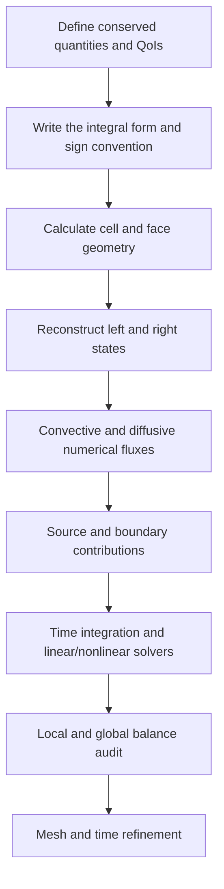



The most powerful perspective for understanding a CFD computation is not “interpolating cell-centered values,” but **balancing the conserved quantities entering and leaving each control volume like a ledger**.
Before admiring colorful contours, verify that the inflow, outflow, accumulation, and generation terms for mass, momentum, and energy close under the same sign convention.

This article explains the common framework of conservative analysis without depending on a particular flow or commercial code.

## 1. What Is Conserved?

Let an arbitrary conserved quantity in a continuum be (U). Its conservation law can be written in differential form as follows.

$$
\frac{\partial U}{\partial t}+\nabla\cdot\mathbf F(U,\nabla U)=S(U,\mathbf x,t).
$$

- (U): Conserved quantity stored per unit volume
- (mathbf F): Flux including convection and diffusion
- (S): A source or sink inside the volume
- (partial U/\partial t): Accumulation rate inside the control volume

Typical conserved variables for a compressible single-phase flow are as follows.

$$
\mathbf U=
\begin{bmatrix}
\rho & \rho u & \rho v & \rho w & \rho E
\end{bmatrix}^{T}.
$$

Here, primitive variables must be distinguished from conservative variables.
Pressure and velocity are intuitive for analysis, but in problems with shock waves or large density changes, directly updating the conservative variables makes it easier to satisfy jump conditions consistently.

## 2. Why the Integral Control-Volume Form Is Fundamental

Integrating over a fixed control volume (Omega) gives

$$
\frac{d}{dt}\int_{\Omega}U\,d\Omega
+\int_{\partial\Omega}\mathbf F\cdot\mathbf n\,dA
=\int_{\Omega}S\,d\Omega
$$

Applying the divergence theorem in reverse yields this expression, which can be used in a weak sense even when discontinuities exist and classical derivatives are not defined.

The intuition is simple.

> Change in stored quantity = quantity entering − quantity leaving + quantity generated internally

At a face shared by two adjacent cells, the outflow flux of one cell must be the inflow flux of the other.
If the same face flux is shared with opposite signs, the contributions from internal faces cancel exactly in the global sum.
This is why the finite volume method is structurally conservative.

## 3. Moving Control Volumes and the Reynolds Transport Theorem

If the mesh or boundary moves, the fixed-control-volume equation cannot be used unchanged.
Let the control-surface velocity be (mathbf v_g). The relative transport velocity is then (mathbf u-mathbf v_g).

$$
\frac{d}{dt}\int_{\Omega(t)}U\,d\Omega
+\int_{\partial\Omega(t)}
\left(\mathbf F-U\mathbf v_g\right)\cdot\mathbf n\,dA
=\int_{\Omega(t)}S\,d\Omega.
$$

A moving mesh must satisfy not only the physical conservation law but also the **geometric conservation law**.
If a uniform solution changes solely because of mesh motion, the metric or swept-volume calculation is inconsistent.

## 4. Split the Flux into Convection and Diffusion

A general flux is divided into convective and diffusive fluxes as

$$
\mathbf F=\mathbf F_c-\mathbf F_d
$$

- Convective terms must account for the direction of information flow and wave speeds.
- Diffusive terms are sensitive to gradient reconstruction and non-orthogonal correction.
- The two terms create different stability conditions and numerical errors.

The scalar convection–diffusion equation shows this distinction most transparently.

$$
\frac{\partial (\rho\phi)}{\partial t}
+\nabla\cdot(\rho\mathbf u\phi)
=\nabla\cdot(\Gamma\nabla\phi)+S_{\phi}.
$$

Values needed at a face are not supplied directly by cell-center values.
Interpolation, gradient reconstruction, and limiters are therefore necessary.

## 5. A Numerical Flux Is an Agreement Between Two States

If the states to the left and right of a face are (U_L,U_R), the numerical flux is written as

$$
\widehat{F}=\widehat{F}(U_L,U_R,\mathbf n)
$$

A good flux must at least satisfy consistency.

$$
\widehat{F}(U,U,\mathbf n)=F(U)\cdot\mathbf n.
$$

Typical choices have the following characteristics.

| Approach | Advantages | Considerations |
|---|---|---|
| central | Low artificial diffusion, simplicity | Can oscillate in convection-dominated problems |
| upwind | Accounts for information direction, robust | Large numerical diffusion at low order |
| approximate Riemann | Accounts for wave structure | Requires treatment of implementation, positivity, and entropy |
| blended/high-resolution | Balances accuracy and boundedness | The limiter affects convergence and smoothness |

The label “high order” alone does not guarantee superiority.
Near discontinuities, unlimited high-order reconstruction can create overshoots and negative density or pressure.
A limiter lowers the local order in exchange for preserving the physically admissible region and monotonicity.

## 6. Face Reconstruction and Mesh Quality

Linear reconstruction extrapolates the value inside cell (P) to the face as

$$
\phi(\mathbf x_f)\approx
\phi_P+\nabla\phi_P\cdot(\mathbf x_f-\mathbf x_P)
$$

The gradient can be calculated with the Green–Gauss or least-squares method.

The following sources of error are important on unstructured meshes.

- non-orthogonality: Misalignment between the face normal and the line connecting cell centers
- skewness: Misalignment between the face center and the interpolation point
- aspect ratio: Excessively long, thin cells
- abrupt growth: Abrupt changes in the size of adjacent cells
- negative volume or inverted elements

Passing a single mesh-quality metric does not guarantee accuracy.
You must also consider which discretized term is sensitive to which geometric error.

## 7. Boundary Conditions Are Part of the Equations and Information Flow

A boundary condition is not a setting appended to the values after computation.
It determines the operator, well-posedness, energy stability, and overall mass balance.

### Dirichlet, Neumann, and Robin Conditions

$$
\phi=g,
\qquad
\frac{\partial\phi}{\partial n}=q,
\qquad
a\phi+b\frac{\partial\phi}{\partial n}=c.
$$

These conditions specify a value, normal flux, or mixed relation, respectively.
Overly prescribing values for every variable can mathematically overconstrain the problem.

### Inflow Boundaries

At an inflow, specify the information required for incoming characteristics.
Whether to prescribe velocity, mass flow, or total state depends on the flow regime and model.
When a turbulence model is used, turbulence variables must also be provided in a physically consistent manner.

### Outflow Boundaries

At an outflow, allow outgoing information to pass naturally and handle the possibility of backflow.
If an outlet cuts through a region of strong recirculation or gradients, a simple zero-gradient assumption can distort the problem.

### Wall Boundaries

For a stationary wall in viscous flow, no-slip and no-penetration conditions are generally used.
For heat transfer, choose among an isothermal condition, a heat-flux condition, and convective coupling.
When wall functions are used, the first-cell location must be consistent with the model assumptions.

### Symmetry and Periodic Boundaries

A symmetry condition constrains the normal-velocity and normal-gradient structures.
A periodic condition connects the variables and fluxes of corresponding faces; if a rotational or translational transformation is present, vector components must also be transformed.

## 8. Conservation Audit of Boundary Conditions

Summing over the entire domain eliminates internal faces and leaves only external boundaries.

$$
\frac{dM}{dt}
+\sum_{b\in\partial\Omega}\dot m_b
=\dot m_{source}.
$$

The mass-balance defect in a transient calculation can be nondimensionalized as

$$
\epsilon_M=
\frac{
\Delta M/\Delta t+sum_b\dot m_b-\dot m_{source}
}{M_{scale}/T_{scale}}
$$

When the denominator is near zero, do not use only relative error; record the absolute defect and reference scale together.

## 9. Implementation Workflow

1. Distinguish conservative variables, constitutive relations, and closures.
2. Document the normal direction and owner-cell convention for every face.
3. Calculate each internal-face flux once and add it to the two cells with opposite signs.
4. Treat boundary faces consistently using either ghost states or direct fluxes.
5. If a source is stiff or creates exchanges of conserved quantities, examine implicitness and pairwise balance.
6. Store not only residuals, but also QoIs and the ledger for each conserved quantity.
7. Confirm the observed order with manufactured solutions and simple benchmarks.

## 10. Verification Checklist

- [ ] Units and dimensions are consistent in every term.
- [ ] The sign of the face normal is defined by a single rule.
- [ ] Internal-face fluxes cancel to machine precision.
- [ ] A uniform field is preserved on both uniform and distorted meshes.
- [ ] The total conserved quantity is maintained in a zero-source closed domain.
- [ ] Mass, momentum, and energy fluxes are reported separately for each boundary.
- [ ] Both steady-state residual reduction and global-imbalance reduction are monitored.
- [ ] Changes in transient storage agree with the time-integrated net flux.
- [ ] Violations of positivity and boundedness are detected automatically.
- [ ] QoI convergence is confirmed on at least three mesh levels.
- [ ] The main conclusions remain valid when boundary locations are moved.
- [ ] Changing source linearization does not break conservation.

## 11. Common Failure Patterns and Limitations

### Assuming that Small Residuals Mean Convergence

Scaled residuals depend on the solver's internal definitions.
Global balance and quantities of interest may still drift, so they must be monitored together.

### Forcing Inlet and Outlet Values to Match

Normalizing a ledger mismatch in postprocessing conceals its cause.
First trace boundary signs, density evaluation, moving volumes, and source integration.

### Selecting Boundary Conditions Only by Their Physical Names

Rather than relying on a UI label such as “pressure outlet,” determine which characteristics and fluxes are actually specified.

### Using High-Order Schemes Unconditionally

Poor meshes, discontinuities, and limiter activation can make the nominal order differ from the actual order.

### Claiming Accuracy Based on Conservation Alone

An incorrect solution can also conserve the total quantity.
Conservation is a strong necessary condition, but it does not replace validation.

## 12. Foundational and Official References

- Reynolds, O., “On the Dynamical Theory of Incompressible Viscous Fluids and the Determination of the Criterion,” *Philosophical Transactions*, 1895.
- Godunov, S. K., “A Difference Method for Numerical Calculation of Discontinuous Solutions,” 1959.
- LeVeque, R. J., *Finite Volume Methods for Hyperbolic Problems*, Cambridge University Press.
- NASA Glenn Research Center, [Navier–Stokes Equations](https://www.grc.nasa.gov/www/k-12/airplane/nseqs.html).
- NIST, [Method of Manufactured Solutions overview in verification resources](https://www.nist.gov/programs-projects/verification-and-validation-computational-science).

The central point is simple.
**Each cell ledger, boundary ledger, and global ledger must close under the same equations and the same sign convention.**
