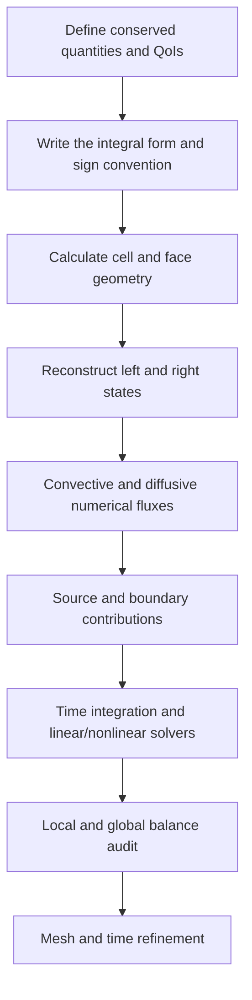



La perspectiva más poderosa para comprender un cálculo CFD no es "interpolar valores centrados en las celdas", sino **equilibrar las cantidades conservadas que entran y salen de cada volumen de control como un libro mayor**.
Antes de admirar los contornos coloridos, verifique que los términos de entrada, salida, acumulación y generación de masa, momento y energía se cierren bajo la misma convención de signos.

Este artículo explica el marco común del análisis conservador sin depender de un flujo o código comercial en particular.

## 1. ¿Qué se conserva?

Sea (U) una cantidad arbitraria conservada en un continuo. Su ley de conservación se puede escribir en forma diferencial de la siguiente manera.

$$
\frac{\partial U}{\partial t}+\nabla\cdot\mathbf F(U,\nabla U)=S(U,\mathbf x,t).
$$

- (U): Cantidad conservada almacenada por unidad de volumen
- (mathbf F): flujo que incluye convección y difusión
- (S): Una fuente o sumidero dentro del volumen.
- (U parcial/\t parcial): Tasa de acumulación dentro del volumen de control

Las variables conservadas típicas para un flujo monofásico compresible son las siguientes.

$$
\mathbf U=
\begin{bmatrix}
\rho & \rho u & \rho v & \rho w & \rho E
\end{bmatrix}^{T}.
$$

Aquí es necesario distinguir las variables primitivas de las variables conservadoras.
La presión y la velocidad son intuitivas para el análisis, pero en problemas con ondas de choque o grandes cambios de densidad, la actualización directa de las variables conservadoras hace que sea más fácil satisfacer las condiciones de salto de manera consistente.

## 2. Por qué la forma integral de volumen de control es fundamental

La integración sobre un volumen de control fijo (Omega) proporciona

$$
\frac{d}{dt}\int_{\Omega}U\,d\Omega
+\int_{\partial\Omega}\mathbf F\cdot\mathbf n\,dA
=\int_{\Omega}S\,d\Omega
$$

La aplicación del teorema de la divergencia a la inversa produce esta expresión, que puede usarse en un sentido débil incluso cuando existen discontinuidades y las derivadas clásicas no están definidas.

La intuición es simple.

> Cambio en la cantidad almacenada = cantidad que entra - cantidad que sale + cantidad generada internamente

En una cara compartida por dos celdas adyacentes, el flujo de salida de una celda debe ser el flujo de entrada de la otra.
Si el mismo flujo de caras se comparte con signos opuestos, las contribuciones de las caras internas se cancelan exactamente en la suma global.
Ésta es la razón por la que el método del volumen finito es estructuralmente conservador.

## 3. Volúmenes de control móviles y el teorema del transporte de Reynolds

Si la malla o el límite se mueve, la ecuación de volumen de control fijo no se puede utilizar sin cambios.
Sea la velocidad de la superficie de control (mathbf v_g). La velocidad de transporte relativa es entonces (mathbf u-mathbf v_g).

$$
\frac{d}{dt}\int_{\Omega(t)}U\,d\Omega
+\int_{\partial\Omega(t)}
\left(\mathbf F-U\mathbf v_g\right)\cdot\mathbf n\,dA
=\int_{\Omega(t)}S\,d\Omega.
$$

Una malla en movimiento debe satisfacer no sólo la ley de conservación física sino también la **ley de conservación geométrica**.
Si una solución uniforme cambia únicamente debido al movimiento de la malla, el cálculo métrico o del volumen barrido es inconsistente.

## 4. Dividir el flujo en convección y difusión

Un flujo general se divide en flujos convectivos y difusivos como

$$
\mathbf F=\mathbf F_c-\mathbf F_d
$$

- Los términos convectivos deben tener en cuenta la dirección del flujo de información y la velocidad de las ondas.
- Los términos difusivos son sensibles a la reconstrucción de gradientes y a la corrección no ortogonal.
- Los dos términos crean diferentes condiciones de estabilidad y errores numéricos.

La ecuación escalar de convección-difusión muestra esta distinción de manera más transparente.

$$
\frac{\partial (\rho\phi)}{\partial t}
+\nabla\cdot(\rho\mathbf u\phi)
=\nabla\cdot(\Gamma\nabla\phi)+S_{\phi}.
$$

Los valores necesarios en una cara no los proporcionan directamente los valores del centro de la celda.
Por tanto, son necesarios la interpolación, la reconstrucción de gradientes y los limitadores.

## 5. Un flujo numérico es un acuerdo entre dos estados

Si los estados a la izquierda y a la derecha de una cara son (U_L,U_R), el flujo numérico se escribe como

$$
\widehat{F}=\widehat{F}(U_L,U_R,\mathbf n)
$$

Un buen fundente debe al menos satisfacer la consistencia.

$$
\widehat{F}(U,U,\mathbf n)=F(U)\cdot\mathbf n.
$$

Las opciones típicas tienen las siguientes características.

| Enfoque | Ventajas | Consideraciones |
|---|---|---|
| central | Baja difusión artificial, sencillez | Puede oscilar en problemas dominados por la convección |
| ceñida | Cuentas para dirección de información, robustas | Gran difusión numérica a bajo orden |
| Riemann aproximado | Cuentas para la estructura de las olas | Requiere tratamiento de implementación, positividad y entropía |
| mezclado/alta resolución | Equilibra precisión y limitación | El limitador afecta la convergencia y la suavidad |

La etiqueta de “alto nivel” por sí sola no garantiza superioridad.
Cerca de discontinuidades, la reconstrucción ilimitada de alto orden puede crear excesos y densidad o presión negativa.
Un limitador reduce el orden local a cambio de preservar la región y la monotonicidad físicamente admisibles.

## 6. Reconstrucción facial y calidad de la malla

La reconstrucción lineal extrapola el valor dentro de la celda (P) a la cara como

$$
\phi(\mathbf x_f)\approx
\phi_P+\nabla\phi_P\cdot(\mathbf x_f-\mathbf x_P)
$$

El gradiente se puede calcular con el método de Green-Gauss o de mínimos cuadrados.

Las siguientes fuentes de error son importantes en mallas no estructuradas.

- no ortogonalidad: Desalineación entre la cara normal y la línea que conecta los centros de las celdas
- asimetría: desalineación entre el centro de la cara y el punto de interpolación
- relación de aspecto: celdas delgadas y excesivamente largas
- crecimiento abrupto: cambios abruptos en el tamaño de las células adyacentes
- volumen negativo o elementos invertidos

Pasar una única métrica de calidad de malla no garantiza la precisión.
También debes considerar qué término discretizado es sensible a qué error geométrico.

## 7. Las condiciones de contorno son parte de las ecuaciones y el flujo de información

Una condición de contorno no es una configuración agregada a los valores después del cálculo.
Determina el operador, la buena postura, la estabilidad energética y el equilibrio de masa general.

### Condiciones de Dirichlet, Neumann y Robin

$$
\phi=g,
\qquad
\frac{\partial\phi}{\partial n}=q,
\qquad
a\phi+b\frac{\partial\phi}{\partial n}=c.
$$

Estas condiciones especifican un valor, flujo normal o relación mixta, respectivamente.
Prescribir valores excesivos para cada variable puede restringir excesivamente el problema matemáticamente.

### Límites de entrada

En una entrada, especifique la información requerida para las características de entrada.
La prescripción de velocidad, flujo másico o estado total depende del régimen y modelo de flujo.
Cuando se utiliza un modelo de turbulencia, las variables de turbulencia también deben proporcionarse de manera físicamente consistente.

### Límites de salida

En un flujo de salida, permita que la información saliente pase de forma natural y maneje la posibilidad de un reflujo.
Si una salida atraviesa una región de fuerte recirculación o gradientes, una simple suposición de gradiente cero puede distorsionar el problema.

### Límites del muro

Para una pared estacionaria en flujo viscoso, generalmente se utilizan condiciones sin deslizamiento y sin penetración.
Para la transferencia de calor, elija entre una condición isotérmica, una condición de flujo de calor y un acoplamiento convectivo.
Cuando se utilizan funciones de pared, la ubicación de la primera celda debe ser consistente con los supuestos del modelo.

### Simetría y límites periódicos

Una condición de simetría restringe las estructuras de velocidad normal y gradiente normal.
Una condición periódica conecta las variables y flujos de las caras correspondientes; si hay una transformación rotacional o traslacional, los componentes del vector también deben transformarse.

## 8. Auditoría de conservación de las condiciones de contorno

La suma de todo el dominio elimina las caras internas y deja solo los límites externos.

$$
\frac{dM}{dt}
+\sum_{b\in\partial\Omega}\dot m_b
=\dot m_{source}.
$$

El defecto de balance de masa en un cálculo transitorio se puede adimensionalizar como

$$
\epsilon_M=
\frac{
\Delta M/\Delta t+sum_b\dot m_b-\dot m_{source}
}{M_{scale}/T_{scale}}
$$

Cuando el denominador esté cerca de cero, no utilice sólo el error relativo; registre el defecto absoluto y la escala de referencia juntos.

## 9. Flujo de trabajo de implementación

1. Distinguir variables conservadoras, relaciones constitutivas y cierres.
2. Documente la dirección normal y la convención de celda propietaria para cada cara.
3. Calcule cada flujo de cara interna una vez y agréguelo a las dos celdas con signos opuestos.
4. Trate las caras de los límites de manera consistente utilizando estados fantasma o flujos directos.
5. Si una fuente es rígida o crea intercambios de cantidades conservadas, examine la implícitaidad y el equilibrio por pares.
6. Almacene no solo los residuos, sino también los QoI y el libro mayor para cada cantidad conservada.
7. Confirmar el orden observado con soluciones fabricadas y puntos de referencia simples.

## 10. Lista de verificación de verificación

- [ ] Las unidades y dimensiones son consistentes en cada término.
- [ ] El signo de la cara normal está definido por una única regla.
- [ ] Los flujos de la cara interna se cancelan según la precisión de la máquina.
- [ ] Se conserva un campo uniforme tanto en mallas uniformes como distorsionadas.
- [ ] La cantidad total conservada se mantiene en un dominio cerrado de fuente cero.
- [ ] Los flujos de masa, momento y energía se informan por separado para cada límite.
- [ ] Se monitorean tanto la reducción residual en estado estacionario como la reducción del desequilibrio global.
- [ ] Los cambios en el almacenamiento transitorio concuerdan con el flujo neto integrado en el tiempo.
- [ ] Las violaciones de positividad y limitación se detectan automáticamente.
- [ ] La convergencia QoI se confirma en al menos tres niveles de malla.
- [ ] Las principales conclusiones siguen siendo válidas cuando se cambian las ubicaciones de los límites.
- [] Cambiar la linealización de la fuente no rompe la conservación.

## 11. Limitaciones y patrones de falla comunes

### Suponiendo que pequeños residuos significan convergencia

Los residuos escalados dependen de las definiciones internas del solucionador.
El equilibrio global y las cantidades de interés aún pueden variar, por lo que deben ser monitoreados juntos.

### Forzar la coincidencia de los valores de entrada y salida

La normalización de una discrepancia en el libro mayor en el posprocesamiento oculta su causa.
Primeros trazos de señales de límites, evaluación de densidad, volúmenes en movimiento e integración de fuentes.

### Seleccionar condiciones de contorno solo por sus nombres físicos

En lugar de confiar en una etiqueta UI como “salida de presión”, determine qué características y flujos se especifican realmente.

### Uso incondicional de esquemas de alto orden

Mallas deficientes, discontinuidades y activación del limitador pueden hacer que el orden nominal difiera del orden real.

### Reclamación de exactitud basada únicamente en la conservación

Una solución incorrecta también puede conservar la cantidad total.
La conservación es una condición muy necesaria, pero no reemplaza la validación.

## 12. Referencias fundacionales y oficiales

- Reynolds, O., “Sobre la teoría dinámica de los fluidos viscosos incompresibles y la determinación del criterio”, *Philosophical Transactions*, 1895.
- Godunov, S. K., “Un método diferencial para el cálculo numérico de soluciones discontinuas”, 1959.
- LeVeque, R. J., *Métodos de volumen finito para problemas hiperbólicos*, Cambridge University Press.
- NASA Centro de investigación Glenn, [Ecuaciones de Navier-Stokes](https://www.grc.nasa.gov/www/k-12/airplane/nseqs.html).
- NIST, [Descripción general del método de soluciones fabricadas en recursos de verificación](https://www.nist.gov/programs-projects/verification-and-validation-computational-science).

El punto central es simple.
**Cada libro mayor de celda, libro mayor de límites y libro mayor global debe cerrarse bajo las mismas ecuaciones y la misma convención de signos.**
