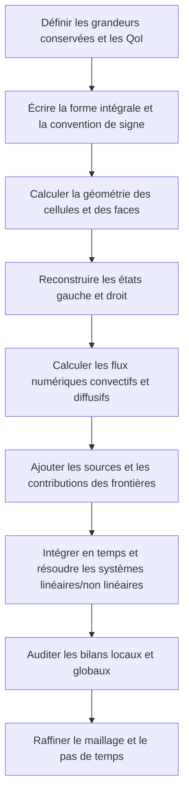



La perspective la plus féconde pour comprendre un calcul CFD ne consiste pas à « interpoler des valeurs au centre des cellules », mais à **tenir, pour chaque volume de contrôle, un bilan exact des grandeurs conservées qui entrent et qui sortent**.
Avant de produire de belles cartes de contours, il faut vérifier que les termes d'entrée, de sortie, d'accumulation et de production de la masse, de la quantité de mouvement et de l'énergie se referment selon une même convention de signe.

Cet article présente l'ossature commune d'une analyse conservative, indépendamment d'un écoulement particulier ou d'un logiciel commercial.

## 1. Que conserve-t-on ?

En notant (U) une grandeur conservée quelconque d'un milieu continu, la loi de conservation s'écrit sous la forme différentielle suivante.

$$
\frac{\partial U}{\partial t}+\nabla\cdot\mathbf F(U,\nabla U)=S(U,\mathbf x,t).
$$

- (U) : grandeur conservée stockée par unité de volume
- (mathbf F) : flux comprenant la convection et la diffusion
- (S) : source ou puits à l'intérieur du volume
- (partial U/\partial t) : taux d'accumulation dans le volume de contrôle

Pour un écoulement monophasique compressible, les variables conservatives représentatives sont les suivantes.

$$
\mathbf U=
\begin{bmatrix}
\rho & \rho u & \rho v & \rho w & \rho E
\end{bmatrix}^{T}.
$$

Il faut ici distinguer les variables primitives des variables conservatives.
La pression et la vitesse sont intuitives pour l'analyse, mais, en présence d'ondes de choc ou de fortes variations de densité, la mise à jour directe des variables conservatives facilite le respect cohérent des conditions de saut.

## 2. Pourquoi la formulation intégrale sur un volume de contrôle est-elle essentielle ?

L'intégration sur un volume de contrôle fixe (Omega) donne

$$
\frac{d}{dt}\int_{\Omega}U\,d\Omega
+\int_{\partial\Omega}\mathbf F\cdot\mathbf n\,dA
=\int_{\Omega}S\,d\Omega
$$

Cette équation, obtenue en appliquant le théorème de la divergence en sens inverse, reste utilisable au sens faible même en présence de discontinuités pour lesquelles les dérivées ne sont pas définies au sens classique.

L'intuition est simple.

> Variation de la quantité stockée = quantité entrante − quantité sortante + quantité produite à l'intérieur

Sur une face commune à deux cellules voisines, le flux sortant de l'une doit être le flux entrant de l'autre.
Si les deux cellules partagent le même flux de face avec des signes opposés, les contributions des faces internes s'annulent exactement dans la somme globale.
C'est ce qui rend la méthode des volumes finis conservative par construction.

## 3. Volume de contrôle mobile et théorème de transport de Reynolds

Lorsque le maillage ou la frontière se déplace, l'équation d'un volume de contrôle fixe ne peut pas être reprise telle quelle.
Si la vitesse de la surface de contrôle est (mathbf v_g), la vitesse de transport relative devient (mathbf u-mathbf v_g).

$$
\frac{d}{dt}\int_{\Omega(t)}U\,d\Omega
+\int_{\partial\Omega(t)}
\left(\mathbf F-U\mathbf v_g\right)\cdot\mathbf n\,dA
=\int_{\Omega(t)}S\,d\Omega.
$$

Avec un maillage mobile, il faut satisfaire non seulement la conservation du flux physique, mais aussi **la loi de conservation géométrique**.
Si une solution uniforme est modifiée par le seul mouvement du maillage, le calcul des métriques ou des volumes balayés manque de cohérence.

## 4. Séparer le flux en convection et diffusion

Un flux général se décompose en flux convectif et flux diffusif sous la forme

$$
\mathbf F=\mathbf F_c-\mathbf F_d
$$

.

- Le terme convectif doit tenir compte du sens de propagation de l'information et de la vitesse des ondes.
- Le terme diffusif est sensible à la reconstruction du gradient et aux corrections de non-orthogonalité.
- Les deux termes produisent des conditions de stabilité et des erreurs numériques différentes.

L'équation scalaire de convection-diffusion rend cette distinction particulièrement claire.

$$
\frac{\partial (\rho\phi)}{\partial t}
+\nabla\cdot(\rho\mathbf u\phi)
=\nabla\cdot(\Gamma\nabla\phi)+S_{\phi}.
$$

La valeur requise sur une face n'est pas donnée directement par les seules valeurs aux centres des cellules.
Une interpolation, une reconstruction du gradient et un limiteur sont donc nécessaires.

## 5. Le flux numérique est une convention entre deux états

Si les états de part et d'autre d'une face sont (U_L,U_R), le flux numérique s'écrit

$$
\widehat{F}=\widehat{F}(U_L,U_R,\mathbf n)
$$

.
Un bon flux doit au minimum satisfaire la propriété de cohérence.

$$
\widehat{F}(U,U,\mathbf n)=F(U)\cdot\mathbf n.
$$

Les principales caractéristiques des choix courants sont les suivantes.

| Approche | Avantages | Points d'attention |
|---|---|---|
| Centrée | Faible diffusion artificielle, simplicité | Oscillations possibles lorsque la convection domine |
| Décentrée amont | Prise en compte du sens de l'information, robustesse | Forte diffusion numérique aux ordres faibles |
| Riemann approché | Prise en compte de la structure des ondes | Mise en œuvre, positivité et traitement de l'entropie nécessaires |
| Hybride/haute résolution | Compromis entre précision et bornitude | Le limiteur influe sur la convergence et la régularité |

L'appellation « ordre élevé » ne garantit pas à elle seule la supériorité d'une méthode.
Près d'une discontinuité, une reconstruction d'ordre élevé sans limitation peut produire des dépassements ainsi que des densités ou des pressions négatives.
Le limiteur réduit l'ordre local en contrepartie du respect du domaine physiquement admissible et de la monotonie.

## 6. Reconstruction sur les faces et qualité du maillage

Une reconstruction linéaire extrapole la valeur interne de la cellule (P) à la face selon

$$
\phi(\mathbf x_f)\approx
\phi_P+\nabla\phi_P\cdot(\mathbf x_f-\mathbf x_P)
$$

.
Le gradient peut être calculé par une méthode de Green–Gauss ou des moindres carrés.

Sur un maillage non structuré, les sources d'erreur suivantes sont importantes.

- non-orthogonalité : désalignement entre la normale à la face et le segment joignant les centres
- obliquité : décalage entre le centre de la face et le point d'interpolation
- rapport d'aspect : cellule excessivement longue et mince
- croissance brutale : variation rapide de la taille de cellules voisines
- volume négatif ou élément inversé

Le respect d'un indicateur unique de qualité du maillage ne garantit pas la précision.
Il faut aussi examiner à quelle erreur géométrique la discrétisation de chaque terme est sensible.

## 7. Les conditions aux limites font partie des équations et du sens de l'information

Les conditions aux limites ne sont pas des valeurs ajoutées après le calcul.
Elles déterminent l'opérateur, le caractère bien posé du problème, la stabilité énergétique et le bilan massique global.

### Dirichlet, Neumann et Robin

$$
\phi=g,
\qquad
\frac{\partial\phi}{\partial n}=q,
\qquad
a\phi+b\frac{\partial\phi}{\partial n}=c.
$$

Ces conditions spécifient respectivement une valeur, un flux normal et une relation mixte.
Fixer de manière excessive la valeur de toutes les variables peut imposer trop de contraintes au problème mathématique.

### Frontière d'entrée

À l'entrée, on spécifie les informations requises par les caractéristiques entrantes.
Le choix entre vitesse, débit massique et état total dépend du régime d'écoulement et du modèle.
Avec un modèle de turbulence, les variables turbulentes doivent également être fournies d'une manière physiquement cohérente.

### Frontière de sortie

À la sortie, il faut laisser passer naturellement les informations sortantes et prendre en charge la possibilité d'un reflux.
Si la surface de sortie traverse une zone de fort gradient ou de recirculation, une simple hypothèse de gradient nul peut fausser le problème.

### Paroi

Pour un écoulement visqueux le long d'une paroi fixe, on emploie généralement les conditions de non-glissement et de non-pénétration.
Pour le transfert thermique, on choisit une condition isotherme, un flux thermique ou un couplage convectif.
Si des lois de paroi sont utilisées, la position de la première cellule doit être compatible avec les hypothèses du modèle.

### Frontières de symétrie et périodiques

Une condition de symétrie impose des contraintes à la vitesse normale et à la structure du gradient normal.
Une condition périodique relie les variables et les flux de faces correspondantes ; en présence d'une rotation ou d'une translation, les composantes vectorielles doivent également être transformées.

## 8. Audit de conservation des conditions aux limites

Lorsqu'on somme sur l'ensemble du domaine, les faces internes disparaissent et seules les frontières extérieures subsistent.

$$
\frac{dM}{dt}
+\sum_{b\in\partial\Omega}\dot m_b
=\dot m_{source}.
$$

Pour un calcul transitoire, le défaut du bilan massique peut être adimensionné comme suit.

$$
\epsilon_M=
\frac{
\Delta M/\Delta t+sum_b\dot m_b-\dot m_{source}
}{M_{scale}/T_{scale}}
$$

Lorsque le dénominateur est proche de zéro, ne vous contentez pas d'une erreur relative : consignez également le défaut absolu et l'échelle de référence.

## 9. Processus de mise en œuvre

1. Distinguez les variables conservatives, les relations constitutives et les fermetures.
2. Documentez, pour toutes les faces, le sens de la normale et la convention relative à la cellule propriétaire.
3. Calculez une fois le flux de chaque face interne et ajoutez-le aux deux cellules avec des signes opposés.
4. Traitez toutes les faces de frontière de façon cohérente, au moyen d'un état fantôme ou d'un flux imposé directement.
5. Si une source est raide ou provoque un échange de grandeur conservée, examinez le degré d'implicitation et le bilan par paires.
6. Enregistrez non seulement le résidu, mais aussi les QoI et le bilan de chaque grandeur conservée.
7. Vérifiez l'ordre observé au moyen de solutions manufacturées et de cas de référence simples.

## 10. Liste de contrôle de la vérification

- [ ] Les unités et les dimensions concordent dans tous les termes.
- [ ] Le signe de la normale aux faces est défini par une règle unique.
- [ ] Les flux des faces internes s'annulent à la précision machine.
- [ ] Un champ uniforme est préservé sur un maillage uniforme comme sur un maillage déformé.
- [ ] Dans un domaine fermé sans source, la grandeur conservée totale reste constante.
- [ ] Les flux de masse, de quantité de mouvement et d'énergie sont produits séparément pour chaque frontière.
- [ ] En régime permanent, la diminution des résidus et celle du déséquilibre global sont examinées ensemble.
- [ ] La variation du stockage transitoire correspond au flux net intégré dans le temps.
- [ ] Les violations de positivité et de bornitude sont détectées automatiquement.
- [ ] La convergence des QoI est vérifiée sur au moins trois niveaux de maillage.
- [ ] On vérifie que le déplacement de la frontière ne modifie pas les principales conclusions.
- [ ] La conservation n'est pas rompue par une modification de la linéarisation des sources.

## 11. Schémas d'échec fréquents et limites

### Conclure à la convergence sur la seule faiblesse du résidu

La définition d'un résidu mis à l'échelle dépend du solveur.
Le bilan global et la grandeur d'intérêt peuvent continuer à dériver ; il faut donc les examiner en parallèle.

### Forcer l'égalité des valeurs à l'entrée et à la sortie

Normaliser après coup un déséquilibre du bilan en masque la cause.
Il faut d'abord rechercher les signes aux frontières, l'évaluation de la densité, le volume mobile et l'intégration des sources.

### Choisir les conditions aux limites uniquement d'après leur nom physique

Au-delà d'un libellé d'interface comme « sortie en pression », vérifiez quelles caractéristiques et quels flux sont réellement imposés.

### Utiliser systématiquement un schéma d'ordre élevé

Un maillage de mauvaise qualité, des discontinuités ou l'activation d'un limiteur peuvent rendre l'ordre nominal différent de l'ordre réel.

### Prétendre à l'exactitude sur la seule base de la conservation

Une solution erronée peut elle aussi conserver les quantités totales.
La conservation est une condition nécessaire forte, mais elle ne remplace pas la validation.

## 12. Formules et sources originales

- Reynolds, O., “On the Dynamical Theory of Incompressible Viscous Fluids and the Determination of the Criterion,” *Philosophical Transactions*, 1895.
- Godunov, S. K., “A Difference Method for Numerical Calculation of Discontinuous Solutions,” 1959.
- LeVeque, R. J., *Finite Volume Methods for Hyperbolic Problems*, Cambridge University Press.
- NASA Glenn Research Center, [Navier–Stokes Equations](https://www.grc.nasa.gov/www/k-12/airplane/nseqs.html).
- NIST, [Method of Manufactured Solutions overview in verification resources](https://www.nist.gov/programs-projects/verification-and-validation-computational-science).

L'idée essentielle est unique.
**Le bilan de chaque cellule, celui des frontières et le bilan global doivent se refermer selon la même équation et la même convention de signe.**
