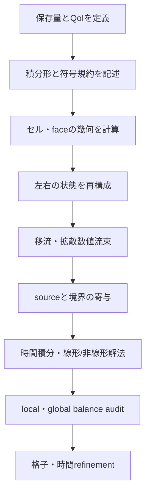



CFD計算を理解するうえで最も強力な視点は、「セル中心値を補間する」ことではなく、**各制御体積に出入りする保存量を帳簿のように一致させる**ことである。
華やかなcontourを見る前に、質量、運動量、エネルギーの流入・流出・蓄積・生成項が同じ符号規約で閉じているかを確認しなければならない。

本稿では、特定の流れや商用コードに依存しない保存型解析に共通する骨格を説明する。

## 1. 何を保存するのか

連続体の任意の保存量を(U)とすると、保存則は微分形で次のように書ける。

$$
\frac{\partial U}{\partial t}+\nabla\cdot\mathbf F(U,\nabla U)=S(U,\mathbf x,t).
$$

- (U)：単位体積当たりに蓄積される保存量
- (mathbf F)：移流と拡散を含む流束
- (S)：体積内部のsourceまたはsink
- (partial U/\partial t)：制御体積内の蓄積率

圧縮性単相流れの代表的な保存変数は次のとおりである。

$$
\mathbf U=
\begin{bmatrix}
\rho & \rho u & \rho v & \rho w & \rho E
\end{bmatrix}^{T}.
$$

ここではprimitive variableとconservative variableを区別しなければならない。
圧力と速度は解析上直感的だが、衝撃波や大きな密度変化がある問題では、保存変数を直接更新するほうがjump conditionを整合的に満たしやすい。

## 2. 制御体積の積分形が核心である理由

固定された制御体積(Omega)について積分すると、

$$
\frac{d}{dt}\int_{\Omega}U\,d\Omega
+\int_{\partial\Omega}\mathbf F\cdot\mathbf n\,dA
=\int_{\Omega}S\,d\Omega
$$

となる。
発散定理を逆に適用したこの式は、不連続が存在して微分が古典的に定義されない場合でも、弱い意味で利用できる。

直感は単純である。

> 蓄積量の変化 = 入ってきた量 - 出ていった量 + 内部で生じた量

隣接する二つのセルが共有するfaceでは、一方のセルから出る流束は、他方のセルへ入る流束でなければならない。
同じface fluxを符号だけ反転して共有すれば、内部faceの寄与は全体の和で厳密に相殺される。
これがfinite volume methodが構造的に保存的である理由だ。

## 3. 移動制御体積とReynolds transport theorem

格子や境界が動く場合、固定制御体積の式をそのまま使ってはならない。
制御面の速度を(mathbf v_g)とすると、相対輸送速度は(mathbf u-mathbf v_g)となる。

$$
\frac{d}{dt}\int_{\Omega(t)}U\,d\Omega
+\int_{\partial\Omega(t)}
\left(\mathbf F-U\mathbf v_g\right)\cdot\mathbf n\,dA
=\int_{\Omega(t)}S\,d\Omega.
$$

moving meshでは、物理流束だけでなく**幾何学的保存則**も満たさなければならない。
一様解が格子の運動だけで変化するなら、metricまたはswept-volumeの計算が整合していない。

## 4. 流束を移流と拡散に分ける

一般的な流束は、

$$
\mathbf F=\mathbf F_c-\mathbf F_d
$$

のように移流流束と拡散流束に分ける。

- 移流項は、情報が流れる方向と波の速度を考慮しなければならない。
- 拡散項は、gradient再構成と非直交補正に敏感である。
- 二つの項は、互いに異なる安定性条件と数値誤差を生む。

スカラー移流拡散方程式は、この区分を最も明快に示す。

$$
\frac{\partial (\rho\phi)}{\partial t}
+\nabla\cdot(\rho\mathbf u\phi)
=\nabla\cdot(\Gamma\nabla\phi)+S_{\phi}.
$$

faceで必要な値は、cell center値から直接は得られない。
そのため、補間、gradient reconstruction、limiterが必要になる。

## 5. 数値流束は二つの状態間の取り決めである

faceの左右の状態を(U_L,U_R)とすると、numerical fluxは

$$
\widehat{F}=\widehat{F}(U_L,U_R,\mathbf n)
$$

と書く。
優れた流束は、少なくともconsistencyを満たさなければならない。

$$
\widehat{F}(U,U,\mathbf n)=F(U)\cdot\mathbf n.
$$

代表的な選択肢の性質は次のとおりである。

| アプローチ | 長所 | 注意点 |
|---|---|---|
| central | 低い人工拡散、単純さ | 移流支配では振動する可能性 |
| upwind | 情報の方向を反映、堅牢性 | 低次では数値拡散が大きい |
| approximate Riemann | 波動構造を反映 | 実装・positivity・entropyへの対応が必要 |
| blended/high-resolution | 精度とboundednessの折衷 | limiterが収束性と滑らかさに影響 |

「高次」という名称だけで優位性は保証されない。
不連続付近では、無制限の高次再構成がovershootや負の密度・圧力を生むことがある。
limiterは局所的な次数を下げる代わりに、物理的な許容領域と単調性を守る。

## 6. face再構成と格子品質

線形再構成では、セル(P)内部の値を

$$
\phi(\mathbf x_f)\approx
\phi_P+\nabla\phi_P\cdot(\mathbf x_f-\mathbf x_P)
$$

としてfaceへ外挿する。
gradientはGreen–Gauss法またはleast-squares法で求められる。

非構造格子では、次の誤差源が重要である。

- non-orthogonality：face normalとcenter間を結ぶ線の不一致
- skewness：face centerと補間点の不一致
- aspect ratio：過度に長く薄いcell
- abrupt growth：隣接cellの大きさの急激な変化
- negative volumeまたは反転した要素

格子qualityの指標を一つ満たしただけでは、精度は保証されない。
どの項のdiscretizationがどの幾何誤差に敏感なのかも併せて調べる必要がある。

## 7. 境界条件は方程式と情報方向の一部である

境界条件は、計算後に値を付け加える設定ではない。
演算子、well-posedness、エネルギー安定性、全体のmass balanceを決定する。

### Dirichlet、Neumann、Robin

$$
\phi=g,
\qquad
\frac{\partial\phi}{\partial n}=q,
\qquad
a\phi+b\frac{\partial\phi}{\partial n}=c.
$$

各条件は、値、normal flux、混合関係を指定する。
すべての変数の値を過度に固定すると、数学的に過剰拘束となる場合がある。

### 流入境界

流入では、入ってくるcharacteristicに必要な情報を指定する。
速度だけを指定するのか、mass flowを指定するのか、total stateを指定するのかは、流動様式とモデルによって異なる。
乱流モデルを使う場合は、乱流変数も物理的に整合する方法で与えなければならない。

### 流出境界

流出では、出ていく情報を自然に通過させ、逆流の可能性に対処しなければならない。
流出面が強い再循環領域やgradient領域を横切る場合、単純なzero-gradientの仮定が問題を歪めることがある。

### 壁境界

粘性流れの固定壁では、通常no-slipとno-penetrationを用いる。
熱伝達では、等温、熱流束、対流結合のいずれかを選ぶ。
壁関数を使う場合は、最初のセルの位置とモデルの仮定が一致していなければならない。

### 対称・周期境界

対称条件は、normal velocityとnormal gradientの構造を制限する。
周期条件は対応するfaceの変数と流束を結び、回転・並進変換がある場合はベクトル成分の変換も必要になる。

## 8. 境界条件のconservation audit

ドメイン全体で和を取ると、内部faceは消え、外部境界だけが残る。

$$
\frac{dM}{dt}
+\sum_{b\in\partial\Omega}\dot m_b
=\dot m_{source}.
$$

transient計算の質量balance defectを

$$
\epsilon_M=
\frac{
\Delta M/\Delta t+sum_b\dot m_b-\dot m_{source}
}{M_{scale}/T_{scale}}
$$

のように無次元化できる。
分母が0に近い場合は相対誤差だけを使わず、絶対defectと基準scaleを併せて記録する。

## 9. 実装ワークフロー

1. 保存変数、constitutive relation、closureを区別する。
2. すべてのfaceのnormal方向と所有セルの規約を文書化する。
3. 内部face fluxを一度だけ計算し、二つのセルへ反対符号で加える。
4. 境界faceをghost state方式または直接flux方式で一貫して処理する。
5. sourceがstiffであるか、保存量の交換を生む場合は、implicitnessとpairwise balanceを検討する。
6. residualだけでなく、QoIと各保存量の帳簿を保存する。
7. manufactured solutionと単純なbenchmarkでobserved orderを確認する。

## 10. 検証チェックリスト

- [ ] 単位と次元がすべての項で一致している。
- [ ] face normalの符号を一つの規則で定義した。
- [ ] 内部face流束がmachine precision水準で相殺される。
- [ ] uniform fieldがuniform meshとdistorted meshで保存される。
- [ ] zero-source closed domainで総保存量が維持される。
- [ ] 境界ごとのmass、momentum、energy fluxを個別に出力する。
- [ ] 定常状態のresidual減少とglobal imbalance減少を併せて確認する。
- [ ] transient storageの変化が、時間積分したnet fluxと一致する。
- [ ] positivityとboundednessの違反を自動検出する。
- [ ] 三水準以上の格子でQoIの収束を確認する。
- [ ] 境界位置を移動しても主要な結論が維持されるか確認する。
- [ ] source linearizationを変更してもconservationが崩れない。

## 11. よく失敗するパターンと限界

### residualだけが小さければ収束したと判断

scaled residualはsolver内部の定義に依存する。
global balanceと関心量が依然としてdriftする可能性があるため、併せて確認しなければならない。

### 入口と出口の数値を強制的に一致させる

帳簿の不一致を後処理で正規化すると、原因を隠してしまう。
境界の符号、density evaluation、moving volume、source integrationから追跡すべきである。

### 境界条件を物理的な名称だけで選ぶ

「pressure outlet」のようなUI上の名称よりも、実際にどのcharacteristicとfluxが指定されるかを確認しなければならない。

### 高次schemeを無条件に使用

格子不良、不連続、limiterの作動により、nominal orderと実際のorderが異なる場合がある。

### 保存性だけで正確さを主張

誤った解でも総量を保存できる。
保存性は強い必要条件だが、validationの代わりにはならない。

## 12. 公式資料・原典

- Reynolds, O., “On the Dynamical Theory of Incompressible Viscous Fluids and the Determination of the Criterion,” *Philosophical Transactions*, 1895.
- Godunov, S. K., “A Difference Method for Numerical Calculation of Discontinuous Solutions,” 1959.
- LeVeque, R. J., *Finite Volume Methods for Hyperbolic Problems*, Cambridge University Press.
- NASA Glenn Research Center, [Navier–Stokes Equations](https://www.grc.nasa.gov/www/k-12/airplane/nseqs.html).
- NIST, [Method of Manufactured Solutions overview in verification resources](https://www.nist.gov/programs-projects/verification-and-validation-computational-science).

要点は一つである。
**各セルの帳簿、境界の帳簿、全体の帳簿は、同じ方程式と同じ符号規約で閉じなければならない。**
