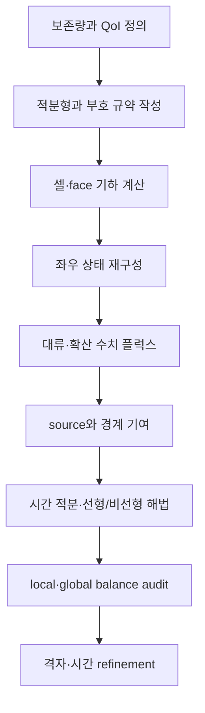



CFD 계산을 이해하는 가장 강한 관점은 “셀 중심 값을 보간한다”가 아니라 **각 제어체적에 들어오고 나가는 보존량을 장부처럼 맞춘다**는 것이다.
화려한 contour보다 먼저 질량, 운동량, 에너지의 유입·유출·축적·생성 항이 같은 부호 규약으로 닫히는지 보아야 한다.

이 글은 특정 유동이나 상용 코드에 종속되지 않는 보존형 해석의 공통 뼈대를 설명한다.

## 1. 무엇을 보존하는가

연속체의 임의 보존량을 (U)라 두면 보존법칙은 미분형으로 다음처럼 쓸 수 있다.

$$
\frac{\partial U}{\partial t}+\nabla\cdot\mathbf F(U,\nabla U)=S(U,\mathbf x,t).
$$

- (U): 단위 체적당 저장되는 보존량
- (mathbf F): 대류와 확산을 포함한 플럭스
- (S): 체적 내부 source 또는 sink
- (partial U/\partial t): 제어체적 안의 축적률

압축성 단일상 유동의 대표 보존변수는 다음과 같다.

$$
\mathbf U=
\begin{bmatrix}
\rho & \rho u & \rho v & \rho w & \rho E
\end{bmatrix}^{T}.
$$

여기서 primitive variable과 conservative variable을 구분해야 한다.
압력과 속도는 해석에 직관적이지만, 충격파나 큰 밀도 변화가 있는 문제에서는 보존변수를 직접 업데이트하는 편이 jump condition을 일관되게 만족시키기 쉽다.

## 2. 제어체적 적분형이 핵심인 이유

고정된 제어체적 (Omega)에 대해 적분하면

$$
\frac{d}{dt}\int_{\Omega}U\,d\Omega
+\int_{\partial\Omega}\mathbf F\cdot\mathbf n\,dA
=\int_{\Omega}S\,d\Omega
$$

가 된다.
발산정리를 거꾸로 적용한 이 식은 불연속이 존재해 미분이 고전적으로 정의되지 않는 경우에도 약한 의미로 사용할 수 있다.

직관은 단순하다.

> 저장량의 변화 = 들어온 양 - 나간 양 + 내부에서 생긴 양

인접한 두 셀이 공유하는 face에서 한 셀의 유출 플럭스는 다른 셀의 유입 플럭스여야 한다.
같은 face flux를 부호만 바꾸어 공유하면 내부 face 기여가 전역 합에서 정확히 상쇄된다.
이것이 finite volume method가 구조적으로 보존적인 이유다.

## 3. 이동 제어체적과 Reynolds transport theorem

격자나 경계가 움직인다면 고정 제어체적 식을 그대로 쓰면 안 된다.
제어면 속도를 (mathbf v_g)라 두면 상대 수송속도는 (mathbf u-mathbf v_g)가 된다.

$$
\frac{d}{dt}\int_{\Omega(t)}U\,d\Omega
+\int_{\partial\Omega(t)}
\left(\mathbf F-U\mathbf v_g\right)\cdot\mathbf n\,dA
=\int_{\Omega(t)}S\,d\Omega.
$$

moving mesh에서는 물리 플럭스뿐 아니라 **기하학적 보존법칙**도 만족해야 한다.
균일한 해가 격자 운동만으로 변한다면 metric 또는 swept-volume 계산이 일관되지 않은 것이다.

## 4. 플럭스를 대류와 확산으로 나눈다

일반적인 플럭스는

$$
\mathbf F=\mathbf F_c-\mathbf F_d
$$

처럼 대류 플럭스와 확산 플럭스로 나눈다.

- 대류 항은 정보가 흐르는 방향과 파동 속도를 고려해야 한다.
- 확산 항은 gradient 재구성과 비직교 보정에 민감하다.
- 두 항은 서로 다른 안정성 조건과 수치 오차를 만든다.

스칼라 대류-확산 방정식은 이 구분을 가장 투명하게 보여 준다.

$$
\frac{\partial (\rho\phi)}{\partial t}
+\nabla\cdot(\rho\mathbf u\phi)
=\nabla\cdot(\Gamma\nabla\phi)+S_{\phi}.
$$

face에서 필요한 값은 cell center 값만으로 바로 주어지지 않는다.
따라서 보간, gradient reconstruction, limiter가 필요하다.

## 5. 수치 플럭스는 두 상태 사이의 약속이다

face 좌우 상태를 (U_L,U_R)라 하면 numerical flux는

$$
\widehat{F}=\widehat{F}(U_L,U_R,\mathbf n)
$$

로 쓴다.
좋은 플럭스는 적어도 consistency를 만족해야 한다.

$$
\widehat{F}(U,U,\mathbf n)=F(U)\cdot\mathbf n.
$$

대표 선택의 성격은 다음과 같다.

| 접근 | 장점 | 주의점 |
|---|---|---|
| central | 낮은 인공확산, 단순성 | 대류 지배에서 진동 가능 |
| upwind | 정보 방향 반영, 견고성 | 저차에서는 수치확산 큼 |
| approximate Riemann | 파동 구조 반영 | 구현·positivity·entropy 처리 필요 |
| blended/high-resolution | 정확도와 boundedness 절충 | limiter가 수렴성과 매끄러움에 영향 |

“고차”라는 명칭만으로 우월함이 보장되지 않는다.
불연속 부근에서는 무제한 고차 재구성이 overshoot와 음의 밀도·압력을 만들 수 있다.
limiter는 국소 차수를 낮추는 대신 물리적 허용영역과 단조성을 지킨다.

## 6. face 재구성과 격자 품질

선형 재구성은 셀 (P) 내부 값을

$$
\phi(\mathbf x_f)\approx
\phi_P+\nabla\phi_P\cdot(\mathbf x_f-\mathbf x_P)
$$

로 face에 외삽한다.
gradient는 Green–Gauss 또는 least-squares 방식으로 구할 수 있다.

비정렬 격자에서는 다음 오차원이 중요하다.

- non-orthogonality: face normal과 center 연결선 불일치
- skewness: face center와 보간점 불일치
- aspect ratio: 지나치게 길고 얇은 cell
- abrupt growth: 인접 cell 크기의 급격한 변화
- negative volume 또는 뒤집힌 요소

격자 quality 지표 하나만 통과했다고 정확도가 보장되지는 않는다.
어떤 항의 discretization이 어떤 기하 오차에 민감한지를 함께 보아야 한다.

## 7. 경계조건은 방정식과 정보 방향의 일부다

경계조건은 계산 후 값을 덧붙이는 설정이 아니다.
연산자, well-posedness, 에너지 안정성, 전체 mass balance를 결정한다.

### Dirichlet, Neumann, Robin

$$
\phi=g,
\qquad
\frac{\partial\phi}{\partial n}=q,
\qquad
a\phi+b\frac{\partial\phi}{\partial n}=c.
$$

각 조건은 값, normal flux, 혼합 관계를 지정한다.
모든 변수에 값을 과도하게 고정하면 수학적으로 과구속될 수 있다.

### 유입 경계

유입에서는 들어오는 characteristic에 필요한 정보를 지정한다.
속도만 정할지, mass flow를 정할지, total state를 정할지는 유동 체계와 모델에 따라 달라진다.
난류모델을 사용하면 난류 변수도 물리적으로 일관된 방법으로 제공해야 한다.

### 유출 경계

유출에서는 나가는 정보를 자연스럽게 통과시키고 역류 가능성을 처리해야 한다.
유출면이 강한 재순환이나 gradient 영역을 자르면 단순 zero-gradient 가정이 문제를 왜곡할 수 있다.

### 벽 경계

점성 유동의 고정 벽에서는 보통 no-slip과 no-penetration을 사용한다.
열전달은 등온, 열유속, 대류 결합 중 하나를 선택한다.
벽함수를 쓰는 경우 첫 셀 위치와 모델 가정이 일치해야 한다.

### 대칭·주기 경계

대칭 조건은 normal velocity와 normal gradient 구조를 제한한다.
주기 조건은 대응 face의 변수와 플럭스를 연결하며, 회전·병진 변환이 있다면 벡터 성분 변환도 필요하다.

## 8. 경계조건의 conservation audit

도메인 전체를 합하면 내부 face는 사라지고 외부 경계만 남는다.

$$
\frac{dM}{dt}
+\sum_{b\in\partial\Omega}\dot m_b
=\dot m_{source}.
$$

transient 계산의 질량 balance defect를

$$
\epsilon_M=
\frac{
\Delta M/\Delta t+sum_b\dot m_b-\dot m_{source}
}{M_{scale}/T_{scale}}
$$

처럼 무차원화할 수 있다.
분모가 0에 가까운 경우 상대오차만 쓰지 말고 절대 defect와 기준 scale을 함께 기록한다.

## 9. 구현 워크플로

1. 보존변수, constitutive relation, closure를 구분한다.
2. 모든 face의 normal 방향과 소유 셀 규약을 문서화한다.
3. 내부 face flux를 한 번 계산해 두 셀에 반대 부호로 더한다.
4. 경계 face를 ghost state 또는 직접 flux 방식으로 일관되게 처리한다.
5. source가 stiff하거나 보존량 교환을 만들면 implicitness와 pairwise balance를 검토한다.
6. residual뿐 아니라 QoI와 각 보존량 장부를 저장한다.
7. 제조해와 단순 benchmark로 observed order를 확인한다.

## 10. 검증 체크리스트

- [ ] 단위와 차원이 모든 항에서 일치한다.
- [ ] face normal 부호를 단일 규칙으로 정의했다.
- [ ] 내부 face 플럭스가 machine precision 수준으로 상쇄된다.
- [ ] uniform field가 uniform mesh와 distorted mesh에서 보존된다.
- [ ] zero-source closed domain에서 총 보존량이 유지된다.
- [ ] boundary별 mass, momentum, energy flux를 따로 출력한다.
- [ ] 정상상태 residual 감소와 global imbalance 감소를 함께 본다.
- [ ] transient storage 변화가 시간 적분된 net flux와 맞는다.
- [ ] positivity와 boundedness 위반을 자동 탐지한다.
- [ ] 세 수준 이상 격자에서 QoI 수렴을 확인한다.
- [ ] 경계 위치를 이동해도 주요 결론이 유지되는지 확인한다.
- [ ] source linearization을 바꾸었을 때 conservation이 깨지지 않는다.

## 11. 자주 실패하는 패턴과 한계

### residual만 작으면 수렴했다고 판단

scaled residual은 solver 내부 정의에 의존한다.
global balance와 관심량이 여전히 drift할 수 있으므로 함께 보아야 한다.

### 입구와 출구 수치를 강제로 맞춤

장부 불일치를 후처리로 정규화하면 원인을 숨긴다.
경계 부호, density evaluation, moving volume, source integration부터 추적해야 한다.

### 경계조건을 물리 이름만으로 선택

“pressure outlet” 같은 UI 이름보다 어떤 characteristic과 flux가 실제로 지정되는지 확인해야 한다.

### 고차 scheme을 무조건 사용

격자 불량, 불연속, limiter 활성화 때문에 nominal order와 실제 order가 다를 수 있다.

### 보존성만으로 정확성을 주장

틀린 해도 총량을 보존할 수 있다.
보존성은 강한 필요조건이지만 validation을 대체하지 않는다.

## 12. 공식·원전 참고자료

- Reynolds, O., “On the Dynamical Theory of Incompressible Viscous Fluids and the Determination of the Criterion,” *Philosophical Transactions*, 1895.
- Godunov, S. K., “A Difference Method for Numerical Calculation of Discontinuous Solutions,” 1959.
- LeVeque, R. J., *Finite Volume Methods for Hyperbolic Problems*, Cambridge University Press.
- NASA Glenn Research Center, [Navier–Stokes Equations](https://www.grc.nasa.gov/www/k-12/airplane/nseqs.html).
- NIST, [Method of Manufactured Solutions overview in verification resources](https://www.nist.gov/programs-projects/verification-and-validation-computational-science).

핵심은 하나다.
**각 셀의 장부, 경계의 장부, 전역 장부가 같은 방정식과 같은 부호 규약으로 닫혀야 한다.**
