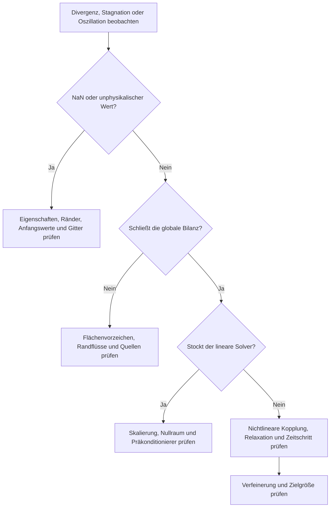



In der CFD vermischt „die Berechnung funktioniert nicht“ mehrere Phänomene.
Die Zeitintegration kann instabil sein, die Druck-Geschwindigkeits-Kopplung kann oszillieren, das lineare System kann schlecht konditioniert oder die Randbedingungen können falsch sein.
Für eine treffende Abhilfe muss die Ursache nach Schicht getrennt werden.

## 1. Stabilität, Konvergenz und Genauigkeit sind verschieden

- **Konsistenz**: Nähert sich die diskrete Gleichung der ursprünglichen Gleichung an, wenn Gitterabstand und Zeitschritt gegen null gehen?
- **Stabilität**: Werden kleine Störungen und Rundungsfehler während der Berechnung kontrolliert?
- **Konvergenz**: Nähert sich die diskrete Lösung der Lösung des kontinuierlichen Problems an?
- **Iterative Konvergenz**: Hat der algebraische Solver das gegebene diskrete Problem hinreichend gelöst?
- **Genauigkeit**: Ist der Gesamtfehler der interessierenden Größe für den vorgesehenen Zweck hinreichend klein?

Ein implizites Schema kann bei großem Zeitschritt ein Divergieren vermeiden und zugleich den transienten Verlauf verschmieren.
Ein niedriges Residuum kann dennoch zur Lösung einer falschen diskreten Gleichung gehören.
Diese Unterscheidung ist der Ausgangspunkt jeder Diagnose.

## 2. Intuition für die CFL-Zahl

Betrachten Sie die eindimensionale Advektionsgleichung.

$$
\frac{\partial u}{\partial t}+a\frac{\partial u}{\partial x}=0.
$$

Die CFL-Zahl gibt an, wie viele Zellen sich Information während eines Zeitschritts bewegt.

$$
\mathrm{CFL}=\frac{|a|\Delta t}{\Delta x}.
$$

Auf mehrdimensionalen unstrukturierten Gittern wird statt eines einfachen (Delta x) eine lokale CFL anhand des spektralen Radius der Flächen und des Zellvolumens verwendet.

$$
\mathrm{CFL}_P
\sim
\frac{\Delta t}{V_P}
\sum_{f\in P}\lambda_f A_f.
$$

Hier bezeichnet (lambda_f) eine repräsentative charakteristische Geschwindigkeit in Normalenrichtung.
Bei kompressiblen Problemen kann sie neben der Strömungsgeschwindigkeit die Schallgeschwindigkeit enthalten.

## 3. Die Bedeutung der CFL-Bedingung nicht überverallgemeinern

Die Stabilitätsbedingung eines expliziten Upwind-Schemas ist nicht dasselbe wie die Genauigkeitsbedingung eines impliziten Schemas.
Der zulässige Bereich variiert mit räumlicher Diskretisierung, Zeitintegrationsmethode, Steifigkeit der Quellen und Randbehandlung.

Die Von-Neumann-Analyse setzt den Fourier-Modus

$$
u_j^n=G^n e^{ikj\Delta x}
$$

ein, um den Verstärkungsfaktor (G) zu erhalten.
Lineare Probleme erfordern im Allgemeinen (|G|\le 1), doch für nichtlineare, unstrukturierte Probleme mit variablen Koeffizienten ist dieses Ergebnis nur eine lokale Orientierung und keine vollständige Garantie.

### Unterschiedliche Skalen für Advektion und Diffusion

Die Advektionsskala ist

$$
\Delta t_{adv}\sim\frac{\Delta x}{|u|}
$$

und die explizite Diffusionsskala ist ungefähr

$$
\Delta t_{diff}\sim\frac{\Delta x^2}{\nu}
$$

.
Bei Gitterverfeinerung kann die Diffusionsbeschränkung schneller strenger werden.

## 4. Stabilität ist keine hinreichende zeitliche Auflösung

Das implizite Eulerverfahren ist bei großen Zeitschritten für viele lineare Probleme stabil, aber nur von erster Ordnung genau und stark dissipativ.
Für die Auflösung der interessierenden Frequenz (omega), der Advektionstransitzeit und der Relaxationszeit einer Quelle sind separate Genauigkeitskriterien nötig.

Vergleichen Sie bei zeitlicher Verfeinerung:

- Maximalwert
- Zeitpunkt und Phase des Maximums
- Periodenmittelwert und Fluktuationsspektrum
- Integrierten Fluss oder Energie
- Ereignisreihenfolge und Zeitpunkt der Schwellenüberschreitung

## 5. Die Rolle des Drucks in inkompressibler Strömung

Die inkompressiblen Navier-Stokes-Gleichungen sind

$$
\frac{\partial\mathbf u}{\partial t}
+\nabla\cdot(\mathbf u\otimes\mathbf u)
=-\frac{1}{\rho}\nabla p
+\nu\nabla^2\mathbf u+\mathbf f,
$$

$$
\nabla\cdot\mathbf u=0
$$

.
Statt eine eigene Evolutionsgleichung zu besitzen, wirkt der Druck eher als Constraint-Multiplikator, der das Geschwindigkeitsfeld auf einen divergenzfreien Raum projiziert.

Berechnen Sie eine vorläufige Geschwindigkeit (mathbf u^*) und setzen Sie

$$
\mathbf u^{n+1}=\mathbf u^*-\frac{\Delta t}{\rho}\nabla p^{n+1}
$$

in die Kontinuität ein, um die Druck-Poisson-Gleichung zu erhalten.

$$
\nabla^2p^{n+1}=
\frac{\rho}{\Delta t}\nabla\cdot\mathbf u^*.
$$

In einer realen Finite-Volumen-Implementierung müssen Flächenfluss und Druckkorrekturkoeffizienten konsistent sein, um Checkerboarding und Massenbilanzfehler zu vermeiden.

## 6. Segregierte und gekoppelte Ansätze

| Ansatz | Struktur | Vorteil | Grenze |
|---|---|---|---|
| Segregiert | Löst die Gleichung jeder Variablen iterativ nacheinander | Speichereffizient, einfache Implementierung | Langsam oder instabil bei starker Kopplung |
| Druckkorrektur | Korrigiert Druck und Fluss nach der Impulsvorhersage | Weit verbreitet bei inkompressiblen Problemen | Empfindlich gegenüber Relaxation und Flächenkopplung |
| Vollständig gekoppelt | Löst den Variablenblock gemeinsam | Bildet starke Kopplung ab | Große Jacobi-Matrix; Präkonditionierer ist wichtig |

Die SIMPLE-Familie folgt stark der Sichtweise einer iterativen stationären Methode, die PISO-Familie dagegen einer transienten Sichtweise mit mehreren Korrekturen innerhalb eines Zeitschritts.
Verlassen Sie sich nicht auf den Namen, sondern prüfen Sie Prädiktor, Korrektor, Relaxation und Zahl der nichtorthogonalen Korrekturen des tatsächlichen Algorithmus.

## 7. Under-Relaxation ist eine Steuerung, kein Heilmittel

Für die Fixpunktiteration

$$
x^{k+1}=G(x^k)
$$

lässt sich Relaxation ausdrücken als

$$
x^{k+1}\leftarrow
x^k+\alpha\left(\tilde x^{k+1}-x^k\right),
\qquad 0<\alpha\le1
$$

.

Eine Verringerung von (alpha) kann Oszillationen dämpfen, aber die Konvergenz extrem verlangsamen.
Verbergen Sie Fehler der Randbedingungen, schlechte Gitter, ungeeignete Materialeigenschaften oder singuläre Systeme nicht durch Relaxation.

## 8. Lineare Systeme dominieren die Rechenkosten

In jeder nichtlinearen Iteration wird im Allgemeinen ein dünn besetztes lineares System der Form

$$
A x=b
$$

gelöst.
Die Auswahl des Solvers hängt von Symmetrie, positiver Definitheit, Konditionierung und Blockstruktur der Matrix ab.

- CG: Geeignet für symmetrische positiv definite Probleme
- GMRES: Stark für allgemeine nichtsymmetrische Systeme, verursacht aber Speicherkosten für die Krylov-Basis
- BiCGSTAB: Speichereffizient, doch der Konvergenzverlauf kann unregelmäßig sein
- Multigrid: Entfernt glatte und oszillatorische Fehler effizient auf verschiedenen Gittern

Ein kleines lineares Residuum

$$
r=b-Ax
$$

bedeutet nicht zwingend einen kleinen Lösungsfehler (e=x-x^*).

$$
A e=r,
\qquad
\|e\|\le\|A^{-1}\|\,\|r\|.
$$

In einem schlecht konditionierten System können ein kleines Residuum und ein großer Fehler gleichzeitig auftreten.

## 9. Zweck der Präkonditionierung

Die Verwendung eines Präkonditionierers (M) zur Lösung von

$$
M^{-1}Ax=M^{-1}b
$$

kann ein Spektrum erzeugen, das für ein Krylov-Verfahren leichter zu behandeln ist.
Ein gutes (M) approximiert (A) hinreichend und bleibt gleichzeitig kostengünstig anwendbar.

Typische Optionen sind Jacobi, ILU, algebraisches Multigrid, Domain Decomposition und physikbasierte Blockpräkonditionierer.
Kein einzelner Präkonditionierer ist optimal; auch parallele Skalierbarkeit und Setup-Kosten müssen bewertet werden.

## 10. Residuen interpretieren

Residualdefinitionen variieren: absolut, relativ, skaliert, präkonditioniert und weitere.
Prüfen Sie daher die Formel, statt nur in einer Solver-UI angezeigte Zahlen zu vergleichen.

Erfassen Sie folgende Signale gemeinsam.

- Anfangs- und Endresiduen jeder Gleichung
- Äußeres nichtlineares Residuum
- Kontinuitäts- oder globaler Erhaltungsdefekt
- Iterationsverlauf der interessierenden Größe
- Verletzungen von Beschränktheit und Positivität
- Zahl linearer Iterationen und Setup-Zeit des Präkonditionierers
- Zahl verworfener Zeitschritte oder nichtlinearer Wiederholungen

## 11. Ablauf der Konvergenzdiagnose

### Schrittweiser Workflow

1. Problem mit einfacherer Physik und kleinem Gitter reproduzieren.
2. Prüfen, dass jeder Anfangswert endlich und physikalisch gültig ist.
3. Gittervolumina, Flächeninhalte und Nichtorthogonalität auditieren.
4. Mathematische Verträglichkeit der Randbedingungen prüfen.
5. Bei einem transienten Problem die Verteilungen lokaler CFL- und Diffusionszahlen untersuchen.
6. Toleranzen des linearen Solvers an die Anforderungen der äußeren Iteration anpassen.
7. Schwierige Terme schrittweise durch nichtlineare Continuation aktivieren.
8. Relaxation und Diskretisierungsordnung zuletzt anpassen.

## 12. Checkliste zur Verifikation

- [ ] Stabilitätsbedingungen und Genauigkeitskriterien wurden separat dokumentiert.
- [ ] Nicht nur das Maximum, sondern auch Verteilung und Ort der lokalen CFL wurden geprüft.
- [ ] Zell-Péclet-Zahlen stimmen mit der Wahl des Schemas überein.
- [ ] Der Drucknullraum wird mit einer Referenz oder einem Constraint behandelt.
- [ ] Flächenmassenfluss und Korrektur der Zellgeschwindigkeit sind konsistent.
- [ ] Lineare Toleranzen sind hinreichend strenger als das äußere Residuum.
- [ ] Die Formel zur Residualnormalisierung ist bekannt.
- [ ] Die Stabilisierung der Zielgröße während der Iteration wurde geprüft.
- [ ] Der globale Erhaltungsdefekt liegt innerhalb der Toleranz.
- [ ] Phase und Maximum konvergieren bei Verringerung des Zeitschritts.
- [ ] Solvertoleranzen bleiben bei Gitteränderungen vergleichbar.
- [ ] Ergebnisreproduzierbarkeit und Reduktionsfehler wurden bei paralleler Ausführung bewertet.

## 13. Häufige Fehlermuster und Grenzen

### Glauben, eine Verringerung der CFL allein löse alles

Eine singuläre Randbedingung oder negative Materialeigenschaft wird durch einen kleinen Zeitschritt nicht behoben.

### Nur die Form des Residualplots betrachten

Ein sägezahnförmiges Residuum kann aus einer physikalischen Periode, Korrekturschleife oder einem adaptiven Schritt entstehen.
Prüfen Sie Definition und Aktualisierungszeitpunkt gemeinsam.

### Das lineare System zu genau lösen

In frühen Iterationen, wenn der äußere nichtlineare Zustand noch ungenau ist, kann die Lösung des inneren Systems bis auf Maschinengenauigkeit verschwenderisch sein.
Wie beim Inexact-Newton-Prinzip können Toleranzen an den äußeren Fortschritt angepasst werden.

### Immer dieselbe Relaxation verwenden

Die Problemsteifigkeit ändert sich mit Zeit und Iteration.
Ein fester Koeffizient ist einfach, adaptive Strategien und Continuation können jedoch effizienter sein.

### Annehmen, eine konvergierte stationäre Lösung sei eindeutig

Ein nichtlineares System kann mehrere stationäre Lösungen oder intrinsische Instationarität besitzen.
Anfangsbedingung, Continuation-Pfad und transientes Verhalten müssen geprüft werden.

## 14. Offizielle und primäre Referenzen

- Courant, Friedrichs, Lewy, „Über die partiellen Differenzengleichungen der mathematischen Physik“, 1928.
- Hestenes und Stiefel, „Methods of Conjugate Gradients for Solving Linear Systems“, 1952.
- Saad und Schultz, „GMRES: A Generalized Minimal Residual Algorithm“, 1986.
- PETSc, [Handbuch zu Krylov-Verfahren und Präkonditionierern](https://petsc.org/release/manual/ksp/).
- hypre, [Skalierbare lineare Solver und Multigrid-Verfahren](https://hypre.readthedocs.io/).
- NASA, [CFL3D-Benutzerressourcen](https://nasa.github.io/CFL3D/).

Eine gute Konvergenzstrategie senkt nicht wahllos Zahlen.
Sie besteht darin, **festzustellen, ob Fehler in den physikalischen Gleichungen, der Diskretisierung, der Kopplung oder der linearen Algebra verstärkt werden, und diese Schicht zu korrigieren**.
