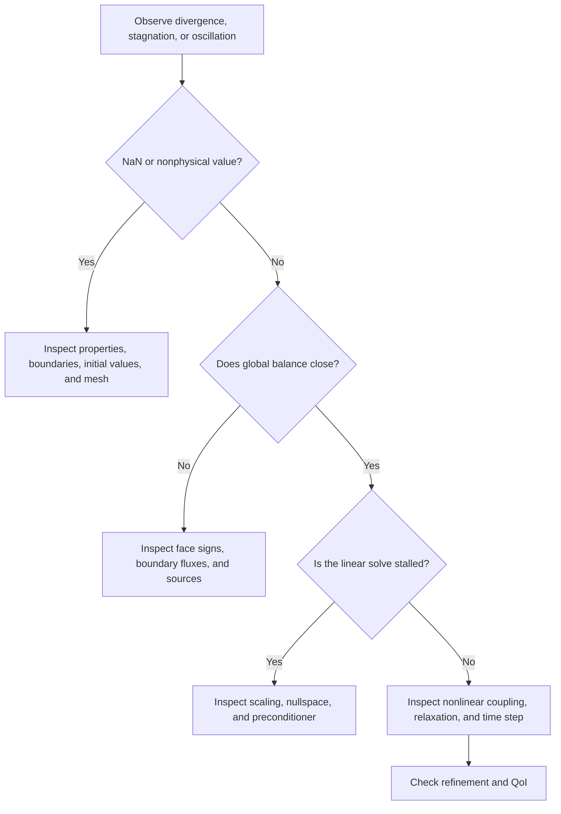



In CFD, “the computation does not work” conflates several phenomena.
Time integration may be unstable, pressure–velocity coupling may oscillate, the linear system may be ill-conditioned, or the boundary conditions may be wrong.
The cause must be separated by layer for the remedy to be accurate.

## 1. Stability, Convergence, and Accuracy Are Different

- **Consistency**: As the mesh spacing and time step approach zero, does the discrete equation approach the original equation?
- **Stability**: Are small perturbations and roundoff errors controlled during computation?
- **Convergence**: Does the discrete solution approach the solution of the continuous problem?
- **Iterative convergence**: Has the algebraic solver adequately solved the given discrete problem?
- **Accuracy**: Is the total error in the quantity of interest sufficiently small for its intended use?

An implicit scheme may avoid blowing up at a large time step while smearing the transient.
A low residual can still belong to the solution of an incorrect discrete equation.
This distinction is the starting point of every diagnosis.

## 2. Intuition for the CFL Number

Consider the one-dimensional advection equation.

$$
\frac{\partial u}{\partial t}+a\frac{\partial u}{\partial x}=0.
$$

The CFL number indicates how many cells information travels during one time step.

$$
\mathrm{CFL}=\frac{|a|\Delta t}{\Delta x}.
$$

On multidimensional, unstructured meshes, a local CFL based on face spectral radius and cell volume is used rather than one simple (Delta x).

$$
\mathrm{CFL}_P
\sim
\frac{\Delta t}{V_P}
\sum_{f\in P}\lambda_f A_f.
$$

Here, (lambda_f) is a representative characteristic speed in the normal direction.
For compressible problems, it may include the speed of sound as well as flow velocity.

## 3. Do Not Overgeneralize the Meaning of the CFL Condition

The stability condition for an explicit upwind scheme is not the same as the accuracy condition for an implicit scheme.
The admissible region varies with spatial discretization, the time-integration method, source stiffness, and boundary treatment.

Von Neumann analysis substitutes the Fourier mode

$$
u_j^n=G^n e^{ikj\Delta x}
$$

to obtain the amplification factor (G).
Linear problems generally require (|G|\le 1), but for nonlinear, unstructured, variable-coefficient problems, this result is only local guidance, not a complete guarantee.

### Different scales for advection and diffusion

The advection scale is

$$
\Delta t_{adv}\sim\frac{\Delta x}{|u|}
$$

and the explicit diffusion scale is approximately

$$
\Delta t_{diff}\sim\frac{\Delta x^2}{\nu}
$$

.
As the mesh is refined, the diffusion restriction may become stricter more rapidly.

## 4. Stability Is Not Sufficient Temporal Resolution

Implicit Euler is stable at large time steps for many linear problems, but it is first-order accurate and strongly dissipative.
Separate accuracy criteria are needed to resolve the frequency of interest (omega), advection transit time, and source relaxation time.

Compare the following during temporal refinement.

- Peak magnitude
- Peak arrival time and phase
- Period average and fluctuation spectrum
- Integrated flux or energy
- Event order and threshold-crossing time

## 5. The Role of Pressure in Incompressible Flow

The incompressible Navier–Stokes equations are

$$
\frac{\partial\mathbf u}{\partial t}
+\nabla\cdot(\mathbf u\otimes\mathbf u)
=-\frac{1}{\rho}\nabla p
+\nu\nabla^2\mathbf u+\mathbf f,
$$

$$
\nabla\cdot\mathbf u=0
$$

.
Rather than having a separate evolution equation, pressure acts more like a constraint multiplier that projects the velocity field onto a divergence-free space.

Compute a tentative velocity (mathbf u^*) and substitute

$$
\mathbf u^{n+1}=\mathbf u^*-\frac{\Delta t}{\rho}\nabla p^{n+1}
$$

into continuity to obtain the pressure Poisson equation.

$$
\nabla^2p^{n+1}=
\frac{\rho}{\Delta t}\nabla\cdot\mathbf u^*.
$$

In an actual finite-volume implementation, the face flux and pressure-correction coefficients must be consistent to avoid checkerboarding and mass imbalance.

## 6. Segregated and Coupled Approaches

| Approach | Structure | Advantage | Limitation |
|---|---|---|---|
| Segregated | Iteratively solves each variable's equation in sequence | Memory-efficient, simple implementation | Slow or unstable under strong coupling |
| Pressure correction | Corrects pressure and flux after momentum prediction | Widely used for incompressible problems | Sensitive to relaxation and face coupling |
| Fully coupled | Solves the variable block together | Reflects strong coupling | Large Jacobian; preconditioner is important |

The SIMPLE family strongly reflects the perspective of an iterative steady-state method, whereas the PISO family strongly reflects a transient perspective with multiple corrections within one time step.
Rather than relying on the name, inspect the actual algorithm's predictor, corrector, relaxation, and number of non-orthogonal corrections.

## 7. Under-Relaxation Is a Control, Not a Cure

For the fixed-point iteration

$$
x^{k+1}=G(x^k)
$$

relaxation can be expressed as

$$
x^{k+1}\leftarrow
x^k+\alpha\left(\tilde x^{k+1}-x^k\right),
\qquad 0<\alpha\le1
$$

.

Reducing (alpha) can damp oscillations but may make convergence extremely slow.
Do not conceal boundary-condition errors, poor meshes, inappropriate material properties, or singular systems with relaxation.

## 8. Linear Systems Dominate Computational Cost

At each nonlinear iteration, one generally solves a sparse linear system of the form

$$
A x=b
$$

.
Solver selection depends on matrix symmetry, positive definiteness, conditioning, and block structure.

- CG: suitable for symmetric positive-definite problems
- GMRES: strong for general nonsymmetric systems, but incurs Krylov-basis storage costs
- BiCGSTAB: memory-efficient, but its convergence history may be irregular
- Multigrid: efficiently removes smooth and oscillatory errors on different grids

A small linear residual

$$
r=b-Ax
$$

does not necessarily imply a small solution error (e=x-x^*).

$$
A e=r,
\qquad
\|e\|\le\|A^{-1}\|\,\|r\|.
$$

In an ill-conditioned system, a small residual can coexist with a large error.

## 9. Purpose of Preconditioning

Using a preconditioner (M) to solve

$$
M^{-1}Ax=M^{-1}b
$$

can create a spectrum that is easier for a Krylov method to handle.
A good (M) approximates (A) sufficiently while remaining inexpensive to apply.

Typical choices include Jacobi, ILU, algebraic multigrid, domain decomposition, and physics-based block preconditioners.
No one preconditioner is optimal, and parallel scalability and setup cost must also be evaluated.

## 10. How to Interpret Residuals

Residual definitions vary: absolute, relative, scaled, preconditioned, and others.
Therefore, inspect the formula rather than comparing numbers shown in a solver UI alone.

Record the following signals together.

- Initial and final residuals for each equation
- Outer nonlinear residual
- Continuity or global conservation defect
- Iteration history of the quantity of interest
- Boundedness and positivity violations
- Number of linear iterations and preconditioner setup time
- Number of rejected time steps or nonlinear retries

## 11. Convergence-Diagnosis Flow

### Step-by-step workflow

1. Reproduce the issue with simpler physics and a small mesh.
2. Check that every initial value is finite and physically valid.
3. Audit mesh volumes, face areas, and non-orthogonality.
4. Check the mathematical compatibility of boundary conditions.
5. For a transient problem, inspect the distributions of local CFL and diffusion numbers.
6. Match linear-solver tolerances to the needs of the outer iteration.
7. Gradually activate difficult terms through nonlinear continuation.
8. Adjust relaxation and discretization order last.

## 12. Verification Checklist

- [ ] Stability conditions and accuracy criteria have been documented separately.
- [ ] The distribution and location of local CFL, not only its maximum, have been checked.
- [ ] Cell Peclet numbers agree with the choice of scheme.
- [ ] The pressure nullspace is handled with a reference or constraint.
- [ ] Face mass flux and cell velocity correction are consistent.
- [ ] Linear tolerances are sufficiently tighter than the outer residual.
- [ ] The residual-normalization formula is known.
- [ ] The QoI has been checked for stabilization during iteration.
- [ ] The global conservation defect is within tolerance.
- [ ] Phase and peak converge as the time step is reduced.
- [ ] Solver tolerances remain comparable when the mesh changes.
- [ ] Result reproducibility and reduction error have been evaluated in parallel execution.

## 13. Common Failure Patterns and Limitations

### Believing that reducing the CFL alone solves everything

A singular boundary condition or negative material property is not fixed by a small time step.

### Looking only at the shape of the residual plot

A sawtooth residual may arise from a physical period, correction loop, or adaptive step.
Inspect its definition and update timing together.

### Solving the linear system too accurately

During early iterations when the outer nonlinear state is still inaccurate, solving the inner system to machine precision can be wasteful.
As in the inexact Newton principle, tolerances can be adjusted to outer progress.

### Always using the same relaxation

Problem stiffness changes with time and iteration.
A fixed coefficient is simple, but adaptive strategies and continuation may be more efficient.

### Assuming a converged steady solution is unique

A nonlinear system may have multiple steady solutions or intrinsic unsteadiness.
The initial condition, continuation path, and transient behavior must be checked.

## 14. Official and Primary References

- Courant, Friedrichs, Lewy, “Über die partiellen Differenzengleichungen der mathematischen Physik,” 1928.
- Hestenes and Stiefel, “Methods of Conjugate Gradients for Solving Linear Systems,” 1952.
- Saad and Schultz, “GMRES: A Generalized Minimal Residual Algorithm,” 1986.
- PETSc, [Krylov methods and preconditioner manual](https://petsc.org/release/manual/ksp/).
- hypre, [Scalable Linear Solvers and Multigrid Methods](https://hypre.readthedocs.io/).
- NASA, [CFL3D User Resources](https://nasa.github.io/CFL3D/).

A good convergence strategy is not indiscriminately lowering numbers.
It is **finding whether error is amplified in the physical equations, discretization, coupling, or linear algebra, and correcting that layer**.
