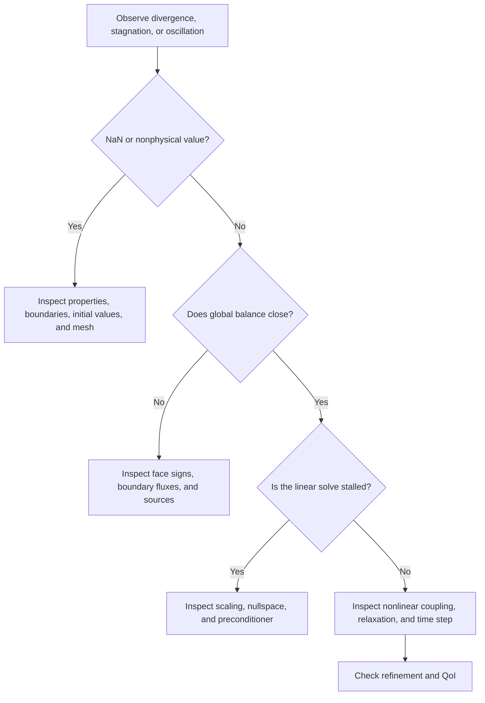



En CFD, “el cálculo no funciona” combina varios fenómenos.
La integración temporal puede ser inestable, el acoplamiento presión-velocidad puede oscilar, el sistema lineal puede estar mal condicionado o las condiciones de contorno pueden ser incorrectas.
La causa debe estar separada por capas para que el remedio sea preciso.

## 1. La estabilidad, la convergencia y la precisión son diferentes

- **Consistencia**: a medida que el espaciado de la malla y el paso de tiempo se acercan a cero, ¿se acerca la ecuación discreta a la ecuación original?
- **Estabilidad**: ¿Se controlan las pequeñas perturbaciones y los errores de redondeo durante el cálculo?
- **Convergencia**: ¿La solución discreta se acerca a la solución del problema continuo?
- **Convergencia iterativa**: ¿El solucionador algebraico ha resuelto adecuadamente el problema discreto dado?
- **Precisión**: ¿El error total en la cantidad de interés es lo suficientemente pequeño para el uso previsto?

Un esquema implícito puede evitar que estalle en un gran paso de tiempo mientras mancha lo transitorio.
Un residual bajo todavía puede pertenecer a la solución de una ecuación discreta incorrecta.
Esta distinción es el punto de partida de todo diagnóstico.

## 2. Intuición para el Número CFL

Considere la ecuación de advección unidimensional.

$$
\frac{\partial u}{\partial t}+a\frac{\partial u}{\partial x}=0.
$$

El número CFL indica cuántas celdas viaja la información durante un paso de tiempo.

$$
\mathrm{CFL}=\frac{|a|\Delta t}{\Delta x}.
$$

En mallas multidimensionales y no estructuradas, se utiliza un CFL local basado en el radio espectral de la cara y el volumen de la celda en lugar de uno simple (Delta x).

$$
\mathrm{CFL}_P
\sim
\frac{\Delta t}{V_P}
\sum_{f\in P}\lambda_f A_f.
$$

Aquí, (lambda_f) es una velocidad característica representativa en la dirección normal.
Para problemas compresibles, puede incluir la velocidad del sonido y la velocidad del flujo.

## 3. No generalice demasiado el significado de la condición CFL

La condición de estabilidad para un esquema explícito de ceñida no es la misma que la condición de precisión para un esquema implícito.
La región admisible varía con la discretización espacial, el método de integración temporal, la rigidez de la fuente y el tratamiento de los límites.

El análisis de von Neumann sustituye el modo de Fourier

$$
u_j^n=G^n e^{ikj\Delta x}
$$

para obtener el factor de amplificación (G).
Los problemas lineales generalmente requieren (|G|\le 1), pero para problemas no lineales, no estructurados y de coeficientes variables, este resultado es solo una guía local, no una garantía completa.

### Diferentes escalas para advección y difusión.

La escala de advección es

$$
\Delta t_{adv}\sim\frac{\Delta x}{|u|}
$$

y la escala de difusión explícita es aproximadamente

$$
\Delta t_{diff}\sim\frac{\Delta x^2}{\nu}
$$

.
A medida que se refina la malla, la restricción de la difusión puede volverse más estricta y más rápidamente.

## 4. La estabilidad no es suficiente Resolución Temporal

Euler implícito es estable en grandes pasos de tiempo para muchos problemas lineales, pero es preciso de primer orden y fuertemente disipativo.
Se necesitan criterios de precisión separados para resolver la frecuencia de interés (omega), el tiempo de tránsito de advección y el tiempo de relajación de la fuente.

Compare lo siguiente durante el refinamiento temporal.

- Magnitud máxima
- Hora y fase punta de llegada.
- Promedio del período y espectro de fluctuación.
- Flujo o energía integrados.
- Orden de eventos y tiempo de cruce de umbrales.

## 5. El papel de la presión en el flujo incompresible

Las ecuaciones incompresibles de Navier-Stokes son

$$
\frac{\partial\mathbf u}{\partial t}
+\nabla\cdot(\mathbf u\otimes\mathbf u)
=-\frac{1}{\rho}\nabla p
+\nu\nabla^2\mathbf u+\mathbf f,
$$

$$
\nabla\cdot\mathbf u=0
$$

.
En lugar de tener una ecuación de evolución separada, la presión actúa más como un multiplicador de restricción que proyecta el campo de velocidades en un espacio libre de divergencia.

Calcule una velocidad tentativa (mathbf u^*) y sustitúyala

$$
\mathbf u^{n+1}=\mathbf u^*-\frac{\Delta t}{\rho}\nabla p^{n+1}
$$

en continuidad para obtener la ecuación de Poisson de presión.

$$
\nabla^2p^{n+1}=
\frac{\rho}{\Delta t}\nabla\cdot\mathbf u^*.
$$

En una implementación real de volumen finito, el flujo frontal y los coeficientes de corrección de presión deben ser consistentes para evitar el tablero de ajedrez y el desequilibrio de masa.

## 6. Enfoques segregados y acoplados

| Enfoque | Estructura | Ventaja | Limitación |
|---|---|---|---|
| Segregado | Resuelve iterativamente la ecuación de cada variable en secuencia | Implementación sencilla y eficiente en memoria | Lento o inestable bajo acoplamiento fuerte |
| Corrección de presión | Corrige la presión y el flujo después de la predicción del impulso | Ampliamente utilizado para problemas incompresibles | Sensible a la relajación y al acoplamiento facial |
| Totalmente acoplado | Resuelven juntos el bloque de variables | Refleja un fuerte acoplamiento | Gran jacobiano; preacondicionador es importante |

La familia SIMPLE refleja fuertemente la perspectiva de un método iterativo de estado estable, mientras que la familia PISO refleja fuertemente una perspectiva transitoria con múltiples correcciones dentro de un paso de tiempo.
En lugar de confiar en el nombre, inspeccione el predictor, el corrector, la relajación y el número de correcciones no ortogonales del algoritmo real.

## 7. La falta de relajación es un control, no una cura

Para la iteración de punto fijo

$$
x^{k+1}=G(x^k)
$$

La relajación se puede expresar como

$$
x^{k+1}\leftarrow
x^k+\alpha\left(\tilde x^{k+1}-x^k\right),
\qquad 0<\alpha\le1
$$

.

La reducción (alfa) puede amortiguar las oscilaciones pero puede hacer que la convergencia sea extremadamente lenta.
No oculte errores en las condiciones de los límites, mallas deficientes, propiedades materiales inapropiadas o sistemas singulares con relajación.

## 8. Los sistemas lineales dominan el costo computacional

En cada iteración no lineal, generalmente se resuelve un sistema lineal disperso de la forma

$$
A x=b
$$

.
La selección del solucionador depende de la simetría de la matriz, la definición positiva, el condicionamiento y la estructura del bloque.

- CG: adecuado para problemas simétricos definidos positivos
- GMRES: fuerte para sistemas no simétricos generales, pero incurre en costos de almacenamiento basados en Krylov
- BiCGSTAB: memoria eficiente, pero su historial de convergencia puede ser irregular
- Multigrid: elimina eficientemente errores suaves y oscilatorios en diferentes grillas

Un pequeño residuo lineal

$$
r=b-Ax
$$

no implica necesariamente un pequeño error de solución (e=x-x^*).

$$
A e=r,
\qquad
\|e\|\le\|A^{-1}\|\,\|r\|.
$$

En un sistema mal acondicionado, un pequeño residuo puede coexistir con un gran error.

## 9. Propósito del Preacondicionamiento

Usando un precondicionador (M) para resolver

$$
M^{-1}Ax=M^{-1}b
$$

puede crear un espectro que es más fácil de manejar para un método de Krylov.
Un bien (M) se aproxima suficientemente a (A) sin dejar de ser económico de aplicar.

Las opciones típicas incluyen Jacobi, ILU, multigrid algebraica, descomposición de dominios y precondicionadores de bloques basados ​​en física.
Ningún preacondicionador es óptimo y también se deben evaluar la escalabilidad paralela y el costo de instalación.

## 10. Cómo interpretar los residuos

Las definiciones residuales varían: absoluta, relativa, escalada, precondicionada y otras.
Por lo tanto, inspeccione la fórmula en lugar de comparar los números que se muestran en un solucionador UI solo.

Registre las siguientes señales juntas.

- Residuos iniciales y finales para cada ecuación.
- Residuo no lineal exterior
- Continuidad o defecto de conservación global
- Historial de iteraciones de la cantidad de interés.
- Violaciones de límites y positividad.
- Número de iteraciones lineales y tiempo de configuración del preacondicionador.
- Número de pasos de tiempo rechazados o reintentos no lineales

## 11. Flujo de diagnóstico y convergencia

### Flujo de trabajo paso a paso

1. Reproduzca el problema con una física más simple y una malla pequeña.
2. Verifique que cada valor inicial sea finito y físicamente válido.
3. Auditar los volúmenes de malla, las áreas de las caras y la no ortogonalidad.
4. Verifique la compatibilidad matemática de las condiciones de contorno.
5. Para un problema transitorio, inspeccione las distribuciones de CFL locales y los números de difusión.
6. Haga coincidir las tolerancias del solucionador lineal con las necesidades de la iteración externa.
7. Active gradualmente los términos difíciles mediante una continuación no lineal.
8. Ajuste el orden de relajación y discretización al final.

## 12. Lista de verificación de verificación

- [ ] Las condiciones de estabilidad y los criterios de precisión se han documentado por separado.
- [ ] Se ha comprobado la distribución y ubicación del local CFL, no solo su máximo.
- [ ] Los números de Cell Peclet concuerdan con la elección del esquema.
- [] El espacio nulo de presión se maneja con una referencia o restricción.
- [] La corrección del flujo de masa facial y de la velocidad de la celda son consistentes.
- [ ] Las tolerancias lineales son suficientemente más estrictas que el residual exterior.
- [ ] Se conoce la fórmula de normalización residual.
- [] Se ha comprobado la estabilización del QoI durante la iteración.
- [ ] El defecto de conservación global está dentro de la tolerancia.
- [ ] La fase y el pico convergen a medida que se reduce el paso de tiempo.
- [] Las tolerancias del solucionador siguen siendo comparables cuando cambia la malla.
- [ ] La reproducibilidad de los resultados y la reducción del error se han evaluado en ejecución paralela.

## 13. Patrones de fallas y limitaciones comunes

### Creer que reducir el CFL por sí solo lo soluciona todo

Una condición de contorno singular o una propiedad material negativa no se fija con un pequeño paso de tiempo.

### Mirando solo la forma del gráfico residual

Un residuo en forma de diente de sierra puede surgir de un período físico, un ciclo de corrección o un paso de adaptación.
Inspeccione su definición y actualice el tiempo juntos.

### Resolver el sistema lineal con demasiada precisión

Durante las primeras iteraciones, cuando el estado no lineal externo aún es inexacto, resolver el sistema interno con precisión de máquina puede ser un desperdicio.
Como en el inexacto principio de Newton, las tolerancias se pueden ajustar al progreso exterior.

### Siempre usando la misma relajación

La rigidez del problema cambia con el tiempo y la iteración.
Un coeficiente fijo es simple, pero las estrategias adaptativas y la continuación pueden ser más eficientes.

### Suponiendo que una solución estacionaria convergente es única

Un sistema no lineal puede tener múltiples soluciones estables o inestabilidad intrínseca.
Se deben verificar la condición inicial, la ruta de continuación y el comportamiento transitorio.

## 14. Referencias oficiales y primarias

- Courant, Friedrichs, Lewy, “Über die partiellen Differenzengleichungen der mathematischen Physik”, 1928.
- Hestenes y Stiefel, “Métodos de gradientes conjugados para resolver sistemas lineales”, 1952.
- Saad y Schultz, “GMRES: Un algoritmo residual mínimo generalizado”, 1986.
- PETSc, [Manual de métodos y preacondicionadores de Krylov](https://petsc.org/release/manual/ksp/).
- hypre, [Solucionadores lineales escalables y métodos multicuadrícula](https://hypre.readthedocs.io/).
- NASA, [Recursos de usuario CFL3D](https://nasa.github.io/CFL3D/).

Una buena estrategia de convergencia no es reducir las cifras indiscriminadamente.
Se trata de **encontrar si el error se amplifica en las ecuaciones físicas, la discretización, el acoplamiento o el álgebra lineal, y corregir esa capa**.
