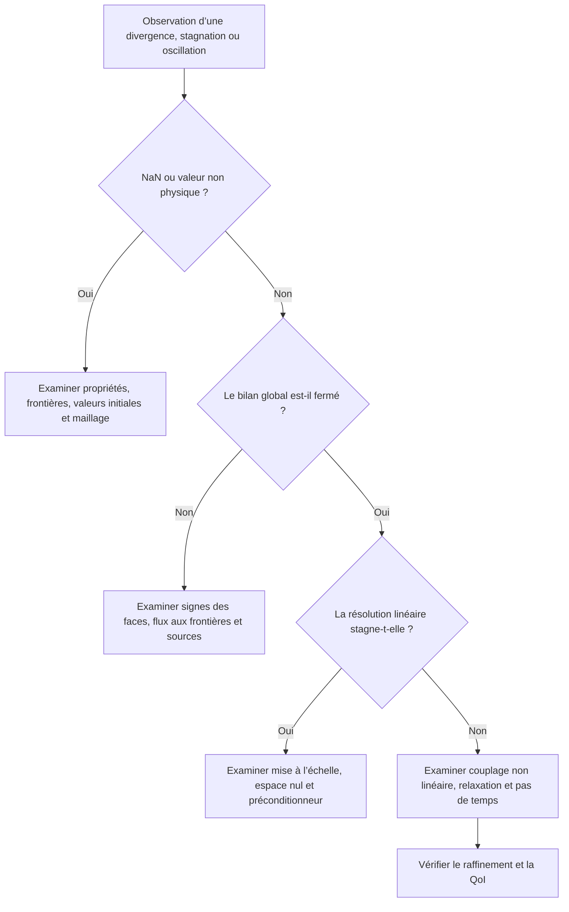



En CFD, dire que « le calcul ne fonctionne pas » mêle plusieurs phénomènes.
L’intégration temporelle peut être instable, le couplage pression-vitesse peut osciller, le système linéaire peut être mal conditionné ou les conditions aux limites peuvent être erronées.
Il faut séparer les causes par niveau pour appliquer le bon remède.

## 1. Stabilité, convergence et précision sont différentes

- **Consistance** : lorsque le pas de maillage et le pas de temps tendent vers zéro, l’équation discrète tend-elle vers l’équation d’origine ?
- **Stabilité** : les petites perturbations et les erreurs d’arrondi restent-elles maîtrisées pendant le calcul ?
- **Convergence** : la solution discrète tend-elle vers celle du problème continu ?
- **Convergence itérative** : le solveur algébrique a-t-il suffisamment résolu le problème discret donné ?
- **Précision** : l’erreur totale de la quantité d’intérêt est-elle assez faible pour l’usage visé ?

Un schéma implicite peut ne pas diverger avec un grand pas de temps tout en lissant le régime transitoire.
Un résidu faible peut tout de même correspondre à la solution d’une équation discrète incorrecte.
Cette distinction est le point de départ de tout diagnostic.

## 2. Intuition du nombre CFL

Considérons l’équation d’advection unidimensionnelle.

$$
\frac{\partial u}{\partial t}+a\frac{\partial u}{\partial x}=0.
$$

Le nombre CFL indique le nombre de cellules parcourues par l’information pendant un pas de temps.

$$
\mathrm{CFL}=\frac{|a|\Delta t}{\Delta x}.
$$

Sur un maillage multidimensionnel non structuré, on utilise plutôt un CFL local fondé sur le rayon spectral des faces et le volume des cellules qu’un simple (Delta x).

$$
\mathrm{CFL}_P
\sim
\frac{\Delta t}{V_P}
\sum_{f\in P}\lambda_f A_f.
$$

Ici, (lambda_f) est une vitesse caractéristique représentative dans la direction normale.
Pour un problème compressible, elle peut inclure la vitesse du son en plus de celle de l’écoulement.

## 3. Ne pas généraliser à l’excès la signification de la condition CFL

La condition de stabilité d’un schéma upwind explicite n’est pas la condition de précision d’un schéma implicite.
La région admissible varie avec la discrétisation spatiale, la méthode d’intégration temporelle, la raideur des sources et le traitement des frontières.

L’analyse de von Neumann substitue le mode de Fourier

$$
u_j^n=G^n e^{ikj\Delta x}
$$

afin d’obtenir le facteur d’amplification (G).
Pour les problèmes linéaires, on exige généralement (|G|\le 1), mais, dans les problèmes non linéaires, non structurés ou à coefficients variables, ce résultat ne constitue qu’une indication locale et non une garantie complète.

### Échelles différentes pour l’advection et la diffusion

L’échelle d’advection est

$$
\Delta t_{adv}\sim\frac{\Delta x}{|u|}
$$

et l’échelle de diffusion explicite vaut approximativement

$$
\Delta t_{diff}\sim\frac{\Delta x^2}{\nu}
$$

.
Lorsque le maillage est raffiné, la contrainte de diffusion peut se durcir plus rapidement.

## 4. La stabilité ne garantit pas une résolution temporelle suffisante

Euler implicite est stable avec de grands pas de temps pour de nombreux problèmes linéaires, mais il est précis au premier ordre et fortement dissipatif.
Des critères de précision distincts sont nécessaires pour résoudre la fréquence d’intérêt (omega), le temps de transit advectif et le temps de relaxation des sources.

Lors d’un raffinement temporel, il faut comparer les éléments suivants.

- Amplitude du pic
- Instant d’arrivée et phase du pic
- Moyenne périodique et spectre des fluctuations
- Flux ou énergie intégrés
- Ordre des événements et instant de franchissement d’un seuil

## 5. Rôle de la pression dans un écoulement incompressible

Les équations de Navier–Stokes incompressibles sont

$$
\frac{\partial\mathbf u}{\partial t}
+\nabla\cdot(\mathbf u\otimes\mathbf u)
=-\frac{1}{\rho}\nabla p
+\nu\nabla^2\mathbf u+\mathbf f,
$$

$$
\nabla\cdot\mathbf u=0
$$

.
Plutôt que de posséder une équation d’évolution séparée, la pression agit comme un multiplicateur de contrainte qui projette le champ de vitesse sur un espace sans divergence.

On calcule une vitesse provisoire (mathbf u^*) et l’on substitue

$$
\mathbf u^{n+1}=\mathbf u^*-\frac{\Delta t}{\rho}\nabla p^{n+1}
$$

dans l’équation de continuité pour obtenir l’équation de Poisson de la pression.

$$
\nabla^2p^{n+1}=
\frac{\rho}{\Delta t}\nabla\cdot\mathbf u^*.
$$

Dans une implémentation réelle en volumes finis, le flux de face et les coefficients de correction de pression doivent être cohérents afin d’éviter le découplage en damier et le déséquilibre de masse.

## 6. Approches ségrégées et couplées

| Approche | Structure | Avantage | Limite |
|---|---|---|---|
| Ségrégée | Résout successivement et itérativement l’équation de chaque variable | Économe en mémoire, implémentation simple | Lente ou instable en cas de couplage fort |
| Correction de pression | Corrige pression et flux après la prédiction de quantité de mouvement | Très répandue pour les problèmes incompressibles | Sensible à la relaxation et au couplage des faces |
| Entièrement couplée | Résout ensemble le bloc de variables | Représente les couplages forts | Grand Jacobien, préconditionneur important |

La famille SIMPLE relève surtout d’une méthode itérative pour l’état stationnaire, tandis que la famille PISO adopte davantage une perspective transitoire avec plusieurs corrections dans un même pas de temps.
Au-delà du nom, il faut examiner le prédicteur, le correcteur, la relaxation et le nombre de corrections de non-orthogonalité de l’algorithme réel.

## 7. La sous-relaxation est un moyen de contrôle, pas un remède

Pour l’itération de point fixe

$$
x^{k+1}=G(x^k)
$$

la relaxation s’écrit

$$
x^{k+1}\leftarrow
x^k+\alpha\left(\tilde x^{k+1}-x^k\right),
\qquad 0<\alpha\le1
$$

.
Réduire (alpha) peut amortir les oscillations, mais risque de rendre la convergence extrêmement lente.
Il ne faut pas masquer par la relaxation des conditions aux limites erronées, un maillage médiocre, des propriétés physiques inadaptées ou un système singulier.

## 8. Les systèmes linéaires dominent le coût de calcul

À chaque itération non linéaire, on résout généralement un système linéaire creux de la forme

$$
A x=b
$$

.
Le choix du solveur dépend de la symétrie, du caractère défini positif, du conditionnement et de la structure par blocs de la matrice.

- CG : adapté aux problèmes symétriques définis positifs
- GMRES : efficace pour les systèmes non symétriques généraux, mais coûteux en stockage de la base de Krylov
- BiCGSTAB : économe en mémoire, mais peut présenter un historique de convergence irrégulier
- Multigrille : élimine efficacement les erreurs lisses et oscillatoires sur des grilles différentes

Un faible résidu linéaire

$$
r=b-Ax
$$

n’implique pas nécessairement une faible erreur de solution (e=x-x^*).

$$
A e=r,
\qquad
\|e\|\le\|A^{-1}\|\,\|r\|.
$$

Dans un système mal conditionné, un petit résidu peut coexister avec une grande erreur.

## 9. Objectif du préconditionnement

Utiliser un préconditionneur (M) pour résoudre

$$
M^{-1}Ax=M^{-1}b
$$

peut produire un spectre plus facile à traiter par une méthode de Krylov.
Un bon (M) approxime suffisamment (A) tout en restant peu coûteux à appliquer.

Les choix courants sont Jacobi, ILU, la multigrille algébrique, la décomposition de domaine et les préconditionneurs par blocs fondés sur la physique.
Il n’existe pas de préconditionneur universellement optimal ; l’extensibilité parallèle et le coût de préparation doivent aussi être évalués.

## 10. Interpréter les résidus

Il existe plusieurs définitions du résidu : absolu, relatif, mis à l’échelle, préconditionné, entre autres.
Il faut donc examiner la formule plutôt que de comparer uniquement les nombres affichés par l’interface du solveur.

Les signaux suivants doivent être enregistrés ensemble.

- Résidus initial et final de chaque équation
- Résidu non linéaire externe
- Défaut de continuité ou de conservation globale
- Historique des itérations de la quantité d’intérêt
- Violations des bornes et de la positivité
- Nombre d’itérations linéaires et temps de préparation du préconditionneur
- Nombre de pas de temps rejetés ou de nouvelles tentatives non linéaires

## 11. Processus de diagnostic de la convergence

### Workflow pas à pas

1. Reproduire le problème avec une physique plus simple et un petit maillage.
2. Vérifier que chaque valeur initiale est finie et physiquement valide.
3. Auditer les volumes des mailles, les aires des faces et la non-orthogonalité.
4. Vérifier la compatibilité mathématique des conditions aux limites.
5. Pour un problème transitoire, examiner les distributions des nombres locaux de CFL et de diffusion.
6. Adapter les tolérances du solveur linéaire aux besoins de l’itération externe.
7. Activer progressivement les termes difficiles par continuation non linéaire.
8. Ajuster en dernier la relaxation et l’ordre de discrétisation.

## 12. Checklist de vérification

- [ ] Les conditions de stabilité et les critères de précision sont documentés séparément.
- [ ] La distribution et l’emplacement du CFL local, et pas seulement son maximum, ont été vérifiés.
- [ ] Les nombres de Peclet des mailles concordent avec le schéma choisi.
- [ ] L’espace nul de la pression est traité par une référence ou une contrainte.
- [ ] Le flux massique aux faces et la correction de vitesse des mailles sont cohérents.
- [ ] Les tolérances linéaires sont suffisamment plus strictes que le résidu externe.
- [ ] La formule de normalisation du résidu est connue.
- [ ] La stabilisation de la QoI au cours des itérations a été vérifiée.
- [ ] Le défaut de conservation globale reste dans la tolérance.
- [ ] La phase et le pic convergent lorsque le pas de temps diminue.
- [ ] Les tolérances du solveur restent comparables quand le maillage change.
- [ ] La reproductibilité des résultats et l’erreur de réduction ont été évaluées en exécution parallèle.

## 13. Échecs fréquents et limites

### Croire qu’il suffit de réduire le CFL

Une condition aux limites singulière ou une propriété physique négative ne se corrige pas avec un petit pas de temps.

### Regarder uniquement la forme de la courbe des résidus

Un résidu en dents de scie peut provenir d’une période physique, d’une boucle de correction ou d’un pas adaptatif.
Il faut examiner ensemble sa définition et le moment de sa mise à jour.

### Résoudre le système linéaire avec une précision excessive

Pendant les premières itérations, lorsque l’état non linéaire externe reste imprécis, résoudre le système interne à la précision machine peut être inutile.
Comme dans le principe de Newton inexact, les tolérances peuvent être adaptées à la progression externe.

### Toujours utiliser la même relaxation

La raideur du problème évolue avec le temps et les itérations.
Un coefficient fixe est simple, mais des stratégies adaptatives et une continuation peuvent être plus efficaces.

### Supposer qu’une solution stationnaire convergée est unique

Un système non linéaire peut avoir plusieurs solutions stationnaires ou présenter une instationnarité intrinsèque.
Il faut vérifier la condition initiale, le chemin de continuation et le comportement transitoire.

## 14. Références officielles et sources primaires

- Courant, Friedrichs, Lewy, “Über die partiellen Differenzengleichungen der mathematischen Physik,” 1928.
- Hestenes and Stiefel, “Methods of Conjugate Gradients for Solving Linear Systems,” 1952.
- Saad and Schultz, “GMRES: A Generalized Minimal Residual Algorithm,” 1986.
- PETSc, [Manuel des méthodes de Krylov et des préconditionneurs](https://petsc.org/release/manual/ksp/).
- hypre, [Solveurs linéaires extensibles et méthodes multigrilles](https://hypre.readthedocs.io/).
- NASA, [Ressources utilisateur de CFL3D](https://nasa.github.io/CFL3D/).

Une bonne stratégie de convergence ne consiste pas à abaisser indistinctement les valeurs.
Elle consiste à **repérer si l’erreur est amplifiée dans les équations physiques, la discrétisation, le couplage ou l’algèbre linéaire, puis à corriger ce niveau**.
