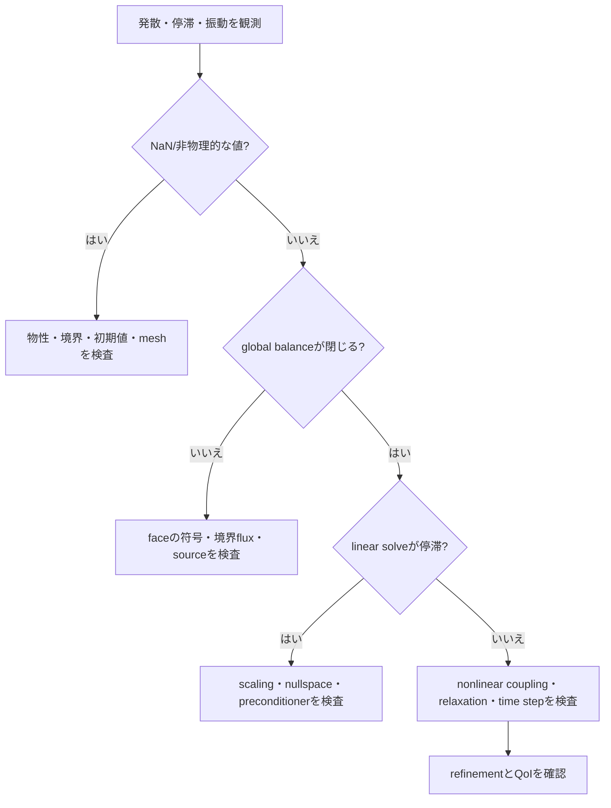



CFDで「計算できない」という言葉には、複数の現象が混在している。
時間積分が不安定な場合もあれば、pressure–velocity couplingが振動している場合もあり、線形系がill-conditionedであったり境界条件が誤っていたりすることもある。
原因を階層ごとに分けてこそ、対処も正確になる。

## 1. 安定性、収束性、精度は異なる

- **整合性**：格子幅と時間間隔を0に近づけたとき、離散方程式が元の方程式に近づくか？
- **安定性**：小さな摂動と丸め誤差が計算過程で制御されるか？
- **収束性**：離散解が連続問題の解に近づくか？
- **反復収束**：与えられた離散問題をalgebraic solverが十分に解いたか？
- **精度**：関心量の総誤差が利用目的に対して十分小さいか？

implicit schemeは大きな時間間隔でも発散しないことがあるが、transientをつぶしてしまう可能性がある。
residualが低くても、誤った離散方程式の解であることがある。
この区別があらゆる診断の出発点である。

## 2. CFL数の直観

1次元移流方程式を考える。

$$
\frac{\partial u}{\partial t}+a\frac{\partial u}{\partial x}=0.
$$

CFL数は、1つの時間stepの間に情報が何個のcellを移動するかを表す。

$$
\mathrm{CFL}=\frac{|a|\Delta t}{\Delta x}.
$$

多次元・非構造格子では、単純な (Delta x) 一つではなく、face spectral radiusとcell volumeを用いたlocal CFLを使う。

$$
\mathrm{CFL}_P
\sim
\frac{\Delta t}{V_P}
\sum_{f\in P}\lambda_f A_f.
$$

ここで (lambda_f) はnormal方向の特性速度の代表値である。
圧縮性問題では、流速だけでなく音速も含まれることがある。

## 3. CFL条件の意味を過度に一般化しない

explicit upwind schemeの安定条件とimplicit schemeの精度条件は同じではない。
空間discretization、時間積分法、source stiffness、boundary treatmentによって許容領域は変わる。

von Neumann解析ではFourier mode

$$
u_j^n=G^n e^{ikj\Delta x}
$$

を代入してamplification factor (G)を求める。
線形問題では通常 (|G|\le 1) を要求するが、非線形・非構造・変数係数問題では、この結果は局所的な指針にすぎず完全な保証ではない。

### 移流と拡散で異なるscale

移流scaleは

$$
\Delta t_{adv}\sim\frac{\Delta x}{|u|}
$$

であり、explicit diffusion scaleはおよそ

$$
\Delta t_{diff}\sim\frac{\Delta x^2}{\nu}
$$

である。
格子を細分化すると、拡散による制限がより速く厳しくなることがある。

## 4. 安定であることと時間解像度が十分であること

implicit Eulerは多くの線形問題で大きなstepでも安定だが、1次精度で数値減衰が大きい。
関心周波数 (omega)、移流通過時間、source relaxation timeを解像するには、別の精度基準が必要である。

時間refinementでは次を比較する。

- peak magnitude
- peak到達時刻とphase
- 周期平均とfluctuation spectrum
- 積分されたfluxまたはenergy
- eventの順序とthreshold crossing time

## 5. 非圧縮性流れにおける圧力の役割

非圧縮性Navier–Stokes方程式は

$$
\frac{\partial\mathbf u}{\partial t}
+\nabla\cdot(\mathbf u\otimes\mathbf u)
=-\frac{1}{\rho}\nabla p
+\nu\nabla^2\mathbf u+\mathbf f,
$$

$$
\nabla\cdot\mathbf u=0
$$

である。
圧力は独立した発展方程式というより、速度場をdivergence-free空間へ射影する制約multiplierに近い。

tentative velocity (mathbf u^*)を計算し、

$$
\mathbf u^{n+1}=\mathbf u^*-\frac{\Delta t}{\rho}\nabla p^{n+1}
$$

をcontinuityに代入するとpressure Poisson equationが得られる。

$$
\nabla^2p^{n+1}=
\frac{\rho}{\Delta t}\nabla\cdot\mathbf u^*.
$$

実際のfinite-volume実装では、checkerboardとmass imbalanceを避けるため、face fluxとpressure correctionの係数が整合していなければならない。

## 6. segregatedアプローチとcoupledアプローチ

| アプローチ | 構造 | 長所 | 限界 |
|---|---|---|---|
| segregated | 変数ごとの方程式を逐次反復 | メモリ効率、実装が単純 | 強連成では遅い、または不安定 |
| pressure-correction | momentum予測後にpressure/fluxを補正 | 非圧縮性問題で広く利用 | relaxationとface couplingに敏感 |
| fully coupled | 変数blockを同時に解く | 強いcouplingを反映 | 大きなJacobian、preconditionerが重要 |

SIMPLE系は定常状態の反復解法としての性格が強く、PISO系は1つのtime step内で複数回のcorrectionを行うtransientの性格が強い。
名称よりも、実際のalgorithmにおけるpredictor、corrector、relaxation、non-orthogonal correctionの回数を確認すべきである。

## 7. under-relaxationは治療薬ではなく制御装置である

固定点反復を

$$
x^{k+1}=G(x^k)
$$

とすると、relaxationは

$$
x^{k+1}\leftarrow
x^k+\alpha\left(\tilde x^{k+1}-x^k\right),
\qquad 0<\alpha\le1
$$

と表せる。

(alpha)を小さくすると振動を緩和できるが、非常に遅くなる。
境界条件の誤り、質の悪い格子、不適切な物性、singular systemをrelaxationで隠してはならない。

## 8. 線形系が計算コストを支配する

各非線形iterationでは通常、

$$
A x=b
$$

という形の疎な線形系を解く。
solverの選択は、行列の対称性、正定値性、conditioning、block structureに依存する。

- CG：対称正定値問題に適する
- GMRES：一般の非対称系に強いが、Krylov basisの保存コストがかかる
- BiCGSTAB：メモリ効率はよいが、収束historyが不規則になることがある
- multigrid：smooth errorとoscillatory errorを異なるgridで効率的に除去

線形residual

$$
r=b-Ax
$$

が小さくても、solution error (e=x-x^*) が必ずしも小さいとは限らない。

$$
A e=r,
\qquad
\|e\|\le\|A^{-1}\|\,\|r\|.
$$

ill-conditioned systemでは、小さなresidualと大きなerrorが共存しうる。

## 9. preconditioningの目的

preconditioner (M)を使って

$$
M^{-1}Ax=M^{-1}b
$$

を解くと、Krylov methodから見て扱いやすいspectrumを作ることができる。
よい (M) は (A) を十分に近似しつつ、適用コストが低くなければならない。

代表的な選択肢はJacobi、ILU、algebraic multigrid、domain decomposition、physics-based block preconditionerである。
唯一の最適なpreconditionerはなく、parallel scalabilityとsetup costも評価する必要がある。

## 10. residualの解釈方法

residualの定義にはabsolute、relative、scaled、preconditionedなどさまざまなものがある。
したがってsolver UIの数値だけを比較せず、式を確認する。

併せて記録する信号は次のとおりである。

- equationごとのinitial/final residual
- outer nonlinear residual
- continuity/global conservation defect
- 関心量のiteration history
- boundednessとpositivityの違反
- 線形iteration回数とpreconditioner setup時間
- time step rejectまたはnonlinear retryの回数

## 11. 収束診断の流れ

### 段階別workflow

1. 単純な物理と小さな格子で再現する。
2. すべての初期値がfiniteか、物理範囲内かを確認する。
3. mesh volume、face area、non-orthogonalityを監査する。
4. boundary conditionのmathematical compatibilityを確認する。
5. transientならlocal CFLとdiffusion numberの分布を見る。
6. linear solver toleranceをouter iterationの要求に合わせる。
7. nonlinear continuationで難しい項を段階的に有効化する。
8. 最後にrelaxationとdiscretization orderを調整する。

## 12. 検証チェックリスト

- [ ] 安定性条件と精度基準を別々に文書化した。
- [ ] local CFLのmaximumだけでなく、分布と位置を確認した。
- [ ] cell Peclet数がschemeの選択と一致している。
- [ ] pressure nullspaceをreferenceまたはconstraintとして処理した。
- [ ] face mass fluxとcell velocity correctionが整合している。
- [ ] linear toleranceがouter residualより十分厳しい。
- [ ] residual normalizationの式を把握している。
- [ ] QoIがiteration中に安定したか確認した。
- [ ] global conservation defectが許容範囲内にある。
- [ ] 時間間隔を小さくしたとき、phaseとpeakが収束する。
- [ ] 格子を変えてもsolver toleranceがcomparableである。
- [ ] 並列実行における結果の再現性とreduction誤差を評価した。

## 13. よくある失敗パターンと限界

### CFLだけを下げれば解決すると考える

singular boundary conditionや負の物性は、小さなtime stepでは修正できない。

### residual plotの形だけを見る

residualがsaw-toothになる理由は、物理的な周期、correction loop、adaptive stepである可能性がある。
定義と更新時点を併せて見る必要がある。

### linear solverを過度に高精度で解く

outer nonlinear stateがまだ不正確な初期反復でinner solveをmachine precisionまで解くのは無駄になりうる。
inexact Newtonの原理のように、outer progressに合わせてtoleranceを調整できる。

### 常に同じrelaxationを使う

問題のstiffnessは時間とiterationに応じて変わる。
固定係数は単純だが、adaptive strategyとcontinuationのほうが効率的なこともある。

### 収束したsteady solutionが唯一だと仮定する

非線形系には、複数の定常解や本質的な非定常性が存在することがある。
初期条件、continuation path、transientの確認が必要である。

## 14. 公式資料・原典

- Courant, Friedrichs, Lewy, “Über die partiellen Differenzengleichungen der mathematischen Physik,” 1928.
- Hestenes and Stiefel, “Methods of Conjugate Gradients for Solving Linear Systems,” 1952.
- Saad and Schultz, “GMRES: A Generalized Minimal Residual Algorithm,” 1986.
- PETSc, [Krylov methods and preconditioner manual](https://petsc.org/release/manual/ksp/).
- hypre, [Scalable Linear Solvers and Multigrid Methods](https://hypre.readthedocs.io/).
- NASA, [CFL3D User Resources](https://nasa.github.io/CFL3D/).

よい収束戦略とは、数値をむやみに下げることではない。
**物理方程式、離散化、coupling、線形代数のどの階層で誤差が増幅されているかを突き止め、その階層を直すこと**である。
