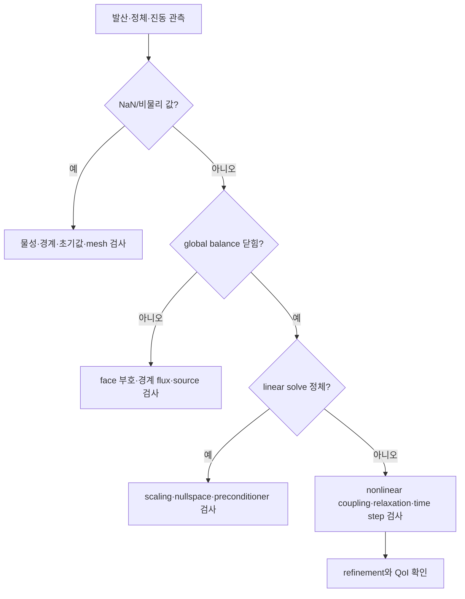



CFD에서 “계산이 안 된다”는 말은 여러 현상을 섞는다.
시간적분이 불안정할 수도 있고, pressure–velocity coupling이 흔들릴 수도 있으며, 선형계가 ill-conditioned이거나 경계조건이 잘못되었을 수도 있다.
원인을 층위별로 나누어야 처방도 정확해진다.

## 1. 안정성, 수렴성, 정확도는 다르다

- **일관성**: 격자와 시간간격을 0으로 보낼 때 이산 방정식이 원래 방정식으로 접근하는가?
- **안정성**: 작은 섭동과 반올림 오차가 계산 과정에서 통제되는가?
- **수렴성**: 이산 해가 연속 문제의 해로 접근하는가?
- **반복 수렴**: 주어진 이산 문제를 algebraic solver가 충분히 풀었는가?
- **정확도**: 관심량의 총 오차가 사용 목적에 충분히 작은가?

implicit scheme은 큰 시간간격에서 폭발하지 않을 수 있지만 transient를 뭉갤 수 있다.
residual이 낮아도 잘못된 이산 방정식의 해일 수 있다.
이 구분이 모든 진단의 시작점이다.

## 2. CFL 수의 직관

1차원 대류 방정식을 보자.

$$
\frac{\partial u}{\partial t}+a\frac{\partial u}{\partial x}=0.
$$

CFL 수는 한 시간 step 동안 정보가 cell 몇 개를 이동하는지를 나타낸다.

$$
\mathrm{CFL}=\frac{|a|\Delta t}{\Delta x}.
$$

다차원·비정렬 격자에서는 단순한 (Delta x) 하나보다 face spectral radius와 cell volume을 이용한 local CFL을 쓴다.

$$
\mathrm{CFL}_P
\sim
\frac{\Delta t}{V_P}
\sum_{f\in P}\lambda_f A_f.
$$

여기서 (lambda_f)는 normal 방향 특성 속도의 대표값이다.
압축성 문제에서는 유속뿐 아니라 음속이 포함될 수 있다.

## 3. CFL 조건의 의미를 과도하게 일반화하지 않는다

explicit upwind scheme의 안정 조건과 implicit scheme의 정확도 조건은 같지 않다.
공간 discretization, 시간 적분법, source stiffness, boundary treatment에 따라 허용영역이 달라진다.

von Neumann 분석에서는 Fourier mode

$$
u_j^n=G^n e^{ikj\Delta x}
$$

를 대입해 amplification factor (G)를 구한다.
선형 문제에서 보통 (|G|\le 1)을 요구하지만, 비선형·비정렬·가변계수 문제에서는 이 결과가 국소 지침일 뿐 완전한 보장은 아니다.

### 대류와 확산의 서로 다른 scale

대류 scale은

$$
\Delta t_{adv}\sim\frac{\Delta x}{|u|}
$$

이고, explicit diffusion scale은 대략

$$
\Delta t_{diff}\sim\frac{\Delta x^2}{\nu}
$$

이다.
격자를 미세화하면 확산 제한이 더 빠르게 엄격해질 수 있다.

## 4. 안정하다는 것과 시간해상도가 충분하다는 것

implicit Euler는 많은 선형 문제에서 큰 step에도 안정하지만 1차 정확도이고 수치 감쇠가 크다.
관심 주파수 (omega), 대류 통과시간, source relaxation time을 해상하려면 별도의 정확도 기준이 필요하다.

시간 refinement에서는 다음을 비교한다.

- peak magnitude
- peak 도달 시점과 phase
- 주기 평균과 fluctuation spectrum
- 적분된 flux 또는 energy
- event 순서와 threshold crossing time

## 5. 비압축성 유동에서 압력의 역할

비압축성 Navier–Stokes 방정식은

$$
\frac{\partial\mathbf u}{\partial t}
+\nabla\cdot(\mathbf u\otimes\mathbf u)
=-\frac{1}{\rho}\nabla p
+\nu\nabla^2\mathbf u+\mathbf f,
$$

$$
\nabla\cdot\mathbf u=0
$$

이다.
압력은 별도의 진화방정식보다 속도장을 divergence-free 공간에 투영하는 제약 multiplier에 가깝다.

tentative velocity (mathbf u^*)를 계산하고

$$
\mathbf u^{n+1}=\mathbf u^*-\frac{\Delta t}{\rho}\nabla p^{n+1}
$$

를 continuity에 대입하면 pressure Poisson equation이 나온다.

$$
\nabla^2p^{n+1}=
\frac{\rho}{\Delta t}\nabla\cdot\mathbf u^*.
$$

실제 finite-volume 구현에서는 face flux와 pressure correction 계수가 일관되어야 checkerboard와 mass imbalance를 피할 수 있다.

## 6. segregated와 coupled 접근

| 접근 | 구조 | 장점 | 한계 |
|---|---|---|---|
| segregated | 변수별 방정식을 순차 반복 | 메모리 효율, 구현 단순 | 강결합에서 느리거나 불안정 |
| pressure-correction | momentum 예측 후 pressure/flux 보정 | 비압축성 문제에 널리 사용 | relaxation과 face coupling 민감 |
| fully coupled | 변수 block을 함께 풂 | 강한 coupling 반영 | 큰 Jacobian, preconditioner 중요 |

SIMPLE 계열은 정상상태의 반복 해법 관점이 강하고, PISO 계열은 한 time step 안에서 여러 correction을 수행하는 transient 관점이 강하다.
이름보다 실제 algorithm의 predictor, corrector, relaxation, non-orthogonal correction 횟수를 확인해야 한다.

## 7. under-relaxation은 치료제가 아니라 제어장치다

고정점 반복을

$$
x^{k+1}=G(x^k)
$$

라 할 때 relaxation은

$$
x^{k+1}\leftarrow
x^k+\alpha\left(\tilde x^{k+1}-x^k\right),
\qquad 0<\alpha\le1
$$

로 표현할 수 있다.

(alpha)를 줄이면 진동을 완화할 수 있지만 매우 느려진다.
경계조건 오류, 불량격자, 부적절한 물성, singular system을 relaxation으로 숨기면 안 된다.

## 8. 선형계가 계산 비용을 지배한다

각 비선형 iteration에서 보통

$$
A x=b
$$

형태의 희소 선형계를 푼다.
solver 선택은 행렬의 대칭성, 정부호성, conditioning, block structure에 달려 있다.

- CG: 대칭 양의 정부호 문제에 적합
- GMRES: 일반 비대칭계에 강하지만 Krylov basis 저장 비용 존재
- BiCGSTAB: 메모리 효율이 좋지만 수렴 history가 불규칙할 수 있음
- multigrid: smooth error와 oscillatory error를 서로 다른 grid에서 효율적으로 제거

선형 residual

$$
r=b-Ax
$$

가 작다고 solution error (e=x-x^*)가 반드시 작은 것은 아니다.

$$
A e=r,
\qquad
\|e\|\le\|A^{-1}\|\,\|r\|.
$$

ill-conditioned system에서는 작은 residual이 큰 error와 공존할 수 있다.

## 9. preconditioning의 목적

preconditioner (M)을 사용해

$$
M^{-1}Ax=M^{-1}b
$$

를 풀면 Krylov method가 보기 쉬운 spectrum을 만들 수 있다.
좋은 (M)은 (A)를 충분히 근사하면서 적용 비용이 낮아야 한다.

대표 선택은 Jacobi, ILU, algebraic multigrid, domain decomposition, physics-based block preconditioner다.
하나의 최적 preconditioner는 없으며 parallel scalability와 setup cost도 평가해야 한다.

## 10. residual을 해석하는 법

residual 정의는 absolute, relative, scaled, preconditioned 등 다양하다.
따라서 solver UI의 숫자만 비교하지 말고 수식을 확인한다.

함께 기록할 신호는 다음과 같다.

- equation별 initial/final residual
- outer nonlinear residual
- continuity/global conservation defect
- 관심량의 iteration history
- boundedness와 positivity 위반
- 선형 iteration 횟수와 preconditioner setup 시간
- time step reject 또는 nonlinear retry 횟수

## 11. 수렴 진단 흐름

### 단계별 워크플로

1. 단순한 물리와 작은 격자로 재현한다.
2. 모든 초기값의 finite 여부와 물리 범위를 확인한다.
3. mesh volume, face area, non-orthogonality를 감사한다.
4. boundary condition의 mathematical compatibility를 확인한다.
5. transient라면 local CFL과 diffusion number 분포를 본다.
6. linear solver tolerance를 outer iteration 요구와 맞춘다.
7. nonlinear continuation으로 어려운 항을 점진적으로 활성화한다.
8. 마지막으로 relaxation과 discretization order를 조정한다.

## 12. 검증 체크리스트

- [ ] 안정성 조건과 정확도 기준을 별도로 문서화했다.
- [ ] local CFL의 maximum뿐 아니라 분포와 위치를 확인했다.
- [ ] cell Peclet 수가 scheme 선택과 일치한다.
- [ ] pressure nullspace를 reference 또는 constraint로 처리했다.
- [ ] face mass flux와 cell velocity correction이 일관된다.
- [ ] linear tolerance가 outer residual보다 충분히 엄격하다.
- [ ] residual normalization 식을 알고 있다.
- [ ] QoI가 iteration 중 안정되었는지 확인했다.
- [ ] global conservation defect가 허용범위에 있다.
- [ ] 시간간격을 줄였을 때 phase와 peak가 수렴한다.
- [ ] 격자를 바꾸어도 solver tolerance가 comparable하다.
- [ ] 병렬 실행에서 결과 재현성과 reduction 오차를 평가했다.

## 13. 자주 실패하는 패턴과 한계

### CFL 하나만 낮추면 해결된다고 믿기

singular boundary condition이나 음의 물성은 작은 time step으로 고쳐지지 않는다.

### residual plot의 모양만 보기

residual이 saw-tooth인 이유가 물리적 주기, correction loop, adaptive step 때문일 수 있다.
정의와 업데이트 시점을 함께 보아야 한다.

### linear solver를 지나치게 정확하게 풀기

outer nonlinear state가 아직 부정확한 초기 반복에서 inner solve를 machine precision까지 푸는 것은 낭비일 수 있다.
inexact Newton 원리처럼 outer progress에 맞춰 tolerance를 조정할 수 있다.

### 항상 같은 relaxation 사용

문제의 stiffness는 시간과 iteration에 따라 바뀐다.
고정 계수는 단순하지만 adaptive strategy와 continuation이 더 효율적일 수 있다.

### 수렴한 steady solution이 유일하다고 가정

비선형계에는 여러 정상해나 본질적 비정상성이 존재할 수 있다.
초기조건, continuation path, transient 확인이 필요하다.

## 14. 공식·원전 참고자료

- Courant, Friedrichs, Lewy, “Über die partiellen Differenzengleichungen der mathematischen Physik,” 1928.
- Hestenes and Stiefel, “Methods of Conjugate Gradients for Solving Linear Systems,” 1952.
- Saad and Schultz, “GMRES: A Generalized Minimal Residual Algorithm,” 1986.
- PETSc, [Krylov methods and preconditioner manual](https://petsc.org/release/manual/ksp/).
- hypre, [Scalable Linear Solvers and Multigrid Methods](https://hypre.readthedocs.io/).
- NASA, [CFL3D User Resources](https://nasa.github.io/CFL3D/).

좋은 수렴 전략은 숫자를 무작정 낮추는 것이 아니다.
**물리 방정식, 이산화, coupling, 선형대수의 어느 층에서 오차가 증폭되는지를 찾아 그 층을 고치는 것**이다.
