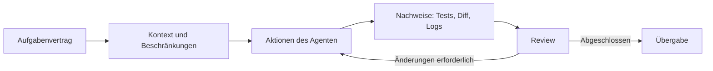



## Das Problem: Ein langer Prompt führt nicht automatisch zu guten Entwicklungsergebnissen

Ein Coding-Agent kann Code lesen und ändern, Befehle ausführen und Ergebnisse untersuchen.

Sind Abschlusskriterien und Grenzen jedoch unklar, treten folgende Probleme auf.

- Er bereinigt Dateien, die nicht Teil der Anfrage waren.
- Er meldet Erfolg, obwohl keine Tests vorhanden sind.
- Er überschreibt bestehende Änderungen des Benutzers.
- Er nimmt an einem externen System eine größere Änderung als erwartet vor.
- Mehrere Agenten bearbeiten gleichzeitig dieselbe Datei.
- Er setzt Erfolg voraus, obwohl die Befehlsausgabe abgeschnitten wurde.
- Die Implementierung existiert, aber es gibt keine reproduzierbare Übergabe.

Der Schlüssel zur wirksamen Nutzung liegt nicht in besonders geschickten Prompt-Formulierungen, sondern in einer Evidenzschleife aus `Umfang -> Ausführung -> Verifikation -> Review -> Übergabe`.

Konkrete Codex-Funktionen und die Benutzeroberfläche können sich ändern.

Dieser Artikel beruht auf den allgemeinen Grundsätzen der zum Zeitpunkt der Abfassung geprüften offiziellen [Codex-Dokumentation](https://developers.openai.com/codex/). Ziehen Sie zusätzlich die neueste Dokumentation für die tatsächlich verwendete Oberfläche heran.

## Denkmodell: Codex ist ein Mitarbeiter innerhalb der erteilten Befugnisse



### Aufgabenvertrag

Festlegen, was geändert wird und was unangetastet bleiben muss.

### Kontext

Repository-Struktur, Build-Befehle, Stil, relevante Dokumentation und Fehlersymptome bereitstellen.

### Befugnis

Sandbox und Genehmigungen begrenzen, was ein Agent lesen, schreiben und ausführen darf.

### Nachweise

Testergebnisse, Lint, Builds, Diffs, Reproduktionsprotokolle und erzeugte Artefakte stützen seine Aussagen.

### Übergabe

Kommunizieren, was geändert und geprüft wurde und was noch offen ist.

## Einen Prompt als Arbeitsvertrag verfassen

Das offizielle Codex-Handbuch empfiehlt, Ziel, Kontext, Beschränkungen und Definition of Done anzugeben.

### Ziel

Ein beobachtbares Ergebnis beschreiben, statt lediglich `fix login` zu schreiben.

Beispiel: `Wenn eine Anfrage eine abgelaufene Sitzung verwendet, genau eine Aktualisierung versuchen. Schlägt sie fehl, den Benutzer zum Anmeldebildschirm schicken und niemals in eine Endlosschleife geraten.`

### Umfang

- Verzeichnisse, die geändert werden dürfen
- Dateien, die ausgeschlossen bleiben müssen
- ob Änderungen an öffentlichen APIs erlaubt sind
- ob Abhängigkeiten hinzugefügt werden dürfen
- ob Migrationen erlaubt sind
- ob Commit-, Push- und PR-Aktionen autorisiert sind

Ein Git-Push oder das Erstellen eines externen Issues ist als eigene Befugnis zu behandeln.

### Abschlusskriterien

- Der Reproduktionstest schlägt zunächst fehl.
- Nach der Korrektur bestehen die relevanten Tests.
- Die vollständige Suite oder die Prüfungen für den betroffenen Umfang bestehen.
- Lint- und Typprüfungen bestehen.
- Dokumentation und Migrationen sind aktualisiert.
- Verbleibende Risiken werden gemeldet.

## Wiederkehrende Anweisungen in AGENTS.md speichern

Das offizielle Handbuch beschreibt `AGENTS.md` als dauerhafte Anleitung, die der Agent in einem Repository automatisch liest.

Gute Anleitungen sind praktisch und überprüfbar.

```md
# Repository guidance

## Build and test
- Install: `npm ci`
- Unit tests: `npm test`
- Type check: `npm run typecheck`

## Change rules
- Do not edit generated files under `dist/`.
- Preserve public API compatibility unless the task says otherwise.
- Add a regression test for every bug fix.

## Handoff
- Report changed files, commands run, and remaining failures.
```

Tatsächliche Befehle und verbotene Bereiche sind nützlicher als ein langes philosophisches Dokument.

Der geltende Gültigkeitsbereich ist zu prüfen, da ein Unterverzeichnis eine spezifischere `AGENTS.md` enthalten kann.

Werden wiederkehrende Fehler entdeckt, wird die Anleitung schrittweise ergänzt.

## Workflow: agentische Entwicklung sicher betreiben

### Schritt 1. Zuerst den aktuellen Zustand bewahren

Der Agent soll vor jeder Bearbeitung Folgendes prüfen:

- aktuellen Branch
- Status des Arbeitsbaums
- nicht versionierte Dateien
- jüngste relevante Commits
- geltende `AGENTS.md`
- Build- und Test-Ausgangslage

Änderungen in einem nicht sauberen Arbeitsbaum können dem Benutzer gehören.

Nicht zusammenhängende Änderungen weder zurücksetzen noch einbeziehen.

### Schritt 2. Eine reproduzierbare Problembeschreibung erstellen

Für einen Fehler werden minimale Reproduktion, tatsächliches Ergebnis und erwartetes Ergebnis festgehalten.

Wenn möglich, wird daraus ein fehlschlagender Test.

Bei einem umgebungsabhängigen Problem werden Version, Betriebssystem, Konfiguration, Befehl und bereinigtes Protokoll aufgezeichnet.

Nicht sofort ein großes Refactoring verlangen, bevor die Ursache bekannt ist.

### Schritt 3. Lesen und Schreiben trennen

Zunächst Codepfad, Abhängigkeiten, Tests und Historie lesen.

Vor der Bearbeitung mögliche Änderungen und Risiken eingrenzen.

Bei einer Diagnoseanfrage nach dem Bericht der Ursache stoppen, statt den Umfang automatisch auf eine Korrektur auszuweiten.

Bei einer Implementierungsanfrage die normale Änderung und Verifikation bis zum Abschluss durchführen.

### Schritt 4. Kleine Patches und ausdrückliche Invarianten bevorzugen

Statt die gesamte Architektur auf einmal zu ändern, die kleinste Änderung vornehmen, die die Ursache direkt behebt.

Eine Ausnahme liegt vor, wenn die Anforderung selbst eine strukturelle Änderung verlangt.

Beispiele für Invarianten:

- Dieselbe Anfrage erzeugt keine doppelten Datensätze.
- Ein nicht authentifizierter Benutzer erhält keine geschützten Daten.
- Nach einem Abbruch bleibt keine Hintergrundaufgabe zurück.
- Altes und neues Schema bestehen während des Rollouts nebeneinander.

### Schritt 5. Parallele Agenten für unabhängige Teilaufgaben einsetzen

Das offizielle Codex-Handbuch beschreibt die Parallelisierung unabhängiger, leselastiger Arbeiten wie Exploration, Testanalyse und Log-Analyse.

Eine wirksame Aufteilung kann beispielsweise so aussehen:

- Agent A: Fehlerpfad und Grundursache untersuchen
- Agent B: Lücken in vorhandenen Tests untersuchen
- Agent C: Sicherheit und Kompatibilität prüfen

Wenn mehrere Agenten dieselbe Datei gleichzeitig bearbeiten, können Konflikte und inkonsistente Entscheidungen entstehen.

Schreibverantwortung nach Datei oder Komponente trennen.

Der Root-Agent integriert die Ergebnisse und führt die abschließende Verifikation durch.

### Schritt 6. Sandbox und Genehmigungen als Sicherheitsgrenzen verwenden

Laut offizieller Dokumentation kontrolliert Codex mit einer Sandbox und Genehmigungsrichtlinien den Umfang von Dateien, Netzwerkzugriff und Befehlen.

Standardmäßig sollte nur die mindestens erforderliche Befugnis erteilt werden.

Ziel und Auswirkungen folgender Aktionen erfordern besondere Prüfung:

- destruktive Dateioperationen
- Zugriff auf Zugangsdaten oder Geheimnisse
- Downloads von Abhängigkeiten
- verändernde externe API-Aufrufe
- Git-Pushes und PR-Erstellung
- Änderungen an Cloud-Ressourcen
- Produktionsbefehle

Eine Genehmigung ist kein lästiges Pop-up, sondern ein Punkt, an dem sich die Befugnis ändert.

### Schritt 7. Die Testpyramide an das Arbeitsrisiko anpassen

Unmittelbar nach einer Änderung wird der engste und schnellste Test ausgeführt.

Danach wird der betroffene Umfang erweitert.

1. neuer Regressionstest
2. zugehörige Unit-Tests
3. Komponenten- oder Integrationstests
4. Lint- und Typprüfungen
5. Build
6. erforderliche End-to-End-Tests

Nicht für jede Aufgabe die teuerste Testsuite verlangen.

Umgekehrt darf eine kritische Authentifizierungsänderung nicht mit einem einzigen Unit-Test abgeschlossen werden.

### Schritt 8. Befehlsergebnisse als Nachweise lesen

Exit-Code, stdout, stderr, Testanzahl, übersprungene Tests und Timeouts prüfen.

Wurde die Ausgabe abgeschnitten, den relevanten Abschnitt erneut lesen.

Zwischen `der Befehl war erfolgreich` und `die Anforderung wurde erfüllt` unterscheiden.

Wird ein Artefakt erzeugt, seinen tatsächlichen Pfad und Inhalt oder seine Darstellung untersuchen.

### Schritt 9. Das Diff unabhängig prüfen

Das Diff auch dann lesen, wenn die Tests bestehen.

- Änderungen außerhalb des Umfangs
- toter Code
- Geheimnisse und persönliche Pfade
- Debug-Ausgaben
- zu weit gefasste Exceptions
- Abweichung der Dependency-Lockdatei
- generierte Dateien
- Rückwärtskompatibilität
- Migration und Rollback

Der Agent kann seinen eigenen Patch prüfen, doch der endgültige Verantwortliche sollte ihn aus einer unabhängigen Perspektive betrachten.

### Schritt 10. Eine Übergabe verlangen, die Fehler nicht verschweigt

Der Abschlussbericht sollte mindestens enthalten:

- Ergebnisübersicht
- geänderte Dateien
- Verifikationsbefehle und Ergebnisse
- nicht ausführbare Prüfungen und deren Gründe
- bekannte Einschränkungen und Folgearbeiten
- Commit-Status und Branch
- Links auf erzeugte Artefakte

`Done` allein ist keine reproduzierbare Übergabe.

## Praxisbeispiel: Korrektur eines API-Idempotenzfehlers anfordern

### Arbeitsvertrag

```text
목표: 동일 idempotency key의 동시 요청이 record 하나만 만들게 수정한다.
범위: api/와 tests/만 수정한다. public response schema는 유지한다.
제약: 새 production dependency를 추가하지 않는다.
완료: concurrency regression test가 수정 전 실패하고 수정 후 통과한다.
검증: 관련 unit/integration test, lint, type check를 실행한다.
보고: 변경 파일과 실행한 명령, 남은 race 가능성을 적는다.
```

### Arbeitsablauf des Agenten

1. Repository-Anleitung und Arbeitsbaum prüfen.
2. Den Codepfad vom Request-Handler bis zur Datenbankbedingung verfolgen.
3. Den vorhandenen Unique-Index bestätigen.
4. Einen Regressionstest hinzufügen, der zwei Anfragen gleichzeitig sendet.
5. Das Check-then-insert-Race auf Anwendungsebene reproduzieren.
6. Es mit einem bedingten Datenbank-Insert und anschließendem Lesen bei Konflikt beheben.
7. Kompatibilität von Antwortschema und Status prüfen.
8. Zugehörige Tests und breitere Prüfungen ausführen.
9. Umfang und Migrationsfragen im Diff prüfen.
10. Die Nachweise und verbleibende datenbankspezifische Unterschiede melden.

## Betrieb nach Größe der Arbeit

### Kleiner Fehler

Reproduktion, minimaler Patch, Regressionstest und Diff-Review können ausreichen.

### Mittelgroßes Feature

Plan, API-Vertrag, Implementierung, Integrationstests und Dokumentation in gestufte Kontrollpunkte aufteilen.

### Große Migration

Architekturentscheidung, Kompatibilitätsmatrix, Feature-Flag, Datenmigration, Canary und Rollback als getrennte Aufgaben verwalten.

Mehrere unabhängig überprüfbare Meilensteine sind sicherer als eine einzige enorme Aufgabe, die länger als einen Tag läuft.

An jedem Meilenstein einen Wiederherstellungspunkt wie einen Datei-Schnappschuss oder Commit erstellen.

## Prüfliste zur Verifikation

### Anfrage

- [ ] Ist das Ziel als beobachtbares Verhalten ausgedrückt?
- [ ] Sind erlaubter und verbotener Umfang definiert?
- [ ] Ist die Befugnis für externe Änderungen ausdrücklich festgelegt?
- [ ] Sind Abschlusskriterien und Verifikationsbefehle definiert?
- [ ] Ist für mehrdeutige Entscheidungen ein Verantwortlicher bestimmt?

### Repository

- [ ] Wurde die geltende AGENTS.md geprüft?
- [ ] Wurde der nicht saubere Arbeitsbaum bewahrt?
- [ ] Wurden Grenzen für generierte Dateien und Geheimnisse geprüft?
- [ ] Wurden Abhängigkeits- und Versionsbeschränkungen geprüft?
- [ ] Wurden Branch und Basisrevision aufgezeichnet?

### Ausführung

- [ ] Wurden Ursache und Hypothese anhand von Nachweisen eingegrenzt?
- [ ] Liegt der Patch innerhalb des Anforderungsumfangs?
- [ ] Überschneiden sich die Schreibbereiche von Subagenten nicht?
- [ ] Wurden destruktive und externe Aktionen genehmigt?
- [ ] Wurden Befehlsausgabe und Exit-Codes geprüft?

### Abschluss

- [ ] Erfasst der Regressionstest den beabsichtigten Fehler?
- [ ] Liegen Ergebnisse für zugehörige Tests, Lint, Typprüfungen und Build vor?
- [ ] Wurde das Diff unter Sicherheits- und Kompatibilitätsaspekten gelesen?
- [ ] Sind nicht ausgeführte Prüfungen und Einschränkungen offengelegt?
- [ ] Sind Artefakte und Übergabe reproduzierbar?

## Häufige Fehler und Einschränkungen

### Jedes Ziel in einen einzigen Prompt packen

Umfang und Prioritäten geraten in Konflikt.

Die Arbeit in Meilensteine mit unabhängigen Abschlusskriterien aufteilen.

### Der Aussage des Agenten über bestandene Tests ohne Prüfung vertrauen

Ausführungsverzeichnis, übersprungene Tests, veraltete Artefakte und abgeschnittene Ausgabe prüfen.

### Parallele Agenten für jede Aufgabe einsetzen

Bei einer kleinen Änderung kann der Koordinationsaufwand den Nutzen übersteigen.

Sie für Arbeiten einsetzen, die sich unabhängig parallelisieren lassen.

### Befugnisse von Beginn an maximieren

Der Schadensradius von Eingabefehlern und Prompt Injection wächst.

Befugnisse nur bei Bedarf durch Genehmigungen mit ausdrücklichen Zielen erweitern.

### Agentenverlauf als einzige Sicherung behandeln

Gesprächszustand und temporäre Arbeitsbereiche sind kein dauerhafter Speicher.

Wichtige Meilensteine in Repository-Commits, Patches, Archiven oder Artefaktspeichern sichern.

### Code-Review durch Tests ersetzen

Tests prüfen festgelegte Fälle; ein Diff-Review findet unerwarteten Umfang.

Beides ergänzt einander.

## Offizielle Referenzen

- [OpenAI-Codex-Dokumentation](https://developers.openai.com/codex/)
- [Codex-Leitfaden zu AGENTS.md](https://developers.openai.com/codex/guides/agents-md/)
- [Codex-Sicherheit und Genehmigungen](https://developers.openai.com/codex/security/)
- [Dokumentation der Codex CLI](https://developers.openai.com/codex/cli/)
- [Bewährte Verfahren für Codex](https://developers.openai.com/codex/)

## Fazit

Codex gut einzusetzen bedeutet nicht, dem Agenten mehr zu sagen, sondern ihm eine Struktur zu geben, die den Abschluss beweist.

Umfang, dauerhafte Repository-Anleitung, minimale Befugnis, unabhängige Teilaufgaben, Regressionstests, Diff-Review und Übergabe werden zu einer Schleife verbunden.

Wenn Repository und Verifikationsnachweise – nicht der Gesprächsverlauf – als maßgebliche Quelle dienen, wird agentische Entwicklung zugleich schnell und wiederherstellbar.
