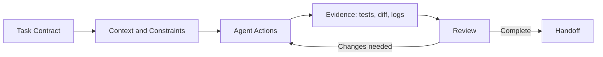



## The Problem: A Long Prompt Does Not Automatically Produce Good Development Results

A coding agent can read code, modify it, run commands, and inspect the results.

When completion criteria and boundaries are vague, however, the following problems arise.

- It cleans up files that were not part of the request.
- It reports success despite having no tests.
- It overwrites existing user changes.
- It makes a larger-than-expected change to an external system.
- Multiple agents modify the same file at the same time.
- It assumes success even though command output was truncated.
- The implementation exists, but there is no reproducible handoff.

The key to effective use is not clever prompt wording, but an evidence loop of `scope -> execution -> verification -> review -> handoff`.

Specific Codex features and UI may change.

This article is based on the general principles in the official [Codex documentation](https://developers.openai.com/codex/) verified at the time of writing; also consult the latest documentation for the surface you actually use.

## Mental Model: Codex Is a Collaborator Working Within Granted Authority



### task contract

Define what will be changed and what must remain untouched.

### context

Provide the repository structure, build commands, style, relevant documentation, and failure symptoms.

### authority

The sandbox and approvals limit what an agent may read, write, and execute.

### evidence

Test results, lint, builds, diffs, reproduction logs, and generated artifacts support its claims.

### handoff

Communicate what changed, what was verified, and what remains.

## How to Write a Prompt as a Work Contract

The official Codex manual recommends specifying the goal, context, constraints, and definition of done.

### Goal

Describe an observable result rather than saying `fix login`.

Example: `When a request uses an expired session, attempt one refresh. If it fails, send the user to the login screen, and never enter an infinite loop.`

### Scope

- directories that may be modified
- files that must be excluded
- whether public API changes are allowed
- whether dependencies may be added
- whether migrations are allowed
- whether commit, push, and PR actions are authorized

Treat a git push or the creation of an external issue as separate authority.

### Completion Criteria

- The reproduction test fails first.
- The relevant tests pass after the fix.
- The full suite or checks for the affected scope pass.
- Lint and type checks pass.
- Documentation and migrations are updated.
- Remaining risks are reported.

## Store Repeated Instructions in AGENTS.md

The official manual describes `AGENTS.md` as persistent guidance that the agent reads automatically in a repository.

Good guidance is practical and verifiable.

```md
# Repository guidance

## Build and test
- Install: `npm ci`
- Unit tests: `npm test`
- Type check: `npm run typecheck`

## Change rules
- Do not edit generated files under `dist/`.
- Preserve public API compatibility unless the task says otherwise.
- Add a regression test for every bug fix.

## Handoff
- Report changed files, commands run, and remaining failures.
```

Actual commands and prohibited boundaries are more useful than a long philosophical document.

Check the applicable scope because a subdirectory may contain a more specific `AGENTS.md`.

Add guidance incrementally when repeated mistakes are discovered.

## Workflow: Operating Agentic Development Safely

### Step 1. Preserve the Current State First

Have the agent check the following before editing:

- current branch
- working tree status
- untracked files
- recent relevant commits
- applicable `AGENTS.md`
- build and test baseline

Changes in a dirty working tree may belong to the user.

Do not revert or include unrelated changes.

### Step 2. Create a Reproducible Problem Definition

For a bug, record a minimal reproduction, the actual result, and the expected result.

Turn it into a failing test where possible.

For an environment-dependent problem, record the version, OS, configuration, command, and sanitized log.

Do not immediately request a large refactor before the cause is known.

### Step 3. Separate Reading from Writing

First read the code path, dependencies, tests, and history.

Narrow down the candidate changes and risks before editing.

For a diagnosis request, stop after reporting the cause instead of automatically expanding the scope to a fix.

For an implementation request, carry the normal change and verification through to completion.

### Step 4. Prefer Small Patches and Explicit Invariants

Make the smallest change that directly addresses the cause instead of changing the entire architecture at once.

The exception is when the requirement itself demands a structural change.

Examples of invariants include:

- The same request does not create duplicate records.
- An unauthenticated user does not receive protected data.
- No background task remains after cancellation.
- The old and new schemas coexist during rollout.

### Step 5. Use Parallel Agents for Independent Subtasks

The official Codex manual describes parallelizing independent, read-heavy work such as exploration, test analysis, and log analysis.

Examples of effective division include:

- agent A: investigate the failure path and root cause
- agent B: investigate gaps in existing tests
- agent C: review security and compatibility

If multiple agents edit the same file simultaneously, conflicts and inconsistent judgments can result.

Separate write ownership by file or component.

The root agent integrates the results and performs final verification.

### Step 6. Use Sandboxing and Approvals as Safety Boundaries

According to the official documentation, Codex uses a sandbox and approval policies to control the scope of files, network access, and commands.

The default should be the minimum authority required.

The target and impact of the following actions require particular scrutiny:

- destructive file operations
- access to credentials or secrets
- dependency downloads
- external API mutations
- git pushes and PR creation
- cloud resource changes
- production commands

An approval is not an annoying popup; it is a point at which authority changes.

### Step 7. Match the Test Pyramid to the Risk of the Work

Run the narrowest, fastest test immediately after a change.

Then broaden the affected scope.

1. new regression test
2. related unit tests
3. component or integration tests
4. lint and type checks
5. build
6. required end-to-end tests

Do not require the most expensive suite for every task.

Conversely, do not conclude a critical authentication change with one unit test.

### Step 8. Read Command Results as Evidence

Check the exit code, stdout, stderr, test count, skipped tests, and timeouts.

If output was truncated, reread the relevant section.

Distinguish `the command succeeded` from `the requirement was satisfied`.

When an artifact is generated, inspect its actual path and contents or rendering.

### Step 9. Review the Diff Independently

Read the diff even when the tests pass.

- changes outside the scope
- dead code
- secrets and personal paths
- debug prints
- overly broad exceptions
- dependency lock drift
- generated files
- backward compatibility
- migration and rollback

You can ask the agent to review its own patch, but the final owner should inspect it from an independent perspective.

### Step 10. Require a Handoff That Does Not Hide Failures

The final report should include at least:

- result summary
- changed files
- verification commands and results
- checks that could not be run, and why
- known limitations and follow-up work
- commit status and branch
- links to generated artifacts

`Done` alone is not a reproducible handoff.

## Practical Example: Requesting a Fix for an API Idempotency Bug

### Work Contract

```text
목표: 동일 idempotency key의 동시 요청이 record 하나만 만들게 수정한다.
범위: api/와 tests/만 수정한다. public response schema는 유지한다.
제약: 새 production dependency를 추가하지 않는다.
완료: concurrency regression test가 수정 전 실패하고 수정 후 통과한다.
검증: 관련 unit/integration test, lint, type check를 실행한다.
보고: 변경 파일과 실행한 명령, 남은 race 가능성을 적는다.
```

### Agent Workflow

1. Check repository guidance and the working tree.
2. Trace the code path from the request handler to the database constraint.
3. Confirm the existing unique index.
4. Add a regression test that sends two requests concurrently.
5. Reproduce the application-level check-then-insert race.
6. Fix it with a database conditional insert and conflict readback.
7. Verify response-schema and status compatibility.
8. Run the related tests and broader checks.
9. Review scope and migration concerns in the diff.
10. Report the evidence and any remaining database-specific differences.

## Operating by Size of Work

### Small Bug

A reproduction, minimal patch, regression test, and diff review may be sufficient.

### Medium-Sized Feature

Divide the plan, API contract, implementation, integration tests, and documentation into staged checkpoints.

### Large Migration

Manage the architecture decision, compatibility matrix, feature flag, data migration, canary, and rollback as separate tasks.

Several independently verifiable milestones are safer than one enormous task that runs for more than a day.

Create a recovery point such as a file snapshot or commit at each milestone.

## Verification Checklist

### Request

- [ ] Is the goal expressed as observable behavior?
- [ ] Are the allowed and prohibited scopes defined?
- [ ] Is authority for external mutations explicit?
- [ ] Are completion criteria and verification commands defined?
- [ ] Is the owner of ambiguous choices specified?

### Repository

- [ ] Was the applicable AGENTS.md checked?
- [ ] Was the dirty working tree preserved?
- [ ] Were boundaries around generated files and secrets checked?
- [ ] Were dependency and version constraints checked?
- [ ] Were the branch and base revision recorded?

### Execution

- [ ] Were the cause and hypothesis narrowed down with evidence?
- [ ] Is the patch within the requirement's scope?
- [ ] Do subagent write areas avoid overlap?
- [ ] Were destructive and external actions approved?
- [ ] Were command output and exit codes checked?

### Completion

- [ ] Does the regression test catch the intended failure?
- [ ] Are results available for related tests, lint, type checks, and the build?
- [ ] Was the diff read from security and compatibility perspectives?
- [ ] Are unrun checks and limitations disclosed?
- [ ] Are the artifacts and handoff reproducible?

## Common Failures and Limitations

### Putting Every Goal into One Prompt

Scope and priorities conflict.

Split the work into milestones with independent completion criteria.

### Trusting the Agent's Test-Pass Claim Without Verification

Check the execution directory, skipped tests, stale artifacts, and truncated output.

### Using Parallel Agents for Every Task

Coordination overhead can outweigh the benefit for a small change.

Use them for work that can be parallelized independently.

### Maximizing Authority from the Start

The blast radius of input errors and prompt injection increases.

Expand authority only when needed, through approvals with explicit targets.

### Treating Agent History as the Only Backup

Conversation state and temporary workspaces are not durable storage.

Preserve important milestones in repository commits, patches, archives, or artifact stores.

### Replacing Code Review with Tests

Tests verify specified cases; diff review finds unexpected scope.

They complement one another.

## Official References

- [OpenAI Codex Documentation](https://developers.openai.com/codex/)
- [Codex AGENTS.md Guide](https://developers.openai.com/codex/guides/agents-md/)
- [Codex Security and Approvals](https://developers.openai.com/codex/security/)
- [Codex CLI Documentation](https://developers.openai.com/codex/cli/)
- [Codex Best Practices](https://developers.openai.com/codex/)

## Conclusion

Using Codex well is not about saying more to the agent; it is about giving it a structure that proves completion.

Turn scope, durable repository guidance, minimum authority, independent subtasks, regression tests, diff review, and handoff into one loop.

When the repository and verification evidence—not the conversation history—serve as the source of truth, agentic development becomes both fast and recoverable.
