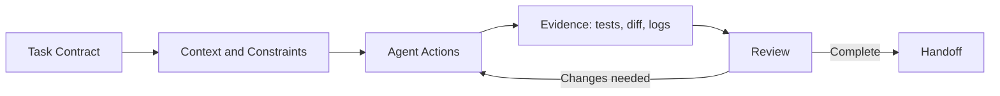



## El problema: un Prompt largo no produce automáticamente buenos resultados de desarrollo

Un agente de codificación puede leer código, modificarlo, ejecutar comandos e inspeccionar los resultados.

Sin embargo, cuando los criterios y límites de finalización son vagos, surgen los siguientes problemas.

- Limpia archivos que no formaban parte de la solicitud.
- Reporta éxito a pesar de no tener pruebas.
- Sobrescribe los cambios de usuario existentes.
- Realiza un cambio mayor de lo esperado en un sistema externo.
- Varios agentes modifican el mismo archivo al mismo tiempo.
- Se supone que el resultado del comando fue exitoso aunque se haya truncado.
- La implementación existe, pero no hay transferencia reproducible.

La clave para un uso eficaz no es una redacción inteligente de prompt, sino un bucle de evidencia de `scope -> execution -> verification -> review -> handoff`.

Las características específicas de Codex y UI pueden cambiar.

Este artículo se basa en los principios generales de la [documentación Codex] oficial (https://developers.openai.com/codex/) verificada al momento de escribir este artículo; Consulte también la documentación más reciente para la superficie que realmente utiliza.

## Modelo mental: Codex es un colaborador que trabaja dentro de la autoridad otorgada



### contrato de tarea

Defina qué se cambiará y qué debe permanecer intacto.

### contexto

Proporcione la estructura del repositorio, los comandos de compilación, el estilo, la documentación relevante y los síntomas de falla.

### autoridad

La zona de pruebas y las aprobaciones limitan lo que un agente puede leer, escribir y ejecutar.

### evidencia

Los resultados de las pruebas, pelusas, compilaciones, diferencias, registros de reproducción y artefactos generados respaldan sus afirmaciones.

### traspaso

Comunicar qué cambió, qué se verificó y qué permanece.

## Cómo redactar un Prompt como contrato de trabajo

El manual oficial Codex recomienda especificar el objetivo, el contexto, las restricciones y la definición de hecho.

### Objetivo

Describe un resultado observable en lugar de decir `fix login`.

Ejemplo: `When a request uses an expired session, attempt one refresh. If it fails, send the user to the login screen, and never enter an infinite loop.`

### Alcance

- directorios que pueden ser modificados
- archivos que deben excluirse
- si se permiten cambios públicos API
- si se pueden agregar dependencias
- si se permiten las migraciones
- si las acciones de confirmación, inserción y PR están autorizadas

Trate un git push o la creación de un problema externo como una autoridad separada.

### Criterios de finalización

- La prueba de reproducción falla primero.
- Las pruebas pertinentes pasan después de la reparación.
- Pasa el conjunto completo o comprobaciones del alcance afectado.
- Pasan los controles de pelusa y tipo.
- Se actualiza la documentación y migraciones.
- Se informan los riesgos restantes.

## Almacenar instrucciones repetidas en AGENTS.md

El manual oficial describe `AGENTS.md` como una guía persistente que el agente lee automáticamente en un repositorio.

Una buena orientación es práctica y verificable.

```md
# Repository guidance

## Build and test
- Install: `npm ci`
- Unit tests: `npm test`
- Type check: `npm run typecheck`

## Change rules
- Do not edit generated files under `dist/`.
- Preserve public API compatibility unless the task says otherwise.
- Add a regression test for every bug fix.

## Handoff
- Report changed files, commands run, and remaining failures.
```

Las órdenes reales y los límites prohibidos son más útiles que un largo documento filosófico.

Verifique el alcance aplicable porque un subdirectorio puede contener un `AGENTS.md` más específico.

Agregue orientación de forma incremental cuando se descubran errores repetidos.

## Flujo de trabajo: Operar el desarrollo de agentes de forma segura

### Paso 1. Preservar primero el estado actual

Haga que el agente verifique lo siguiente antes de editar:

- sucursal actual
- estado del árbol de trabajo
- archivos sin seguimiento
- compromisos relevantes recientes
- aplicable `AGENTS.md`
- construir y probar la línea base

Los cambios en un árbol de trabajo sucio pueden pertenecer al usuario.

No revierta ni incluya cambios no relacionados.

### Paso 2. Crear una definición de problema reproducible

Para un error, registre una reproducción mínima, el resultado real y el resultado esperado.

Conviértalo en una prueba fallida siempre que sea posible.

Para un problema dependiente del entorno, registre la versión, OS, la configuración, el comando y el registro saneado.

No solicite inmediatamente una refactorización grande antes de que se conozca la causa.

### Paso 3. Separar la lectura de la escritura

Primero lea la ruta del código, las dependencias, las pruebas y el historial.

Limite los cambios y riesgos de los candidatos antes de editarlos.

Para una solicitud de diagnóstico, deténgase después de informar la causa en lugar de ampliar automáticamente el alcance hasta una solución.

Para una solicitud de implementación, lleve a cabo el cambio y la verificación normales hasta su finalización.

### Paso 4. Prefiere parches pequeños e invariantes explícitas

Realice el cambio más pequeño que aborde directamente la causa en lugar de cambiar toda la arquitectura a la vez.

La excepción es cuando el propio requisito exige un cambio estructural.

Ejemplos de invariantes incluyen:

- Una misma solicitud no crea registros duplicados.
- Un usuario no autenticado no recibe datos protegidos.
- No queda ninguna tarea en segundo plano después de la cancelación.
- Los esquemas antiguos y nuevos coexisten durante la implementación.

### Paso 5. Utilice agentes paralelos para subtareas independientes

El manual oficial Codex describe la paralelización de trabajos independientes y de lectura intensa, como exploración, análisis de pruebas y análisis de registros.

Ejemplos de división efectiva incluyen:

- agente A: investiga la ruta del fallo y la causa raíz
- agente B: investigar lagunas en las pruebas existentes
- agente C: revisar seguridad y compatibilidad

Si varios agentes editan el mismo archivo simultáneamente, pueden producirse conflictos y juicios inconsistentes.

Separe la propiedad de escritura por archivo o componente.

El agente raíz integra los resultados y realiza la verificación final.

### Paso 6. Utilice el entorno de pruebas y las aprobaciones como límites de seguridad

Según la documentación oficial, Codex utiliza una zona de pruebas y políticas de aprobación para controlar el alcance de los archivos, el acceso a la red y los comandos.

El valor predeterminado debe ser la autoridad mínima requerida.

El objetivo y el impacto de las siguientes acciones requieren un análisis especial:

- operaciones destructivas de archivos
- acceso a credenciales o secretos
- descargas de dependencia
- mutaciones externas API
- git pushs y creación de PR
- cambios en los recursos de la nube
- comandos de producción

Una aprobación no es una ventana emergente molesta; es un punto en el que la autoridad cambia.

### Paso 7. Haga coincidir la pirámide de pruebas con el riesgo del trabajo

Ejecute la prueba más estrecha y rápida inmediatamente después de un cambio.

Luego amplíe el alcance afectado.

1. nueva prueba de regresión
2. pruebas unitarias relacionadas
3. pruebas de componentes o de integración
4. comprobaciones de pelusa y tipo
5. construir
Seis. pruebas requeridas de un extremo a otro

No requiera el paquete más caro para cada tarea.

Por el contrario, no concluya un cambio de autenticación crítico con una prueba unitaria.

### Paso 8. Leer los resultados del comando como evidencia

Verifique el código de salida, stdout, stderr, recuento de pruebas, pruebas omitidas y tiempos de espera.

Si el resultado se truncó, vuelva a leer la sección correspondiente.

Distinga `the command succeeded` de `the requirement was satisfied`.

Cuando se genera un artefacto, inspeccione su ruta real y su contenido o representación.

### Paso 9. Revisar la diferencia de forma independiente

Lea la diferencia incluso cuando pasen las pruebas.

- cambios fuera del alcance
- código muerto
- secretos y caminos personales
- depurar impresiones
- excepciones demasiado amplias
- deriva de bloqueo de dependencia
- archivos generados
- compatibilidad con versiones anteriores
- migración y reversión

Puedes pedirle al agente que revise su propio parche, pero el propietario final debe inspeccionarlo desde una perspectiva independiente.

### Paso 10. Exigir una transferencia que no oculte las fallas

El informe final deberá incluir al menos:

- resumen de resultados
- archivos cambiados
- comandos de verificación y resultados
- comprobaciones que no se pudieron ejecutar y por qué
- limitaciones conocidas y trabajo de seguimiento
- estado de confirmación y rama
- enlaces a artefactos generados

`Done` por sí solo no es una transferencia reproducible.

## Ejemplo práctico: Solicitar una solución para un error de idempotencia API

### Contrato de trabajo

```text
목표: 동일 idempotency key의 동시 요청이 record 하나만 만들게 수정한다.
범위: api/와 tests/만 수정한다. public response schema는 유지한다.
제약: 새 production dependency를 추가하지 않는다.
완료: concurrency regression test가 수정 전 실패하고 수정 후 통과한다.
검증: 관련 unit/integration test, lint, type check를 실행한다.
보고: 변경 파일과 실행한 명령, 남은 race 가능성을 적는다.
```

### Flujo de trabajo del agente

1. Consulte la guía del repositorio y el árbol de trabajo.
2. Rastree la ruta del código desde el controlador de solicitudes hasta la restricción de la base de datos.
3. Confirme el índice único existente.
4. Agregue una prueba de regresión que envíe dos solicitudes simultáneamente.
5. Reproduzca la carrera de verificación y luego inserción a nivel de aplicación.
6. Solucionarlo con una inserción condicional de la base de datos y una lectura de conflicto.
7. Verifique la compatibilidad del estado y el esquema de respuesta.
8. Ejecute las pruebas relacionadas y comprobaciones más amplias.
9. Revisar el alcance y las preocupaciones sobre la migración en la diferencia.
10. Informe la evidencia y cualquier diferencia restante específica de la base de datos.

## Operando por tamaño de trabajo

### Pequeño error

Una reproducción, un parche mínimo, una prueba de regresión y una revisión de diferencias pueden ser suficientes.

### Característica de tamaño mediano

Divida el plan, el contrato API, la implementación, las pruebas de integración y la documentación en puntos de control por etapas.

### Gran migración

Administre la decisión de arquitectura, la matriz de compatibilidad, el indicador de funciones, la migración de datos, el canario y la reversión como tareas separadas.

Varios hitos verificables de forma independiente son más seguros que una tarea enorme que dura más de un día.

Cree un punto de recuperación, como una instantánea de archivo, o confirme en cada hito.

## Lista de verificación de verificación

### Solicitud

- [ ] ¿El objetivo se expresa como un comportamiento observable?
- [ ] ¿Están definidos los alcances permitidos y prohibidos?
- [ ] ¿Es explícita la autoridad para las mutaciones externas?
- [ ] ¿Están definidos criterios de finalización y comandos de verificación?
- [ ] ¿Se especifica el propietario de las opciones ambiguas?

### Repositorio

- [ ] ¿Se verificó el AGENTS.md aplicable?
- [ ] ¿Se conservó el árbol del trabajo sucio?
- [] ¿Se verificaron los límites alrededor de los archivos y secretos generados?
- [] ¿Se verificaron las restricciones de dependencia y versión?
- [ ] ¿Se registró la revisión de sucursal y base?

### Ejecución

- [ ] ¿Se restringieron la causa y la hipótesis con evidencia?
- [] ¿Está el parche dentro del alcance del requisito?
- [] ¿Las áreas de escritura del subagente evitan la superposición?
- [ ] ¿Se aprobaron acciones destructivas y externas?
- [] ¿Se verificaron los códigos de salida y de salida del comando?

### Finalización

- [] ¿La prueba de regresión detecta el fallo previsto?
- [] ¿Están disponibles los resultados de las pruebas relacionadas, pelusa, verificaciones de tipo y compilación?
- [] ¿Se leyó la diferencia desde perspectivas de seguridad y compatibilidad?
- [ ] ¿Se divulgan los controles y las limitaciones no realizados?
- [] ¿Son reproducibles los artefactos y la transferencia?

## Fallos y limitaciones comunes

### Poniendo cada objetivo en uno Prompt

Conflicto de alcance y prioridades.

Divida el trabajo en hitos con criterios de finalización independientes.

### Confiar en la afirmación de aprobación del agente sin verificación

Verifique el directorio de ejecución, las pruebas omitidas, los artefactos obsoletos y la salida truncada.

### Uso de agentes paralelos para cada tarea

Los gastos generales de coordinación pueden superar el beneficio de un pequeño cambio.

Utilícelos para trabajos que puedan paralelizarse de forma independiente.

### Maximizar la autoridad desde el principio

El radio de explosión de los errores de entrada y la inyección prompt aumenta.

Amplíe la autoridad solo cuando sea necesario, mediante aprobaciones con objetivos explícitos.

### Tratar el historial del agente como la única copia de seguridad

El estado de conversación y los espacios de trabajo temporales no son almacenamiento duradero.

Conserve hitos importantes en confirmaciones de repositorios, parches, archivos o almacenes de artefactos.

### Reemplazo de revisión de código con pruebas

Las pruebas verifican casos específicos; La revisión de diferencias encuentra un alcance inesperado.

Se complementan entre sí.

## Referencias oficiales

- [Documentación de OpenAI Codex](https://developers.openai.com/codex/)
- [Guía Codex AGENTS.md](https://developers.openai.com/codex/guides/agents-md/)
- [Codex Seguridad y aprobaciones](https://developers.openai.com/codex/security/)
- [Documentación Codex CLI](https://developers.openai.com/codex/cli/)
- [Mejores prácticas Codex](https://developers.openai.com/codex/)

## Conclusión

Usar bien Codex no se trata de decirle más al agente; se trata de darle una estructura que demuestre su compleción.

Convierta el alcance, la guía duradera del repositorio, la autoridad mínima, las subtareas independientes, las pruebas de regresión, la revisión de diferencias y la transferencia en un solo ciclo.

Cuando el repositorio y la evidencia de verificación (no el historial de la conversación) sirven como fuente de verdad, el desarrollo agencial se vuelve rápido y recuperable.
