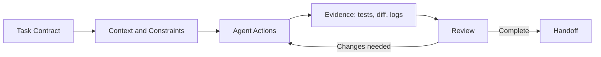



## Le problème : une longue invite ne produit pas automatiquement de bons résultats de développement

Un agent de programmation peut lire et modifier le code, exécuter des commandes et examiner les résultats.

Toutefois, lorsque les critères d'achèvement et les limites sont vagues, les problèmes suivants apparaissent.

- Il nettoie des fichiers qui ne faisaient pas partie de la demande.
- Il annonce un succès alors qu'aucun test n'existe.
- Il écrase des modifications existantes de l'utilisateur.
- Il effectue sur un système externe une modification plus vaste que prévu.
- Plusieurs agents modifient simultanément le même fichier.
- Il suppose une réussite alors que la sortie de la commande a été tronquée.
- L'implémentation existe, mais la transmission n'est pas reproductible.

La clé d'une utilisation efficace n'est pas une formulation ingénieuse de l'invite, mais une boucle de preuves : `scope -> execution -> verification -> review -> handoff`.

Les fonctionnalités et l'interface propres à Codex peuvent évoluer.

Cet article s'appuie sur les principes généraux de la [documentation Codex](https://developers.openai.com/codex/) officielle, vérifiés au moment de sa rédaction ; consultez également la documentation la plus récente de l'interface que vous utilisez réellement.

## Modèle mental : Codex est un collaborateur qui agit dans les limites de l'autorité accordée



### contrat de tâche

Définissez ce qui sera modifié et ce qui doit rester intact.

### contexte

Fournissez la structure du dépôt, les commandes de compilation, le style, la documentation pertinente et les symptômes de la défaillance.

### autorité

Le bac à sable et les approbations limitent ce qu'un agent peut lire, écrire et exécuter.

### preuves

Les résultats des tests, l'analyse statique, les compilations, les différences, les journaux de reproduction et les artefacts générés étayent ses affirmations.

### transmission

Communiquez ce qui a changé, ce qui a été vérifié et ce qui reste à faire.

## Comment rédiger une invite comme un contrat de travail

Le manuel officiel de Codex recommande de préciser l'objectif, le contexte, les contraintes et la définition de l'achèvement.

### Objectif

Décrivez un résultat observable au lieu de dire `fix login`.

Exemple : `When a request uses an expired session, attempt one refresh. If it fails, send the user to the login screen, and never enter an infinite loop.`

### Périmètre

- répertoires qui peuvent être modifiés
- fichiers qui doivent être exclus
- autorisation ou non de modifier l'API publique
- autorisation ou non d'ajouter des dépendances
- autorisation ou non d'effectuer des migrations
- autorisation ou non des actions de commit, de push et de création de PR

Considérez un push Git ou la création d'un ticket externe comme une autorité distincte.

### Critères d'achèvement

- Le test de reproduction échoue d'abord.
- Les tests pertinents réussissent après la correction.
- La suite complète ou les vérifications du périmètre concerné réussissent.
- L'analyse statique et la vérification des types réussissent.
- La documentation et les migrations sont mises à jour.
- Les risques restants sont signalés.

## Stocker les instructions récurrentes dans AGENTS.md

Le manuel officiel décrit `AGENTS.md` comme des consignes persistantes que l'agent lit automatiquement dans un dépôt.

De bonnes consignes sont pratiques et vérifiables.

```md
# Repository guidance

## Build and test
- Install: `npm ci`
- Unit tests: `npm test`
- Type check: `npm run typecheck`

## Change rules
- Do not edit generated files under `dist/`.
- Preserve public API compatibility unless the task says otherwise.
- Add a regression test for every bug fix.

## Handoff
- Report changed files, commands run, and remaining failures.
```

Les commandes réelles et les limites interdites sont plus utiles qu'un long document philosophique.

Vérifiez le périmètre applicable, car un sous-répertoire peut contenir un `AGENTS.md` plus spécifique.

Ajoutez progressivement des consignes lorsque des erreurs récurrentes sont constatées.

## Processus : mener le développement agentique en toute sécurité

### Étape 1. Préserver d'abord l'état actuel

Demandez à l'agent de vérifier les éléments suivants avant toute modification :

- branche actuelle
- état de l'arbre de travail
- fichiers non suivis
- commits récents pertinents
- fichier `AGENTS.md` applicable
- référence initiale de compilation et de test

Les modifications d'un arbre de travail non propre peuvent appartenir à l'utilisateur.

N'annulez ni n'incluez des modifications sans rapport.

### Étape 2. Créer une définition reproductible du problème

Pour un bogue, consignez une reproduction minimale, le résultat réel et le résultat attendu.

Transformez-la si possible en test qui échoue.

Pour un problème dépendant de l'environnement, consignez la version, le système d'exploitation, la configuration, la commande et un journal expurgé.

Ne demandez pas immédiatement une vaste refactorisation avant d'en connaître la cause.

### Étape 3. Séparer la lecture de l'écriture

Lisez d'abord le chemin du code, les dépendances, les tests et l'historique.

Réduisez les modifications candidates et les risques avant d'éditer.

Pour une demande de diagnostic, arrêtez-vous après avoir indiqué la cause au lieu d'élargir automatiquement le périmètre à une correction.

Pour une demande d'implémentation, menez la modification et sa vérification normales jusqu'au bout.

### Étape 4. Préférer les petits correctifs et les invariants explicites

Effectuez la plus petite modification qui traite directement la cause, plutôt que de changer toute l'architecture d'un coup.

La seule exception est lorsque l'exigence impose elle-même un changement structurel.

Exemples d'invariants :

- Une même requête ne crée pas d'enregistrements en double.
- Un utilisateur non authentifié ne reçoit pas de données protégées.
- Aucune tâche d'arrière-plan ne subsiste après une annulation.
- L'ancien et le nouveau schéma coexistent pendant le déploiement.

### Étape 5. Utiliser des agents parallèles pour les sous-tâches indépendantes

Le manuel officiel de Codex décrit la parallélisation de travaux indépendants, surtout fondés sur la lecture, comme l'exploration, l'analyse des tests et celle des journaux.

Exemples de répartition efficace :

- agent A : étudier le chemin de défaillance et la cause profonde
- agent B : étudier les lacunes des tests existants
- agent C : examiner la sécurité et la compatibilité

Si plusieurs agents modifient simultanément le même fichier, il peut en résulter des conflits et des décisions incohérentes.

Séparez la responsabilité d'écriture par fichier ou composant.

L'agent racine intègre les résultats et effectue la vérification finale.

### Étape 6. Utiliser le bac à sable et les approbations comme limites de sécurité

Selon la documentation officielle, Codex utilise un bac à sable et des politiques d'approbation pour contrôler le périmètre des fichiers, l'accès réseau et les commandes.

L'autorité minimale nécessaire doit être accordée par défaut.

La cible et l'impact des actions suivantes exigent une attention particulière :

- opérations destructrices sur les fichiers
- accès aux identifiants ou secrets
- téléchargement de dépendances
- mutations d'API externes
- push Git et création de PR
- modifications de ressources cloud
- commandes de production

Une approbation n'est pas une fenêtre gênante ; c'est le point où l'autorité change.

### Étape 7. Adapter la pyramide de tests au risque du travail

Exécutez immédiatement après une modification le test le plus ciblé et le plus rapide.

Élargissez ensuite le périmètre concerné.

1. nouveau test de régression
2. tests unitaires associés
3. tests de composant ou d'intégration
4. analyse statique et vérification des types
5. compilation
6. tests de bout en bout requis

N'exigez pas la suite la plus coûteuse pour chaque tâche.

À l'inverse, ne concluez pas une modification critique de l'authentification avec un seul test unitaire.

### Étape 8. Lire les résultats des commandes comme des preuves

Vérifiez le code de sortie, stdout, stderr, le nombre de tests, les tests ignorés et les expirations.

Si la sortie a été tronquée, relisez la partie pertinente.

Distinguez `the command succeeded` de `the requirement was satisfied`.

Lorsqu'un artefact est généré, inspectez son chemin réel ainsi que son contenu ou son rendu.

### Étape 9. Examiner les différences indépendamment

Lisez les différences même lorsque les tests réussissent.

- modifications hors périmètre
- code mort
- secrets et chemins personnels
- affichages de débogage
- exceptions trop larges
- dérive du verrouillage des dépendances
- fichiers générés
- rétrocompatibilité
- migration et retour arrière

Vous pouvez demander à l'agent d'examiner son propre correctif, mais le responsable final doit l'inspecter avec un regard indépendant.

### Étape 10. Exiger une transmission qui ne masque pas les échecs

Le rapport final doit au moins comprendre :

- résumé du résultat
- fichiers modifiés
- commandes de vérification et résultats
- vérifications non exécutées et leur raison
- limites connues et travaux de suivi
- état du commit et branche
- liens vers les artefacts générés

`Done` seul ne constitue pas une transmission reproductible.

## Exemple pratique : demander la correction d'un bogue d'idempotence d'API

### Contrat de travail

```text
목표: 동일 idempotency key의 동시 요청이 record 하나만 만들게 수정한다.
범위: api/와 tests/만 수정한다. public response schema는 유지한다.
제약: 새 production dependency를 추가하지 않는다.
완료: concurrency regression test가 수정 전 실패하고 수정 후 통과한다.
검증: 관련 unit/integration test, lint, type check를 실행한다.
보고: 변경 파일과 실행한 명령, 남은 race 가능성을 적는다.
```

### Processus de l'agent

1. Vérifier les consignes du dépôt et l'arbre de travail.
2. Retracer le chemin du code, du gestionnaire de requête à la contrainte de base de données.
3. Confirmer l'index unique existant.
4. Ajouter un test de régression qui envoie deux requêtes simultanément.
5. Reproduire la condition de concurrence « vérifier puis insérer » au niveau applicatif.
6. La corriger par une insertion conditionnelle en base et une relecture en cas de conflit.
7. Vérifier la compatibilité du schéma de réponse et du statut.
8. Exécuter les tests associés et les vérifications plus larges.
9. Examiner dans les différences les questions de périmètre et de migration.
10. Rapporter les preuves et les éventuelles différences restantes propres à la base de données.

## Adapter le fonctionnement à la taille du travail

### Petit bogue

Une reproduction, un correctif minimal, un test de régression et l'examen des différences peuvent suffire.

### Fonctionnalité de taille moyenne

Répartissez le plan, le contrat d'API, l'implémentation, les tests d'intégration et la documentation en jalons successifs.

### Grande migration

Gérez séparément la décision d'architecture, la matrice de compatibilité, l'indicateur de fonctionnalité, la migration des données, le canari et le retour arrière.

Plusieurs jalons vérifiables indépendamment sont plus sûrs qu'une tâche énorme qui dure plus d'une journée.

Créez à chaque jalon un point de reprise, par exemple un instantané de fichier ou un commit.

## Liste de contrôle de vérification

### Demande

- [ ] L'objectif est-il exprimé comme un comportement observable ?
- [ ] Les périmètres autorisés et interdits sont-ils définis ?
- [ ] L'autorité concernant les mutations externes est-elle explicite ?
- [ ] Les critères d'achèvement et les commandes de vérification sont-ils définis ?
- [ ] Le responsable des choix ambigus est-il indiqué ?

### Dépôt

- [ ] Le fichier AGENTS.md applicable a-t-il été vérifié ?
- [ ] L'arbre de travail non propre a-t-il été préservé ?
- [ ] Les limites concernant les fichiers générés et les secrets ont-elles été vérifiées ?
- [ ] Les contraintes de dépendances et de versions ont-elles été vérifiées ?
- [ ] La branche et la révision de base ont-elles été consignées ?

### Exécution

- [ ] La cause et l'hypothèse ont-elles été affinées à l'aide de preuves ?
- [ ] Le correctif respecte-t-il le périmètre de l'exigence ?
- [ ] Les zones d'écriture des sous-agents évitent-elles tout chevauchement ?
- [ ] Les actions destructrices et externes ont-elles été approuvées ?
- [ ] La sortie des commandes et leurs codes de sortie ont-ils été vérifiés ?

### Achèvement

- [ ] Le test de régression détecte-t-il la défaillance visée ?
- [ ] Les résultats des tests associés, de l'analyse statique, de la vérification des types et de la compilation sont-ils disponibles ?
- [ ] Les différences ont-elles été examinées sous l'angle de la sécurité et de la compatibilité ?
- [ ] Les vérifications non exécutées et les limites sont-elles signalées ?
- [ ] Les artefacts et la transmission sont-ils reproductibles ?

## Échecs fréquents et limites

### Regrouper tous les objectifs dans une seule invite

Le périmètre et les priorités entrent en conflit.

Découpez le travail en jalons dotés de critères d'achèvement indépendants.

### Croire sans vérification l'affirmation de l'agent selon laquelle les tests réussissent

Vérifiez le répertoire d'exécution, les tests ignorés, les artefacts périmés et les sorties tronquées.

### Utiliser des agents parallèles pour chaque tâche

Pour une petite modification, le coût de coordination peut dépasser le bénéfice.

Utilisez-les pour des travaux parallélisables indépendamment.

### Maximiser l'autorité dès le départ

Le rayon d'impact des erreurs d'entrée et de l'injection d'invite augmente.

N'élargissez l'autorité qu'en cas de besoin, par des approbations visant des cibles explicites.

### Considérer l'historique de l'agent comme l'unique sauvegarde

L'état de la conversation et les espaces de travail temporaires ne sont pas des stockages durables.

Préservez les jalons importants dans des commits du dépôt, des correctifs, des archives ou des magasins d'artefacts.

### Remplacer la revue de code par des tests

Les tests vérifient les cas spécifiés ; l'examen des différences repère les écarts de périmètre inattendus.

Ils se complètent.

## Références officielles

- [Documentation d'OpenAI Codex](https://developers.openai.com/codex/)
- [Guide Codex sur AGENTS.md](https://developers.openai.com/codex/guides/agents-md/)
- [Sécurité et approbations de Codex](https://developers.openai.com/codex/security/)
- [Documentation de l'interface en ligne de commande Codex](https://developers.openai.com/codex/cli/)
- [Bonnes pratiques de Codex](https://developers.openai.com/codex/)

## Conclusion

Bien utiliser Codex ne consiste pas à en dire davantage à l'agent, mais à lui fournir une structure qui prouve l'achèvement.

Réunissez dans une même boucle le périmètre, les consignes durables du dépôt, l'autorité minimale, les sous-tâches indépendantes, les tests de régression, l'examen des différences et la transmission.

Lorsque le dépôt et les preuves de vérification — et non l'historique de conversation — servent de source de vérité, le développement agentique devient à la fois rapide et récupérable.
