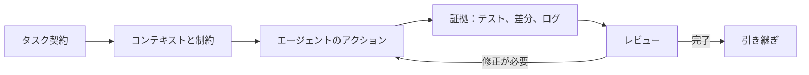



## 問題：長いpromptが良い開発結果を自動的に生み出すわけではない

coding agentはcodeを読み、修正し、commandを実行し、結果を検討できる。

しかし、完了条件と境界が曖昧だと、次の問題が生じる。

- 要求していないfileまで整理する。
- testがない状態を成功として報告する。
- 既存のユーザー変更を上書きする。
- 外部systemに想定以上の大きな変更を加える。
- 複数のagentが同じfileを同時に修正する。
- command outputが途中で切れているのに成功と見なす。
- 実装はできたものの、再現可能なhandoffがない。

優れた使い方の核心は、promptの言い回しの巧みさよりも、`scope -> 実行 -> 検証 -> review -> handoff`というevidence loopにある。

現在のCodexの具体的な機能やUIは変わる可能性がある。

本稿は執筆時点で確認した公式の[Codexドキュメント](https://developers.openai.com/codex/)における一般原則に基づいており、実際のsurfaceについては最新のドキュメントも併せて確認する。

## Mental model：Codexは権限の範囲内で働く協力者である



### task contract

何を変更し、何に手を付けないかを定義する。

### context

repositoryの構造、build command、style、関連ドキュメント、失敗の症状を提供する。

### authority

sandboxとapprovalは、agentが読み書きし、実行できる範囲を制限する。

### evidence

test結果、lint、build、再現log、生成artifactが主張を裏付ける。

### handoff

何が変わり、何が検証され、何が残っているのかを伝える。

## Promptを作業契約として書く方法

公式のCodex manualは、goal、context、constraints、done criteriaを具体的に示すことを推奨している。

### 目標

`ログインを直して`よりも、観察可能な結果を書く。

例：`期限切れのsessionでリクエストするとrefreshを一度試み、失敗したらlogin画面へ送り、無限loopが発生しないこと。`

### 範囲

- 修正可能なdirectory
- 除外するfile
- public APIの変更可否
- dependencyの追加可否
- migrationの許可
- commit、push、PRの権限の有無

git pushや外部issueの作成は別個の権限と見なす。

### 完了条件

- 再現testが最初に失敗する。
- 修正後、関連testが通過する。
- full suiteまたは影響範囲のcheckが通過する。
- lintとtype checkが通過する。
- ドキュメントとmigrationが更新される。
- 残っているリスクを報告する。

## AGENTS.mdに繰り返し使う指示を保存する

公式manualは、`AGENTS.md`をrepository内でagentが自動的に読み込む永続的な指示として説明している。

優れた内容は実務的で検証可能である。

```md
# Repository guidance

## Build and test
- Install: `npm ci`
- Unit tests: `npm test`
- Type check: `npm run typecheck`

## Change rules
- Do not edit generated files under `dist/`.
- Preserve public API compatibility unless the task says otherwise.
- Add a regression test for every bug fix.

## Handoff
- Report changed files, commands run, and remaining failures.
```

長すぎる理念文書より、実際のcommandと禁止範囲の方が役立つ。

下位directoryにさらに具体的な`AGENTS.md`が存在する場合もあるため、scopeを確認する。

繰り返し発生するミスが見つかったら、指示を段階的に追加する。

## Workflow：エージェント型開発を安全に運用する

### Step 1. まず現在の状態を保全する

agentに修正前に次の項目を確認させる。

- current branch
- working tree status
- untracked file
- 最近の関連commit
- 適用される`AGENTS.md`
- buildとtestのbaseline

dirty working treeの変更はユーザーのものかもしれない。

無関係な変更を元に戻したり、含めたりしない。

### Step 2. 再現可能な問題定義を作る

bugであれば、最小再現、実際の結果、期待する結果を記録する。

可能であればfailing testに置き換える。

環境依存の問題であれば、version、OS、config、command、sanitized logを残す。

原因が不明な状態で、いきなり大規模なrefactorを依頼しない。

### Step 3. 読み取りと書き込みを区別する

まずcode path、dependency、test、historyを読む。

変更候補とリスクを絞り込んだ後で修正する。

diagnosisの依頼なら原因の報告までにとどめ、fixの範囲を自動的に広げないようにする。

implementationの依頼なら、通常の修正と検証を最後まで実施させる。

### Step 4. 小さなpatchと明確なinvariantを優先する

一度にarchitecture全体を変えるのではなく、失敗原因を直接解決する最小限のchangeを作る。

例外は、要件自体が構造変更を必要とする場合である。

invariantの例は次のとおり。

- 同じrequestは重複するrecordを作らない。
- unauthenticated userはprotected dataを受け取らない。
- cancellation後にbackground taskが残らない。
- old schemaとnew schemaがrollout中に共存する。

### Step 5. 並列agentは独立したsubtaskに使う

公式のCodex manualは、exploration、test、log分析のような、独立していてread-heavyな作業を並列化する方法を説明している。

適切な分割例は次のとおり。

- agent A：failure pathとroot causeの調査
- agent B：既存のtest gapの調査
- agent C：securityとcompatibilityのreview

同じfileを複数のagentが同時に修正すると、conflictや判断の不一致が生じる。

書き込みのownershipをfileまたはcomponent単位で分離する。

root agentが結果を統合し、最終検証を行う。

### Step 6. sandboxとapprovalを安全境界として使う

公式ドキュメントによると、Codexはsandboxとapproval policyを使ってfile・network・commandの範囲を制御する。

基本は、必要最小限の権限である。

次のactionでは、特にtargetと影響を確認する必要がある。

- destructive file operation
- credentialまたはsecretへのアクセス
- dependency download
- 外部API mutation
- git pushとPRの作成
- cloud resourceの変更
- production command

approvalは面倒なpopupではなく、authorityの切り替え地点である。

### Step 7. test pyramidを作業リスクに合わせる

変更直後は、最も範囲が狭く高速なtestを実行する。

その後、影響範囲を広げる。

1. 新しいregression test
2. 関連するunit test
3. componentまたはintegration test
4. lintとtype check
5. build
6. 必要なend-to-end test

すべてのtaskに対して、常に最も高コストなsuiteを要求するわけではない。

一方で、中核的なauthenticationの変更をunit test一つで終わらせてはいけない。

### Step 8. commandの結果をevidenceとして読む

exit code、stdout、stderr、test count、skipped test、timeoutを確認する。

output truncationがあれば、関連箇所をもう一度読む。

`command succeeded`と`要件が満たされた`を区別する。

生成されたartifactがあれば、実際のpathと内容またはrenderを確認する。

### Step 9. diffを独立してreviewする

testが通過してもdiffを読む。

- scope外の変更
- dead code
- secretと個人用path
- debug print
- overly broad exception
- dependency lock drift
- generated file
- backward compatibility
- migrationとrollback

agentに自身のpatchをreviewさせることもできるが、最終責任者は別の観点から確認しなければならない。

### Step 10. 失敗を隠さないhandoffを求める

最終報告には、少なくとも次の内容を含める必要がある。

- 結果の要約
- 変更したfile
- 検証commandと結果
- 実行できなかったcheckとその理由
- 既知の制限と後続作業
- commitの有無とbranch
- 生成artifactのlink

`完了しました`だけでは、再現可能なhandoffではない。

## 実践例：API idempotency bugの修正依頼

### 作業契約

```text
목표: 동일 idempotency key의 동시 요청이 record 하나만 만들게 수정한다.
범위: api/와 tests/만 수정한다. public response schema는 유지한다.
제약: 새 production dependency를 추가하지 않는다.
완료: concurrency regression test가 수정 전 실패하고 수정 후 통과한다.
검증: 관련 unit/integration test, lint, type check를 실행한다.
보고: 변경 파일과 실행한 명령, 남은 race 가능성을 적는다.
```

### agent workflow

1. repo guidanceとworking treeを確認する。
2. request handlerからdatabase constraintまでcode pathを追跡する。
3. 既存のunique indexを確認する。
4. 同時に二つのリクエストを送るregression testを追加する。
5. applicationのcheck-then-insert raceを再現する。
6. databaseのconditional insertとconflict readbackを使って修正する。
7. 応答schemaとstatusのcompatibilityを確認する。
8. 関連testとbroader checkを実行する。
9. diffでscopeとmigrationをreviewする。
10. evidenceと、残っているdatabaseごとの差異を報告する。

## 作業規模別の運用

### 小さなbug

再現、最小patch、regression test、diff reviewで十分な場合がある。

### 中規模のfeature

計画、API contract、implementation、integration test、docsを段階別のcheckpointに分ける。

### 大規模なmigration

architecture decision、compatibility matrix、feature flag、data migration、canary、rollbackを別々のtaskとして管理する。

agentが一日以上実行され続ける巨大な一つのtaskよりも、独立して検証できる複数のmilestoneの方が安全である。

各milestoneでfile snapshotやcommitなどの復旧地点を作る。

## 検証Checklist

### 依頼

- [ ] 目標がobservable behaviorとして表現されている。
- [ ] 修正範囲と禁止範囲がある。
- [ ] 外部mutationの権限が明記されている。
- [ ] 完了条件と検証commandがある。
- [ ] 曖昧な選択のownerが決まっている。

### repository

- [ ] 適用されるAGENTS.mdを確認した。
- [ ] dirty working treeを保全した。
- [ ] generated fileとsecretの境界を確認した。
- [ ] dependencyとversionの制約を確認した。
- [ ] branchとbase revisionを記録した。

### 実行

- [ ] 原因と仮説をevidenceによって絞り込んだ。
- [ ] patchが要件の範囲内にある。
- [ ] subagentの書き込み領域が衝突していない。
- [ ] destructive・external actionは承認を経ている。
- [ ] command outputとexit codeを確認した。

### 完了

- [ ] regression testが意図したfailureを捉える。
- [ ] 関連test、lint、type check、buildの結果がある。
- [ ] diffをsecurityとcompatibilityの観点から読んだ。
- [ ] 未実行のcheckと制限が開示されている。
- [ ] artifactとhandoffが再現可能である。

## よくある失敗と限界

### 一つのpromptにすべての目標を入れる

scopeと優先順位が衝突する。

独立した完了条件を持つmilestoneに分ける。

### agentが報告したtest通過を確認せずに信じる

実行directory、skipped test、stale artifact、truncated outputを確認する必要がある。

### すべての作業で並列agentを使う

小さなchangeではcoordination overheadの方が大きくなり得る。

独立して並列化できる作業に使用する。

### 権限を最初から最大化する

誤入力やprompt injectionの影響範囲が広がる。

必要になった時点で、targetが明確なapprovalによって拡張する。

### agentの記録を唯一のbackupと見なす

対話状態と一時workspaceは永続的な保存先ではない。

重要なmilestoneはrepositoryのcommit、patch、archive、artifact storeに保存する。

### code reviewをtestで代用する

testは明示したケースを検証し、diff reviewは想定外の範囲を見つける。

両者は相互補完的である。

## 公式参考資料

- [OpenAI Codex Documentation](https://developers.openai.com/codex/)
- [Codex AGENTS.md Guide](https://developers.openai.com/codex/guides/agents-md/)
- [Codex Security and Approvals](https://developers.openai.com/codex/security/)
- [Codex CLI Documentation](https://developers.openai.com/codex/cli/)
- [Codex Best Practices](https://developers.openai.com/codex/)

## まとめ

Codexを使いこなすうえで重要なのは、agentにより多くの言葉を与えることではなく、完了を証明するための構造を与えることである。

scope、durable repository guidance、最小権限、独立したsubtask、regression test、diff review、handoffを一つのloopにしよう。

対話履歴ではなく、repositoryと検証evidenceをsource of truthとすることで、エージェント型開発は高速でありながら復旧可能になる。
